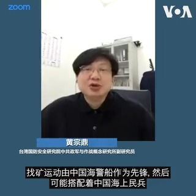
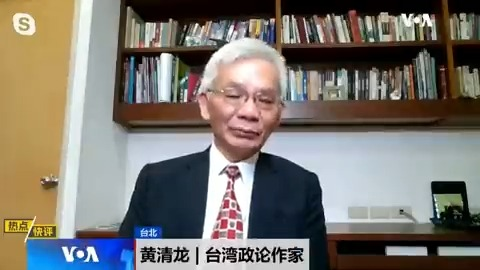
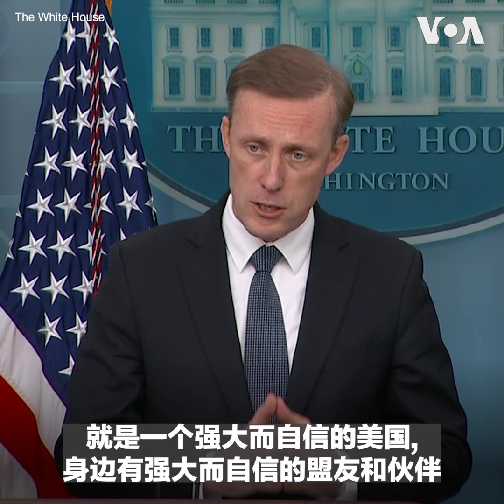
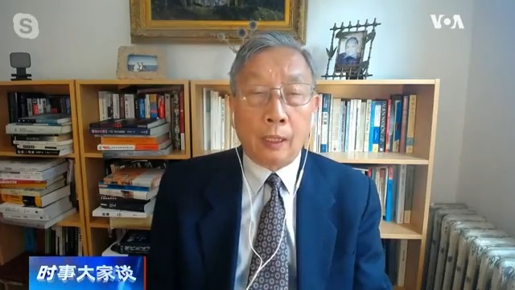
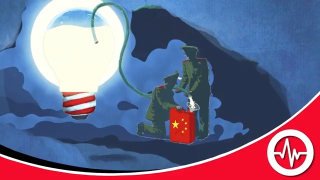
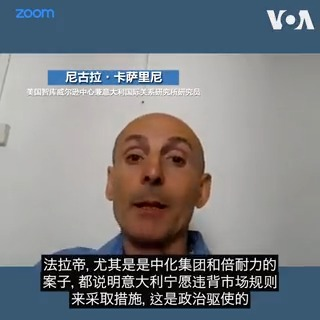
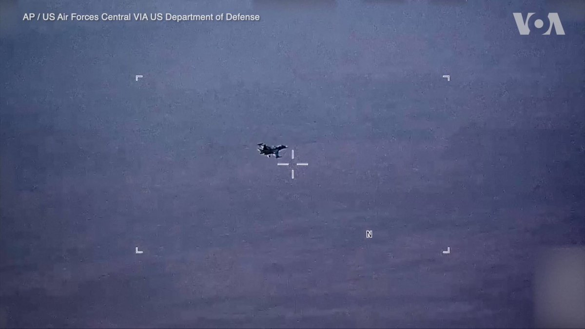

美国之音中文网 北京时间 2023-07-08T22:11:03Z 1677681707934183424 日本8日举行前首相安倍晋三被枪杀一周年纪念活动。民众来到东京的一个寺庙鲜花。此前日本首相岸田文雄和其他官员、安倍的遗孀安倍昭惠等在这里举行了私人的纪念仪式。安倍一年前在奈良街头遭到枪击身亡。 https://t.co/cYlDkMiJty   美国之音中文网 北京时间 2023-07-08T14:48:32Z 1677570344918614016 耶伦访华期间 中国军机军舰持续在台湾周边抵近威吓 https://t.co/wjKt9rqxTF   美国之音中文网 北京时间 2023-07-08T12:01:33Z 1677528322786627584 专访巴贝奇：习近平视攻占台湾为毕生宿命，中国人民将为此付出惨重代价 https://t.co/2BBHlkFaXQ   美国之音中文网 北京时间 2023-07-08T12:01:35Z 1677528330336366594 耶伦敦促中国支持现有的国际机构 应对气候变化 https://t.co/q0yH0dHfNP   美国之音中文网 北京时间 2023-07-08T10:03:33Z 1677498627005222912 习普视频会晤后 拜登就中国依赖西方投资警告习近平 https://t.co/7kUk94m2C5   美国之音中文网 北京时间 2023-07-08T10:26:03Z 1677504289865093125 北约峰会前夕：拜登不会在乌克兰加入北约问题上让步 https://t.co/NlyW7KzOIG   美国之音中文网 北京时间 2023-07-08T10:35:33Z 1677506679888572416 香港依CBD禁令监禁第一人 https://t.co/D2DSqWZV0y   美国之音中文网 北京时间 2023-07-08T10:52:02Z 1677510828126535680 布林肯敦促东盟对缅甸和中国采取更强硬立场 https://t.co/c8LL29bkGX   美国之音中文网 北京时间 2023-07-08T10:54:06Z 1677511347268120577 镓、锗生产并非不可取代 中国出口管制吓唬谁？ https://t.co/wcdiGk3E4K   美国之音中文网 北京时间 2023-07-08T10:57:20Z 1677512162963537920 中国政府宣布从8月起对镓、锗相关物项实施出口管制。此举被认为是对美欧日韩联手限制中国获取半导体芯片技术能力的反制。不过，分析认为北京再次利用稀有元素进行出口管制的影响有限，是与西方进行技术和贸易领域谈判中一枚不具威胁力的筹码。报道内容：https://t.co/qPxfuNjluF https://t.co/0iZvwPShcj   美国之音中文网 北京时间 2023-07-08T11:00:02Z 1677512840830234627 网友说王毅的外交言行是跟习近平有样学样。台湾政论作家黄清龙先生说：曾跟王毅数次接触，甚至谈得比较久，完全没有感觉到他今天变成这个样。他当日本大使时是出了名的亲善。这说明习的战狼风格已贯彻到了整个外交体系，王毅今天的表现，一点都不意外。 #大家谈完整版： https://t.co/RoWwzVZhWO https://t.co/jlmJfyoT53   美国之音中文网 北京时间 2023-07-08T06:30:00Z 1677444884314345473 菲律宾报告说，在南中国海具有主权争议的海域再次遭到中国海警船的骚扰。观察人士表示，北京近期的海上行径与其日前官方所公布的找矿行动有关，预料将持续在中菲具有主权重叠的部分岛礁进行扩张，然而随著美国和印度等国相继声援马尼拉，北京未来的海洋行动恐遭遇更大阻力。https://t.co/EKsAY19FS1 https://t.co/LFNZFAFJLh   美国之音中文网 北京时间 2023-07-08T06:30:03Z 1677444897098579969 德克萨斯州沃尔玛枪击案凶手被连续判处90轮终身监禁，仍可能面临死刑 https://t.co/F26j5if0UR   美国之音中文网 北京时间 2023-07-08T07:00:00Z 1677452434812325888 李强见耶伦的“彩虹说”如何解？台湾政论作家黄清龙先生说，李强这番好听话是迎客之道，因此推断耶伦北京行带来美中关系突破言之太早。现在美中经济情势冰火两重天，美国的科技管制也不是耶伦一次访问就能解决的。#时事大家谈完整版： https://t.co/RoWwzVZPMm https://t.co/ksTLiDOaOg   美国之音中文网 北京时间 2023-07-08T07:21:30Z 1677457846399582209 美国总统拜登将于7月9日到13日先后访问英国、立陶宛和芬兰。白宫国安顾问沙利文周五在简报会上说，在立陶宛首都维尔纽斯举行的北约年度峰会上，拜登和北约盟友将“展示我们支持乌克兰的团结和决心“。沙利文并表示，峰会后，拜登将在维尔纽斯发表重要讲话。 https://t.co/bfPI79y3Zj   美国之音中文网 北京时间 2023-07-08T07:30:00Z 1677459983745847296 习近平新时代推出一个又一个的“宏大叙事”，把民族主义、爱国主义和党国一体观念推向高潮。为什么把习近平新时代的中共洗脑宣传定义为“认知战”？中共如何通过认知战，让许多中国人接受与他们所经历的现实根本相反的“宏大叙事”？请看7月8日上午9点《纵深视角》专访斯坦福大学中国问题专家吴国光。 https://t.co/ymvLmpRV1Z   美国之音中文网 北京时间 2023-07-08T08:00:00Z 1677467533010518019 北京出口管制稀缺金属效果如何？ 《北京之春》荣誉主编胡平先生说：美国高科技产品出口管制是美国有，中国没有的，一旦管制中国无替代品，而中国出口管制产品是美国有能力生产的，只是自己生产不合算，北京 对美国搞出口管制后，你把产品卖给谁？  #时事大家谈完整版： https://t.co/RoWwzVZhWO https://t.co/7wKhYn6cW6   美国之音中文网 北京时间 2023-07-08T08:20:03Z 1677472579555319809 美国集束弹药前往乌克兰战场，基辅保证负责任使用 https://t.co/g0rub9MIFU   美国之音中文网 北京时间 2023-07-08T08:42:07Z 1677478131161247744 荷兰政府因移民政策难达成一致而集体请辞 https://t.co/rqua3yfmpP   美国之音中文网 北京时间 2023-07-08T09:00:01Z 1677482638053974017 一键解锁#美国热搜 榜：1、李玟去世引发中国抑郁症话题讨论，全国抑郁症患者逾9千万 2、从岁月静好到勇敢发声，编程随想妻子的觉醒与抗争 3、习近平视察东部战区首提敢于打仗 4、吉林农民因修桥被判入狱和罚款 5、粉红逻辑：洋人都是脑残 6、中国律师的尴尬角色 7、在中国只需纳税不许做纳税人 https://t.co/bcZqriS4Dt   美国之音中文网 北京时间 2023-07-08T09:03:35Z 1677483533999411200 众院将审议的国防授权法有三十余项涉台条款,专家指美台联合军训而非环太军演更具急迫性 https://t.co/qsrDfsAIOb   美国之音中文网 北京时间 2023-07-08T09:19:03Z 1677487425441103872 消息人士：中国意图通过散布“逃跑计划”虚假信息来打击台湾士气 https://t.co/nJyzACwSHb   美国之音中文网 北京时间 2023-07-08T09:54:04Z 1677496239229923328 尘埃未落的高峰：印中边境三年紧张局势 https://t.co/M5oQZZ0Buu   美国之音中文网 北京时间 2023-07-08T04:22:03Z 1677412684390879232 VOA专访白宫国安会发言人：北约峰会将向中国发出什么信息？ https://t.co/4FnnhygcYR   美国之音中文网 北京时间 2023-07-08T04:29:35Z 1677414578538291200 揭谎频道：北京窃取美国技术, 并声称美国的反应是攻击中国经济 文字报道：https://t.co/krFJRXQljf https://t.co/iMWOf7moPZ   美国之音中文网 北京时间 2023-07-08T04:39:02Z 1677416958227259392 美财长耶伦与中国总理李强举行“坦率和建设性”会谈 https://t.co/0j44BEQHum   美国之音中文网 北京时间 2023-07-08T04:44:33Z 1677418348655640577 合成药物，尤其是芬太尼，是18至49岁美国人的头号杀手。美国国务院7月7日成立一个打击合成毒品的全球联盟，并召开首次线上会议，有来自超过80个国家的官员出席。国务卿布林肯发言说，该联盟将通过全球伙伴关系和与非政府利益相关者协调合作，以遏制合成药物带来的威胁。报道：https://t.co/Ufs96BDqwZ https://t.co/KMIzxAAIPI   美国之音中文网 北京时间 2023-07-08T05:11:03Z 1677425015896281088 美国6月份招聘放缓，但仍增加20.9万就业岗位显示经济韧性 https://t.co/eTt17lwWJd   美国之音中文网 北京时间 2023-07-08T05:17:43Z 1677426694062239752 国际原子能机构负责人本周正在访问亚太地区，4日他批准东京向太平洋排放超过100万吨处理后的核废水。国际原子能机构表示，这些废水可以安全释放，然而这一决定并没有缓解整个地区渔业和环境界的担忧。请看美国之音记者杰西卡·斯通的报道。https://t.co/elqZWf46MJ https://t.co/kWTK1wSUVD   美国之音中文网 北京时间 2023-07-08T05:30:59Z 1677430031679729673 #揭谎频道  中国外交部表示，粮农组织总干事屈冬玉有着无可挑剔的记录。 然而，在屈冬玉领导下，这个联合国机构偏离了减少全球对农药依赖的长期政策，并与包括中国国企在内的农化行业游说团体和公司建立了合作伙伴关系。https://t.co/IA1xT44fBI   美国之音中文网 北京时间 2023-07-08T06:01:05Z 1677437608677318657 中国资本近年来大举进入欧洲国家，意大利就是其中之一。近期意大利政府出手限制倍耐力的最大股东中化集团在董事会内扩权。法拉帝公司在米兰上市前，最大股东潍柴集团出售股权失去了对该公司的绝对控制权。在欧洲去风险的背景下，中国公司在意大利可能会面临更加严格的投资审查。 https://t.co/kcko2TRVoD   美国之音中文网 北京时间 2023-07-08T06:06:44Z 1677439030726742016 在日内瓦举行的 “人工智能造福人类”全球峰会上, 九个人工智能人形机器人7日在联合国国际电信联盟所说的世界上第一个人形社交机器人记者会上回答各种问题,  记者们提的问题包括机器人是否能成为比人类更有效的领导人,  人类是否能信任机器人, 机器人会不会反抗人类等。我们来看看机器人是怎么回答的。 https://t.co/DPHeoailcr   美国之音中文网 北京时间 2023-07-08T04:09:03Z 1677409412032643073 频频骚扰菲律宾船只 中国续扩大海上灰色行动 https://t.co/0z1rgGMkZa   美国之音中文网 北京时间 2023-07-08T00:53:33Z 1677360213970624563 美军官员7月6日说，俄罗斯军机在过去一天里两次做出危险举动，骚扰在叙利亚上空飞行的美军无人机。美国空军中央司令部司令格林科维奇中将说，俄军苏-34和苏-35军机飞到美军MQ-9“死神”无人机附近，并发射照明弹，迫使无人机采取规避操作。 https://t.co/lXd67a6kEq   美国之音中文网 北京时间 2023-07-08T01:45:04Z 1677373180208635904 国事光析：岂止习近平是专制者？ https://t.co/FM9GtwLTwm   美国之音中文网 北京时间 2023-07-08T01:45:06Z 1677373187674505216 蚂蚁集团受重罚，反垄断风暴留下一地鸡毛 https://t.co/IIGWGS5SLo   美国之音中文网 北京时间 2023-07-08T01:59:03Z 1677376697585500161 美国希望全球禁毒盟友推动中国严控芬太尼合成毒品 https://t.co/P40tehIGct   美国之音中文网 北京时间 2023-07-08T02:06:35Z 1677378593561935872 意大利加速去风险，中企未来或面临严格投资审查 https://t.co/kOdjNfEYXy   美国之音中文网 北京时间 2023-07-08T02:15:30Z 1677380836100825090 美国财政部长耶伦7日在北京会晤美国商界人士时呼吁中国进行市场改革。耶伦还表示定期交流能够帮助两国监控经济与金融风险。据报道耶伦8日将与中国副总理何立峰会晤。耶伦在与中国总理李强会晤时说美国寻求与中国在互利和公平规则基础上健康竞争，而不是“赢者通吃”。  
报道： https://t.co/qKk0iwDU1S https://t.co/a3CojeCZYg   