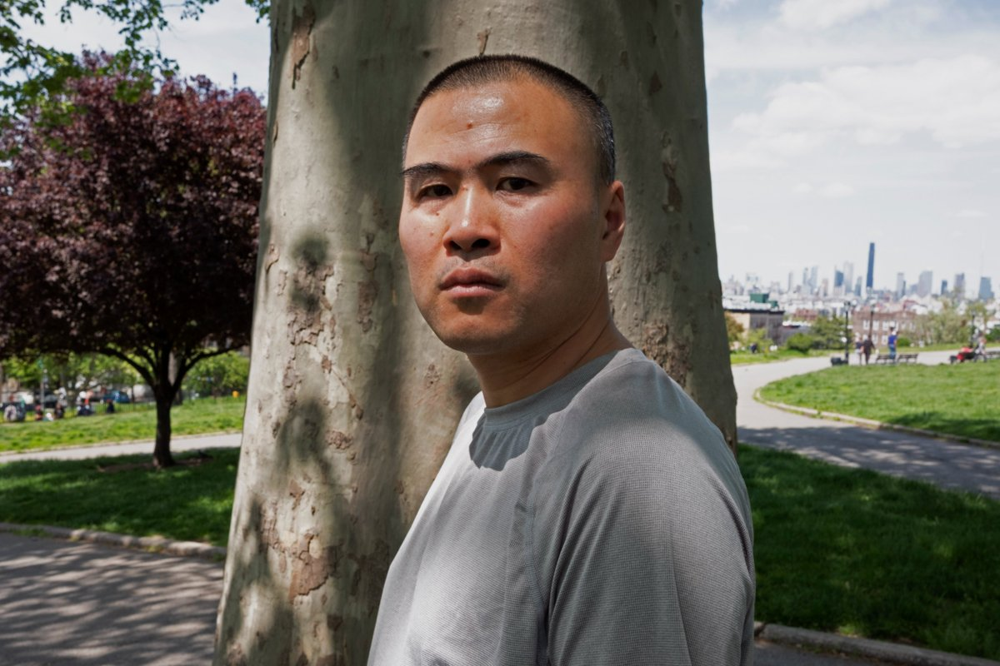

自由亚洲电台 北京时间 2023-07-08T06:10:14Z 1677439908300967937 【#709案 八周年】 未了的八年抗战（上）】
https://t.co/XpOvnwkqYt
从2015年7月9日起，中国政府在全国范围内，大规模抓捕了将近三百名人权律师和维权人士等。然而八年过去了，这些已经获释的律师，却面对更大力度的逼迁、边控等压迫，更有律师二次入狱，甚至面临更长的刑期。对于他们和一直被株连的家人而言，709的八年抗战，至今仍未告终。
本台记者吕熙制作了两集专题，上集是709人权律师 #李和平 和 #王全璋 诉说他们八年来的经历。   自由亚洲电台 北京时间 2023-07-08T02:53:24Z 1677390375026040833 【调查报道 |中国“秘密警察站”在纽约】林海:寻找没有恐惧的土地
https://t.co/SpNH1RA0J4
2019年从中国逃亡到美国的林海从没想到，他会在曼哈顿街头的民主活动上，遭到不明身份的人挥舞五星红旗袭击。但随着中国“秘密警察站”在美国司法部的调查中曝光，像林海这样的受害者一方面看到了正义的曙光... https://t.co/vcm4vFHwts   自由亚洲电台 北京时间 2023-07-08T04:11:50Z 1677410111948574720 本周五，正在北京访问的美国财政部长 #耶伦（Janet Yellen）与中国国务院总理 #李强 举行会晤。李强有关"风雨过后定见彩虹"的比喻引发舆论热议。那么，#美中关系 的"彩虹"出现了吗？
https://t.co/z75ujDDHgv   自由亚洲电台 北京时间 2023-07-08T04:13:20Z 1677410492254437377 #事实查核｜拜登发表全国电视讲话宣布 #俄罗斯将使用核武？
https://t.co/imNanYsqHf   自由亚洲电台 北京时间 2023-07-08T00:42:32Z 1677357441359695872 香港国安警周四（7月6日）在机场拘捕一名24岁男子，称涉嫌违反《#香港国安法》"串谋勾结外国或者境外势力危害国家安全"罪。
据多家香港媒体报道，被捕者为前政党"#香港众志"常委 #朱恩浩，他在机场准备坐飞机前往台湾时被拘捕。
 https://t.co/8NOpMANC7v   自由亚洲电台 北京时间 2023-07-08T01:30:01Z 1677369392068460545 傅政华"天坛公馆"豪宅低价拍卖
北京一房产中介宋先生周五（7日）接受本台采访时说，#傅政华 的房子，没有人敢买，也不敢住：“东城区崇文门是精华区，贪官住过的房，感觉总不如住正常的房子安心，还有就是你买了（这房子）以后会成为人们关注的焦点。这属于特殊的情况。”

 https://t.co/yzLLEQbIcr   自由亚洲电台 北京时间 2023-07-08T02:06:47Z 1677378644707270661 美国华尔街投行 #高盛 近日下调中国一些标杆股份制银行和国有大行的评级，引发市场悲观情绪。虽然高盛事后澄清并非“唱空”银行股，但中国官媒《证券时报》7日仍发文《误读 #中资银行 基本面不可取 》，点名批评高盛。

 https://t.co/wPfOm5CWKv   自由亚洲电台 北京时间 2023-07-08T02:22:52Z 1677382690394234885 【#调查报道 | 中国"秘密警察站"在纽约：中共海外渗透的冰山一角】
https://t.co/xKyDhoXlfc
两名涉嫌经营"#中国海外警察站"的侨领被美国司法部逮捕，引起美国大众对中共海外行动的警觉；但对于一些在纽约的中国移民来说，这类监控与骚扰已经持续了数十年，且正在变本加厉。帮助移民的侨团如何变成了协助中共海外监控的警察站？"华人移民楷模"又为何被指控为中国特工呢?
请看本台记者唐家婕 @ccjanetang 报道

#卢建旺 #陈金平 #福建同乡会 #长乐公会   自由亚洲电台 北京时间 2023-07-08T00:24:46Z 1677352972244889600 虚拟 #山河大学 被封杀：“在中国，你想做梦都是做梦。”
 https://t.co/KX3whSzvSa   自由亚洲电台 北京时间 2023-07-08T00:25:31Z 1677353160728514562 近日，社交媒体流传一则有关“#北京马驹桥零工市场降薪”的消息引起热议。本台就此查询当地劳务中介披露，目前不要说工人找不到工作，#劳务市场 更处于饱和状态。

 https://t.co/rvMkG4vUd6   