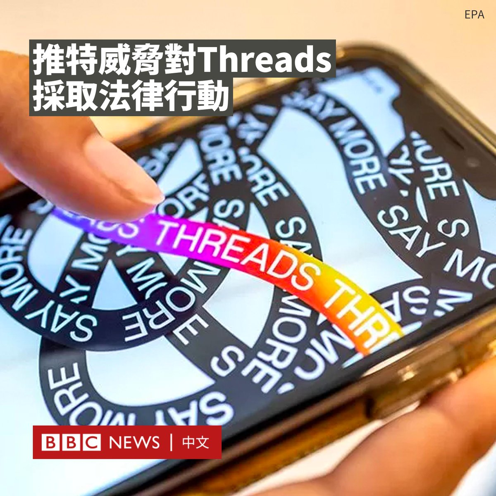
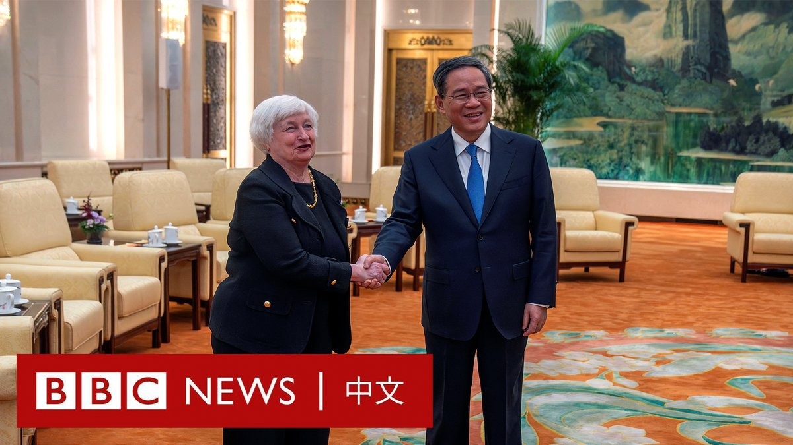
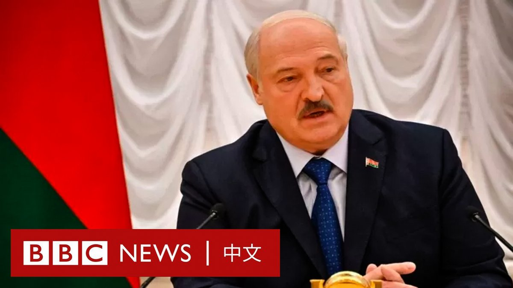

D英国广播公司BBC 北京时间 2023-07-07T22:28:24Z 1677323687173799937 推特（Twitter）正在考虑就其快速增长的竞争对手Threads，对Meta采取法律行动。

7月5日，脸书（Facebook）和Instagram的母公司Meta推出新的应用程式Threads和推特竞争，并被Meta老板赞扬为“友好”的替代品。

据Meta称，已有超过三千万人注册了这款新应用程式。

据报道，推特代表律师亚历克斯·斯皮罗（Alex Spiro）于周三（7月5日）致函Meta首席执行官扎克伯格（Mark Zuckerberg），指Meta“有系统、故意和非法地占用了推特的商业秘密和其他知识产权”来创建Threads。

具体而言，斯皮罗声称Meta雇佣了数十名推特前员工，指他们有权访问推特的商业秘密和其他“高度机密信息”。

律师信称，“推特打算严格保护其知识产权，要求Meta立即采取措施停止使用任何推特商业秘密或其他高度机密信息”。

Meta否认了该律师信中的说法。发言人安迪·斯通（Andy Stone）在Threads上发表了一篇帖子，称“Threads工程团队中没有一名推特前员工，这根本就不是事实”。

推特老板马斯克（Elon Musk）则在推特上表示，“竞争没问题，作弊不行”。

BBC新闻科技记者詹姆斯·克莱顿（James Clayton）表示，Threads的外观、动态消息和转发功能与推特非常相似。

但美国版权法并不保护创意，因此推特要想在法庭上取胜，就必须证明其自己的知识产权，如编程代码，被盗用。   D英国广播公司BBC 北京时间 2023-07-07T18:59:42Z 1677271162945167363 【现场画面】美国财政部长耶伦（Janet Yellen）与中国国务院总理李强在北京会晤。

李强在开场致辞时，提及耶伦周四（7月6日）抵达北京时正好出现一轮彩虹，称中美关系“不完全都是风雨”，两国“一定能见到更多的彩虹”。

耶伦表示，华盛顿寻求“健康的经济竞争”，不是“赢家通吃”，而是基于一套使两国都受益的公平规则。

她还称，华盛顿可能需要采取有针对性的行动来保护其国家安全，因此双方可能持不同意见，但不应允许“任何分歧导致误解，从而不必要地恶化双边经济和金融关系”。

在会见李强之前，耶伦批评了中国对美国公司的打击和限制，但她表示，美国不寻求与中国脱钩。   D英国广播公司BBC 北京时间 2023-07-07T21:36:15Z 1677310563402018818 尊子是香港知名的时事漫画家，从事创作超过四十年。由于他的作品主题多与香港和中国大陆的社会政治议题有关且风格大胆，多年来不时引发争议。

2023年5月，香港报章《明报》宣布《尊子漫画专栏》停刊。尊子向BBC中文表示，即使《国安法》令香港新闻和创作自由带来诸多“红线”，他不会离港或停止创作。 https://t.co/VjM7bDjFsE   D英国广播公司BBC 北京时间 2023-07-07T20:17:50Z 1677290828325085184 【最新消息】中国金融监管机构宣布对蚂蚁集团及旗下机构处以罚款和没收违法所得共计71.23亿元人民币。

由马云创办的蚂蚁集团原计划在2020年底通过规模创纪录的IPO融资340亿美元，但这桩IPO在最后一刻被叫停。这成为北京对国内科技巨头持续多年的监管整顿行动中的一个重要时刻。 https://t.co/gklnF8Fzyr   D英国广播公司BBC 北京时间 2023-07-07T17:00:09Z 1677241078393499649 白俄罗斯总统卢卡申科对BBC说，在瓦格纳集团的叛乱中“没有人成为英雄”。

“普里戈津不是，普京不是，卢卡申科也不是……从这中获得的教训是什么呢？如果我们创建这样的武装组织，我们需要密切关注它。”https://t.co/X7avDv7ik5   D英国广播公司BBC 北京时间 2023-07-07T18:07:41Z 1677258072765485056 中国政策制定者面临的挑战，是要找到一种方法，令经济增长和商业信心摆脱对房地产销售的重度依赖。
https://t.co/bH66oM0DFV   D英国广播公司BBC 北京时间 2023-07-07T14:33:16Z 1677204113598349313 曾促成瓦格纳首领普里戈津（Yevgeny Prigozhin）与克里姆林宫达成协议的白俄罗斯总统卢卡申科（Alexander Lukashenko）透露，普里戈津身处圣彼得堡，并不在白俄罗斯。

当他被问及白俄罗斯是否会使用俄罗斯部署的核武器时，卢卡申科这样回答……👇 https://t.co/b2Dzea5JoA   D英国广播公司BBC 北京时间 2023-07-07T16:00:02Z 1677225951233728512 要问今夏中国街头最潮流的穿搭是什么？“脸基尼”肯定是其中之一！

随着中国多地被艳阳炙烤，各种防晒产品在北京和上海等城市街头纷纷亮相。

受到青睐的包括这种防紫外线面罩，它可以覆盖眼睛以下的脸部和脖子。一些人还搭配了帽子或墨镜以“全副武装”。

官方媒体和一些网民将其戏称为“脸基尼”。该词原本是由青岛的游泳爱好者结合“脸”和“比基尼”两个词而成，用以形容在海滩日浴时所戴的防晒面罩。

在多地气温逼近甚至超过40°C的情况下，“脸基尼”成为居民出行不可或缺的时尚配饰。

官方媒体援引电商分析平台“商指针”的数据称，2023年5月，中国防晒服的零售额超6亿元人民币，同比增长351.15%。

一家位于义乌的店铺的一款有帽檐的“脸基尼”已经卖出了近30万件。

根据中国国家气候中心的数据，今年上半年，中国的高温天数创下了自1961年有官方监测记录以来的历史同期最多纪录。

周三（7月5日），首都北京的气温今年以来第四度冲上40°C。从1951年到去年，北京只有六天的温度达到40°C。   D英国广播公司BBC 北京时间 2023-07-07T13:32:19Z 1677188774797914112 风靡全球的韩国人气女团Blackpink在越南卷入风波。该组合本月下旬将在越南举行两场演唱会，而其主办方因在官网上发布中国主张的南海“九段线”地图而道歉。

越南外交部发言人称，主办方iME公司网站上的地图是一个“敏感问题”，并补充说“在越南推广和使用带有‘九段线’的产品违反了越南的法律，是不可接受的”。

总部位于北京的娱乐公司iME发布道歉信，表示将更换地图。

该公司表示，其网站上的地图“不代表任何国家的领土，我们尊重所有国家的主权和文化”。

几天前，越南决定禁播美国浪漫喜剧电影《芭比》（Barbie）。原因同样是当局指电影内容含有“九段线”地图。

Blackpink是YouTube上关注度最高的女团。她们最近的专辑《Born Pink》在英国专辑排行榜上排名第一。

由于类似的巡演在越南很少见，其在粉丝中引发了热潮。但该事件发生后，一些越南粉丝呼吁抵制其巡演。

中国通常使用所谓“九段线”，对南中国海的绝大部分海域提出主权声索，但越南、菲律宾、马来西亚、文莱等国均提出质疑。

海牙国际仲裁法院曾于2016年作出裁决，称中国不享有“九段线”的历史性权利，中方不承认有关裁决。   D英国广播公司BBC 北京时间 2023-07-07T11:22:19Z 1677156059629203457 镓和锗是制造半导体的关键原材料，中国此举普遍被认为是美中芯片战中的最新反制措施。这两种金属有什么用途？出口禁令将如何影响供应链？https://t.co/L7HMQuP4r3   D英国广播公司BBC 北京时间 2023-07-07T10:15:36Z 1677139272347037697 随着推特（Twitter）出现动荡，有至少二十名日本插画师转而前往中国社交媒体微博开设账户，受到中国粉丝的广泛欢迎。

许多插画师将原因归咎为推特老板马斯克（Elon Musk）推出的新限制措施，使得推特变得“不稳定”。

“很高兴见到你……现在推特很难用，所以我第一次尝试！从现在开始我会发布更多插图。”插画师“Kuki Kushiro”周二（7月4日）在微博上写道。

另一名账号为“comori22”的插画师也发微博称：“Twitter遇到了严重的麻烦，所以我正在紧急尝试各种SNS。”

上周，推特开始限制用户每天可阅读的推文数量，未认证用户每天可以阅读1000条推文，认证用户每天可以阅读10,000条推文。

为了推广推特的付费订阅服务Twitter Blue，该平台还取消了此前针对名人的免费认证，用户需付费获得蓝色勾号。

据中国媒体“第六声”（Sixth Tone）报道，由于中国屏蔽了海外社交媒体以及同人作品网站Archive of Our Own（AO3）​​，许多日本插画师入驻中国社交平台，让很多粉丝倍感惊喜。

截至周五（7月7日），“comori22”在微博上已拥有33万粉丝，这远远超过了她在推特上的5万名关注者。

“我收到的评论比Twitter上的多5亿倍！”插画师“NANASE_Miri”在微博打趣地写道。

她称，由于不懂中文，她正在使用翻译软件来写微博和阅读评论。

“太热闹了，感谢马斯克给我们带来了这么多优秀老师（指画师）！”一名微博网友开玩笑地写道。   