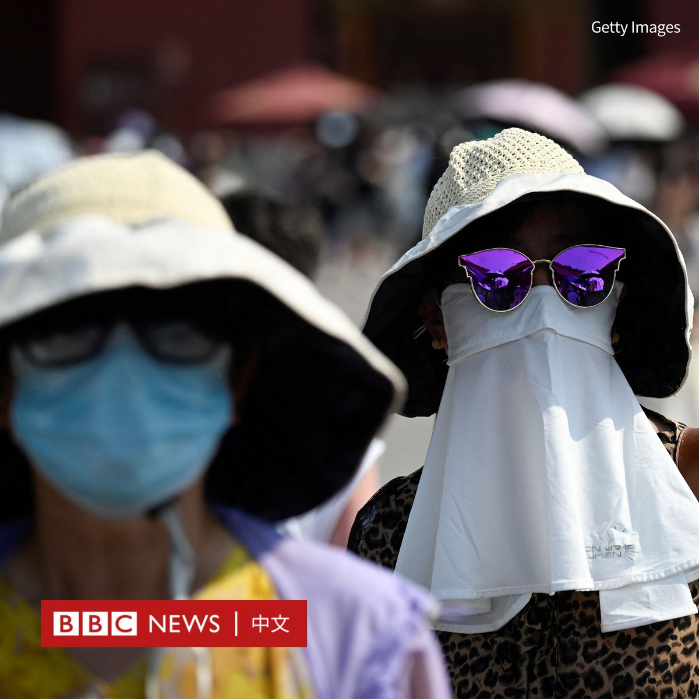
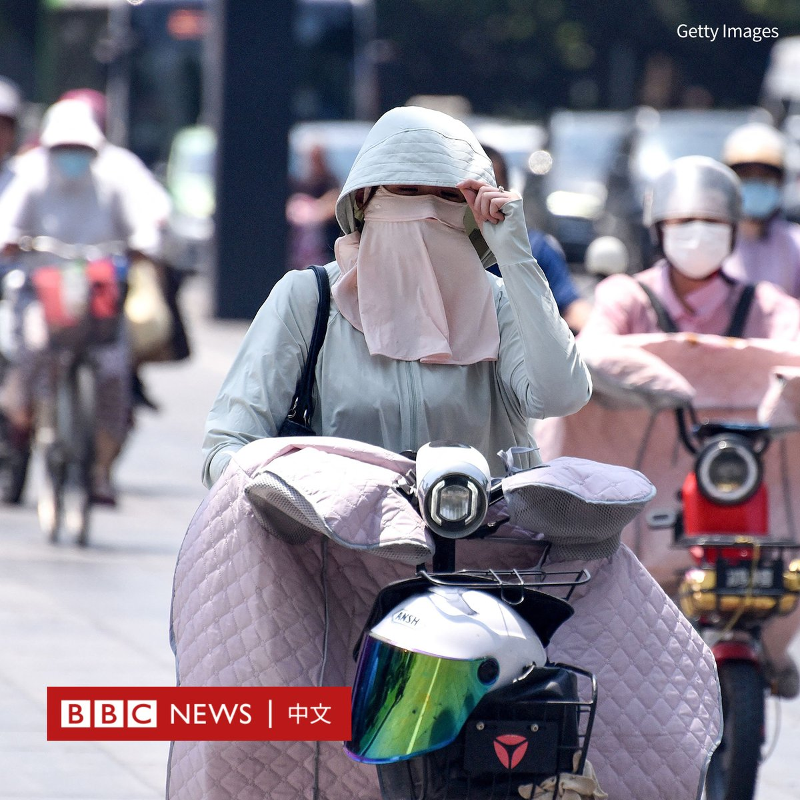
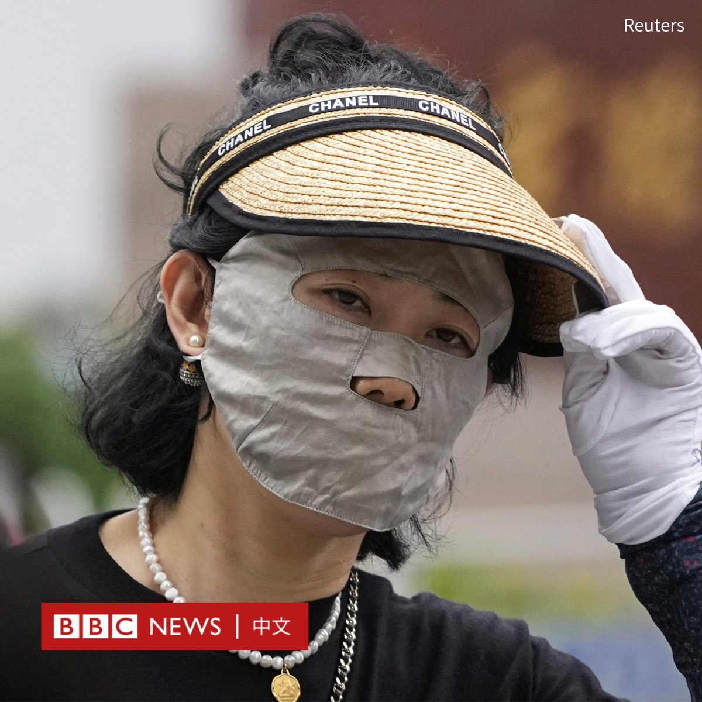
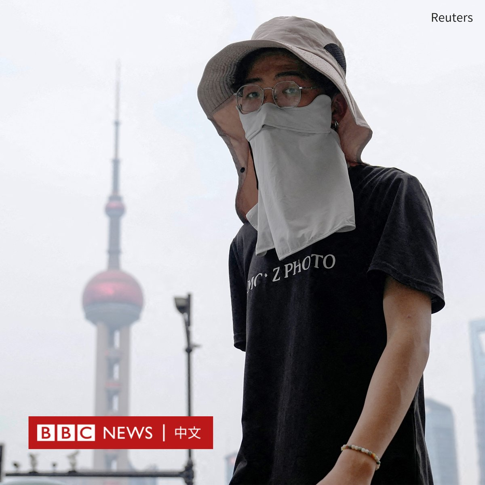
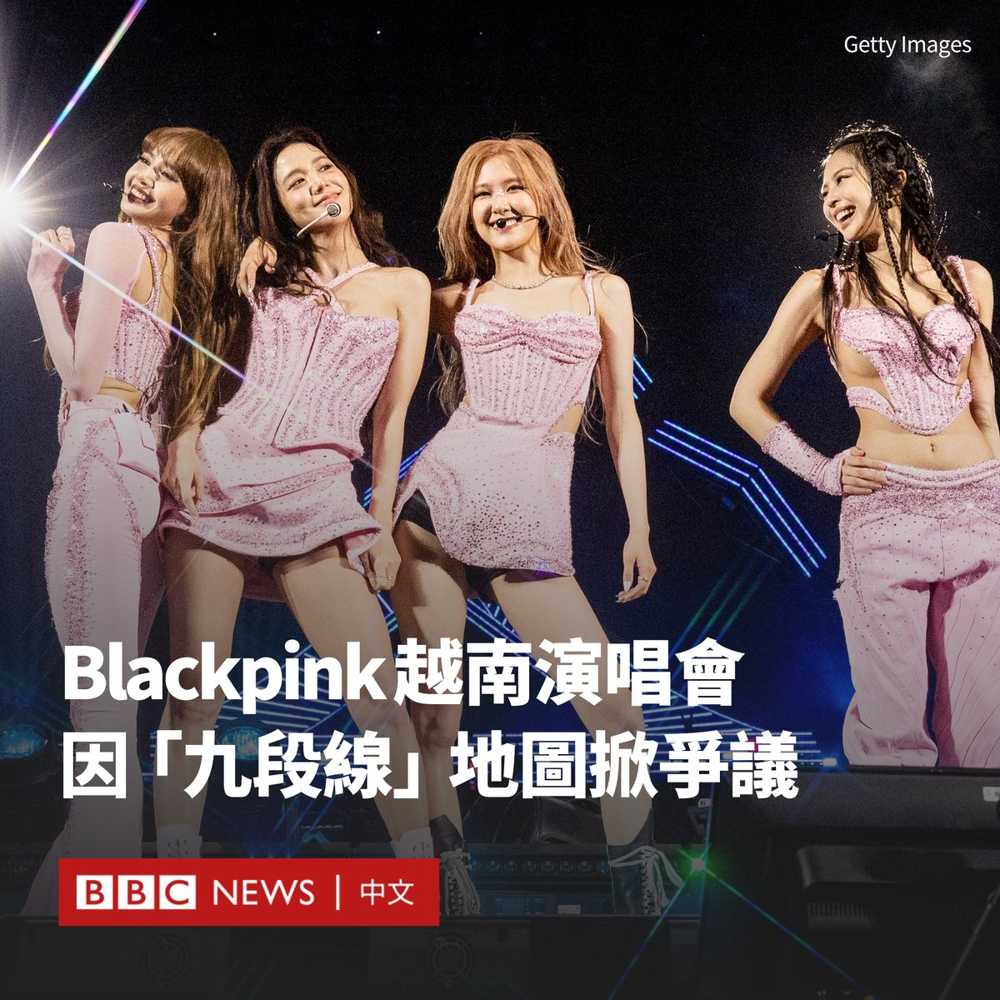
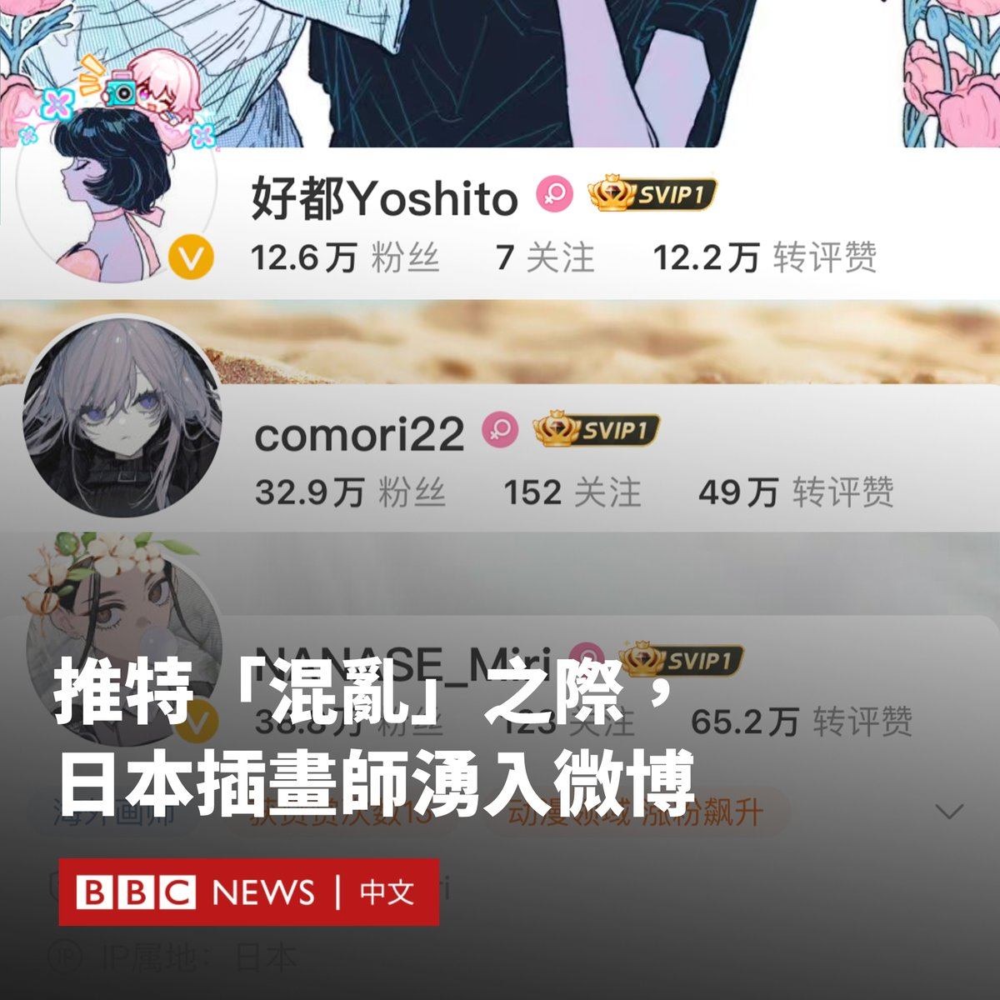

D英国广播公司BBC 北京时间 2023-07-07T16:00:02Z 1677225951233728512 要问今夏中国街头最潮流的穿搭是什么？“脸基尼”肯定是其中之一！

随着中国多地被艳阳炙烤，各种防晒产品在北京和上海等城市街头纷纷亮相。

受到青睐的包括这种防紫外线面罩，它可以覆盖眼睛以下的脸部和脖子。一些人还搭配了帽子或墨镜以“全副武装”。

官方媒体和一些网民将其戏称为“脸基尼”。该词原本是由青岛的游泳爱好者结合“脸”和“比基尼”两个词而成，用以形容在海滩日浴时所戴的防晒面罩。

在多地气温逼近甚至超过40°C的情况下，“脸基尼”成为居民出行不可或缺的时尚配饰。

官方媒体援引电商分析平台“商指针”的数据称，2023年5月，中国防晒服的零售额超6亿元人民币，同比增长351.15%。

一家位于义乌的店铺的一款有帽檐的“脸基尼”已经卖出了近30万件。

根据中国国家气候中心的数据，今年上半年，中国的高温天数创下了自1961年有官方监测记录以来的历史同期最多纪录。

周三（7月5日），首都北京的气温今年以来第四度冲上40°C。从1951年到去年，北京只有六天的温度达到40°C。   D英国广播公司BBC 北京时间 2023-07-07T13:32:19Z 1677188774797914112 风靡全球的韩国人气女团Blackpink在越南卷入风波。该组合本月下旬将在越南举行两场演唱会，而其主办方因在官网上发布中国主张的南海“九段线”地图而道歉。

越南外交部发言人称，主办方iME公司网站上的地图是一个“敏感问题”，并补充说“在越南推广和使用带有‘九段线’的产品违反了越南的法律，是不可接受的”。

总部位于北京的娱乐公司iME发布道歉信，表示将更换地图。

该公司表示，其网站上的地图“不代表任何国家的领土，我们尊重所有国家的主权和文化”。

几天前，越南决定禁播美国浪漫喜剧电影《芭比》（Barbie）。原因同样是当局指电影内容含有“九段线”地图。

Blackpink是YouTube上关注度最高的女团。她们最近的专辑《Born Pink》在英国专辑排行榜上排名第一。

由于类似的巡演在越南很少见，其在粉丝中引发了热潮。但该事件发生后，一些越南粉丝呼吁抵制其巡演。

中国通常使用所谓“九段线”，对南中国海的绝大部分海域提出主权声索，但越南、菲律宾、马来西亚、文莱等国均提出质疑。

海牙国际仲裁法院曾于2016年作出裁决，称中国不享有“九段线”的历史性权利，中方不承认有关裁决。   D英国广播公司BBC 北京时间 2023-07-07T11:22:19Z 1677156059629203457 镓和锗是制造半导体的关键原材料，中国此举普遍被认为是美中芯片战中的最新反制措施。这两种金属有什么用途？出口禁令将如何影响供应链？https://t.co/L7HMQuP4r3   D英国广播公司BBC 北京时间 2023-07-07T10:15:36Z 1677139272347037697 随着推特（Twitter）出现动荡，有至少二十名日本插画师转而前往中国社交媒体微博开设账户，受到中国粉丝的广泛欢迎。

许多插画师将原因归咎为推特老板马斯克（Elon Musk）推出的新限制措施，使得推特变得“不稳定”。

“很高兴见到你……现在推特很难用，所以我第一次尝试！从现在开始我会发布更多插图。”插画师“Kuki Kushiro”周二（7月4日）在微博上写道。

另一名账号为“comori22”的插画师也发微博称：“Twitter遇到了严重的麻烦，所以我正在紧急尝试各种SNS。”

上周，推特开始限制用户每天可阅读的推文数量，未认证用户每天可以阅读1000条推文，认证用户每天可以阅读10,000条推文。

为了推广推特的付费订阅服务Twitter Blue，该平台还取消了此前针对名人的免费认证，用户需付费获得蓝色勾号。

据中国媒体“第六声”（Sixth Tone）报道，由于中国屏蔽了海外社交媒体以及同人作品网站Archive of Our Own（AO3）​​，许多日本插画师入驻中国社交平台，让很多粉丝倍感惊喜。

截至周五（7月7日），“comori22”在微博上已拥有33万粉丝，这远远超过了她在推特上的5万名关注者。

“我收到的评论比Twitter上的多5亿倍！”插画师“NANASE_Miri”在微博打趣地写道。

她称，由于不懂中文，她正在使用翻译软件来写微博和阅读评论。

“太热闹了，感谢马斯克给我们带来了这么多优秀老师（指画师）！”一名微博网友开玩笑地写道。   