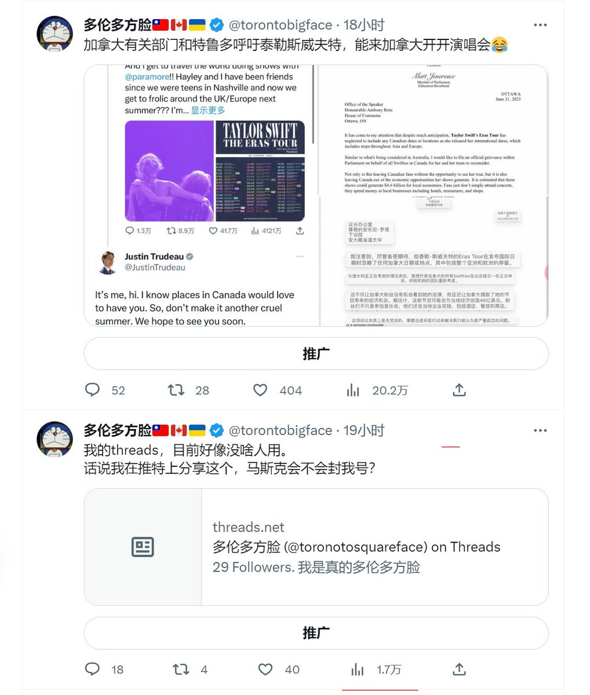

多伦多方脸 北京时间 2023-07-07T22:10:11Z 1677319101662781440 交完保护费咯 https://t.co/ipgfMhIZKT   多伦多方脸 北京时间 2023-07-07T14:50:40Z 1677208493500276736 什么小丑🤡 https://t.co/iLH7L2NNNV   多伦多方脸 北京时间 2023-07-07T12:54:24Z 1677179233167360000 奸诈的马斯克 偷偷限流 https://t.co/X0GdTUHZR9   多伦多方脸 北京时间 2023-07-07T00:17:50Z 1676988836583452672 建议各位可千万别失业了去创业
虽然成功概率也是有的，但是很低
首先创业本身应该是一件准备好的事情，计划好的事情
而不是我现在失业了，闲的慌，我去找点事情，或者我没钱了，创业赌一把。
另外因为受到共产主义的影响，很多人认为老板就是纯剥削，但是其实老板在承担风险
经济下行，创业风险更大   