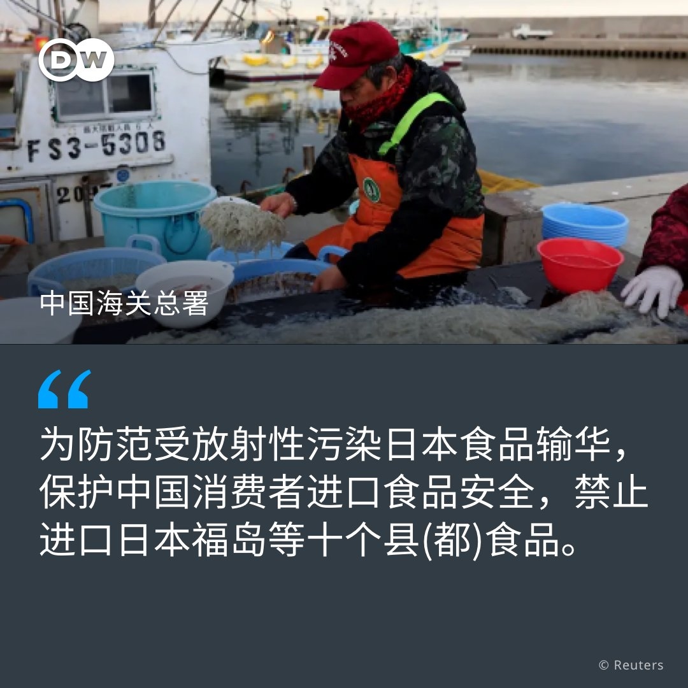
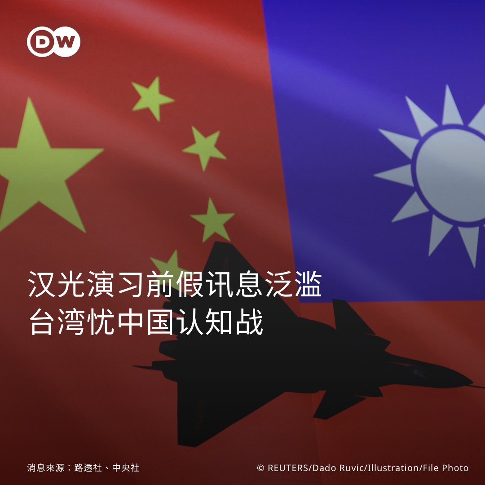
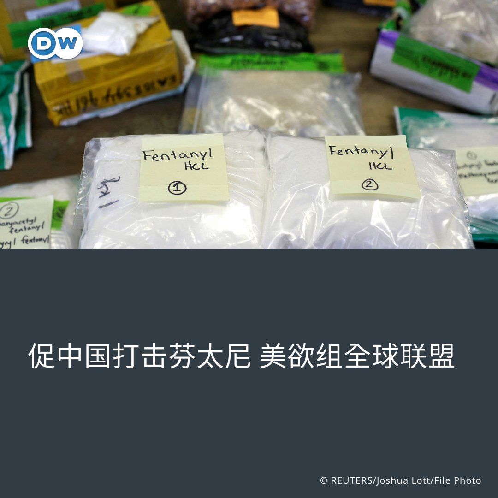

德国之声 北京时间 2023-07-07T19:49:00Z 1677283570157596672 美国🇺🇸财长 #耶伦 周五和中国🇨🇳国务院总理 #李强 会面时强调，美方寻求与中国的良性竞争，她希望此行能促进双方更加常态化沟通。李强则表示，中美关系风雨过定见彩虹🌈。

https://t.co/7lPe3qtmos   德国之声 北京时间 2023-07-07T21:15:00Z 1677305213743427587 阿富汗塔利班政权宣布关闭美发沙龙💇‍♀️，而这是许多女性的唯一就业机会和生活来源。 https://t.co/qJ2qgrqqS0   德国之声 北京时间 2023-07-07T18:40:00Z 1677266206070284288 电影《芭比娃娃》刚刚因场景出现反映中国对南海领土主张的 #九段线 而在越南🇻🇳遭禁映，韩国当红天团 @BLACKPINK 越南巡演的主办公司又因同样的问题受到越南文化局审查。

https://t.co/5ENVGXlojk   德国之声 北京时间 2023-07-07T19:17:00Z 1677275517219934210 详情报导：https://t.co/VgRslt8EdO

在IAEA本周报告稱 #日本核廢水排海🌊 计划符合安全標准之後，中国海关总署本周五宣布將禁止进口日本 #福岛 等十个县(都)食品🐟🦀。 https://t.co/Eziv6ywWzB   德国之声 北京时间 2023-07-07T20:33:00Z 1677294643250356224 自俄乌战争以来，德国向乌克兰提供武器、弹药、装备并在德国为乌克兰士兵提供培训，由此受到俄罗斯情报部门更密集地刺探🥸🔎。德国军事反情报局 #MAD 报告称，俄在德情报活动达到全新的规模。

https://t.co/sakbF2IeeG   德国之声 北京时间 2023-07-07T17:08:00Z 1677243053310980098 #乌克兰 城市尼科波尔距离 #扎波罗热核电站 很近。当地民众因为害怕 #核泄漏 在面对俄军攻击时也不敢回击。基辅近来警告称俄方已在核电站布雷。附近的居民现在不仅要担心轰炸，还要忧虑可能的核灾难。 https://t.co/T7RZuy90xK   德国之声 北京时间 2023-07-07T18:00:01Z 1677256146480951296 详细报导👉https://t.co/SETpDsWKTM

【中国对台 #认知战❓】🇹🇼 🇨🇳
台湾国安人士指出，每年 #汉光演习 前，都会出现来自中国的 #假讯息攻势，其中有些声称蔡英文要借此进行"逃命彩排"。台湾官员认为，这些假讯息可能是为了影响明年的 #台湾总统大选。 https://t.co/ZBtBiiV8DM   德国之声 北京时间 2023-07-07T16:08:15Z 1677228018388062208 #俄罗斯 6月底发生戏剧性的叛乱事件，叛军 #瓦格纳 集团首领普里戈津曾传出已流亡 #白俄罗斯，但该国🇧🇾总统6日称，普里戈津现在在俄罗斯。对此，🇷🇺俄国称并未、也无意追踪普里戈津下落。
详细报导👉https://t.co/JbuJupMhz8   德国之声 北京时间 2023-07-07T11:20:55Z 1677155710029950976 【#Meta 推新应用程序 #Threads 传 #推特 将提告】🤳
Meta近日推出了新的应用程序Threads，上线1天已吸引数千万用户。不过，#Twitter 认为这款程序盗用其商业机密及知识产权，扬言将对Meta提告。
🔗看详细报导🔗 https://t.co/PipfNqzH7s
   
🤔您用过Threads了吗？使用体验如何呢？请跟我们分享！
👇媒体向推特寻求置评时，还发生了这样的事⋯⋯   德国之声 北京时间 2023-07-07T10:57:00Z 1677149690813628416 【美国：打击#芬太尼 中国应做得更多】🇨🇳 🇺🇸
 
#美国 将于7日主办一场关于芬太尼（#fentanyl）的线上会议，希望全球各国与 #中国 洽谈，促其出手打击毒品流通。这样的做法是否有用❓ 欢迎您留言与我们分享看法👇
详细报导👉https://t.co/MdPCisBxuP https://t.co/REvea3ym6z   德国之声 北京时间 2023-07-07T07:10:00Z 1677092561905934337 中国本周宣布对 #镓 #锗 实施出口管制，引发了对中国可能限制其他原材料出口，尤其 #稀土 出口的担忧。稀土究竟有何用处？中国的稀土对全球市场来说有多重要？

https://t.co/TpAucmslLw   