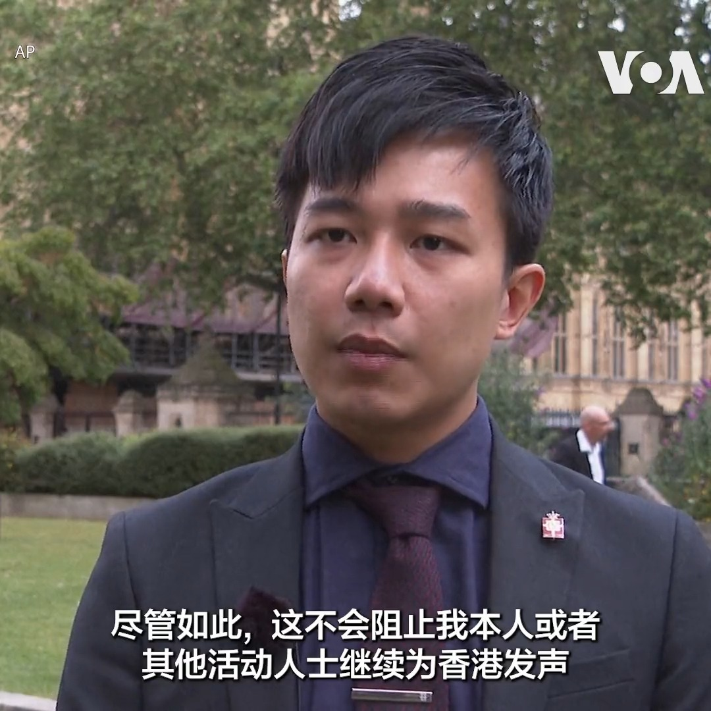

美国之音中文网 北京时间 2023-07-07T01:27:33Z 1677006380799238144 中国疫情卷土重来，官方通报六月染疫死亡人数比五月大幅增加 https://t.co/KKqXTRpAWa   美国之音中文网 北京时间 2023-07-07T01:31:29Z 1677007374337339392 居住在美国的维吾尔人士5日在华盛顿特区中国驻美国大使馆前进行抗议示威，纪念新疆乌鲁木齐七五事件14周年。抗议人士高喊”恐怖主义者中国”、“中国撒谎”等口号，并焚烧中国国旗。 https://t.co/z4Gx1H5BMr   美国之音中文网 北京时间 2023-07-07T01:43:04Z 1677010286312841218 港警挥舞国安法大棒镇压不手软，第五位前众志成员在机场被逮捕 https://t.co/ibf8fQttBD   美国之音中文网 北京时间 2023-07-07T00:27:17Z 1676991217588920321 “这并不会阻止我继续努力，继续推动人权与民主”,  居住在英国的香港活动人士刘祖迪说。刘祖迪是被香港政府通缉的8名海外活动人士之一。他和另外一名被通缉的活动人士蒙兆达5日到英国议会参加记者会,  蒙兆达也表示不会因为被通缉而停止民主活动。 https://t.co/jt5uXRPrLW   