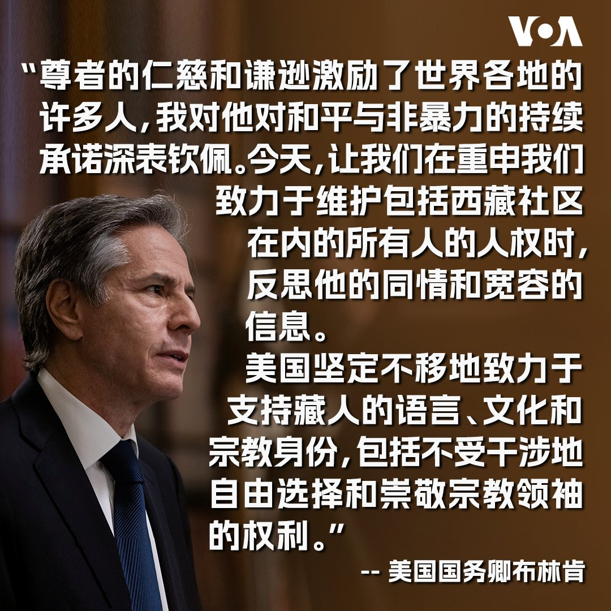

美国之音中文网 北京时间 2023-07-07T02:54:27Z 1677028250915053568 7月6日是西藏精神领袖达赖喇嘛88岁生日。美国国务卿布林肯发表声明，向达赖喇嘛致以生日祝福。 https://t.co/KKCIgeIpHv   美国之音中文网 北京时间 2023-07-07T03:22:12Z 1677035235731488768 “我们在两周内一直没能等到病床。我真的很害怕。我儿子病了。”一位母亲抱怨道。儿科医生短缺是目前韩国社会面临的又一难题。业界人士表示，韩国的低出生率导致儿科医疗资源严重匮乏。与同行相比，儿科医生收入很少，许多医生纷纷回避这个“没有未来的领域”。医生们认为，政府应投入更多预算解决问题。 https://t.co/2QqhCzvXzE   美国之音中文网 北京时间 2023-07-07T04:20:11Z 1677049827534819328 越南外交部发言人6日说在越南使用和推广包含 “九段线”的作品违反了越南法律。7月底将在河内演出的韩国女团 “BLACKPINK”演唱会宣传使用了含“九段线”的地图，越南政府对主办方、总部设在中国的iMe娱乐集团是否涉嫌支持“牛舌线”（九段线）展开调查。越南一些民众也表示反对九段线,。 https://t.co/XMgSwv1lzf   美国之音中文网 北京时间 2023-07-07T01:27:33Z 1677006380799238144 中国疫情卷土重来，官方通报六月染疫死亡人数比五月大幅增加 https://t.co/KKqXTRpAWa   美国之音中文网 北京时间 2023-07-07T01:31:29Z 1677007374337339392 居住在美国的维吾尔人士5日在华盛顿特区中国驻美国大使馆前进行抗议示威，纪念新疆乌鲁木齐七五事件14周年。抗议人士高喊”恐怖主义者中国”、“中国撒谎”等口号，并焚烧中国国旗。 https://t.co/z4Gx1H5BMr   美国之音中文网 北京时间 2023-07-07T01:43:04Z 1677010286312841218 港警挥舞国安法大棒镇压不手软，第五位前众志成员在机场被逮捕 https://t.co/ibf8fQttBD   美国之音中文网 北京时间 2023-07-07T00:27:17Z 1676991217588920321 “这并不会阻止我继续努力，继续推动人权与民主”,  居住在英国的香港活动人士刘祖迪说。刘祖迪是被香港政府通缉的8名海外活动人士之一。他和另外一名被通缉的活动人士蒙兆达5日到英国议会参加记者会,  蒙兆达也表示不会因为被通缉而停止民主活动。 https://t.co/jt5uXRPrLW   