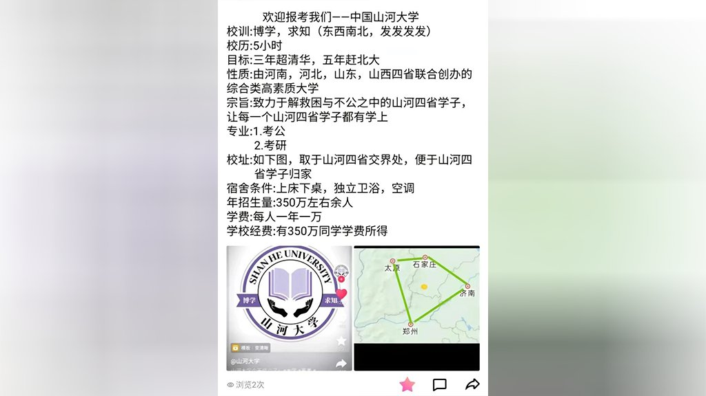
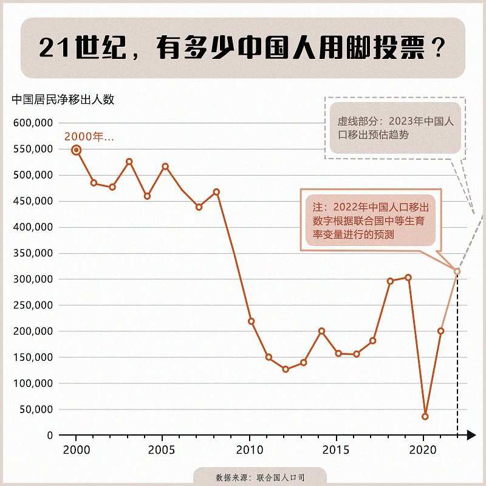
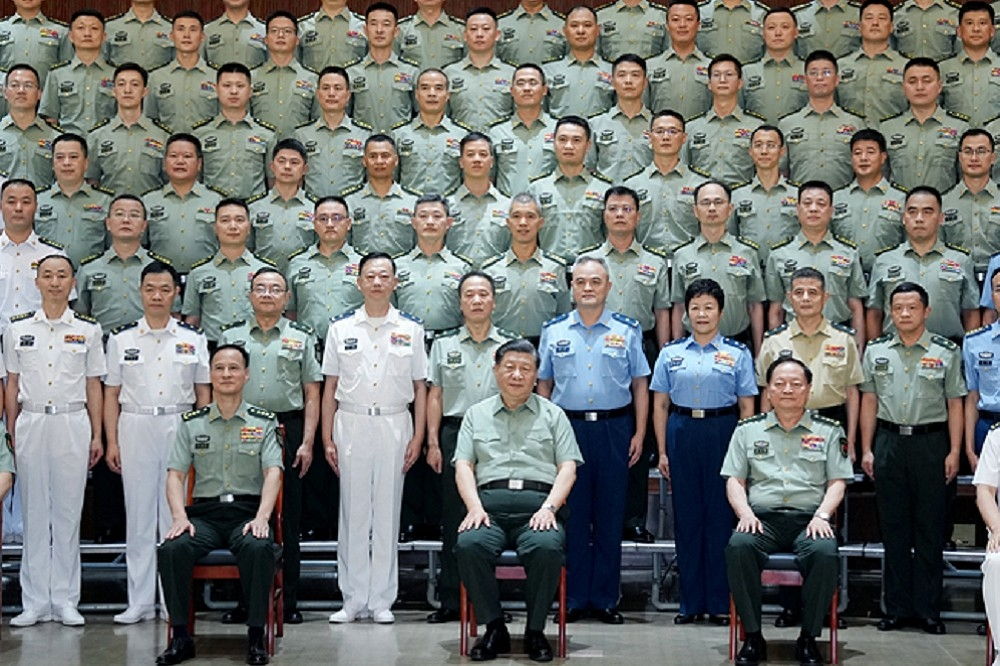

自由亚洲电台 北京时间 2023-07-07T16:33:40Z 1677234415783772161 【傅政华“天坛公馆”豪宅拍卖】
【低价求售却无人竞标】
去年被法院判处死刑缓期执行的中国正部级官员 #傅政华，其位于北京的“#天坛公馆”一号楼1单元602室，本周四（6日）挂牌拍卖。该豪宅起拍价近2千万元人民币，比起市场价格要低了600万元，但无人投标。北京房地产及业内人士称，政商界人士担心树大招风，即使有钱也不敢买傅政华的房子。
详细报道：https://t.co/F4wFkXBKNk
（图：网站上的同型户房产）   自由亚洲电台 北京时间 2023-07-07T10:58:41Z 1677150113683357696 #美国在台协会（AIT）新任主席劳拉∙罗森伯格（Laura Roseberger）7月6日在华盛顿办公室接受部分驻美华媒访问时表示，无论 #台湾 人民选出谁为下一任领导人，美国都将继续与其密切合作。美国的政策不会依据哪位候选人当选而改变。

 https://t.co/JVjgYXuPW1   自由亚洲电台 北京时间 2023-07-07T04:45:31Z 1677056204051472387 本周四，中共领导人 #习近平视察东部战区，并强调了练兵备战的军事目标。
有学者指出，今年以来，习近平两度视察承担主要对台军事任务的南部和东部战区，是为推进 #统一台湾 做准备，但迹象显示军方内部却与习近平存在分歧。

 https://t.co/PIwQMv3SZx   自由亚洲电台 北京时间 2023-07-07T06:30:00Z 1677082498118057990 俄罗斯两艘护卫舰格罗姆基号和主权号周三在上海停靠。两艘船舰属于位于符达迪沃斯托克的俄罗斯太平洋舰队。

 https://t.co/7hnCbM4zbT   自由亚洲电台 北京时间 2023-07-07T07:00:08Z 1677090078391164929 【#亚太报道（2023-7-6）】
欢迎收听和订阅播客【亚太报道】 https://t.co/MjLNSvVeAE
美国财长 #耶伦 抵达北京 / #习近平视察东部战区 / 武汉 #张海 “寻滋”案被退回警方重新侦查 / 高 #抑郁 风险下的中国年轻一代 / 香港政府试图影响美国的中、港政策 https://t.co/XMVQFq558N   自由亚洲电台 北京时间 2023-07-07T07:57:21Z 1677104480075096071 RT @RFA_Chinese: 死磕 #九段线    #越南 禁映真人《#芭比》 https://t.co/OhlZegWdOv   自由亚洲电台 北京时间 2023-07-07T08:55:59Z 1677119235720613888 #事实查核｜美国警告美国人不要去中国？
 https://t.co/Gq3PejqwmZ   自由亚洲电台 北京时间 2023-07-07T09:05:35Z 1677121651102580736 【#山河大学 乌托邦  中原学子辛酸泪】
中国六月底大学选填志愿期，网上出现反应教育资源不公的一所虚拟的”山河大学“，相关讨论引爆网络。由于河南、山东等人口大省的考生众多、竞争激烈，录取分数要求高，导致很多考生上不了好大学，于是网友提议”在山东、山西、河北、河南四省的343万考生，每人出1000元，合计30多亿元，就可以打造出一所综合性大学，争取一年内赶超清华北大。“
这一玩笑很快就传播开来。7月2号，许多网友发现有关”山河大学“的微博、知乎话题遭到封禁。对此，有网友调侃，”在中国，你想做梦都是做梦。”
据中新网消息，中国教育部副部长吴岩表示，关于“山河大学”，教育部已经关注到。教育部将不断优化高等教育资源的布局结构，支持中西部地区，特别是人口大省扩大高等教育资源规模，优化类型结构和区域结构。   自由亚洲电台 北京时间 2023-07-07T09:33:51Z 1677128763149090816 RT @RFA_Chinese: 《华尔街日报》根据联合国人口司数据，发现在21世纪头十年初的大部分时间里，每年 #中国净迁出人数 约为50万。… https://t.co/pMLUxEwRWR   自由亚洲电台 北京时间 2023-07-07T09:56:50Z 1677134549401174017 RT @RFA_Chinese: 中国前商务部副部长魏建国周三在接受《中国日报》的独家专访中表示，中国出口管制芯片重要原材料只是开始。 https://t.co/KcF2ibpmy0   自由亚洲电台 北京时间 2023-07-07T04:36:09Z 1677053847116607489 中国前商务部副部长魏建国周三在接受《中国日报》的独家专访中表示，中国出口管制芯片重要原材料只是开始。 https://t.co/KcF2ibpmy0   自由亚洲电台 北京时间 2023-07-07T06:01:15Z 1677075261114687494 《华尔街日报》根据联合国人口司数据，发现在21世纪头十年初的大部分时间里，每年 #中国净迁出人数 约为50万。
但在2008年之后，这一数字急剧下降，部分原因很可能是中国从全球金融危机中强劲复苏，而同期西方主要经济体陷入困境。本世纪第二个十年初，中国经济强劲增长，同时中国劳动年龄人口缓慢减少。2012年，中国的净迁出人数一度降至12.5万人。
这一趋势到本世纪第二个十年末开始逆转。到2018年，中国的净迁出人数已回升至近30万人。
尽管迁出人数在 #新冠疫情 期间再次回落，但联合国的最新预测，在2021年净迁出约20万人之后，2022年的净迁出人数将再次突破30万人。
您认为这个预测靠谱吗？   自由亚洲电台 北京时间 2023-07-07T02:33:29Z 1677022975013408786 星期四， #习近平视察解放军东部战区。习近平表示，“当前世界进入新的动荡变革，中国安全形势不稳定不确定增大。要增建战区联合作战指挥体系，大抓实战化军事训练，加快提高打赢能力。”
根据中国官方媒体，习近平还说，要深入贯彻党的２０大精神，贯彻新时代军事战略方针，锚定进军一百年奋斗目标，能力开创战区建设和备战打仗工作新局面。中央军委副主席 #张又侠 等人也参观了相关活动。   自由亚洲电台 北京时间 2023-07-07T02:55:15Z 1677028451717447683 专栏 | #军事无禁区：从兵变到逼宫－#普京 的下一步？
https://t.co/se1ZjFf2GD   自由亚洲电台 北京时间 2023-07-07T04:13:30Z 1677048145203609602 7月6日，美国财政部长 #耶伦 抵达中国，开启了她为期四天的访华行程。预计本周五，耶伦将在与中国总理 #李强 以及前副总理 #刘鹤 举行会晤。耶伦此行能否从两国商贸角度为处于低谷的 #美中关系 止跌停损，备受各界瞩目。
https://t.co/8G5AD3zMUk https://t.co/6QJmx0VNUP   自由亚洲电台 北京时间 2023-07-07T00:54:28Z 1676998055487475712 专栏 | #纵横大历史：第五十五讲 风暴前夜的清华附中
#红卫兵 https://t.co/gugYJeTmsj   自由亚洲电台 北京时间 2023-07-07T01:23:07Z 1677005265785192461 死磕 #九段线    #越南 禁映真人《#芭比》 https://t.co/OhlZegWdOv   自由亚洲电台 北京时间 2023-07-07T01:29:32Z 1677006883050364928 本周二，著名华语流行乐女歌手 #李玟 因 #抑郁症 而轻生去世的消息震惊各界。
其实，#精神抑郁 问题近年来在中国日益严重，尤其是年轻人罹患抑郁症的风险明显高于其他年龄人群。这其中究竟是什么原因呢？
本台记者凯迪 @KittyWang5 报道。

 https://t.co/DuFMMMuMmz   自由亚洲电台 北京时间 2023-07-07T02:05:40Z 1677015973239595009 因为推动"#香港议会"而遭到 #香港政府通缉 的 #袁弓夷 正在加拿大宣传"香港议会"选举活动。他称通缉令代表自己做了正确的事情，令中国和香港政府感到害怕。不少加拿大港人称不担心安全，届时会参与投票，用选票决定香港未来。

 https://t.co/KIPA3L6xIr   自由亚洲电台 北京时间 2023-07-07T00:16:56Z 1676988609872936961 从1997年开始至2014年雨伞运动期间，#香港贸发局 用超过830万美元在美游说。
2019年反送中运动后，有关的开支增加至超过3500多万美元，其中大部分是通过贸发局支付予美国说客，贸发局与美国政界的互动高达400多次。
中美关系紧张，中国利用香港打开局面？

 https://t.co/9ez6kN7QV0   