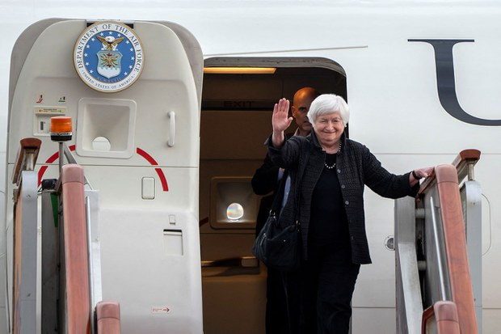

自由亚洲电台 北京时间 2023-07-07T02:55:15Z 1677028451717447683 专栏 | #军事无禁区：从兵变到逼宫－#普京 的下一步？
https://t.co/se1ZjFf2GD   自由亚洲电台 北京时间 2023-07-07T04:13:30Z 1677048145203609602 7月6日，美国财政部长 #耶伦 抵达中国，开启了她为期四天的访华行程。预计本周五，耶伦将在与中国总理 #李强 以及前副总理 #刘鹤 举行会晤。耶伦此行能否从两国商贸角度为处于低谷的 #美中关系 止跌停损，备受各界瞩目。
https://t.co/8G5AD3zMUk https://t.co/6QJmx0VNUP   自由亚洲电台 北京时间 2023-07-07T00:54:28Z 1676998055487475712 专栏 | #纵横大历史：第五十五讲 风暴前夜的清华附中
#红卫兵 https://t.co/gugYJeTmsj   自由亚洲电台 北京时间 2023-07-07T01:23:07Z 1677005265785192461 死磕 #九段线    #越南 禁映真人《#芭比》 https://t.co/OhlZegWdOv   自由亚洲电台 北京时间 2023-07-07T01:29:32Z 1677006883050364928 本周二，著名华语流行乐女歌手 #李玟 因 #抑郁症 而轻生去世的消息震惊各界。
其实，#精神抑郁 问题近年来在中国日益严重，尤其是年轻人罹患抑郁症的风险明显高于其他年龄人群。这其中究竟是什么原因呢？
本台记者凯迪 @KittyWang5 报道。

 https://t.co/DuFMMMuMmz   自由亚洲电台 北京时间 2023-07-07T02:05:40Z 1677015973239595009 因为推动"#香港议会"而遭到 #香港政府通缉 的 #袁弓夷 正在加拿大宣传"香港议会"选举活动。他称通缉令代表自己做了正确的事情，令中国和香港政府感到害怕。不少加拿大港人称不担心安全，届时会参与投票，用选票决定香港未来。

 https://t.co/KIPA3L6xIr   自由亚洲电台 北京时间 2023-07-07T00:16:56Z 1676988609872936961 从1997年开始至2014年雨伞运动期间，#香港贸发局 用超过830万美元在美游说。
2019年反送中运动后，有关的开支增加至超过3500多万美元，其中大部分是通过贸发局支付予美国说客，贸发局与美国政界的互动高达400多次。
中美关系紧张，中国利用香港打开局面？

 https://t.co/9ez6kN7QV0   