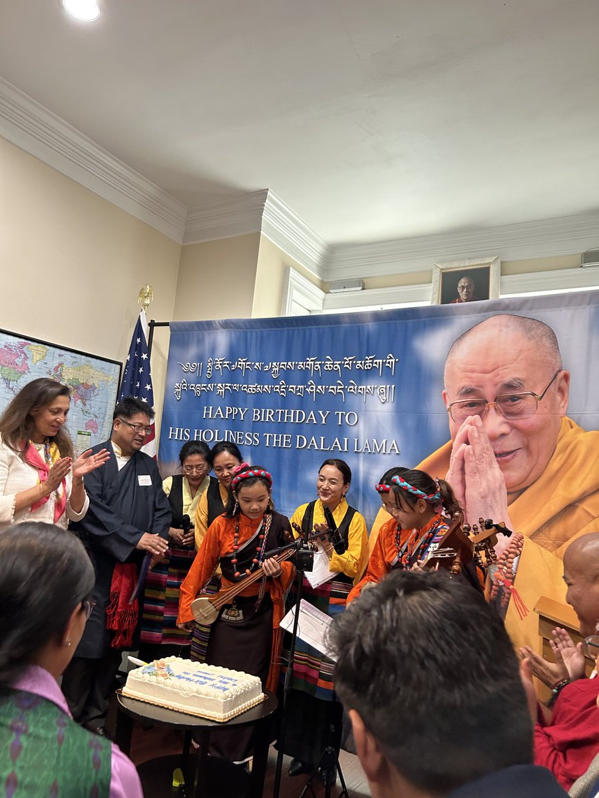
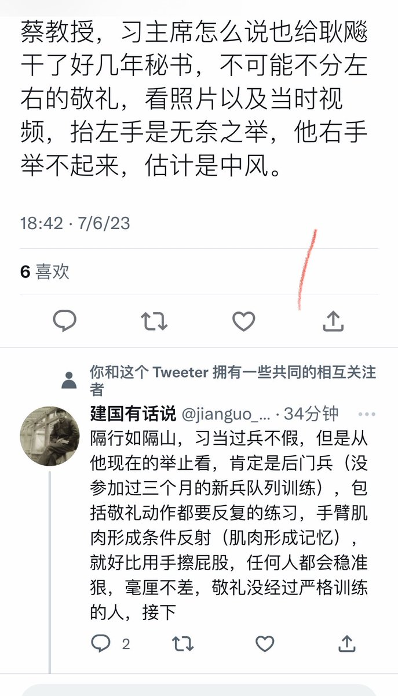
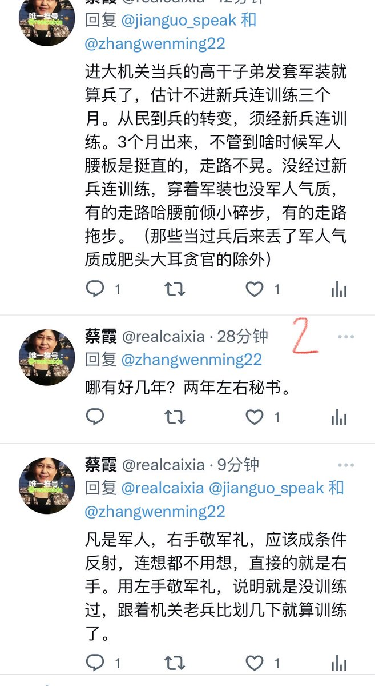
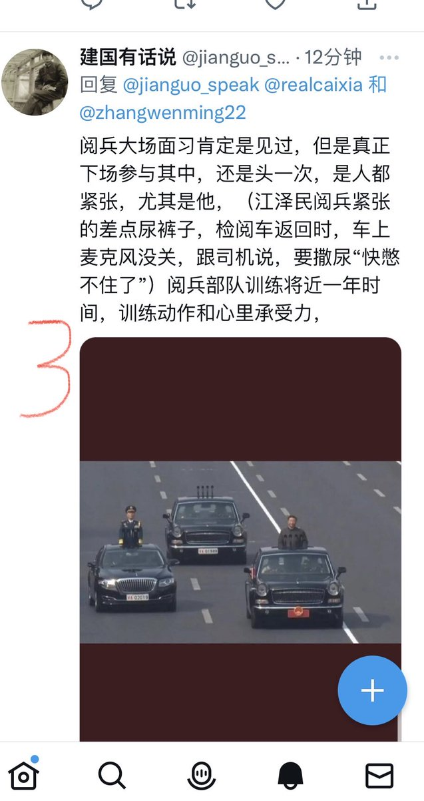
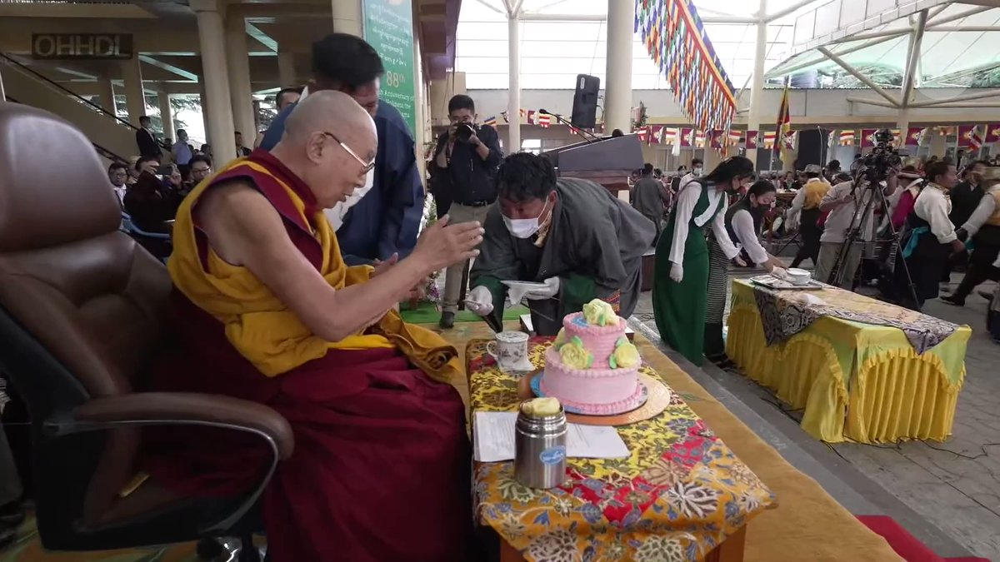
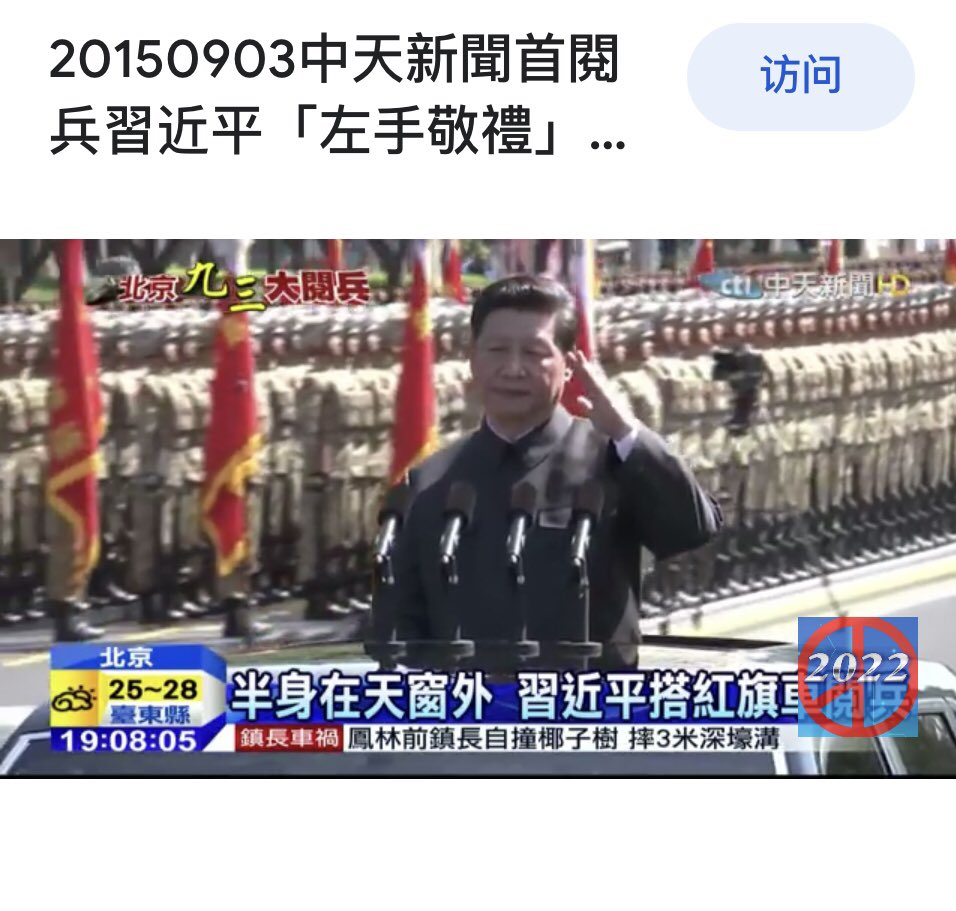
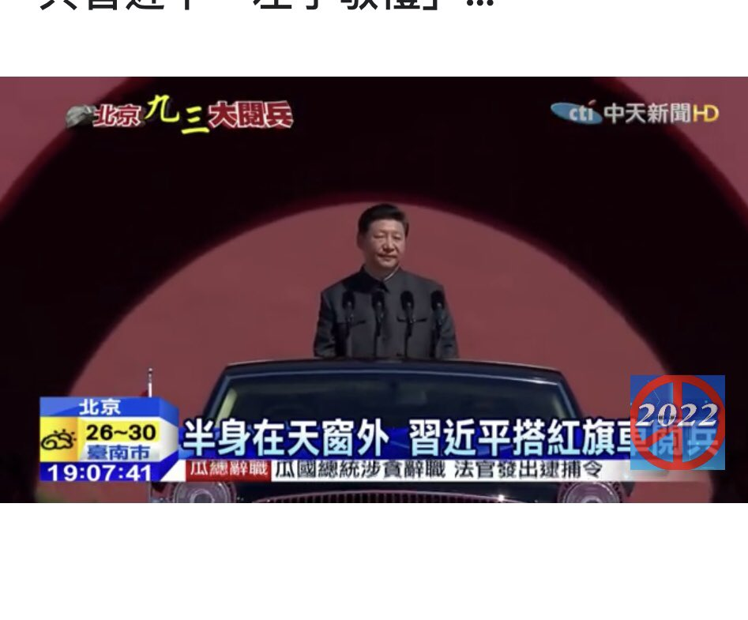

蔡霞 北京时间 2023-07-07T22:55:58Z 1677330623474589698 哀悼阎明复先生。🥀有墙里朋友说，当局不许人们送花圈。   蔡霞 北京时间 2023-07-07T22:57:30Z 1677331008209711104 RT @chinatransition: 纪念刘晓波先生去世6周年。这是一个对未來有着特殊意义的时代，自由民主理想的孤悬不免让不少人沮喪、疲倦。但吶喊抗爭的意义必将在未來、在中国自由民主新纪元来临后得到普遍的认知。这个时代將留给后世一批永远被景仰的思想者、英雄，晓波将是其中特別…   蔡霞 北京时间 2023-07-07T23:02:17Z 1677332212004388864 RT @gaoyu200812: 中國人民大學曾經佔據中國高校排行榜第一名數十年，近年跌出十名之外，為追趕名次，只能想些么蛾子，驚跌眼鏡最近設立了“追尋領袖初心”實踐導師，4日舉行了“實踐導師聘任暨暑期實踐出征儀式”，赤日炎炎之下，不知導師要帶領學生重走長征路，還是再下梁家河？…   蔡霞 北京时间 2023-07-07T23:05:06Z 1677332920267165702 RT @caojitw: 7月5日中國人社部公布，中國16省最低月薪低於2000元，最高的上海也只有2690元。很多網民自曝，自己的月薪比官方公佈的標準更低。中國現有近三億人失業，但中共黨媒卻聲稱“全國就業形勢總體穩定”，中共官方發言人甚至說“每周工作一個小時就算就業”。令人費…   蔡霞 北京时间 2023-07-07T19:07:11Z 1677273047114584064 RT @OnePersonOnePus: #张盼成，1995年生，甘肃人，前北大保安，异见人士
2018年因录视频称不同意中国政府将600亿美元未经法定程序送给外国而被逮捕
后被判刑1年6个月
2021年因录视频声援张展，谴责中共暴行，称“凛凛寒冬终将过去，春天马上要来临”
后…   蔡霞 北京时间 2023-07-07T12:21:12Z 1677170878352875521 RT @LiYuan6: 目测是在我以前在北京的食堂，三里屯一坐一忘   蔡霞 北京时间 2023-07-07T10:34:54Z 1677144128046665729 RT @yangjianli001: 今晚出席达赖喇嘛驻北美代表处与国际声援西藏联合举办的庆祝尊者达赖喇嘛88岁生日晚会。

恭祝达赖喇嘛尊者健康长寿。
长久驻世，福泽人类。 https://t.co/wyr4Fqt2ik   蔡霞 北京时间 2023-07-07T08:44:25Z 1677116323145613313 当过兵的人有共同的判断力。只要看举手投足，走路姿势，就辨得出真假。 https://t.co/7Ar42P3z4k   蔡霞 北京时间 2023-07-07T03:03:01Z 1677030408410611712 RT @rfatibet: His Holiness the #DalaiLama cuts the Birthday cake at the Main Temple, #Dharamshala https://t.co/xkBV5FIHvW   蔡霞 北京时间 2023-07-07T00:23:48Z 1676990339561951232 2015习阅兵，向受检阅部队敬礼，习近平抬左手。一时议论翻了天，他是不分左右？还是不懂应该右手敬礼？还是天生就是“左撇子“？还是慌了神抬错了手？当时墙里微信议论大翻车
网信办紧跟着一波封号删帖，微信大清场；官媒忙替习圆场遮囧：那是招手致意。党报给网友们又添一波噱笑欢乐。 https://t.co/0bRJsJs0Oa   