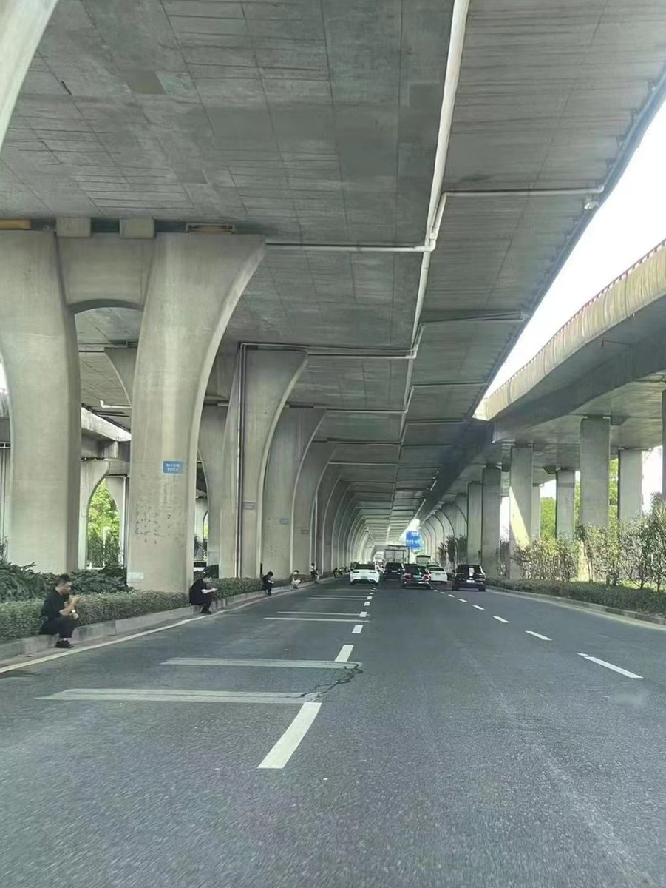

A李老师不是你老师 北京时间 2023-07-06T03:31:52Z 1676675281208201219 网友投稿
苏州今天的戒严情况：
图1：立交桥下每个桥墩坐着一个黑衣人
图2：立交桥上所有车辆被两百米外的一辆警车堵住
图3/4：下午有那么1小时 有部分路段人行道也被封锁，不让步行市民，电动车自行车通行 https://t.co/4mv5dKByXo   A李老师不是你老师 北京时间 2023-07-06T03:35:27Z 1676676179753947162 RT @PekingMike: Oh wow! This is a fascinating story by @vwang3 - very sad, but well worth your time. 
China Took Her Husband. She Was Left…   A李老师不是你老师 北京时间 2023-07-06T00:41:27Z 1676632393925492736 网友投稿
7月6日凌晨，南京火车站检票口
一女子突然情绪崩溃边哭边喊，同时不断拿出手机向周围人群展示。
因女子主要以方言为主，投稿人只能依稀听见“可惜”，“案子一拖再拖”，“感叹社会”等零星词语。
值得一提的是，从女子崩溃开始，旁边就站了两名男子，本来以为是普通乘客，但是后续当女子被扶坐下后，其中一名便衣男子掏出执法记录仪开始拍摄。   