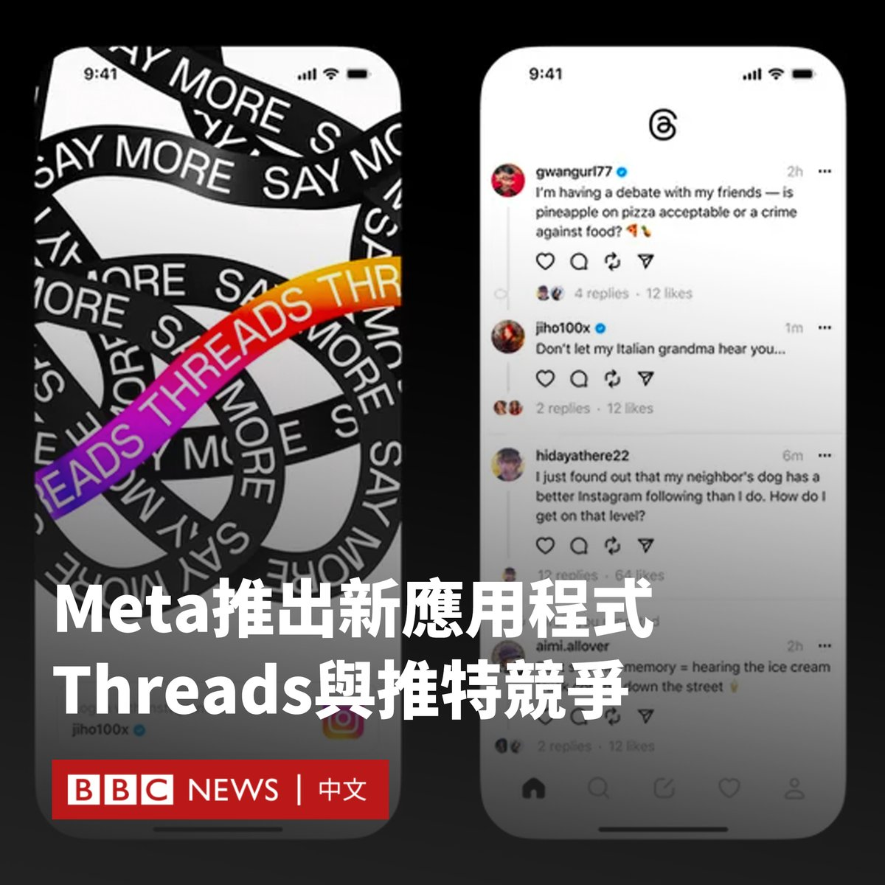

D英国广播公司BBC 北京时间 2023-07-06T12:02:03Z 1676803670497984513 在马斯克（Elon Musk）对推特（Twitter）的改版招致批评之际，脸书（Facebook）和Instagram的母公司Meta推出了新的应用程式Threads，以和推特竞争。

Threads现在可以在包括英国在内的100多个国家下载，但由于监管方面的问题，其尚未提供在欧盟的服务。

相比于Instagram，Threads更加侧重于文字内容的分享，其允许用户每次发布最多500个字符的帖子，可以包括链接、照片和影片。

Meta首席执行官扎克伯格（Mark Zuckerberg）表示，该应用在发布后的两小时内就有超过200万人注册。

他称，保持该平台“友好性”，将“最终成为其成功的关键。”

马斯克则回应称，“在推特上被陌生人攻击，也比沉浸在Instagram的虚假快乐中要好得多”。

当被问及Threads是否会“比推特规模更大”时，扎克伯格说：“这需要一些时间，但我认为需要有一款拥有10亿以上用户的公共对话应用。”

尽管Threads是一个独立的应用程式，但用户可以使用Instagram账户登录，并快速同步自己的好友。

该应用程式的质疑者批评了其可能调取的大量数据。据苹果应用商店（Apple App Store），这可能包括与用户身份相关的健康、财务和浏览数据。

此前，脸书曾因允许包括英国政治咨询公司剑桥分析（Cambridge Analytica）在内的第三方访问用户个人数据，深陷隐私数据泄露丑闻。

但与此同时，推特也因马斯克的改版面临着用户越来越多的批评。

为了推广该平台的付费订阅服务Twitter Blue，推特取消了此前针对名人和媒体的免费认证审核。用户仅需付费，便可以获得蓝色勾号。

上周，推特开始限制用户每天可以阅读的推文数量，未认证用户每天可以阅读 1000条推文，认证用户每天可以阅读10,000条推文。   D英国广播公司BBC 北京时间 2023-07-06T09:55:02Z 1676771706004983809 这是黑猩猩 🦍“香草”（Vanila）28年来第一次踏出笼子，首次看到天空的一刻。

作为医学研究对象，香草的童年生活在与世隔绝的环境中，后来她被送往一个动物保护区，但仍然生活在一个看不到外部世界的笼子里。 https://t.co/xvTZsasVEf   D英国广播公司BBC 北京时间 2023-07-06T00:23:02Z 1676627757030334465 华语乐坛天后李玟（Coco Lee）的家人周三（7月5日）表示，这名出道近30年的歌手轻生去世，终年48岁。

李玟姐姐李思林在社交平台称，患抑郁症的李玟周日（7月2日）试图在家中自戕，送院后昏迷至周三因抢救无效而离世。

“CoCo于数年前不幸患上了抑郁症，经过长时间与病魔抗争，可惜近日病情急转直下。”李思林在社交媒体上写道。“（她）努力地为华人歌手在国际歌坛开拓一片新天地，一直全力以赴为华人发光发亮，我们为她感到自豪。”

李玟1975年1月出生于香港，9岁时移民美国。1993年，她获得香港TVB举办的《新秀歌唱大赛》亚军。1994年，她发行了个人首张音乐专辑《爱就要趁现在》，正式出道。

1998年，她演唱迪士尼动画电影《花木兰》的华语主题曲《自己》。同年，她为中国动画电影《宝莲灯》演唱的插曲《想你的365天》成为经典。

1999年11月，她在美国推出英文专辑《Just No Other Way》，全球销量达到200万张，主打歌《Do You Want My Love》打入了美国Billboard舞曲榜以及澳大利亚和英国的榜单。

2001年，她在第73届奥斯卡颁奖礼上献唱单曲《A Love Before Time》，成为首位站上奥斯卡的华人歌手。这首歌是她为李安电影《卧虎藏龙》演唱的主题曲，获得当年最佳原创歌曲提名。

在她近30年的歌唱生涯中，她的中英文专辑销量达到千万级别。总是带着标志性的灿烂笑容的她同时也是舞蹈家和演员。   