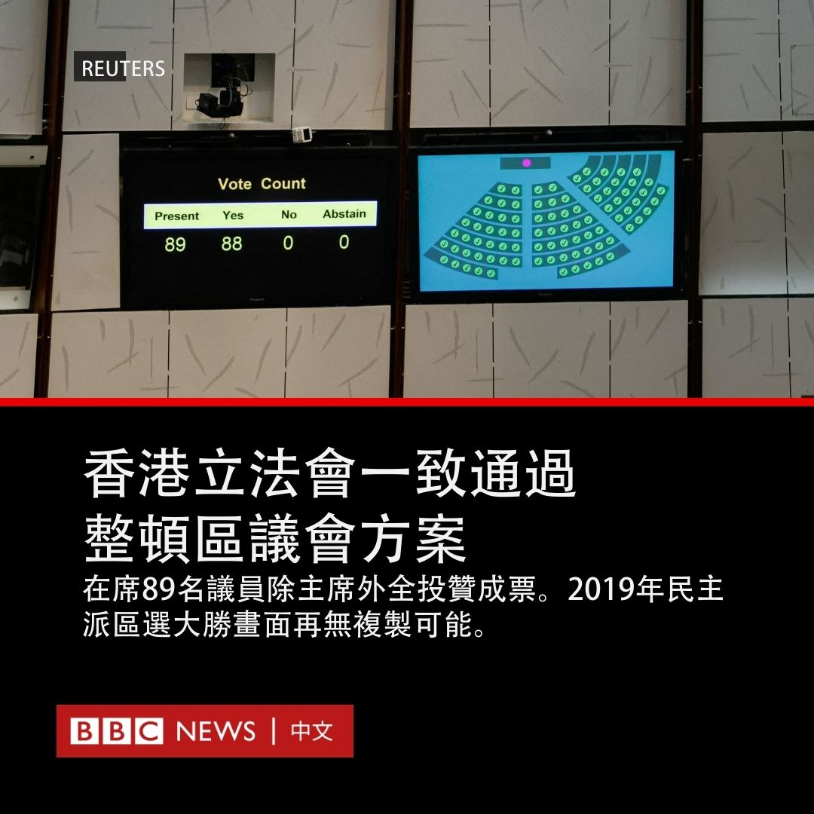
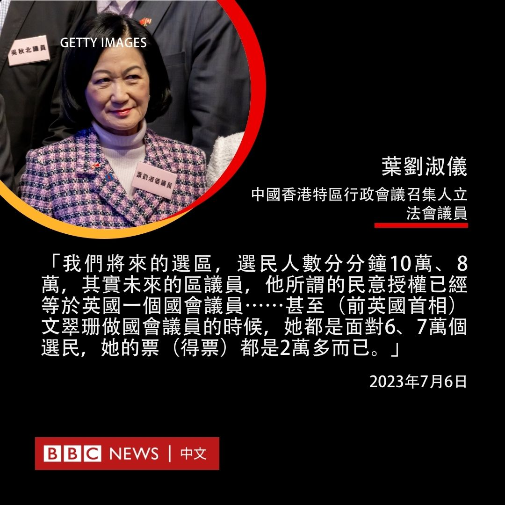
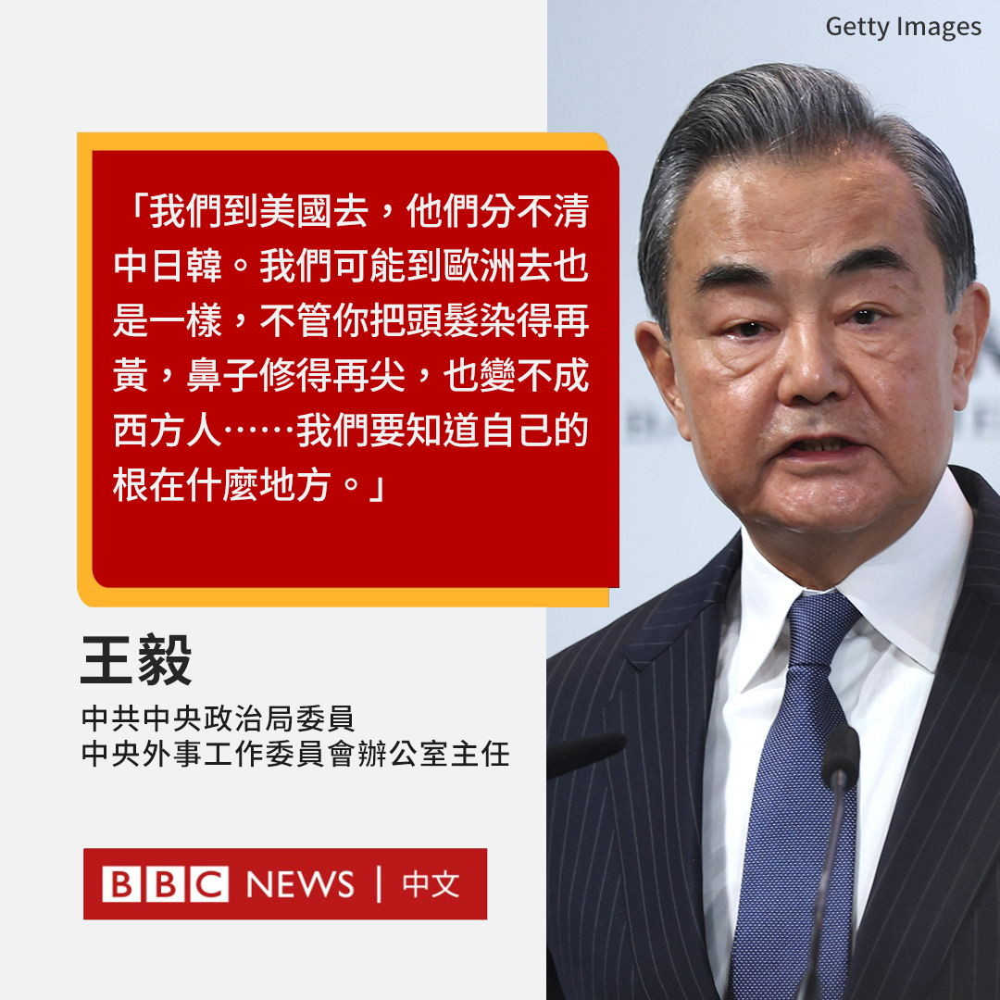

D英国广播公司BBC 北京时间 2023-07-06T19:30:13Z 1676916455344832512 过去几个月，“去风险”（De-risking）成为地缘政治上的一大热词，风头盖过之前特朗普治下美国对华政策中的“脱钩”之说。北京指责“去风险”是西方新的话语陷阱。

那么，这个热词是否代表欧美对中国的战略转向，背后又有哪些考量？https://t.co/oZYNw8zuFS   D英国广播公司BBC 北京时间 2023-07-06T20:41:16Z 1676934335344279553 中国香港立法会7月6日一致通过整顿区议会方案，下届18区区议会合共470席将只有88席——即20%——由选民投票产生，且参选人事先须取得官方谘询组织委员提名，并通过国家安全审查，2019年民主派在区选中大胜的画面再无复制可能。

正在贵州贵阳官式访问的香港行政长官李家超发表声明欢迎法案通过，称此举是“在特区地区治理层面贯彻落实‘爱国者治港’原则，令区议会牢牢掌握在爱国者手里”，并称法案在两个月内获得通过，彰显经北京整顿选举制度后产生的立法会“高效专业”。

身兼特区行政会议召集人的立法会议员叶刘淑仪在表决前发言中称，新制度下直选选区将合并，因此新区议员的民意基础可与英国国会下议院议员相比拟。

香港民主党主席罗健熙稍早前评论特区政府的方案时称，他担忧循委任途径加入的议员会否只会附和政府、阻挠民选议员问责于政府，不会重视市民期望。 @BBCChinese 此前的报道： https://t.co/nhIOuYUWdX   D英国广播公司BBC 北京时间 2023-07-06T17:08:35Z 1676880811566710785 中共中央外办主任王毅近日在青岛出席2023年中日韩合作国际论坛时的一番讲话引发争议。

官方媒体发布的影片显示，王毅在一间会议室带有告诫意味地对与会者说，中国、日本和韩国人“要知道自己的根在什么地方”。

“我们到美国去，他们分不清中日韩。我们可能到欧洲去也是一样，不管你把头发染得再黄，鼻子修得再尖，也变不成西方人。”王毅说道。

“如果我们能够携手合作的话……我们可以共同繁荣、振兴东亚。”王毅补充说。

王毅的言论引发一些外交学者和评论人士的批评。有批评者认为，这名中国最高外交官员试图推广基于外表的狭隘观点，仿佛在强调“亚洲属于亚洲人”的血统论。

前中国美国商会（AmCham China）主席吉莫曼（James Zimmerman）发推文称，“王毅的言论既鲁莽又霸道。而且不幸的是，这只会导致更多的分裂。”

德国马歇尔基金会（German Marshall Fund）亚洲项目主任葛来仪（Bonnie Glaser）写道：“这一信息不会在日本和韩国得到好的反响。王毅真的认为外表比国家利益重要？”

乔治城大学“美中全球议题对话计划”项目（The Georgetown Initiative for U.S.-China Dialogue on Global Issues）高级研究员伟德宁（Dennis Wilder）形容该言论是“很长一段时间以来”，他看到的中国外交官发出的“最令人震惊的煽动种族主义的言论之一”。

还有网友打趣地问道：“那中国和非洲做生意是不是也是同理？”

王毅发表此番言论之际，中国因美国强化与日韩盟友的军事和情报关系，而与这两个东亚邻国关系紧张。

据官方媒体报道，王毅是在周一（7月3日）发表题为《把握正确方向，共同振兴亚洲》的演说时作此番表态的。   D英国广播公司BBC 北京时间 2023-07-06T17:31:03Z 1676886465211510785 面对崛起的中国，美国和越南近年来不仅经贸关系日趋密切，在南海问题上似乎也有着共同之关切。但分析人士认为，华盛顿亟欲拉拢河内并未成功，因为对越共高层来说，维系政权才是头号大事。https://t.co/kBrM5hOqIF   D英国广播公司BBC 北京时间 2023-07-06T16:39:39Z 1676873531622330369 中共中央外办主任王毅近日在青岛出席2023年中日韩合作国际论坛时的一番讲话引发争议。

官方媒体发布的影片显示，王毅在一间会议室带有告诫意味地对与会者说，中国、日本和韩国人“要知道自己的根在什么地方”。

“我们到美国去，他们分不清中日韩。我们可能到欧洲去也是一样，不管你把头发染得再黄，鼻子修得再尖，也变不成西方人。”王毅说道。

“如果我们能够携手合作的话……我们可以共同繁荣、振兴东亚。”王毅补充说。

王毅的言论引发一些外交学者和评论人士的批评。有批评者认为，这名中国最高外交官员试图推广基于外表的狭隘观点，仿佛在强调“亚洲属于亚洲人”的血统论。

前中国美国商会（AmCham China）主席吉莫曼（James Zimmerman）发推文称，“王毅的言论既鲁莽又霸道。而且不幸的是，这只会导致更多的分裂。”

德国马歇尔基金会（German Marshall Fund）亚洲项目主任葛来仪（Bonnie Glaser）写道：“这一信息不会在日本和韩国得到好的反响。王毅真的认为外表比国家利益重要？”

乔治城大学“美中全球议题对话计划”项目（The Georgetown Initiative for U.S.-China Dialogue on Global Issues）高级研究员伟德宁（Dennis Wilder）形容该言论是“很长一段时间以来”，他看到的中国外交官发出的“最令人震惊的煽动种族主义的言论之一”。

还有网友打趣地问道：“那中国和非洲做生意是不是也是同理？”

王毅发表此番言论之际，中国因美国强化与日韩盟友的军事和情报关系，而与这两个东亚邻国关系紧张。

据官方媒体报道，王毅是在周一（7月3日）发表题为《把握振兴方向，共同振兴亚洲》的演说时作此番表态的。   D英国广播公司BBC 北京时间 2023-07-06T15:14:58Z 1676852221600751617 作为在亚洲乐坛享负盛名的歌手，李玟为华人歌手在国际舞台开拓了一片天地。https://t.co/pZuwHAfA1Z   D英国广播公司BBC 北京时间 2023-07-06T13:39:43Z 1676828250289446912 上海合作组织成员国领导人在峰会上寻求加强联系，在这个不断扩大的欧亚集团内增进合作，但是该组织内仍然面临着成员国之间的利益冲突和摩擦的风险。https://t.co/lkzrDgIhS7   D英国广播公司BBC 北京时间 2023-07-06T12:02:03Z 1676803670497984513 在马斯克（Elon Musk）对推特（Twitter）的改版招致批评之际，脸书（Facebook）和Instagram的母公司Meta推出了新的应用程式Threads，以和推特竞争。

Threads现在可以在包括英国在内的100多个国家下载，但由于监管方面的问题，其尚未提供在欧盟的服务。

相比于Instagram，Threads更加侧重于文字内容的分享，其允许用户每次发布最多500个字符的帖子，可以包括链接、照片和影片。

Meta首席执行官扎克伯格（Mark Zuckerberg）表示，该应用在发布后的两小时内就有超过200万人注册。

他称，保持该平台“友好性”，将“最终成为其成功的关键。”

马斯克则回应称，“在推特上被陌生人攻击，也比沉浸在Instagram的虚假快乐中要好得多”。

当被问及Threads是否会“比推特规模更大”时，扎克伯格说：“这需要一些时间，但我认为需要有一款拥有10亿以上用户的公共对话应用。”

尽管Threads是一个独立的应用程式，但用户可以使用Instagram账户登录，并快速同步自己的好友。

该应用程式的质疑者批评了其可能调取的大量数据。据苹果应用商店（Apple App Store），这可能包括与用户身份相关的健康、财务和浏览数据。

此前，脸书曾因允许包括英国政治咨询公司剑桥分析（Cambridge Analytica）在内的第三方访问用户个人数据，深陷隐私数据泄露丑闻。

但与此同时，推特也因马斯克的改版面临着用户越来越多的批评。

为了推广该平台的付费订阅服务Twitter Blue，推特取消了此前针对名人和媒体的免费认证审核。用户仅需付费，便可以获得蓝色勾号。

上周，推特开始限制用户每天可以阅读的推文数量，未认证用户每天可以阅读 1000条推文，认证用户每天可以阅读10,000条推文。   D英国广播公司BBC 北京时间 2023-07-06T09:55:02Z 1676771706004983809 这是黑猩猩 🦍“香草”（Vanila）28年来第一次踏出笼子，首次看到天空的一刻。

作为医学研究对象，香草的童年生活在与世隔绝的环境中，后来她被送往一个动物保护区，但仍然生活在一个看不到外部世界的笼子里。 https://t.co/xvTZsasVEf   D英国广播公司BBC 北京时间 2023-07-06T00:23:02Z 1676627757030334465 华语乐坛天后李玟（Coco Lee）的家人周三（7月5日）表示，这名出道近30年的歌手轻生去世，终年48岁。

李玟姐姐李思林在社交平台称，患抑郁症的李玟周日（7月2日）试图在家中自戕，送院后昏迷至周三因抢救无效而离世。

“CoCo于数年前不幸患上了抑郁症，经过长时间与病魔抗争，可惜近日病情急转直下。”李思林在社交媒体上写道。“（她）努力地为华人歌手在国际歌坛开拓一片新天地，一直全力以赴为华人发光发亮，我们为她感到自豪。”

李玟1975年1月出生于香港，9岁时移民美国。1993年，她获得香港TVB举办的《新秀歌唱大赛》亚军。1994年，她发行了个人首张音乐专辑《爱就要趁现在》，正式出道。

1998年，她演唱迪士尼动画电影《花木兰》的华语主题曲《自己》。同年，她为中国动画电影《宝莲灯》演唱的插曲《想你的365天》成为经典。

1999年11月，她在美国推出英文专辑《Just No Other Way》，全球销量达到200万张，主打歌《Do You Want My Love》打入了美国Billboard舞曲榜以及澳大利亚和英国的榜单。

2001年，她在第73届奥斯卡颁奖礼上献唱单曲《A Love Before Time》，成为首位站上奥斯卡的华人歌手。这首歌是她为李安电影《卧虎藏龙》演唱的主题曲，获得当年最佳原创歌曲提名。

在她近30年的歌唱生涯中，她的中英文专辑销量达到千万级别。总是带着标志性的灿烂笑容的她同时也是舞蹈家和演员。   