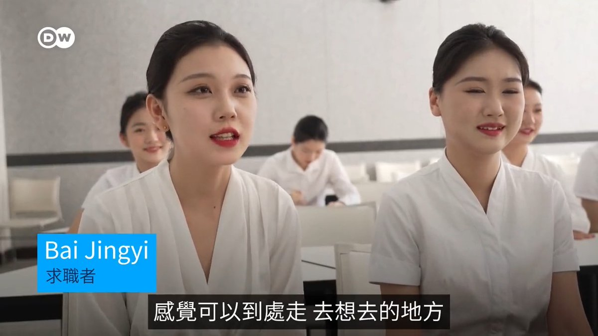
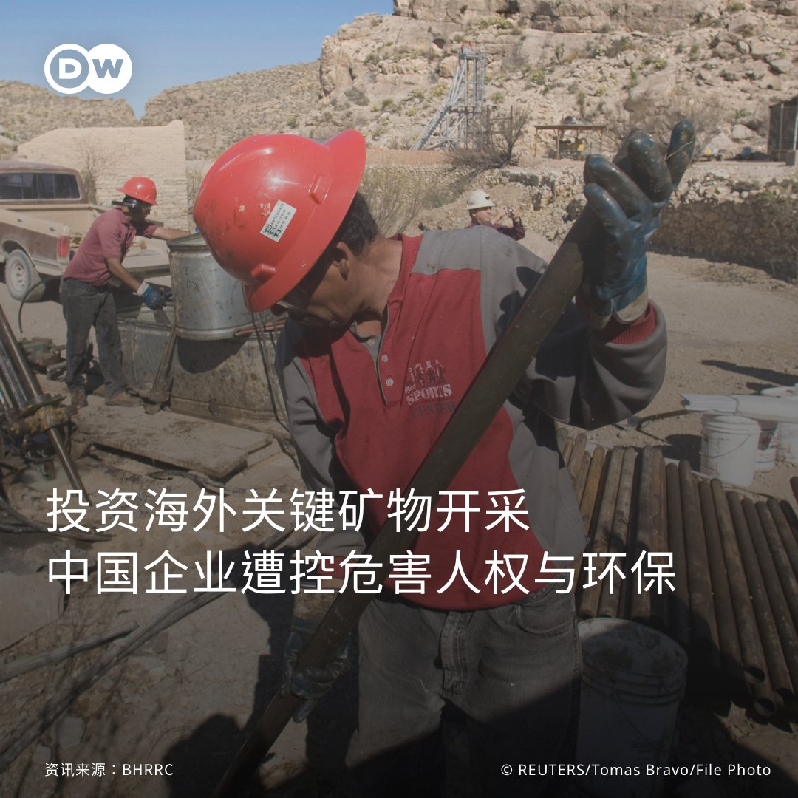
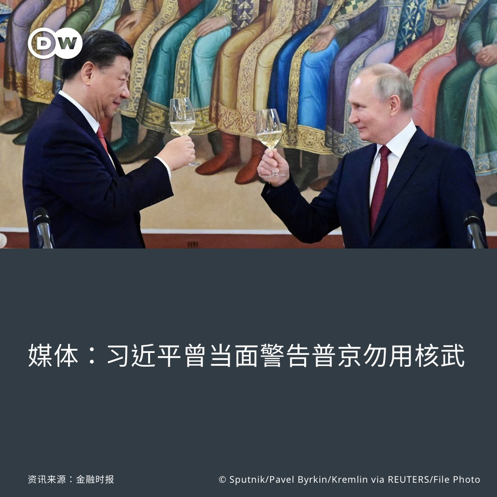
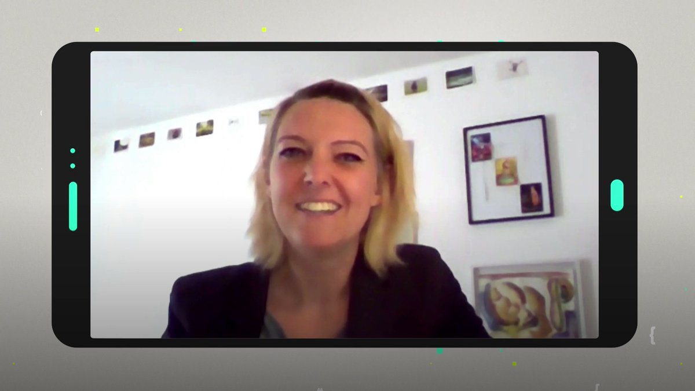
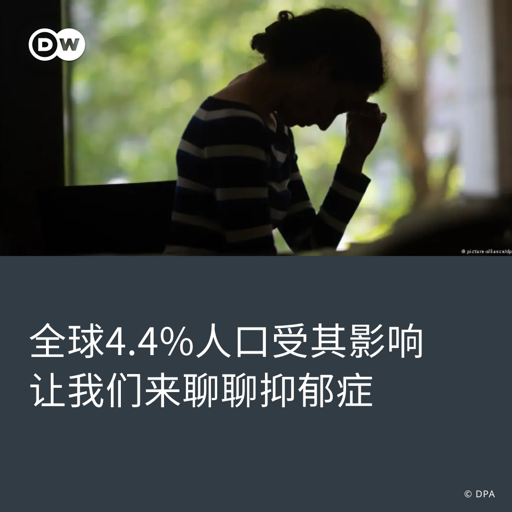
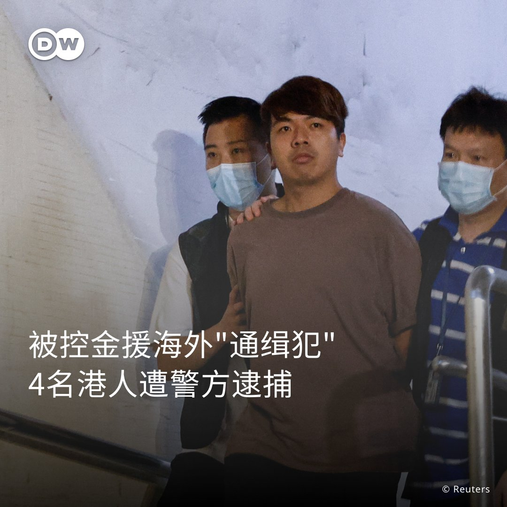

德国之声 北京时间 2023-07-06T23:04:00Z 1676970256458481666 《商报》评论说，欧洲拥有关键金属等矿藏，应当自主开采🔨和加工，即便成本更高。因为这涉及 #安全问题。《新苏黎世报》就香港活动人士被悬赏通缉🚨写道，#民主国家 应关注中共在海外的 #监控活动，并坚决予以制止。

https://t.co/dwFPXzG5lf   德国之声 北京时间 2023-07-06T21:11:00Z 1676941818448199682 #台积电 #TSMC 在一份声明中表示：”经过评估，我们预计 #镓 和 #锗 的出口限制不会对台积电的生产产生任何直接影响。” 其他的台湾半导体公司也表示影响微弱。

https://t.co/pV4bRWC4LI   德国之声 北京时间 2023-07-06T21:51:00Z 1676951884723294208 #中国年轻人 #失业率高 的问题迫在眉睫。许多人受过良好的教育，却一直找不到工作，这让他们对现状感到焦虑，对未来感到恐惧。 https://t.co/KaZJ0F73dW   德国之声 北京时间 2023-07-06T19:56:00Z 1676922943903768576 #德国 联邦检察署在北威州发现疑似 #极端伊斯兰 恐怖组织并逮捕七名嫌疑犯。这七人主要来自塔吉克斯坦。联邦检察署7月6日宣布，被逮捕的七人涉嫌在德国成立恐怖主义组织并策划实施袭击。

https://t.co/40BN26nbD8   德国之声 北京时间 2023-07-06T18:21:00Z 1676899036362579969 最近，很多推特用户对于马斯克 @elonmusk 非常恼火。在启动“蓝V认证”后，这位推特老板又推出了推文浏览数量限制。竞争者Meta似乎嗅到了机会的味道，推出了名为Threads的新应用。它能对推特构成威胁吗？ #dwdigital https://t.co/xu6FDfLjer   德国之声 北京时间 2023-07-06T15:56:40Z 1676862713501302786 今年酷热、暴雨交替正在检测中国应对 #极端天气 加剧的能力。若应对不力令人联想起去年河南的暴雨以及98年的严重 #洪灾。除此以外，极端天气也对供电、农业构成威胁。

https://t.co/ZsiBXbEeNy   德国之声 北京时间 2023-07-06T14:57:37Z 1676847854189694976 人权监督团体"企业与人权资源中心"（BHRRC）6日发布的研究报告指，#中国企业 在海外投资的矿物开采计划存在显著的 #人权 与 #环保 疑虑，特别是涉及 #能源转型 的关键矿物（例如 #钴、#铜、#镍、#锂）开采。过去2年来，相关案例至少102件，遍及亚洲、拉丁美洲与非洲。
 
#中国 主导了这类矿物的加工等过程；其太阳能板、电动车电池产制等干净能源发展，也居全球领先地位。报告写道："中国展现了 #绿能转型 的承诺……然而，其海外业务伴随着严重的 #人权风险，让这点蒙上了阴影。"
 
3日，中国宣布对 #镓、#锗 实施 #出口管制，也让跟半导体产业有关的矿物成为关注焦点。请看DW的相关报导👇
 
中国管制镓锗出口 各国如何严防供应链中断？
🔗https://t.co/CI0dkrEp2b
镓、锗究竟是什么？
🔗https://t.co/11sW4pwcoy   德国之声 北京时间 2023-07-06T10:23:13Z 1676778800712151042 【媒体：#习近平 曾当面警告 #普京 勿用核武】🇨🇳 🇷🇺 🇺🇦
 
英国《金融时报》报导，#中国 担心 #俄罗斯 如果在 #乌克兰 动用核武器，可能会破坏中国与欧洲国家的关系；3月，习近平更曾亲自告诉俄国总统普京不要这么做。对此报导，俄方已经否认。
 
详细报导👉https://t.co/weUtFJC0qg https://t.co/eaN4i8Nipi   德国之声 北京时间 2023-07-06T07:12:00Z 1676730677004324864 #社交媒体 能够帮助我们克服孤独感，还是用得越多越感到孤独？一位德国社会学家对此进行了分析，并给出了她的建议。 https://t.co/q4EPjdA95x   德国之声 北京时间 2023-07-06T07:40:00Z 1676737723485523968 全球有3亿2千2百万人受 #抑郁症的 困扰，占世界总人口的4.4%，但人们还是很少去谈论这个话题。很多人都以为抑郁症主要是和生活中遇到的问题有关，或者是因为悲伤和失望，世卫组织多年来一直在试图纠正这种偏见。

👉https://t.co/pugZieqT0I https://t.co/QUgrWErPCm   德国之声 北京时间 2023-07-06T09:46:36Z 1676769586367336449 【此案涉及遭通缉的8名海外港人？ 】🇭🇰

香港警务处 #国家安全处 5日以涉嫌违反《国安法》为由，拘捕4名现已解散的政党"#香港众志"成员。港媒援引匿名消息报导，被捕者遭控在幕后营运"#惩罚Mee"社交平台，并将所获资金用以支持海外"逃犯"。

据报，这些"逃犯"疑指日前遭港警通缉、以各 #100万港币 悬赏的8名海外民主人士，其中包含前香港众志创党主席 #罗冠聪。香港特首 #李家超 4日称将对他们进行「终身追捕」。

当前被捕的4名港人，目前正接受扣留调查。港媒指出，警方仍持续展开相关搜索，不排除会有更多人被捕。   