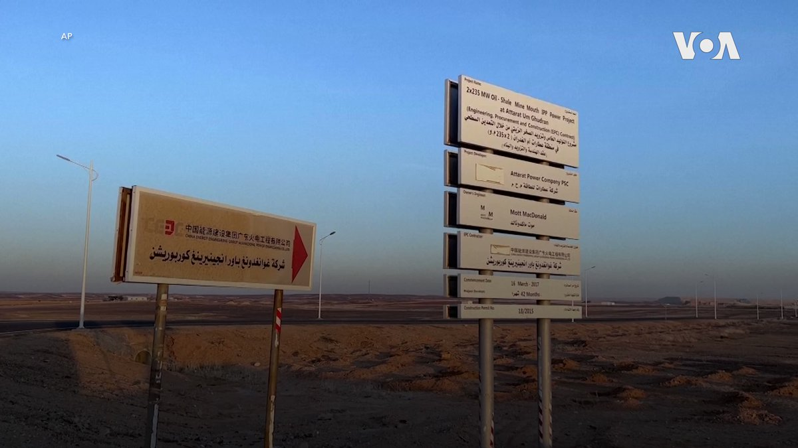
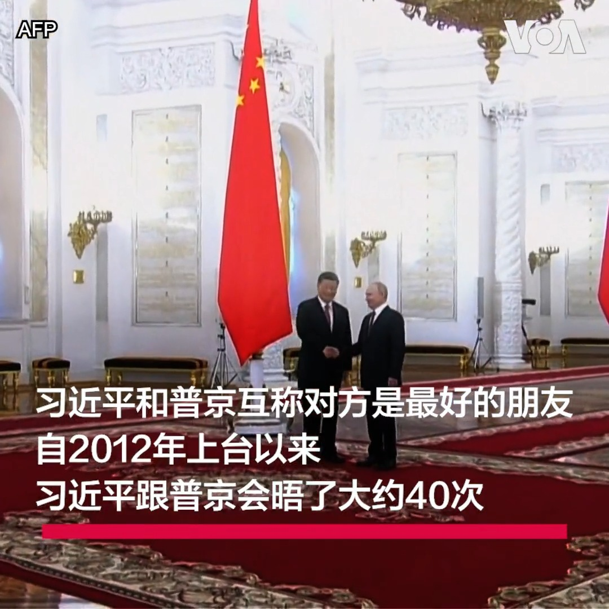

美国之音中文网 北京时间 2023-07-06T20:18:08Z 1676928515231592449 德国荷兰当局逮捕九名涉嫌策划恐怖袭击的中亚人 https://t.co/WptL9BZMqF   美国之音中文网 北京时间 2023-07-06T17:06:35Z 1676880309089079296 拜登会晤瑞典总理 深化6G合作应对中国挑战 https://t.co/4SPFDezWiE   美国之音中文网 北京时间 2023-07-06T17:23:09Z 1676884479955341319 韩女艺团BLACKPINK误触“九段线”争议 河内演唱会遭抵制 https://t.co/v0DVtPKEG5   美国之音中文网 北京时间 2023-07-06T17:48:34Z 1676890874511507456 日韩就福岛核污水问题保持高层沟通 与中国强硬反对形成鲜明对比 https://t.co/UTriQiCCNy   美国之音中文网 北京时间 2023-07-06T18:21:45Z 1676899224863006721 潘功胜本周升任中国人民银行党委书记后，成为准人行行长的热门人选。对此，观察人士说，潘功胜具金融实战经验和外汇专业，但在中国国家主席习近平独揽大权下，恐难独立行使职权，更何况，以中国目前面临的经济困境，降息或降准等货币政策都不是刺激经济的良方。报道: https://t.co/CjG57NngD4 https://t.co/pRPqXIah9B   美国之音中文网 北京时间 2023-07-06T14:31:03Z 1676841169542840321 主导地位增强 中国国产车有望今年占据一半国内市场 https://t.co/CR27ZYJtn7   美国之音中文网 北京时间 2023-07-06T14:16:34Z 1676837522767495169 美国“坚决”反对中国限制镓锗出口 召集盟友建立关键供应链韧性 https://t.co/LMLiDzGSzT   美国之音中文网 北京时间 2023-07-06T10:04:04Z 1676773980995485697 安全担忧和支付纠纷阻碍中国在巴基斯坦的“一带一路”投资 https://t.co/ZMT76Z9OGX   美国之音中文网 北京时间 2023-07-06T10:08:03Z 1676774980703649797 拜登会见瑞典首相，白宫正说服土耳其批准瑞典加入北约 https://t.co/b4bz8ero7F   美国之音中文网 北京时间 2023-07-06T06:30:00Z 1676720110063726592 习近平在对中共党校干部讲话时警告，我们这支队伍里不能有胆小鬼，更不能有心怀异心、身在曹营心在汉、同床异梦的人。政论作家陈破空告诉美国之音，从团派到军队再到他身边的亲信，习近平没一个人信得过，总怀疑这些人里通外国，每个人都有可能背叛他。完整访谈【时事大家谈】https://t.co/EwLq5LMwpL https://t.co/tmUQMuMGPc   美国之音中文网 北京时间 2023-07-06T07:00:01Z 1676727662708944897 美财长耶伦开启中国行，她要去谈哪些敏感问题？中国在耶伦临行前祭出芯片原材料出口管制，能增加谈判筹码吗？在另一方面，中国官媒渲染“外国人吃不饱”遭网友群嘲，有网友说，“这届韭菜不好骗了”，这是北京最害怕的事？7/6 时事大家谈将讨论这些问题，请留言参与。 https://t.co/GaMRFpbXJ1   美国之音中文网 北京时间 2023-07-06T07:39:33Z 1676737611883495425 中国参与投资的约旦阿塔拉特(Attarat)油页岩发电厂1号机组和2号机组分别于去年10月和今年5月投入商业运行。据美联社报道，这个投资21亿美元的发电厂曾被视为约旦的一个里程碑项目，有望为这个沙漠王国提供主要能源，但这个项目现在引发担忧，因为它可能导致约旦欠下中国数十亿美元的债务。 https://t.co/hI2zH9GFnk   美国之音中文网 北京时间 2023-07-06T07:46:34Z 1676739376666284035 “反美斗士”司马南参加美国使馆独立日晚宴后遭网民批评 https://t.co/nhLykQelZj   美国之音中文网 北京时间 2023-07-06T08:00:01Z 1676742761863602177 世界媒体看中国--金哲报道：瓦格纳之后，习近平还会唱普京的曲调吗？
https://t.co/17vUgYaDC6 https://t.co/KanKefjUCu   美国之音中文网 北京时间 2023-07-06T08:14:34Z 1676746425521299458 法国被敦促处理警务中的种族主义 https://t.co/W844SBWYg0   美国之音中文网 北京时间 2023-07-06T08:29:03Z 1676750068236550145 五角大楼正在加强机密情报的安全性 https://t.co/BfOrrvXs2E   美国之音中文网 北京时间 2023-07-06T08:29:05Z 1676750075513671680 好莱坞正在制作更多关于亚裔美国人的影视节目 https://t.co/tMjqO5oryY   美国之音中文网 北京时间 2023-07-06T08:30:00Z 1676750307873918977 一键解锁#美国热搜 榜1、身为中国人，如何度过35岁这道生死劫2、解决1700万光棍的婚姻，中国走私新娘渐热3、假货市场的荒诞横幅4、真实数字组装最假谎言5、为什么官方宣传西方人民吃不饱？6、日本人不是人？7、习近平如何破解失业率高？8、中国真实的房价 https://t.co/TPyawIPxpk https://t.co/YPBBUkjnbj   美国之音中文网 北京时间 2023-07-06T08:46:33Z 1676754472998170625 周二创下地球最热一天的非官方记录，周三气温可能更甚 https://t.co/gskRPaaj0H   美国之音中文网 北京时间 2023-07-06T09:17:34Z 1676762279289958400 立陶宛批准并公布《印太战略》 https://t.co/U2Jy3zYQBO   美国之音中文网 北京时间 2023-07-06T09:33:34Z 1676766302759972864 为何2024年台湾选举对美国重要？美官员：台海和平稳定关乎美国持久利益 https://t.co/O4vmFMCthm   美国之音中文网 北京时间 2023-07-06T09:49:07Z 1676770218033696768 专家：柬埔寨在选举前加深对中国的依赖 https://t.co/iK7Y4XmLpx   美国之音中文网 北京时间 2023-07-06T10:00:01Z 1676772961007575041 五月以来，中国官员两度低调访问意大利，试图游说意政府续签一带一路谅解备忘录并加强与意商界联系。分析认为，在欧洲去风险背景下，意政府续签可能性不大，但会与中国签订新的协议以维持双边关系。有专家认为退出一带一路签订新协议的做法仍存风险。https://t.co/NIllmGr84d https://t.co/qPTO7bXAYV   美国之音中文网 北京时间 2023-07-06T04:53:33Z 1676695836301074432 阻止普京核威胁的功劳该归谁？习近平还是美英法？ https://t.co/h7bOZFK44v   美国之音中文网 北京时间 2023-07-06T05:07:08Z 1676699252809146369 美财长耶伦周四赴华：呼吁健康、公平的经济竞争 https://t.co/UNpDvTZaiD   美国之音中文网 北京时间 2023-07-06T05:21:06Z 1676702769942769664 内塔尼亚胡: 以色列裔俄罗斯学者在伊拉克被什叶派民兵扣留 https://t.co/eAqXcyMaay   美国之音中文网 北京时间 2023-07-06T05:21:08Z 1676702778729852928 原声带·坎比努尔｜我怕什么？害怕的应该是他们 https://t.co/1pLhW7awUY   美国之音中文网 北京时间 2023-07-06T05:30:00Z 1676705008723677185 瓦格纳兵变后，普京首次在上合组织峰会露面，但与过去口中亲爱的朋友习近平却没有进一步互动，另一方面，中国国防部长李尚福在北京会晤俄罗斯海军总司令，宣称强化两军交流，独立时评人马聚告诉美国之音，中俄关系早已脑体失控，纯属交易哪有真心朋友。完整访谈【时事大家谈】https://t.co/EwLq5LLYAd https://t.co/IsULyJZ1ZY   美国之音中文网 北京时间 2023-07-06T02:50:25Z 1676664846623076353 台湾将在明年1月举行总统大选，民进党候选人、台湾副总统赖清德4日投书华尔街日报，提出保卫台海和平四大支柱。国民党候选人侯友宜称自己反“一国两制”，也反“台独”。候选人柯文哲所在的民众党则以“台湾自主，两岸和平，备战不畏战”为政策核心。您怎么看几位候选人的中国政策与立场？欢迎在评论区内留言 https://t.co/yUhaOVN7Vq   美国之音中文网 北京时间 2023-07-06T03:54:03Z 1676680860446371840 意大利欲退一带一路，中国官员急救火，中意关系面临转折 https://t.co/PCZxyr2eJQ   美国之音中文网 北京时间 2023-07-06T04:09:34Z 1676684767021129728 美国海军说，阻止了伊朗在海湾夺取油轮 https://t.co/2SphFmzjDm   美国之音中文网 北京时间 2023-07-06T04:09:36Z 1676684775330050049 乌克兰打击被俄罗斯占领的马基夫卡 https://t.co/kX4E8f6wQd   美国之音中文网 北京时间 2023-07-06T01:09:03Z 1676639338048917507 潘功胜将升任中国人行行长? 观察人士:具专业但缺独立性 也难起作用 https://t.co/SsRLkCJNHO   美国之音中文网 北京时间 2023-07-06T01:38:33Z 1676646763518894080 港警以国安法罗列罪名逮捕四名前香港众志成员 https://t.co/evkLX5x2xw   美国之音中文网 北京时间 2023-07-06T01:46:51Z 1676648850415558656 香港警务处国家安全处7月5日逮捕了四名被控支持境外异见人士和香港独立的男子。香港警方说，被捕人通过“惩罚 Mee”社交平台等方式收取资金，支援海外人士继续从事“危害国家安全”的活动，还多次通过社交平台发布支持香港独立的帖文。报道：https://t.co/ToaiduXXdu https://t.co/GSJzGBBxu5   美国之音中文网 北京时间 2023-07-06T00:09:11Z 1676624272301883392 菲律宾谴责中国跟踪骚扰菲运送后勤物资船只 https://t.co/wmHj8EMfER   