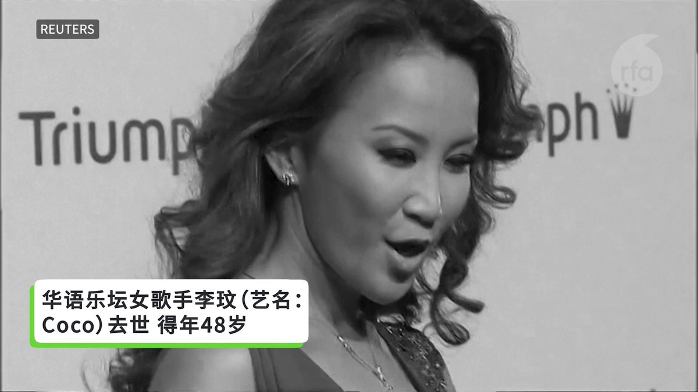
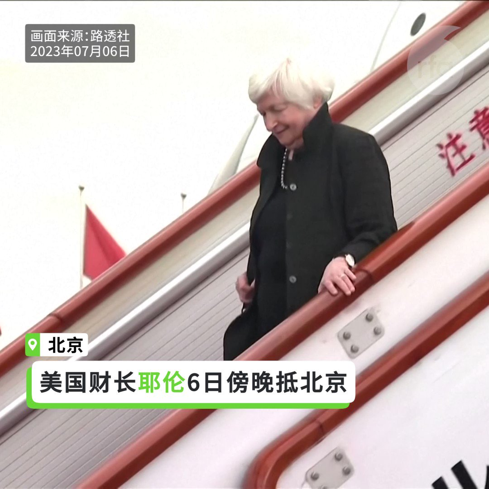
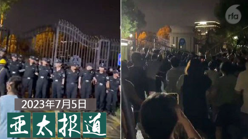
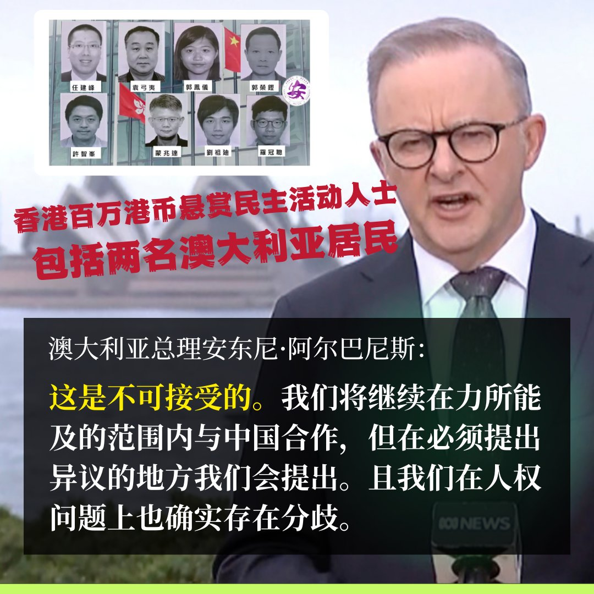
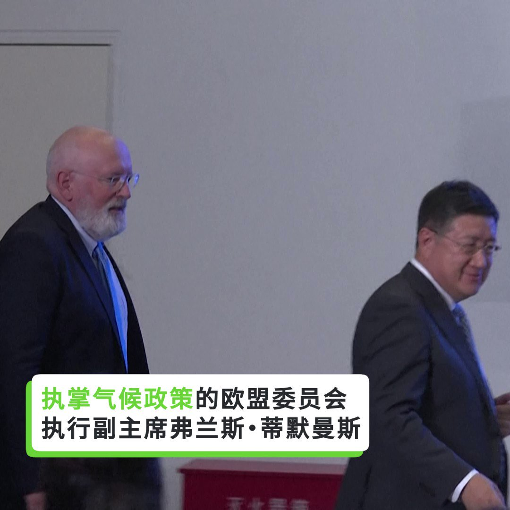
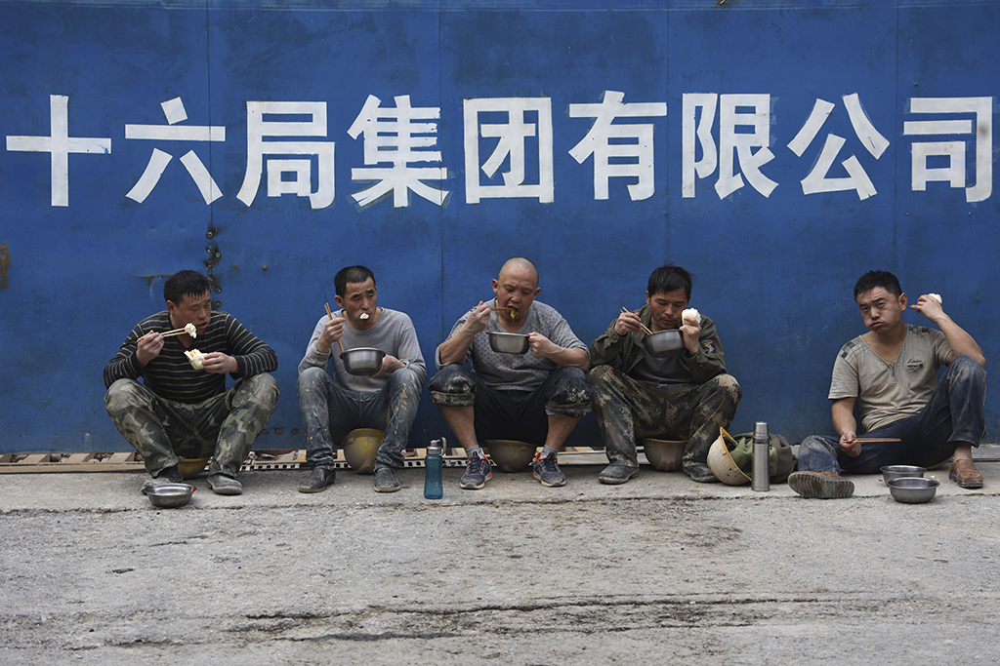
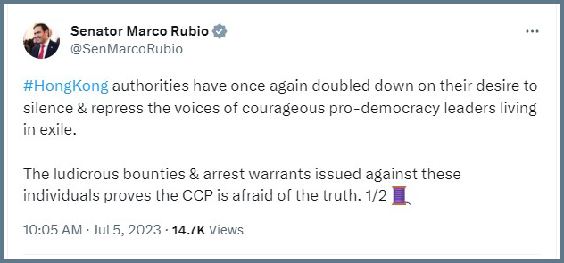

自由亚洲电台 北京时间 2023-07-06T20:06:15Z 1676925526542364672 RT @RFA_Chinese: 华语乐坛女歌手李玟（艺名：Coco）去世 得年48岁
李玟的歌，你记得哪几首？ https://t.co/31TfrLKYKt   自由亚洲电台 北京时间 2023-07-06T20:34:24Z 1676932610147373057 评论 | 王丹 @wangdan1989：#香港 失去自由的四大教训
 https://t.co/z51SfPwliN   自由亚洲电台 北京时间 2023-07-06T17:43:28Z 1676889592312774657 【湖北购车优惠补贴款未到】
【车主4S店门前抗议指涉诈骗】
#湖北 政府启用 #财政补贴 和汽车企业推出半价出售私家车活动，但近四个月后，有车主说尚未收到购车合同中承诺的购车补贴款。近日，湖北有众多车主到 #东风雪铁龙 湖北一4S店门前拉横幅，指车企涉嫌诈骗。东风雪铁龙承诺8月15日前支付全部补贴。业内人士告诉记者，这笔补贴主要来自政府财政，车企拿不到政府补贴导致买家拿不到钱。
https://t.co/8e9PoEI5pg   自由亚洲电台 北京时间 2023-07-06T18:20:55Z 1676899015852724229 【#耶伦 6日抵达中国】
【展开四天访华行程】
美国财政部长耶伦6日傍晚抵达中国，展开为期四天的访华行程。纽约时报分析，耶伦此行不会取得重大突破，美中关系紧张下，耶伦和中方官员的对话可能艰难；纽时为耶伦访华列出技术与贸易管制、汇率、人权与国家安全等关键议题。中国媒体称中美将聚焦关税、汇率、债务等议题。有评论说，耶伦此行聚焦美中关系重新调整。
有片   自由亚洲电台 北京时间 2023-07-06T12:28:43Z 1676810382676213761 #事实查核｜华语世界关于 #法国骚乱 现场的四条假新闻
 https://t.co/7ceABWdbEx   自由亚洲电台 北京时间 2023-07-06T06:57:33Z 1676727043621548034 李恒青 
@LiHengqing
 说，“怎么可能持续呢？像这种通过政府来炒作的方式来解决消费问题和经济升级换代问题，不太现实，一定要以市场需求为导向。”
#淄博烧烤。#地摊经济 https://t.co/xZU8C737lh   自由亚洲电台 北京时间 2023-07-06T07:00:05Z 1676727681008951298 【#亚太报道（2023-7-5）】
欢迎收听和订阅播客【亚太报道】 https://t.co/MjLNSvVMqc
上海小区发生警民冲突/中国公安部列举 #十大谣言 范例/涉"#恶俗维基案" #牛腾宇 狱中发病/#耶伦访华 前 美国学者如何看中国官方经济数据/#上合会议 意在打造"2.0版华约组织"? https://t.co/SoT0aOBf7o   自由亚洲电台 北京时间 2023-07-06T08:13:28Z 1676746147212263425 香港国安处周一宣布悬赏通缉的8名海外港人，悬赏金额每人100万港元（127,656美元），其中包括两名澳大利亚居民——墨尔本律师、澳大利亚公民任建峰，以及自2021年以来一直居住在澳大利亚的前香港立法会议员许智峰。香港特首李家超：“无论他们走到天涯海角，我们都会终身追捕这些罪犯。” 澳大利亚总理安东尼·阿尔巴尼斯（Anthony Albanese）7月5日作出回应：   自由亚洲电台 北京时间 2023-07-06T04:46:06Z 1676693962030202880 【一边喊减碳一边搞煤电：中国的“矛盾”及水深火热】
欧盟高级气候官员蒂默曼斯在清华大学的一次演讲中表示，中国应对全球变暖的雄心勃勃的目标与其持续建设燃煤电厂之间存在“矛盾”。 https://t.co/1UtgU3rhht   自由亚洲电台 北京时间 2023-07-06T05:05:58Z 1676698959589376000 近日网络刊登一篇关于 #第一代农民工 打工命运的调查报告《#如此打工三十年》，被网友大量转发，但同时遭到持续封杀。
这篇文章讲述第一代农民工在城市打工３０年后，每个月养老金只有人民币１００、２００元，带着一身病痛无法退休。
《如此打工３０年》是根据安徽师范大学副教授 #仇凤仙 针对农民工做的一项研究，由新媒体《正面连接》刊发，在文章被下架后，有网友将其复制或更改标题转发到其他平台，但多篇仍被下架。
所谓第一代农民工，大致生于１９７０年代之前，８０年代中期、９０年代初从农村进城打工，规模约８６００多万人，这期间是中国城市发展最快的３０年，调查针对２５００分问卷以及访谈２００人，了解他们如何维生，结果发现，在退休问题上，他们有６０％的人称只能干到干不动为止。
文章说，大部分第一代农民工，年轻时顾不上晚年，只能把工资用于当下，２００９年养老金政策公布，３５％的人不理解或不相信这项政策，于是没有参保。
等到他们６０岁后，只能领基础养老金，每个月仅１００多元。
为了未来，为了偿还儿子结婚造成的债务，他们不打算退休。四分之三的人表示，６０岁后会继续在城里打工。但近两年，各地严禁６０岁以上农民工进入建筑工地，所以他们只能去做绿化、保洁、仓储管理等工作，薪水不到工地的三分之一。
第一代农民工并非不努力，但调查发现，努力无法改变命运。仇凤仙表示，这是一个时代性的问题，深受社会排斥性政策的影响，远非个人能决定。   自由亚洲电台 北京时间 2023-07-06T05:07:34Z 1676699362955608065 【悬赏100万港元  港府 "终身追捕"八港人】
香港宣布通缉8名流亡海外的民主人士，并悬赏高达100万港元。此举遭到了国际社会的强烈谴责和反对。 https://t.co/IOCOmHszzT   自由亚洲电台 北京时间 2023-07-06T05:19:24Z 1676702342106828804 针对日前香港特区政府对流亡海外的八名民主人士提出拘捕令，美国国会参议院马可.#卢比奥 ５日上午发推文表示：#香港特区政府 再次升级对 #流亡民主人士 的噤声和打压。
推文称，港府对这些民主活动人士提出的巨额悬赏和通缉令证明了中国共产党对事实真理的恐惧。 https://t.co/Yyr6MzlnRk   自由亚洲电台 北京时间 2023-07-06T02:31:31Z 1676660091658047491 香港政府日前悬红通缉八名海外港人后，周三（5日）再在香港拘捕前民主派政党"香港众志"主席 #林朗彦 等四人，指控他们经营网购平台资助海外逃犯。有被通缉者明言并不认识相关人士，直斥港警指控"匪夷所思"。
https://t.co/glfJA1CFrM   自由亚洲电台 北京时间 2023-07-06T02:58:09Z 1676666796747919361 近日，因涉及习近平家属资料泄露而被重判十四年有期徒刑的 #牛腾宇 疑似由于监狱条件恶劣而旧病复发。牛腾宇的家属仍盼望为他翻案，其母却遭到当局的阻挠恐吓。

 https://t.co/KkmKhwH6mu   自由亚洲电台 北京时间 2023-07-06T03:55:13Z 1676681156413243403 中国官方公布的 ＃经济数据，是否能反映中国市场的实际情况？本周三，美国学界便针对中国官方数据的可信赖度进行了讨论。

https://t.co/qeppTBz3Mv   自由亚洲电台 北京时间 2023-07-06T01:22:52Z 1676642818046189568 中国公安部近日公布所谓打击网络谣言的专项整治行动成果，包括关停或禁言网络账号逾一万个，并列举十起典型造谣传谣案例。有评论认为，当局严打网络谣言的原因是由于经济不景气，社会不稳，试图借清网维稳。

 https://t.co/LtrDj05pYD   自由亚洲电台 北京时间 2023-07-06T01:33:57Z 1676645605760978944 #台湾在孟买设立办事处 是否会使 #中印关系 进一步紧张? 印度智库中国分析及策略中心研究员夏海娜说，印度向来做对自己有利的事，允许台湾在孟买设处对印度有利，不需要考虑其他国家的感受。印度以行动做出了表示。
  https://t.co/skRd0xzDBe   