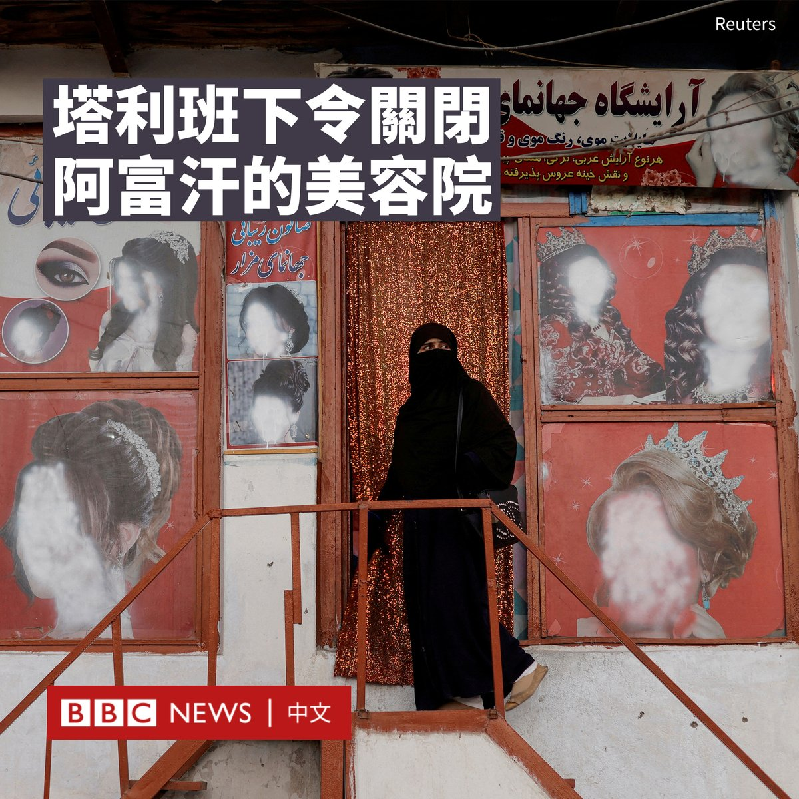
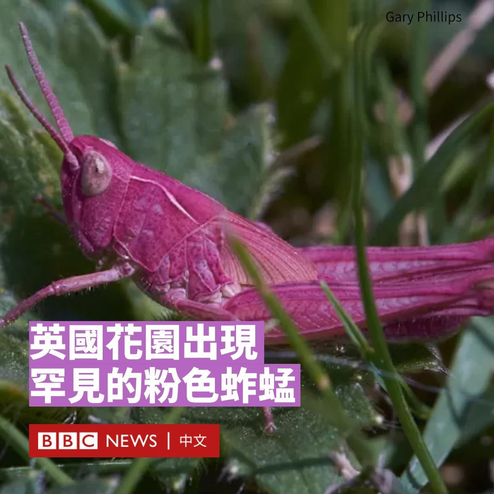
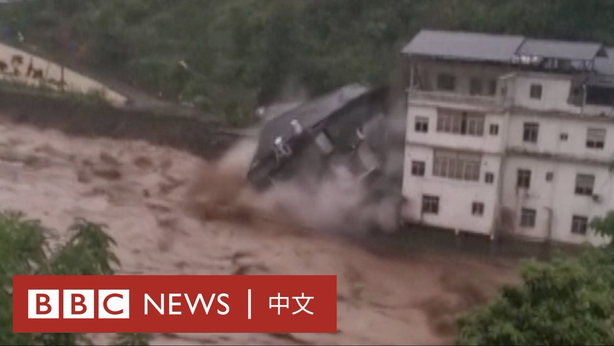
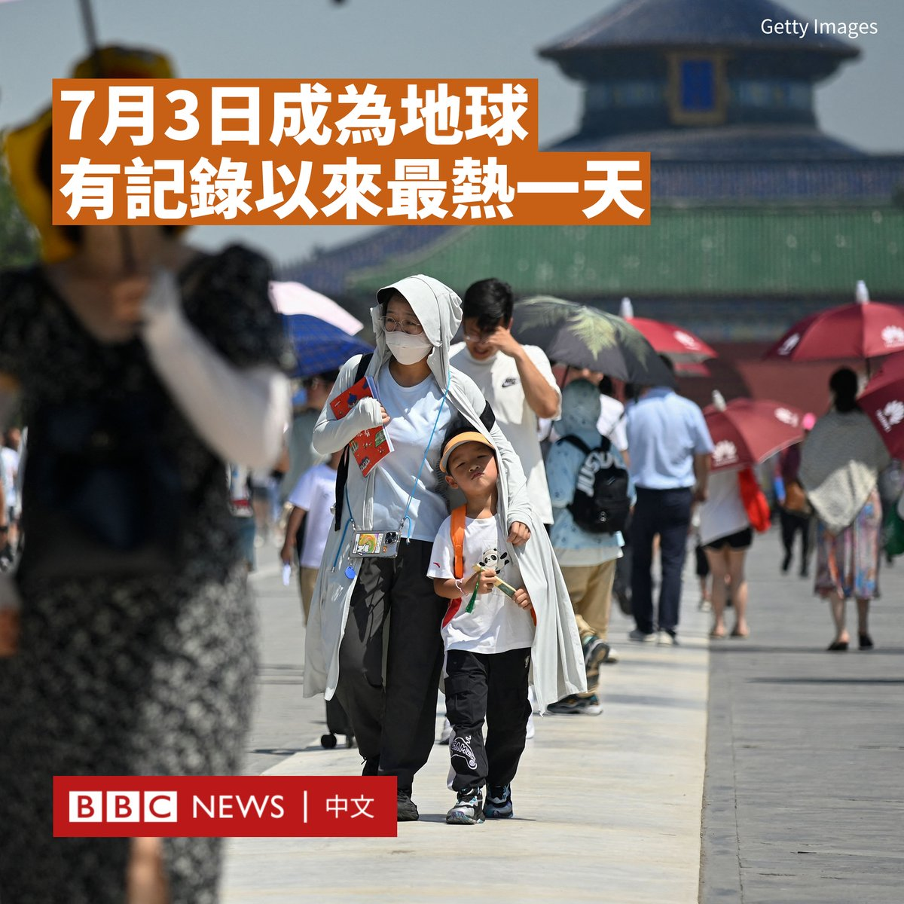
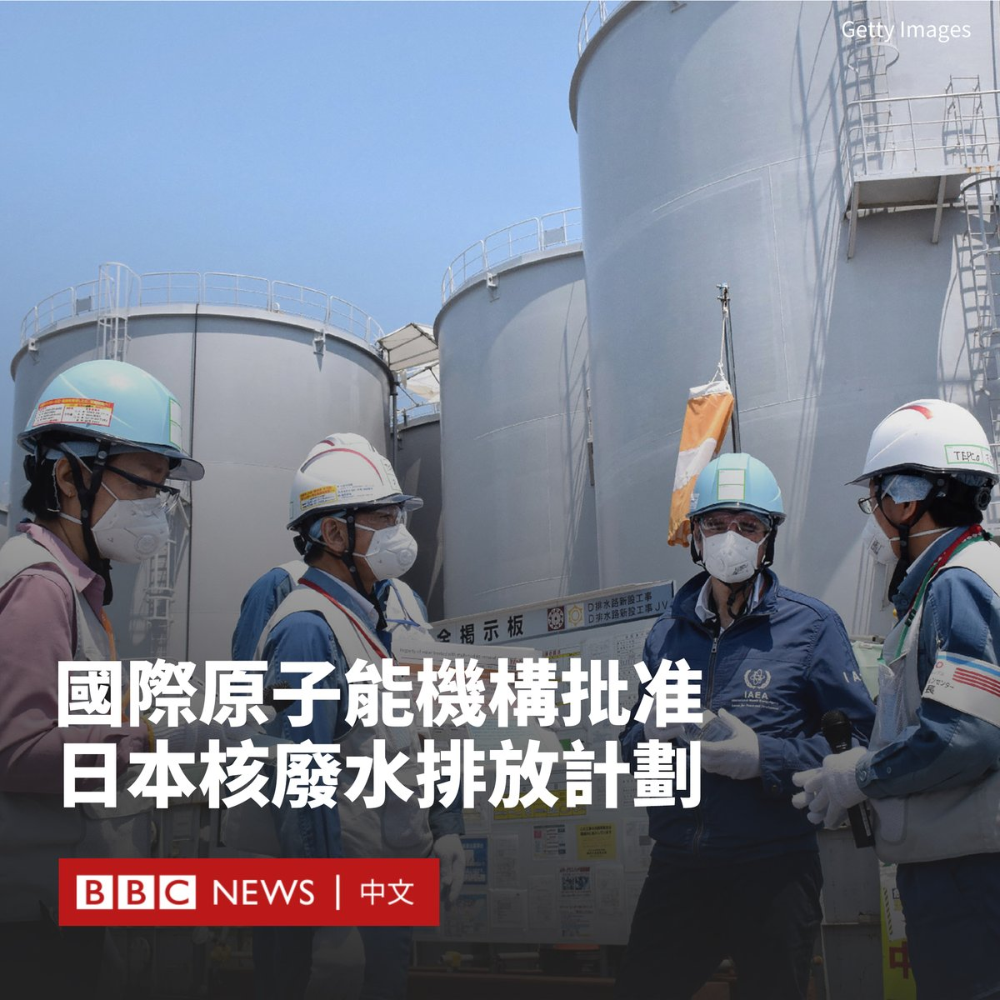

D英国广播公司BBC 北京时间 2023-07-05T20:35:50Z 1676570580328275973 1998年7月6日凌晨，国泰航空机长金·沙曼（Capt Kim Sharman）执飞CX251航班前往伦敦，成为香港启德机场最后一趟离港商业航班。他在启德关闭25周年之际接受BBC专访。

观看全片：https://t.co/ahwPGQQFR8   D英国广播公司BBC 北京时间 2023-07-05T16:38:07Z 1676510759273267200 阿富汗塔利班下令关闭该国的美发沙龙及美容院，使得阿富汗妇女面临新的限制。

塔利班促进美德与预防部的一名发言人告诉BBC，自7月2日新规宣布起，相关店铺有一个月的时间来履行这一规定。

自塔利班于2021年掌权以来，女性的自由不断萎缩。高年级的中学生被禁止入校读书，也被禁止前往健身房和公园。

塔利班还颁布法令，规定女性的穿着必须只露出眼睛，而且如果外出旅行超过72公里，必须有一名男性亲属陪同。

尽管受到国际社会的谴责以及活动人士的抗议，这些限制仍在继续。

关闭美容院是塔利班在1996年至2001年执政期间实施的一系列措施之一。但在2001年以美国为首的联军入侵阿富汗后，它们重新开放。

塔利班在两年前重新掌权后，美容院仍在营业。但许多商店橱窗被遮盖，沙龙外的女性形象被喷漆遮住脸部。

塔利班政府没有解释禁令的原因，也没有解释一旦美容院和发廊关闭，女性有什么替代选择。   D英国广播公司BBC 北京时间 2023-07-05T18:00:07Z 1676531395370553344 在英国威尔士的兰德凡（Llandegfan），一位业余摄影师在自家花园的草丛中惊讶地看到了一只罕见的粉色蚱蜢。

65岁的菲利普斯（Gary Phillips）在花园修剪栽培的大丽花时，被这只昆虫的“鲜艳颜色”惊呆了。

尽管这种蚱蜢体型很小，但其鲜艳的粉色格外显眼。菲利普斯说：“我以前从未听说过它们”，然后用相机拍了一些照片。

蚱蜢通常是绿色、棕色或两者的混合色。据信，在偶尔的情况下，基因突变会导致它们变成粉色。

这使得它们变得更加罕见，因为它们鲜艳的颜色意味着无法躲避捕食者，生存时间也不会很长。

保育组织“Buglife”的保罗·赫瑟灵顿（Paul Hetherington）表示，粉色蚱蜢的颜色是由一种隐性基因引起的，可以连续几代遗传。

这种现象被称为红色过度（erythrism），指红色色素过多，黑色色素不足。   D英国广播公司BBC 北京时间 2023-07-05T15:47:38Z 1676498054978109441 中国中部和西南部大片地区遭遇暴雨天气，目前已有数千人被疏散。在重庆巫山，一座建筑物倒塌在汹涌的洪水中。 https://t.co/2AMgmiqRTC   D英国广播公司BBC 北京时间 2023-07-05T13:17:46Z 1676460339477774337 越南当局宣布禁止即将上映的美国浪漫喜剧电影《芭比》（Barbie），指电影内容含有中国在南海主张的“九段线”地图。

越南媒体报道称，越南文化体育旅游部电影局局长微建成（Vi Kien Thanh）证实了这一消息。但目前尚不清楚他所说的“冒犯性画面”具体指电影中的哪一个场景。

中国通常使用所谓“九段线”，对南中国海的绝大部分海域提出主权声索，但越南、菲律宾、马来西亚、文莱等国均提出质疑。

海牙国际仲裁法院曾于2016年作出裁决，称中国不享有“九段线”的历史性权利，中方不承认有关裁决。

多年来，北京一直在该地区的人工岛屿上修建军事基地，并派出海警船巡逻，以维护其领土主张。

据报道，这部电影的上映档期、海报和信息已全部被影院撤下。

官方媒体《越南+》（Vietnam Plus）撰文称，河内认为该片存在“歪曲事实，违反了法律，特别是侵犯了越南领土主权”的内容。

《芭比》是首部以芭比娃娃作为蓝本的真人电影，由格蕾塔·格维希（Greta Gerwig）执导，玛格特·罗比（Margot Robbie）和雷恩·高斯林（Ryan Gosling）主演，原定于7月21日在越南院线上映。   D英国广播公司BBC 北京时间 2023-07-05T14:17:56Z 1676475482009923584 研究人员表示，全球平均气温在周一（7月3日）创下新高，首次突破17°C。

美国国家环境预测中心（US National Centers for Environmental Prediction）的科学家表示，7月3日，全球平均气温达到17.01°C，打破了2016年8月创下的16.92°C的纪录。

该数字使星期一成为自1979年有卫星监测记录以来最热的一天。专家还认为，这是自19世纪末开始广泛有仪器记录以来的最高水平。

厄尔尼诺现象（El Niño）和人类持续排放的二氧化碳，被认为是导致高温的原因。

上个月也被证实是世界上有记录以来最热的六月。全球平均温度比1850年至1900年期间的平均气温高出1.46°C。

气候研究员利昂·西蒙斯（Leon Simons）说：“自我们有可靠纪录以来，全球平均表面气温首次达到17°C，这是我们日益变暖的世界中的一个重要的象征性里程碑。”

“现在，厄尔尼诺的升温阶段已经开始，我们可以预计在未来一年半的时间里，会有更多的日、月和年度纪录被打破。”   D英国广播公司BBC 北京时间 2023-07-05T11:14:08Z 1676429226357194756 联合国下属的国际原子能机构（IAEA）表示，日本将因海啸受损的福岛核电站产生的核废水排入大海的计划符合国际标准。

该机构表示，排放废水对环境产生的影响“可忽略不计”，并表示该机构将在排放时继续实施安全监测。

由于福岛核电站用于冷却核反应堆的水的存储空间即将耗尽，日本希望今年夏天开始实施该计划，但中国政府对此提出强烈抗议。

中国外交部发言人汪文斌表示：“海洋是全世界的公共财产，不是日本的‘下水道’。”

周二，国际原子能机构总干事拉斐尔·格罗西（Rafael Grossi）在东京向日本首相岸田文雄转达了为期两年的安全审查结果，称其公正且科学。

今年5月，该机构表示，福岛的运营商东京电力公司已经证明其有能力对处理后的水的辐射量进行“准确和精确的测量”。

2011年，一场由9.0级地震引发的海啸令福岛第一核电站停电，导致三个反应堆熔毁。它被认为是自苏联切尔诺贝利事件以来，世界上最严重的核灾难。

核电站目前仍处于禁区，有超过15万人被疏散。福岛的核废水已经储存了130万立方米，还以每天100立方米的速度在增加。日本的目标是花费30年时间，将这些核废水缓慢释放进大海。

大多数放射性元素已从水中过滤掉，但氢和碳的放射性同位素（氚和碳-14）除外。这两种同位素很难从水中分离。

东京表示，将被排入太平洋的核废水经过海水稀释，其氚和碳-14的含量符合安全标准。但中国强烈批评了日本的计划，呼吁国际原子能机构不要批准该计划。

该计划也在日本的另一邻国韩国引发了恐慌，一些民众抢购和储备了海盐。日本的渔业社区也对此表示反对，称其进一步损害了日本渔业产品的声誉。   D英国广播公司BBC 北京时间 2023-07-05T08:46:58Z 1676392188354387968 在伊朗，酒精饮品因为宗教因素而被普遍禁止，饮用者可能面临入狱或是高达80下鞭刑的风险，四次再犯者可能被处以绞刑。

因为害怕严厉的刑罚，许多私自饮酒的年轻人在酒精中毒后不敢寻求医疗协助，最终甚至导致死亡。 https://t.co/Arig2EHOLN   