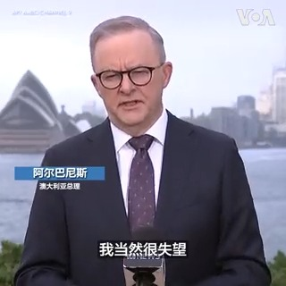
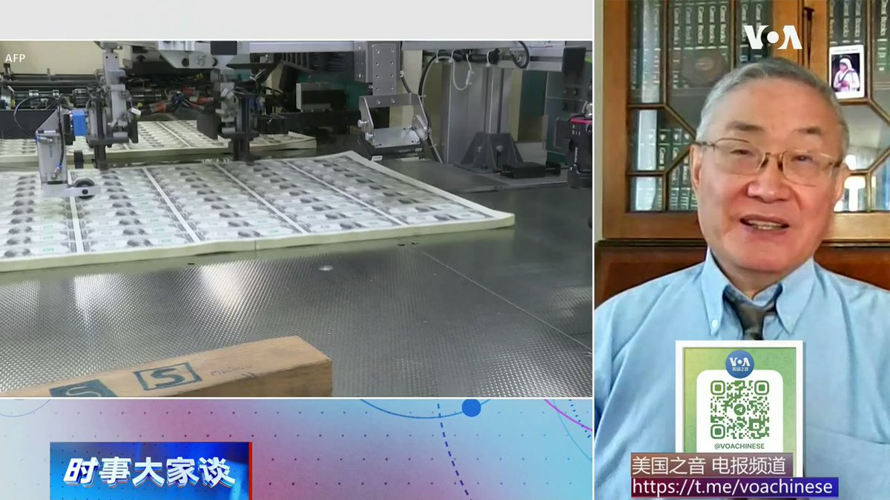
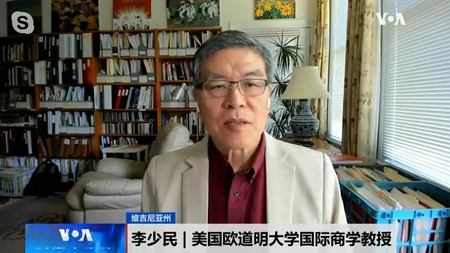

美国之音中文网 北京时间 2023-07-05T23:33:58Z 1676615410265759744 澳大利亚总理5日对香港对两名身在澳大利亚的活动人士发出拘捕令表示关切和失望。称这是“不可接受的”。阿尔巴尼斯表示，澳大利亚将尽可能与中国合作，但在人权等领域，两国会持不同意见。香港3日指控八位流亡海外的活动人士触犯“国安法”并发出通缉，这八人中包括澳大利亚公民任建峰和永久居民许智峰。 https://t.co/CV4o1osE8v   美国之音中文网 北京时间 2023-07-05T21:15:02Z 1676580448150130689 强风暴雨扰乱荷兰交通 https://t.co/yXdNaSgZDG   美国之音中文网 北京时间 2023-07-05T21:58:03Z 1676591272830685186 北约峰会：乌克兰会被快速接纳为北约成员国吗？ https://t.co/3Y7D3MNkNf   美国之音中文网 北京时间 2023-07-05T22:11:04Z 1676594547319615489 高盛警告中国地方债将拖累银行，陆港股市齐跌银行股受重挫 https://t.co/6nomggF1Kd   美国之音中文网 北京时间 2023-07-05T18:26:11Z 1676537954637090818 日本据称8月开始进行福岛核污水排放 中国持续强烈反对 韩国称尊重IAEA 报告 https://t.co/7DJ0qLOmJp   美国之音中文网 北京时间 2023-07-05T19:45:19Z 1676557870098264065 有分析认为，俄罗斯过去一年已抛售价值45亿美元的人民币，对人民币贬值“补刀”。美国三一学院经济系荣休教授文贯中表示，45亿和中国声称的3万亿外汇储备相比太小了，但北京在人民币不可自由兑换的情况下强推人民币国际化，会让人民币汇率面临越来越多这样的风险。
完整版：https://t.co/fgoM8XD0OX https://t.co/sHZxpHoX4L   美国之音中文网 北京时间 2023-07-05T19:51:21Z 1676559388801216513 中国二手房挂牌量激增，房价下行压力加大，外界猜测北京是否会出台更强力的救市政策。美国欧道明大学国际商学教授李少民认为，在信心缺乏的情况下，鼓励性刺激政策很难带来复苏。
时事大家谈完整版：https://t.co/fgoM8XD0OX https://t.co/Yp4BOuuzmA   美国之音中文网 北京时间 2023-07-05T20:44:03Z 1676572649013792769 港人民主倡议组织公布香港当局对美政治游说报告 https://t.co/PJtYmwB4xo   美国之音中文网 北京时间 2023-07-05T20:45:35Z 1676573036772982785 拜登总统和瑞典首相克里斯特松在白宫会晤 https://t.co/FQWKMj8N1t   美国之音中文网 北京时间 2023-07-05T17:19:02Z 1676521056100843522 赖清德称若当选会持续提升台湾的吓阻力 愿在没先决条件下与北京对话 https://t.co/D9b8hur5bC   美国之音中文网 北京时间 2023-07-05T17:28:04Z 1676523327710695424 韩国军方称朝鲜发射失败的卫星不具军事用途 https://t.co/nrL6AHKgb4   美国之音中文网 北京时间 2023-07-05T17:38:33Z 1676525965495926789 罕见！德国司法部长在柏林公开会见台湾法务部长 https://t.co/aVq2sgibz9   美国之音中文网 北京时间 2023-07-05T14:51:03Z 1676483815840301059 北京管制半导体关键原料出口、取消欧盟高官访华 中欧关系趋于紧张 https://t.co/gp1cWp29Vo   美国之音中文网 北京时间 2023-07-05T14:03:33Z 1676471859100131330 澳大利亚总理称香港悬赏民主活动人士做法“不可接受” 许智峰：今日香港“极端荒谬 https://t.co/CW2WR5H13z   美国之音中文网 北京时间 2023-07-05T11:56:33Z 1676439898432344065 美中持续对峙之际，财长耶伦访华预计难有重大突破 https://t.co/mS8BH8TQaV   美国之音中文网 北京时间 2023-07-05T10:01:09Z 1676410857264414722 北京在美中科技大战中出击，祭出芯片材料出口管控，业界担心稀土或是下一目标 https://t.co/tqh8DkBQfh   美国之音中文网 北京时间 2023-07-05T06:30:02Z 1676357730737745920 欧盟特使：在取消制裁之前，科索沃政府必须采取措施缓解与塞族的紧张关系 https://t.co/VS4Q0RyHsZ   美国之音中文网 北京时间 2023-07-05T06:44:33Z 1676361381233455104 推特上的中国：王毅称“欧美人分不清中日韩”遭群嘲 https://t.co/obcClIviTt   美国之音中文网 北京时间 2023-07-05T06:58:33Z 1676364905564475402 国际原子能机构批准福岛废水排放计划，东亚各国密切关注 https://t.co/dy0oIdBMep   美国之音中文网 北京时间 2023-07-05T06:58:35Z 1676364913693032449 普京向亚洲盟友保证俄罗斯的团结一致 https://t.co/47xsjRpD7i   美国之音中文网 北京时间 2023-07-05T07:00:01Z 1676365275342733317 普京兵变后首次出席国际峰会，与习近平藉上合组织异口同声抨击外部势力，与此同时，习近平一篇引用李后主故国不堪回首的谈话引发关注，习近平为何如此担心中共重蹈苏共复辙？普习两人一个遭兵变、一个怕亡党，俄中关系如何牵动世界格局？美国之音7月5日上午9点《时事大家谈》欢迎留言参与讨论。 https://t.co/Ki8oVlHYAr   美国之音中文网 北京时间 2023-07-05T07:14:07Z 1676368822905995265 以色列攻击约旦河西岸造成的死亡人数上升至12人 https://t.co/Yv5NJ2A9aX   美国之音中文网 北京时间 2023-07-05T08:00:00Z 1676380371460530176 中国报道—金哲：香港悬赏百万通缉，袁弓夷：我追求民主自由为良心平安。报道 https://t.co/976ROvBqnG https://t.co/jmmpWH3Rb3   美国之音中文网 北京时间 2023-07-05T08:56:33Z 1676394602105016321 美国联邦法官限制拜登政府官员与社交媒体公司联系内容审查事宜 https://t.co/f8gONqKcpw   美国之音中文网 北京时间 2023-07-05T09:54:32Z 1676409193069432832 索马里官员称非盟部队撤军仓促且考虑不周 https://t.co/S2pNRM248K   美国之音中文网 北京时间 2023-07-05T04:47:34Z 1676331941241720833 欧盟对中国管制稀有金属出口表示“关切” https://t.co/4JDMTh3Jwx   美国之音中文网 北京时间 2023-07-05T04:50:09Z 1676332591241375744 哥伦比亚军方7月4日在该国北部靠近巴拿马的海域发现并营救了30名乘船渡海的中国移民，其中四名女性。哥伦比亚军方称拘押了三名试图非法运送这些中国人的哥伦比亚人。这些中国移民被带上岸后接受了健康检查。 https://t.co/KRoj1MZ7ge   美国之音中文网 北京时间 2023-07-05T05:02:02Z 1676335584212824064 欧盟气候负责人对中国煤炭行业扩张表示关切 https://t.co/BDfClVPq1N   美国之音中文网 北京时间 2023-07-05T06:00:33Z 1676350308442857477 马克龙宣布骚乱“高峰”已过，巴黎在寻找骚乱背后真相 https://t.co/veT5nmEIuT   美国之音中文网 北京时间 2023-07-05T06:15:34Z 1676354089943437313 克里姆林宫：美俄讨论新的囚犯交换 https://t.co/F8Pe4rSANj   美国之音中文网 北京时间 2023-07-05T02:41:27Z 1676300203047940098 人称“揽炒巴”的香港自由(Hong Kong Liberty)组织发起人刘祖迪说，香港当局的悬赏通缉对他来说是一种“荣耀勋章”。包括他在内的八名香港民主活动人士被港府以触犯国安法为由悬红通辑，特首李家超还称他们会被终身追捕。刘祖迪说，这可能会令他面临更多人身风险，但他仍会为民主自由战斗下去。 https://t.co/mASsMUfbP8   美国之音中文网 北京时间 2023-07-05T03:32:34Z 1676313067725156352 塔利班在阿富汗禁止妇女美容院 https://t.co/VPIt01UWHz   美国之音中文网 北京时间 2023-07-05T00:45:03Z 1676270911312515073 中国突然取消欧盟外交与安全高级代表博雷利的中国之行 https://t.co/1LmOrgC142   美国之音中文网 北京时间 2023-07-05T00:45:05Z 1676270919365558272 美国华裔的求学之路与平权行动 https://t.co/UsFWgGlyvG   美国之音中文网 北京时间 2023-07-05T00:45:07Z 1676270927074693120 美中科技战升级 美拟限制中国公司获取美云计算服务 https://t.co/RGtzBKObLV   美国之音中文网 北京时间 2023-07-05T00:47:41Z 1676271572384980992 巴西女足7月4日乘坐向伊朗抗议者阿米尼和阿扎达尼致敬的飞机抵达澳大利亚参加女足世界杯。阿米尼因未遵循严格的头巾佩戴要求被警察逮捕后死亡，这一事件引发了 2022年伊朗大规模抗议活动。阿扎达尼在抗议活动中被捕，并被判长期监禁。 https://t.co/CfH8oTFPoh   美国之音中文网 北京时间 2023-07-05T01:54:01Z 1676288266692075536 乌克兰总统泽连斯基在7月4日美国独立日对美国的军事支持表示感谢。他说，在美国的支持下，乌克兰“在其所处的欧洲地区点燃了崭新的、强大的自由之火”。 https://t.co/5G9R3TwpBQ   