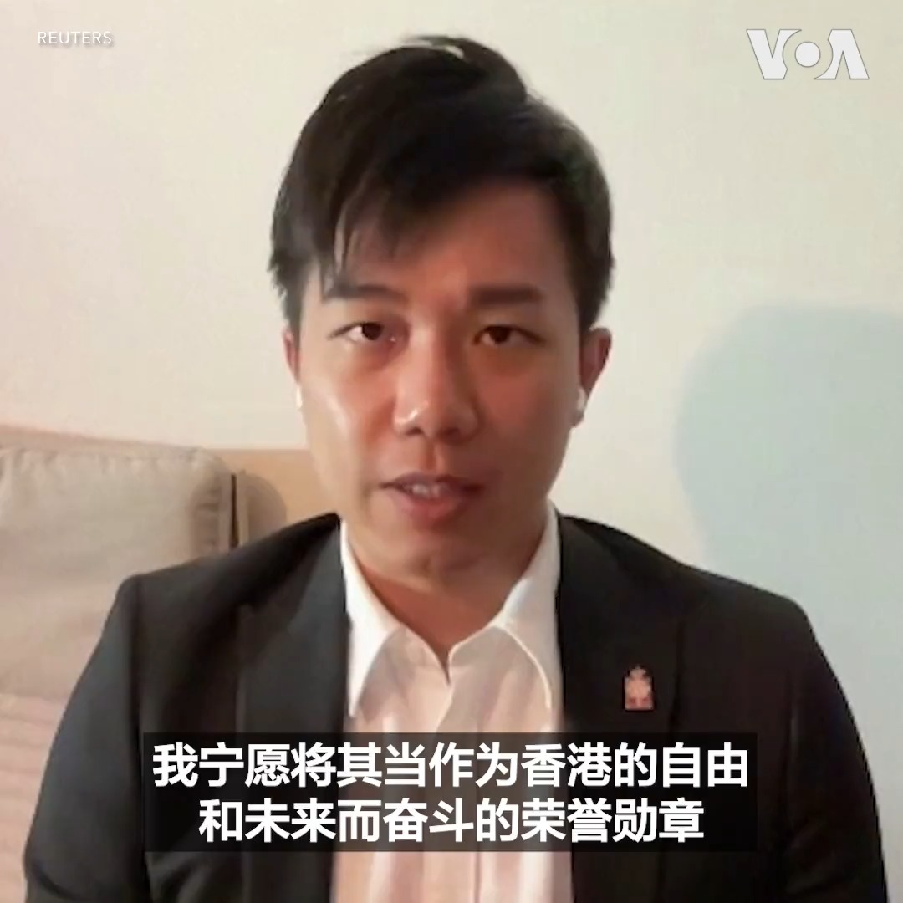
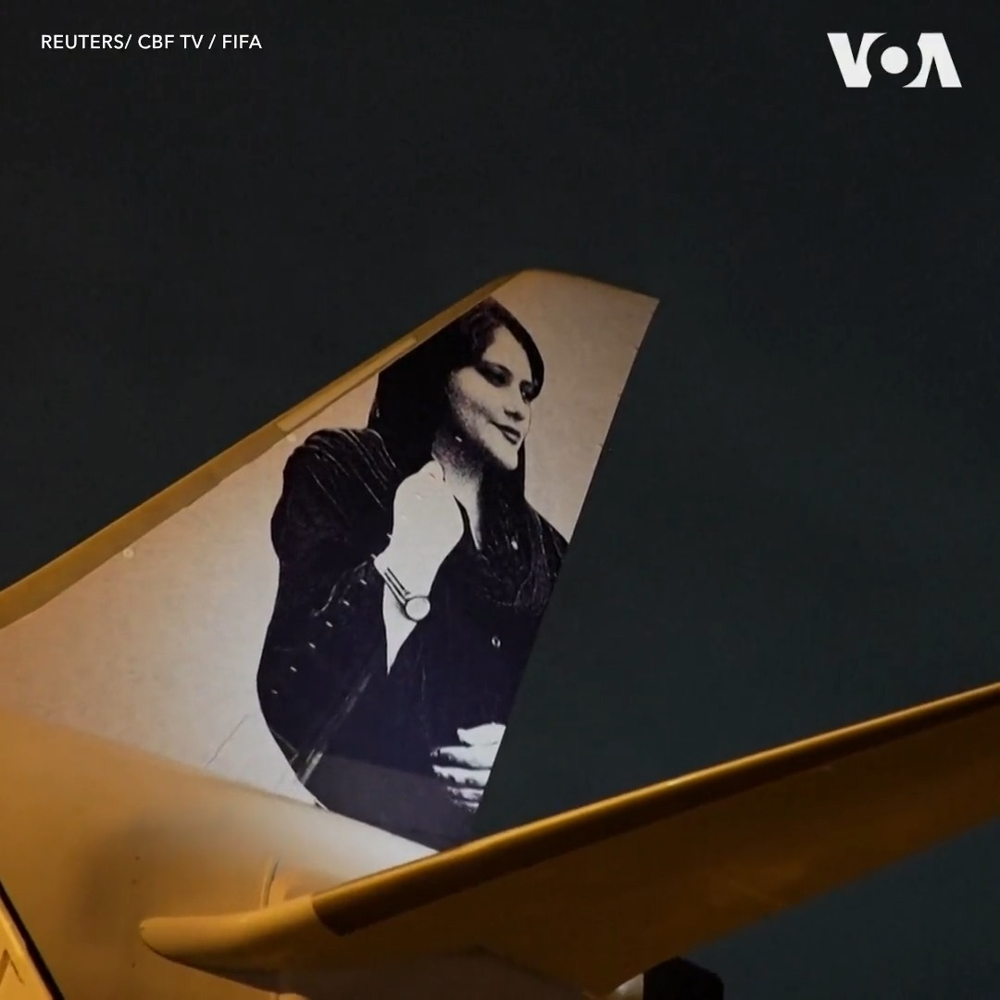
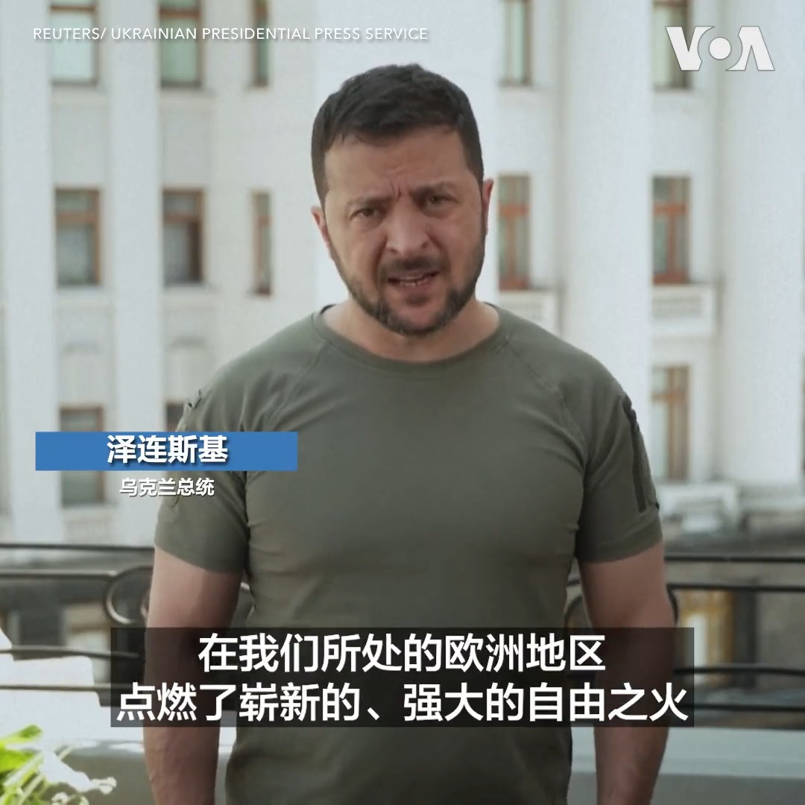

美国之音中文网 北京时间 2023-07-05T02:41:27Z 1676300203047940098 人称“揽炒巴”的香港自由(Hong Kong Liberty)组织发起人刘祖迪说，香港当局的悬赏通缉对他来说是一种“荣耀勋章”。包括他在内的八名香港民主活动人士被港府以触犯国安法为由悬红通辑，特首李家超还称他们会被终身追捕。刘祖迪说，这可能会令他面临更多人身风险，但他仍会为民主自由战斗下去。 https://t.co/mASsMUfbP8   美国之音中文网 北京时间 2023-07-05T03:32:34Z 1676313067725156352 塔利班在阿富汗禁止妇女美容院 https://t.co/VPIt01UWHz   美国之音中文网 北京时间 2023-07-05T00:45:03Z 1676270911312515073 中国突然取消欧盟外交与安全高级代表博雷利的中国之行 https://t.co/1LmOrgC142   美国之音中文网 北京时间 2023-07-05T00:45:05Z 1676270919365558272 美国华裔的求学之路与平权行动 https://t.co/UsFWgGlyvG   美国之音中文网 北京时间 2023-07-05T00:45:07Z 1676270927074693120 美中科技战升级 美拟限制中国公司获取美云计算服务 https://t.co/RGtzBKObLV   美国之音中文网 北京时间 2023-07-05T00:47:41Z 1676271572384980992 巴西女足7月4日乘坐向伊朗抗议者阿米尼和阿扎达尼致敬的飞机抵达澳大利亚参加女足世界杯。阿米尼因未遵循严格的头巾佩戴要求被警察逮捕后死亡，这一事件引发了 2022年伊朗大规模抗议活动。阿扎达尼在抗议活动中被捕，并被判长期监禁。 https://t.co/CfH8oTFPoh   美国之音中文网 北京时间 2023-07-05T01:54:01Z 1676288266692075536 乌克兰总统泽连斯基在7月4日美国独立日对美国的军事支持表示感谢。他说，在美国的支持下，乌克兰“在其所处的欧洲地区点燃了崭新的、强大的自由之火”。 https://t.co/5G9R3TwpBQ   