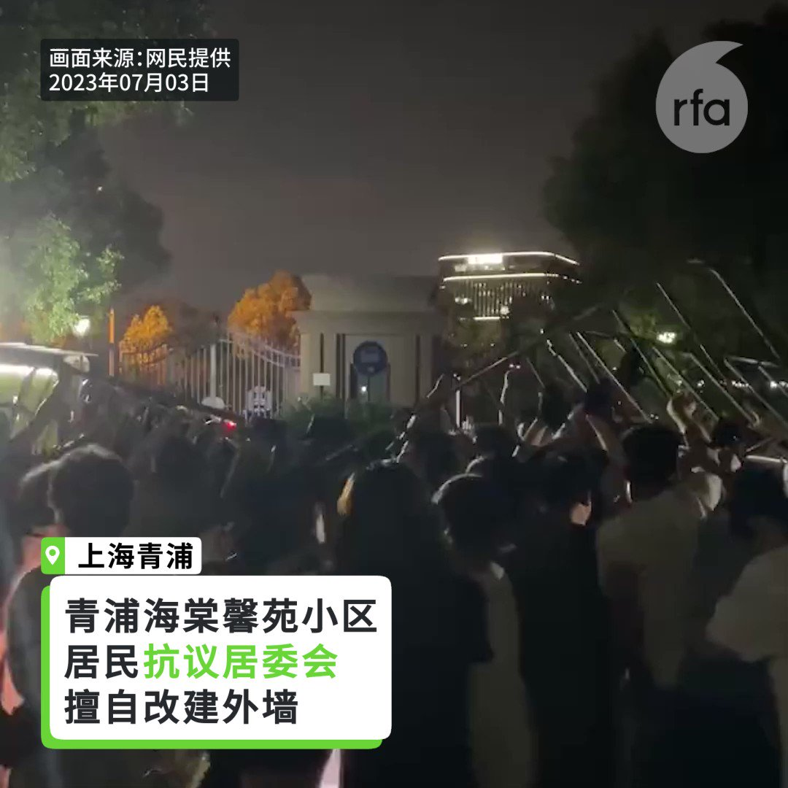

自由亚洲电台 北京时间 2023-07-05T22:55:47Z 1676605802608570369 中国国家主席 #习近平 在上合会议指出，要高度警惕外部势力在本地区煽动“新冷战”、反对外国策动“#颜色革命”，打击“#东突”等势力，并建议扩大“本币结算”份额。学者分析，习近平有意打造“二点零版的华沙条约组织”。
https://t.co/BMOrhxN7cu   自由亚洲电台 北京时间 2023-07-05T23:19:25Z 1676611747631726593 RT @RFA_Chinese: 中国网络近期出现“#35岁魔咒”一词，民众借此表达对职场瓶颈的不满。而35岁以上的青年人遭遇年龄歧视，不但找不到稳定的工作，更难以结婚生子。

中国为什么会出现“35岁魔咒”的现象呢？https://t.co/3kRmngzqNl   自由亚洲电台 北京时间 2023-07-05T23:55:16Z 1676620772352331776 #王毅 又语不惊人死不休了：#染发修鼻也变不成洋人
有网友说，这是煽动种族主义拉拢日韩。
有学者反问，北京也极欲拉拢非洲、中东，又该如何以种族论自圆其说？ https://t.co/RZmqodH0sc   自由亚洲电台 北京时间 2023-07-05T16:58:09Z 1676515799190880256 【中国公布 #最低工资 标准】
【过半省份月薪 #低于2000元】
中国人社部最新发布了全国31个省、直辖市最低工资标准情况，其中上海以2690元仍居榜首。15个省最低工资在2000元以下，辽宁最低，每月1420元，以每小时计算上海24元，辽宁最低14.3元。
https://t.co/SkxjqRveqq https://t.co/IFjvgsT5Rp   自由亚洲电台 北京时间 2023-07-05T17:50:50Z 1676529056479866880 【上海青浦小区居民与警冲突】
【多人受伤及被捕】
#上海 #青浦 一住宅小区居民不满物业及居委会未经居民大会表决，耗资两千万元改建小区围墙，因而阻止有关当局强行施工。双方发生冲突，当局出动特警“维稳”，约十人被警察带走。另有多位居民受伤。
6月30日到7月3日晚，上海市青浦区 #海棠馨苑小区 的居民连续多日抗议小区居委会在未召开居民大会表决的情况下，擅自改建小区外墙，阻挠施工方进入小区强行拆除围墙。晚上七、八点许多下班回家的居民加入了抗议行列，双方爆发激烈冲突，当局出动特警试图平息事件，愤怒的居民拆下大门防撞围栏投向保安员和协警，约10人被带走。
详细报道：https://t.co/rVlcEYmPFq   自由亚洲电台 北京时间 2023-07-05T18:22:41Z 1676537073157947392 【重庆万州洪水泛滥至少15人死】
【网民质疑排水系统没建好】
中国多省市近日出现暴雨，其中 #重庆万州 灾情严重，洪水直涌市区大街，至周三至少15人死亡，4人失踪。
中国官媒影片显示，洪水在万州大街上如大河猛冲，有目击者形容：“这是一条大街波浪宽，水卷铺面冲两岸！”大批民众被困在淹水的家中等待救援，由于待救人数太多，救援人员的橡皮艇看似数量不足，不少长者及小童只能穿上救生衣或救生圈浮在水面等待。
官方通报，本周一（3日）至周二重庆万州区遭受暴雨袭击，因灾死亡15人，失踪4人。据称受灾人口37226人，当局紧急避险撤离11578人，紧急安置779人。农作物受灾面积1949.96公顷，倒塌房屋50户138间。全区直接经济损失近2.3亿元人民币。
#洪水灾害
#重庆万州
#基建腐败   自由亚洲电台 北京时间 2023-07-05T16:01:19Z 1676501496635207681 【欲拉拢日韩 王毅发言却引争议】
【称 #中日韩 #头发染黄 #鼻子修尖 也变不成西方人】
中共中央政治局委员、中央外事办主任 #王毅   7月3日出席“2023年中日韩合作国际论坛”时，发表“欧美人分不清中日韩，无论头发染得再黄，鼻子修得再尖，也变不成西方人”的言论。外界认为有 #种族主义 色彩，引发强烈批评。   自由亚洲电台 北京时间 2023-07-05T05:15:49Z 1676339050205044737 目前Meta正计划在中国销售其头戴式设备，已经与包括腾讯等在内的中国科技公司讨论重返中国的问题，并取得了进展。https://t.co/lRJgNYEKPc   自由亚洲电台 北京时间 2023-07-05T02:52:26Z 1676302966976835587 中国网络近期出现“#35岁魔咒”一词，民众借此表达对职场瓶颈的不满。而35岁以上的青年人遭遇年龄歧视，不但找不到稳定的工作，更难以结婚生子。

中国为什么会出现“35岁魔咒”的现象呢？https://t.co/3kRmngzqNl   自由亚洲电台 北京时间 2023-07-05T03:55:05Z 1676318733369761792 就在美国财长耶伦即将访华前夕，美国传出消息，拜登政府正准备限制中国企业使用美国云计算服务。据美国《华尔街日报》报道，消息人士透露，这项新规如果被采纳，可能会要求亚马逊、微软等美国云服务提供商要先获得美国政府许可，才能向中国客户提供使用先进制程人工智能(AI)芯片的云计算服务。https://t.co/18HVrsWq1D   自由亚洲电台 北京时间 2023-07-05T03:59:26Z 1676319830016704512 【#亚太报道（2023-7-4）】
欢迎收听和订阅播客【亚太报道】 https://t.co/MjLNSvVeAE

中国宣传“西方衰败”原因何在？；中国发布 #限制半导体材料出口 措施； “#35岁魔咒”与职场瓶颈； #香港特首 宣称对八名港人“ #终身追捕”；#台湾 推出举报干预选举奖励措施；#洗脑宣传 #中国经济 #美中关系 https://t.co/EBe3MNKEx3   自由亚洲电台 北京时间 2023-07-05T01:08:02Z 1676276694087344138 据彭博社报道，消息人士透露，中国大型国有银行正向地方政府融资平台（LGFV）提供25年期贷款，帮助地方政府减缓债务压力，避免出现信用紧缩。https://t.co/pgoDCneAVV   自由亚洲电台 北京时间 2023-07-05T01:39:16Z 1676284554288439302 上海合作组织成员国元首理事会第二十三次会议7月4日在印度召开。中国国家主席习近平以视频形式在会议上发表讲话，强调上合组织成员国之间要增加团结互信，警惕外部势力在本地区煽动“新冷战”、反对任何国家以任何理由干涉内政、策动“颜色革命”，独立自主制定对外政策，把本国命运掌握在自己手中。https://t.co/m5iqjj4wqa   自由亚洲电台 北京时间 2023-07-05T00:11:39Z 1676262505012707330 台湾法务部日前推出检举奖励措施，以防止“境外敌对势力”和网络选举赌盘等介入2024年选举。而台湾的国安会秘书长顾立雄此前曾发出警告，北京当局恐将大规模干预明年的台湾总统大选。https://t.co/b300gSQpsW   自由亚洲电台 北京时间 2023-07-05T00:12:11Z 1676262639343742976 美国财政部长耶伦访华前夕，中国商务部以“维护国家安全和利益”为由，宣布对涉及半导体材料的相关物质实施出口管制。有评论认为，中方此举是对美中贸易竞争的反制，并试图借此增加谈判筹码。https://t.co/TdY4IEwyGG   自由亚洲电台 北京时间 2023-07-05T00:12:54Z 1676262819656876032 7月4日，台湾的外交部政务次长李淳公布近期外交成果，包括总统蔡英文和外交部长吴钊燮分别成功出访中美洲及欧洲，七大工业国(G7)领袖峰会重申台海和平稳定的重要性，以及先后有多达40个外国代表团到访台湾等。与此同时，台湾将如何平衡应对中国武力威胁与保证自身安全的问题，也日趋令人关注。https://t.co/SfLU1me2pZ   