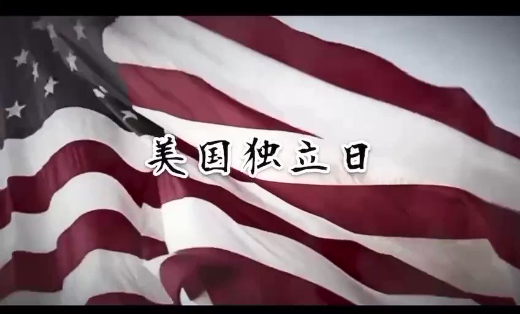

蔡霞 北京时间 2023-07-05T02:59:15Z 1676304684368162827 RT @NiKiTa_32156: 2023年7月4日美國獨立日。 https://t.co/Iq4njyfdxr   蔡霞 北京时间 2023-07-05T02:59:31Z 1676304750508142604 RT @USA_China_Talk: 今天是7月4日，美国人庆祝自由的节日。今年，我们问了美国大使馆的美国官员——自由对你意味着什么？ https://t.co/oA91xpFNKZ   蔡霞 北京时间 2023-07-05T01:56:26Z 1676288876888088584 今天是美国独立日。庆贺美国人民的节日！🌹🌹🌹
议报转发公益性重要影讯，今天全美继续上映一部感人至深的电影《自由之声》。期待更多的朋友走进影院观看，用我们的微薄之力，与所有被奴役的人一起争取自由奔向自由

【議想天開】自由之聲｜只要良心統治著人類（影訊） - 议报 https://t.co/Ox18tnRA1A   