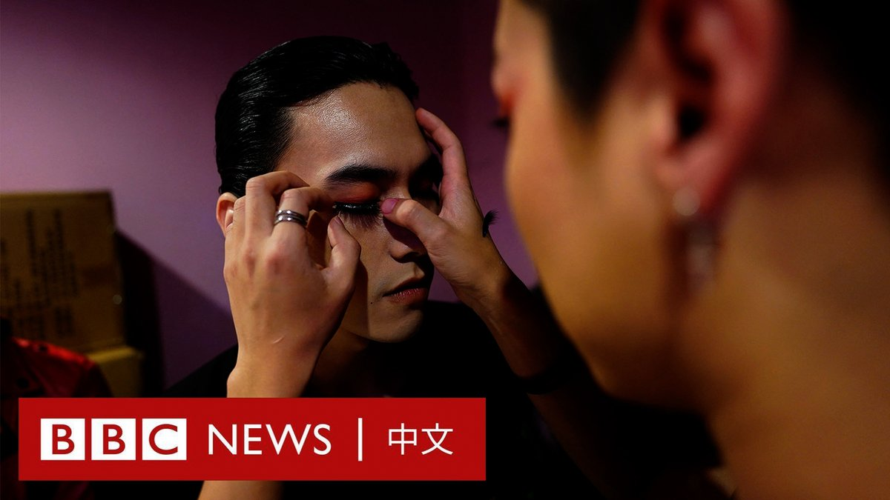
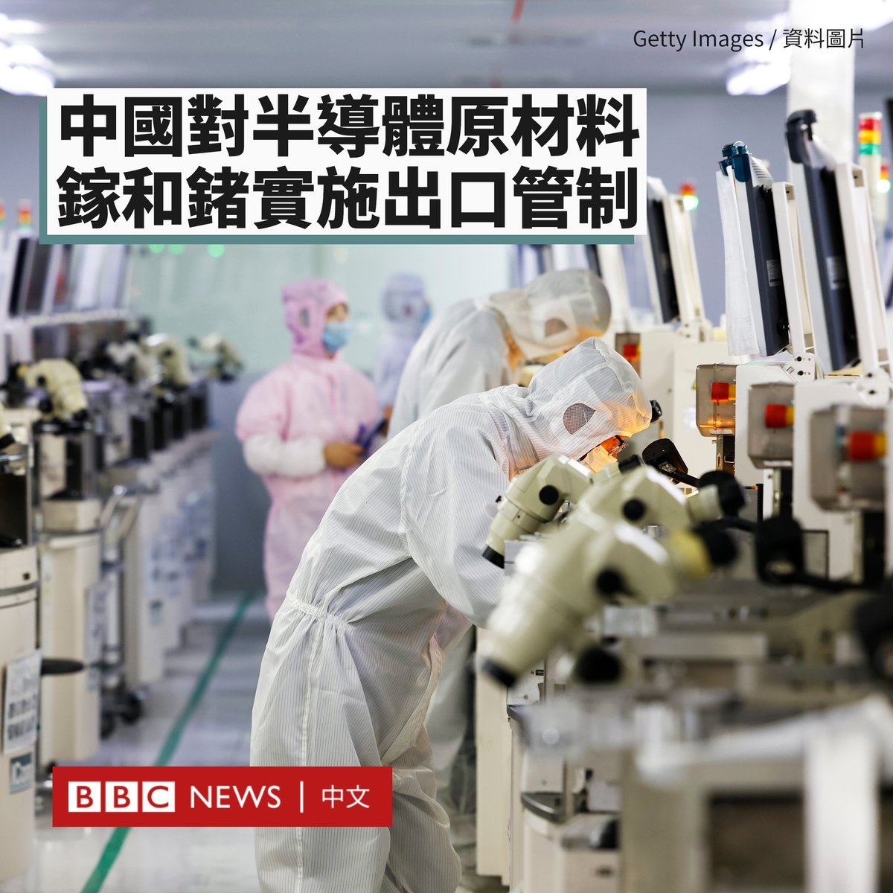
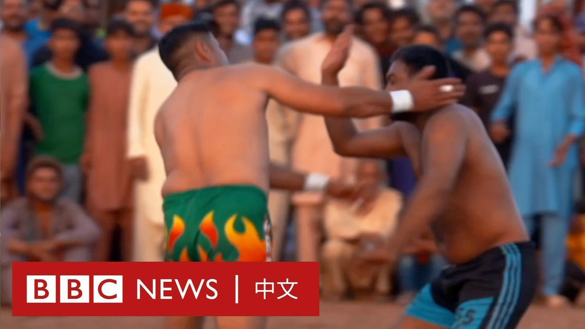
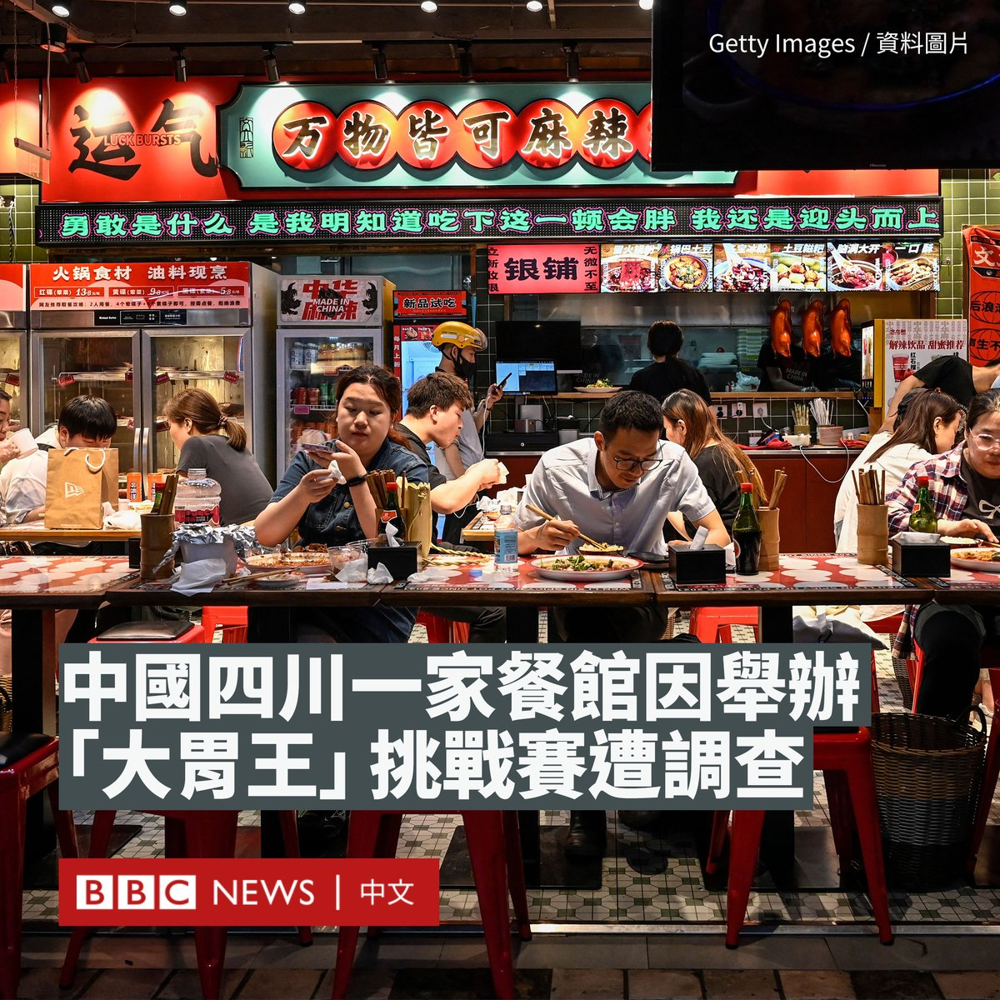

D英国广播公司BBC 北京时间 2023-07-04T18:30:51Z 1676176740324966401 一名腾讯公司的程序员周一（7月3日）在北京被拘捕。他被指在读硕士研究生期间，侵入了母校中国人民大学的数据库，并用学生的照片和信息建立了一个外貌打分平台。https://t.co/V9FuNHwREM   D英国广播公司BBC 北京时间 2023-07-04T20:01:30Z 1676199553454972928 Voguing是一种起源于与20世纪中期纽约的舞蹈形式，因为深受性少数群体（LGBTQ）的欢迎而被人认识。

在中国，由于性少数议题与传统和官方宣传的价值观不符，近年一些运营多年的彩虹公益团体纷纷解散，而与性少数文化关系密切的Voguing舞团只能低调举办舞会。 https://t.co/VV96uvUT5Q   D英国广播公司BBC 北京时间 2023-07-04T16:58:28Z 1676153491088195585 香港警方国安处宣布悬红100万港元通缉罗冠聪、许智峰等八人。身居英国的罗冠聪回应称，他认为自己的人身安全将变得更加危险。https://t.co/yfo4PC5OvO   D英国广播公司BBC 北京时间 2023-07-04T15:22:04Z 1676129231980617729 英国苏格兰奥克尼群岛（Orkney Islands）领导人将提交一项议案，研究“另一种执政形式”，包括成为挪威的自治领地。

奥克尼群岛距离苏格兰北海岸约10英里，由70个岛屿组成，人口2.2万。奥克尼议会领导人詹姆斯·斯托坎（James Stockan）表示，奥克尼群岛并未获得公平的资助。

他表示，过去40年间，英国北海的大量石油在奥克尼群岛进行加工，但该岛没有得到足够的好处。

除了重新加入挪威外，该议案还提及其他的选项，比如成为王室属地（Crown Dependencies），或成为海外领土等。

奥克尼群岛曾被挪威和丹麦统治，直到1472年成为苏格兰的一部分。挪威和丹麦国王克里斯蒂安一世（Christian I）将女儿玛格丽特（Margaret）嫁给苏格兰国王詹姆斯三世（James III）时，把奥克尼群岛作为嫁妆担保。由于他没有支付款项，苏格兰吞并了这一领土。

斯托坎告诉BBC，在英国和苏格兰政府的管理下，奥克尼很多领域都遭遇“严重失败”。

他表示，奥克尼在挪威王国治下的时间比在英国更长，“在奥克尼的街头，人们会走过来问我，我们什么时候才能还回嫁妆，我们什么时候回挪威。”

英国政府表示，它正在提供22亿英镑的资金来促进英国社区的发展，包括5000万英镑用于发展奥克尼等苏格兰岛屿的经济。

奥克尼群岛拥有欧洲其中一些最古老、保存最完好的新石器时代遗址，以及迤逦的风景和物种丰富的海洋和鸟类野生动物。   D英国广播公司BBC 北京时间 2023-07-04T12:58:56Z 1676093213193703424 中国周一（7月3日）宣布，将从下个月开始对两种稀有金属镓和锗实施出口限制。

镓和锗被广泛用于半导体生产，中国是这两种金属的主要生产国。分析认为这是在反制此前美国等国对中国的芯片出口限制。

中国商务部和海关总署表示，将从8月1日起对镓、锗相关物项实施出口管制。当局在声明中称，此举是为维护国家安全和利益，并称未来一些物项的出口将需要由国务院来批准。

去年10月，美国停止向中国出口先进制程半导体的生产设备，并向韩国和荷兰等盟友施压，要求它们采取同样的措施。

据路透社报道，美国和荷兰将于今夏进一步限制芯片制造设备的销售，对中国芯片制造业进行“连续打击”。华盛顿担忧北京将该技术用来增强军力。

中国现代国际关系研究院研究员陈凤英对官方媒体《环球时报》表示，中国向国际上供应了很多稀有关键金属，但被制成芯片后反过来“卡中国的脖子”，因此这是一种“对等反制”，以维护国家安全和利益。

镓的化合物是优质的半导体材料，被广泛应用于集成电路、红外光学、发光二极管和微波通信领域。锗用于红外技术、光纤电缆和太阳能电池。这两种材料都在欧盟的关键原材料清单上。   D英国广播公司BBC 北京时间 2023-07-04T11:01:00Z 1676063531366580225 在巴基斯坦的旁遮普省，一种融合了“掌掴”和摔跤的运动正越来越受欢迎。

这种新风格的“掌掴”卡巴迪，也被称为“Thappad”卡巴迪，选手们需通过突袭和拍打对手来决胜负，传统上在旁遮普省中东部的节日中进行。 https://t.co/WcZ9Rl6gCb   D英国广播公司BBC 北京时间 2023-07-04T09:27:28Z 1676039992819453952 中国四川一家餐馆因举办“大胃王”挑战赛，遭到当局立案调查。

据中国媒体报导，这家位于宜宾市叙州区的餐饮店推出了“挑战大胃王”竞赛活动，要求参与者在规定时间内食用108个抄手，吃的越快会获得更多奖励。

抄手是中国西南地区类似于馄饨的一种小吃。据报导，该店的负责人拍摄了比赛影片，并上传至网络平台，吸引了很多网友观看。

但当地市场监督管理局的执法人员表示，该行为触犯了《反食品浪费法》，涉嫌“诱导”或“误导”消费者超量点餐。

据报导，执法人员认为，没有被参赛者吃完的抄手会被店家直接倒掉，造成了浪费。

这起案例是中国近期就食品浪费问题处罚的最新一例。

今年3月，福建厦门一家酒店举办“汉堡王挑战赛”活动，比赛规定食客在30分钟内吃完3斤重的汉堡即可退还入场券费用。该酒店同样因触犯《反食品浪费法》遭到立案调查。

在中国领导人习近平呼吁“制止餐饮浪费”后，中国在2021年通过《反食品浪费法》，规定浪费食物是违法行为。

根据该法律，诱导和误导消费者“超量点餐”造成浪费的餐饮商将面临高达10,000元人民币（1500美元）罚款。

该法还禁止网民制作和传播暴饮暴食的吃播视频。社交媒体上的很多“大胃王”账号被关闭。

一些地方政府也纷纷制定相关政策。例如，武汉市餐饮协会要求该市的餐馆遵守“N-1”的点餐模式，即10位进餐客人只能点9个人的菜，不够再增加菜品。

一些餐馆甚至还规定，要在用餐前通过测体重来确定顾客的饮食量。   