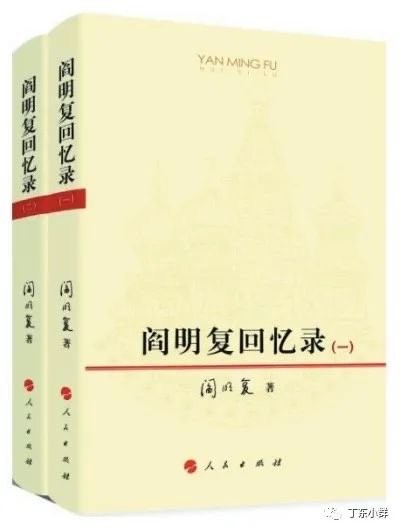
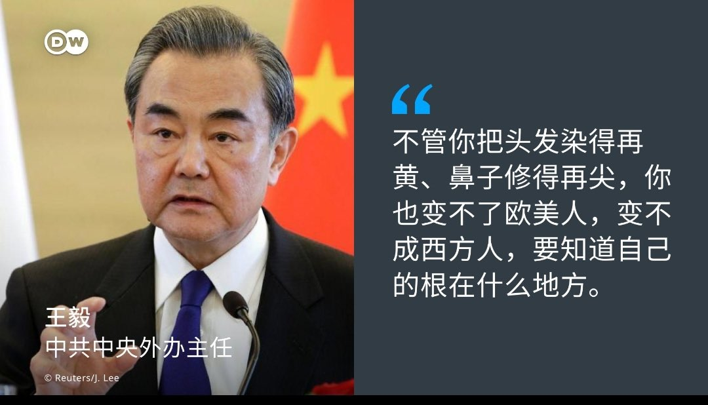
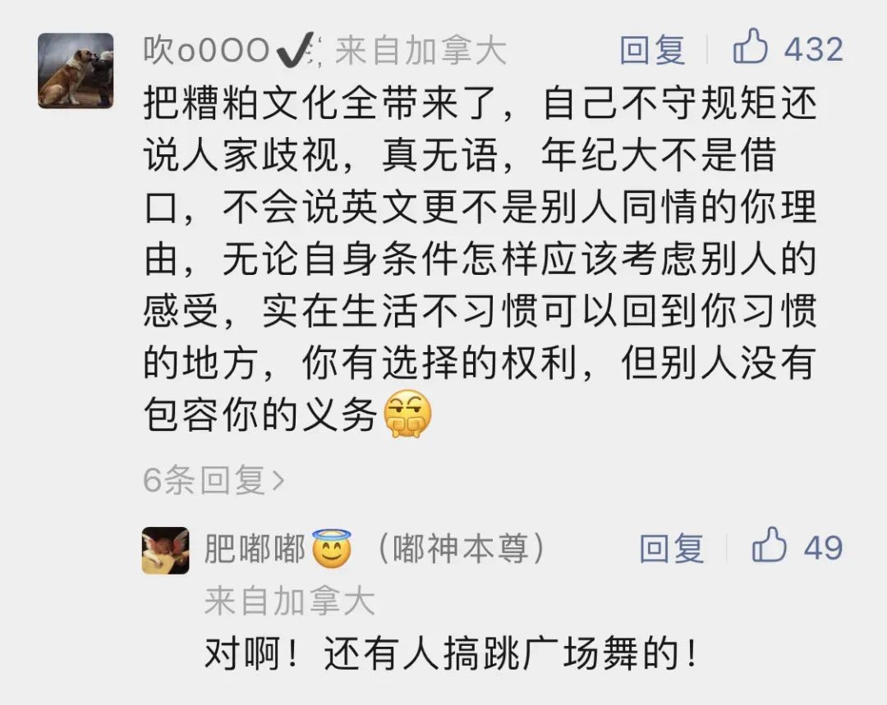
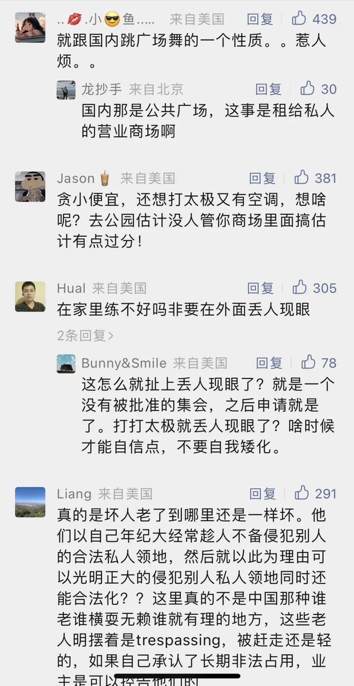
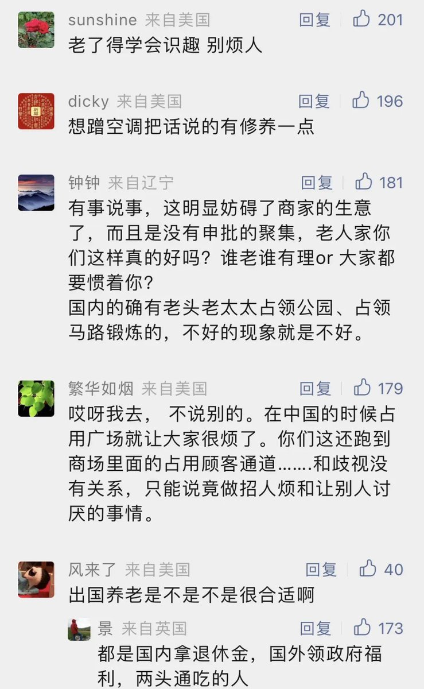

Petrichor 北京时间 2023-07-04T20:49:31Z 1676211635386556416 阎明复：中苏大论战形式上是意识形态论战，实际上是争夺国际共运领导权的政治斗争。中国企图通过意识形态斗争手段，剥夺苏共‘马克思主义正统’和对马克思主义的解释权，从而摧毁它在国际共运中的领导地位。在这场论战中双方都力图把对方党的最高领导人搞下台。大论战是历史悲剧，从总体上应该否定。 https://t.co/Uv8x4nGOSX   Petrichor 北京时间 2023-07-04T20:36:11Z 1676208280056594432 根在秦国。 https://t.co/WQqxdk6HwH   Petrichor 北京时间 2023-07-04T03:52:18Z 1675955647093911554 最近温哥华一家商场，因为有空调，吸引一帮华人中老年人未经允许进去跳“广场舞”、打太极拳、练剑等活动，因为噪音等影响商家正常的商业活动，遭到投诉，警察到场赶人。但是这帮老人也不是好惹的，从中国大陆，经验丰富，反说商场保安搞种族歧视，一些大外宣自媒体也趁机煽火。但是中国网民眼睛雪亮。 https://t.co/x5HZMDs2hu   Petrichor 北京时间 2023-07-04T00:35:38Z 1675906152306028556 刻苦钻研，不断进步，勇攀高峰。 https://t.co/n8uzwuvsaK   