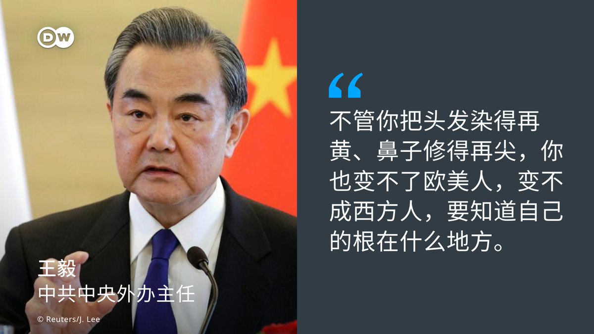

德国之声 北京时间 2023-07-04T16:40:00Z 1676148843199471619 在中国通过 #对外关系法 和 #反间谍法 修订案之后，美国国务院发布最新旅行警告，建议美国公民重新考虑前往中国的旅行，称中国存在任意执法和错误拘留的风险。

https://t.co/Fgx5Zb9vsa https://t.co/Di4cHxWWVq   德国之声 北京时间 2023-07-04T17:20:00Z 1676158909608853504 今年度 #中日韩合作国际论坛 7月3日于中国青岛登场，中国🇨🇳最高外交代表 #王毅 在致词时强调：三方应当坚定维护三国合作的正确方向。

王毅也向 #日韩 两方喊话道，我们去美国都会被认为是亚裔人 ，“不管你把头发染得再黄、鼻子修得再尖，你也变不了欧美人，变不成西方人，要知道自己的根在什么地方。” https://t.co/KEyb2vvSAE   德国之声 北京时间 2023-07-04T17:56:00Z 1676167969230168065 台海局势紧张之际，#国际特赦组织 总会秘书长卡拉马尔（Agnès Callamard）6月24日至29日访台，她此行目的为何？ 5月，该组织遭外界质疑🤔误报一名留韩的 #维族 学生赴港失踪，加深其多年来被控立场 #反华、 #亲西方 的隐忧。对此，秘书长本人有何表态？

DW专访在此：https://t.co/Pf2HsyLFOj https://t.co/aWq45WAVxQ   德国之声 北京时间 2023-07-04T15:12:03Z 1676126710339719168 这是自上个月 #瓦格纳 叛乱失败以来，中俄军方之间最高层级的会谈。俄罗斯🇷🇺海军总司令表示，应把两国海军关系 "推向新的高度"。双方还谈了什么❓
https://t.co/CML05UIHhB   德国之声 北京时间 2023-07-04T15:50:00Z 1676136260367433728 中美 #芯片 战不断升级，#中国 宣布将限制镓、锗的出口。这两种金属是制造半导体的重要材料，外界认为此举是🇨🇳 中方对西方芯片技术管制的回击。这项金属出口管制措施，将对全球半导体产业造成多大影响❓
 https://t.co/GV3H8PQ1BZ   德国之声 北京时间 2023-07-04T07:15:00Z 1676006656319320064 #乌克兰🇺🇦 称大反攻尚未开始，乌军正在前线艰苦作战，进展缓慢。DW记者从 #顿涅茨克 实地发回了报道。 https://t.co/988rauyd4I   