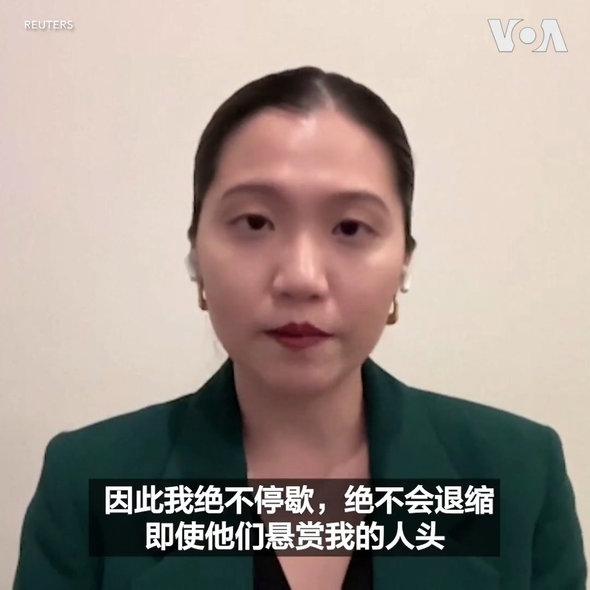
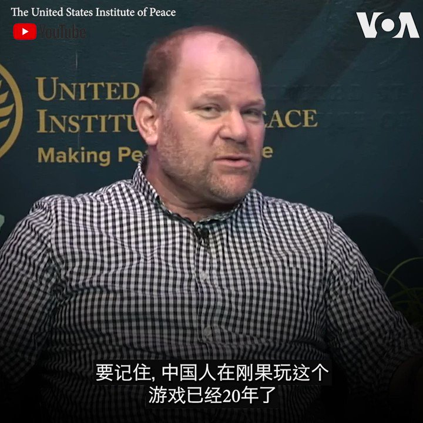
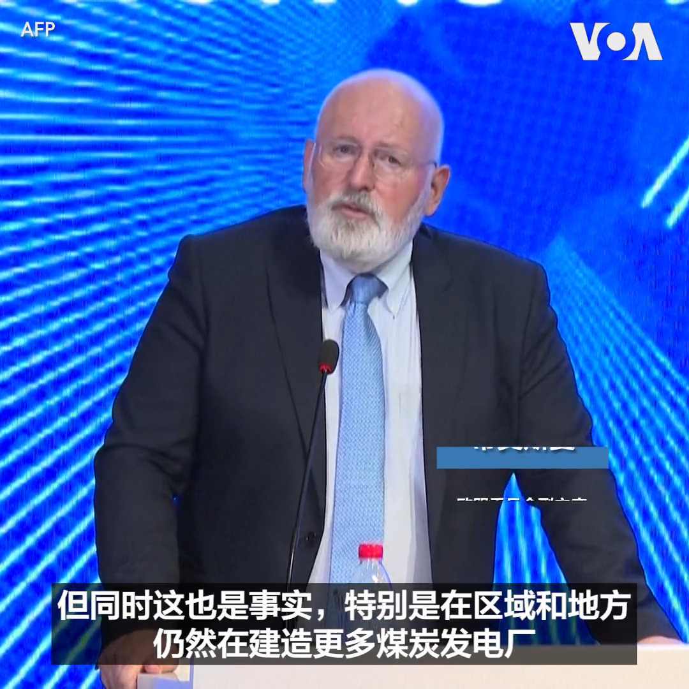

美国之音中文网 北京时间 2023-07-04T22:55:02Z 1676243226620219392 中共干预台湾大选新手法：“降低干扰”以退为进？ https://t.co/KZm97dnbIw   美国之音中文网 北京时间 2023-07-04T23:12:14Z 1676247553732386818 “我相信我所做的事情是正确的，我永远不会退缩”， 身在美国首都华盛顿的香港民主委员会(HKDC)执行总监郭凤仪说。香港当局3日以触犯国安法为由悬赏百万港元，通缉包括她在内的八名流散在海外的香港民主活动人士。郭凤仪认为，她呼吁美方禁止香港特首李家超出席APEC会议是她被通缉的原因之一。 https://t.co/jsMxSkqoof   美国之音中文网 北京时间 2023-07-04T23:12:33Z 1676247633323790336 面临严峻挑战，北约决定让老将斯托尔滕贝格留任秘书长职务 https://t.co/bYGHmBV8iX   美国之音中文网 北京时间 2023-07-04T23:12:35Z 1676247640496013315 担忧“灰犀牛”，中国任命金融技术官僚为央行党委书记 https://t.co/5ur1n2OgPo   美国之音中文网 北京时间 2023-07-04T23:53:37Z 1676257966196965376 活动人士、澳大利亚律师任建峰说被港府以国家安全罪通缉“并非完全出乎意料”。他说，当局“几乎成功地压制了香港境内所有异议的声音”，唯一剩下的境外异议声音就是他们下一步的目标。与此同时，澳大利亚外交部长黄英贤表示，澳大利亚一直对《国家安全法》的适用深表关切。她表示，澳大利亚支持言论自由。 https://t.co/E4lNgKgQ8b   美国之音中文网 北京时间 2023-07-04T21:16:55Z 1676218533401772038 中国在非洲基础设施和矿产开发行业深耕二十年后，美国重返非洲战略姗姗来迟。分析认为， 美国与非洲伙伴国家增加接触时应该避免与中国“硬碰硬”，并将重点放在如何让非洲国家受益。报道内容：https://t.co/L1gp9Lap41 https://t.co/OQFLRAn6xM   美国之音中文网 北京时间 2023-07-04T21:37:03Z 1676223597801775104 俄罗斯称乌克兰无人机袭击莫斯科，但无人机全被击落 https://t.co/4kNtCtwicT   美国之音中文网 北京时间 2023-07-04T21:43:33Z 1676225233995571201 中国一个月内连续降低美元存款利率，以阻人民币继续贬值 https://t.co/FdF92o7QWu   美国之音中文网 北京时间 2023-07-04T18:26:03Z 1676175534492098562 台湾国民党总统候选人称当选后会确保两岸和平、缩短兵役 https://t.co/rPxMo5prqr   美国之音中文网 北京时间 2023-07-04T20:13:04Z 1676202463362433025 香港悬赏百万通缉的袁弓夷：我追求民主自由为良心平安 https://t.co/2w1M67BgiT   美国之音中文网 北京时间 2023-07-04T20:42:34Z 1676209886282264579 美国人民欢庆独立日，烧烤和烟花不可或缺 https://t.co/gJbOuRkf0n   美国之音中文网 北京时间 2023-07-04T16:33:33Z 1676147220247359488 总结西太平洋访问之旅 美国众议员代表团称支持盟友对遏止中国侵略至关重要 https://t.co/5OMPvFIlTj   美国之音中文网 北京时间 2023-07-04T18:10:03Z 1676171506030870528 习近平出席上海合作组织在线峰会 谈及“上合大家庭”扩员 https://t.co/3E7mPh6ddu   美国之音中文网 北京时间 2023-07-04T15:17:04Z 1676127972598910976 与美西方科技战升温 中国管制两稀有金属出口 https://t.co/DjN6bb1387   美国之音中文网 北京时间 2023-07-04T15:30:03Z 1676131241006108673 美中高层官员恢复互访 台湾称不担忧 乐见美中正面发展 https://t.co/WjJ6g1bAMO   美国之音中文网 北京时间 2023-07-04T16:00:03Z 1676138789297885186 日本预计获国际原子能机构批准排放福岛核废水 中国持续抗议 https://t.co/56hoOgCgNX   美国之音中文网 北京时间 2023-07-04T11:33:04Z 1676071602990247936 不把中国视作竞争假想敌 分析：美国战略将让非洲更受益 https://t.co/GVxQadjZUx   美国之音中文网 北京时间 2023-07-04T11:46:34Z 1676074998170292225 多名被香港警方悬红点名人士回应 称“光荣”上榜誓言继续人权工作 https://t.co/WDPOLFwqqV   美国之音中文网 北京时间 2023-07-04T06:34:33Z 1675996478463184896 北约最高军事官员：乌克兰反攻困难且漫长 https://t.co/iBBSxYGEg4   美国之音中文网 北京时间 2023-07-04T07:00:00Z 1676002881680592896 近期人民币波动引发关注，人民币汇率到底会跌跌不休还是站稳回升？哪些要素在彼此牵制？另一方面，中国房地产市场负面消息不断，二手房挂牌量激增，房市危机是否到来？政府要不要救？救不救得了？7/4时事大家谈将讨论这些问题，请留言参与。 https://t.co/JZXl09C6Kh   美国之音中文网 北京时间 2023-07-04T07:18:34Z 1676007553627729920 埃尔多安说，土耳其没有准备好批准瑞典加入北约 https://t.co/D3Iksm1dNf   美国之音中文网 北京时间 2023-07-04T07:44:06Z 1676013980333273088 美国驻俄大使探视在莫斯科被关押的美国记者 https://t.co/w9FFdmMxIl   美国之音中文网 北京时间 2023-07-04T08:03:08Z 1676018768898826241 联邦调查局利用社交媒体追踪叛徒 https://t.co/OAfGEeYnC4   美国之音中文网 北京时间 2023-07-04T08:30:00Z 1676025531169648641 亚裔充当了美国最高法院推翻平权法案的急先锋，最高法院做出裁决的两个案例其中之一就包括亚裔起诉哈佛大学的招生行为，控告学校当局歧视白人和亚裔生源。夏明教授说，一些华人身为少数民族，却以特权阶层的眼光看待美国的教育平权和机会均等问题，到头来将自食恶果。完整版：https://t.co/xwqYw88mOJ https://t.co/RfOT4ZXxOQ   美国之音中文网 北京时间 2023-07-04T08:49:05Z 1676030335916838912 美众院又一访团抵台 国会人士：习近平渐不考虑非暴力统一选项，国会要落实承诺阻中犯台 https://t.co/J3MT3KOBow   美国之音中文网 北京时间 2023-07-04T09:00:01Z 1676033083747848194 法国动乱以及西方国家面临的挑战和危机让中共看到了机会，官媒和自媒体流露出看热闹不嫌事大，希望黑人和阿拉伯人将法国拖进深渊的心态，让人联想起习近平提出的“东升西降”理论。法律学者虞平博士说，法国的危机改变不了民主制度上升，极权制度败落的世界大趋势。完整版：https://t.co/xwqYw87OZb https://t.co/iFUCdZI3O5   美国之音中文网 北京时间 2023-07-04T09:06:33Z 1676034730406600704 泽连斯基：乌克兰是北约重要资产 https://t.co/WN14G9zvz8   美国之音中文网 北京时间 2023-07-04T09:49:04Z 1676045428918468609 冯德莱恩敦促欧盟扩大, 吸收乌克兰和摩尔多瓦 https://t.co/Gzu9kUZKUd   美国之音中文网 北京时间 2023-07-04T09:54:35Z 1676046816620728320 一个时代的结束：因涉六四事件被降职的中共官员阎明复逝世 https://t.co/69TzGcsmrw   美国之音中文网 北京时间 2023-07-04T05:42:14Z 1675983313717043200 华纳兄弟公司出品、以芭比娃娃为原型的真人版电影《芭比》将在本月上映。中国将与美国于7月21日同步上映这部今夏备受期待的浪漫喜剧片。越南原本也是同步上映，但现在下达禁令。为什么越南禁止上映《芭比》？报道：https://t.co/qIEbg3aWap https://t.co/rRbtFI4ShW   美国之音中文网 北京时间 2023-07-04T06:20:03Z 1675992828261040130 美国发表声明谴责香港警方悬赏缉拿海外香港活动人士 https://t.co/etVtKt4gmZ   美国之音中文网 北京时间 2023-07-04T06:20:05Z 1675992835747889152 年轻委内瑞拉流亡新闻从业员坚持说出真相 https://t.co/3t0DXqA12y   美国之音中文网 北京时间 2023-07-04T02:34:21Z 1675936030166249483 白俄罗斯总统卢卡申科6月27日收到了该国国防部长赫列宁送给他的礼物-苏联1949年造的第一颗核弹的模型。 https://t.co/rNn9f1Xn8Q   美国之音中文网 北京时间 2023-07-04T03:38:33Z 1675952187569229824 英国外交大臣抨击香港悬赏缉拿海外香港活动人士 https://t.co/BMH0Dt8PgC   美国之音中文网 北京时间 2023-07-04T03:54:04Z 1675956090805301381 因任意执法和出境禁令，美国政府就前往中国的旅行发布警告 https://t.co/j0OluAu9Nj   美国之音中文网 北京时间 2023-07-04T04:07:09Z 1675959381836570624 以色列攻击西岸打死8人，打伤50人 https://t.co/8utr13EHiq   美国之音中文网 北京时间 2023-07-04T00:33:51Z 1675905705407139842 台湾军方3日在南部屏东开始为期两天的导弹实弹试射；并将于本月底进行最大规模的年度军事演习，以加强针对日益咄咄逼人中国的备战。 https://t.co/nj7ng8a8ad   美国之音中文网 北京时间 2023-07-04T00:37:03Z 1675906510604632064 瓦格纳兵变平息后，普京本周将首次与习近平、莫迪等视频会晤 https://t.co/wqCkfvWrY4   美国之音中文网 北京时间 2023-07-04T00:37:05Z 1675906517944643584 美电影《芭比》显示南中国海“九段线”，遭越南禁演 https://t.co/zobviIFlva   美国之音中文网 北京时间 2023-07-04T00:51:05Z 1675910042925801472 台湾邀请英国前首相特斯拉访台曾付费及耗资11.4万美元 https://t.co/o3fsKVmKM9   美国之音中文网 北京时间 2023-07-04T01:44:32Z 1675923494499151872 欧盟委员会副主席蒂莫斯曼 (Frans Timmermans）3日在北京发表演说时表示，中国要控制全球气候变暖的目标与继续建设煤炭发电厂之间存在矛盾。中国是温室气体最大排放国，例如二氧化碳。中国的减少气体排放承诺被认为对控制气温上升非常关键。但是中国在去年有60%的电力来自燃煤发电。 https://t.co/941DMNUPrX   