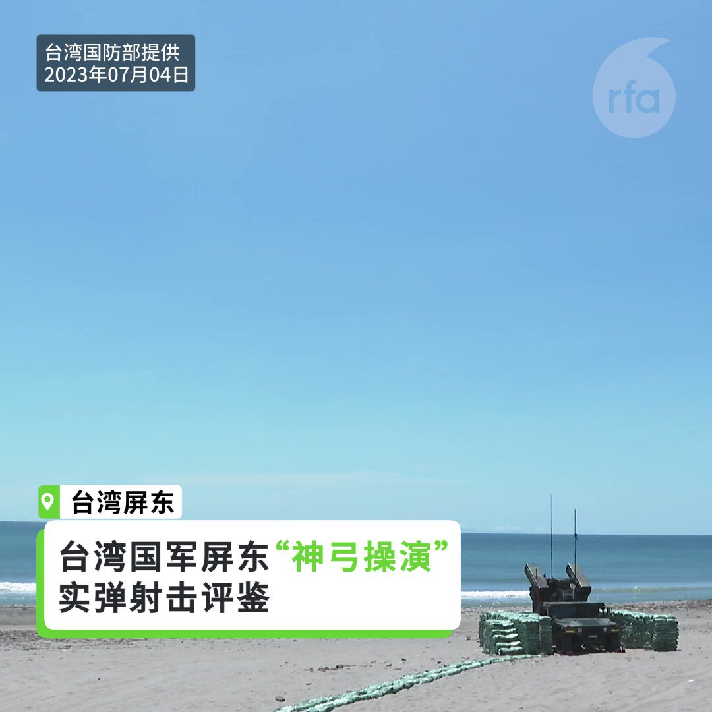
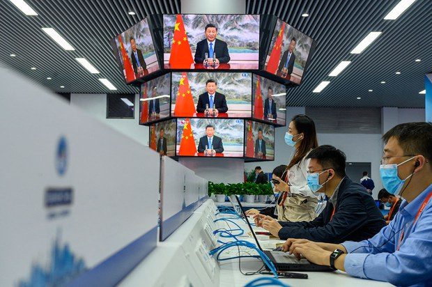
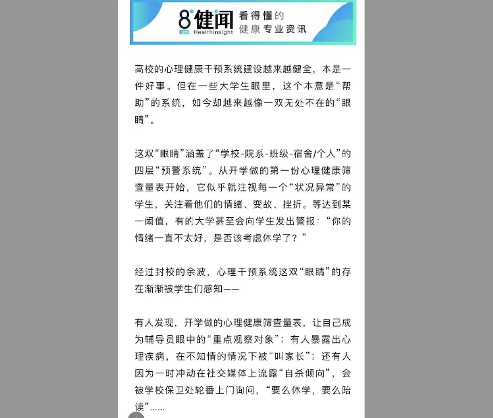
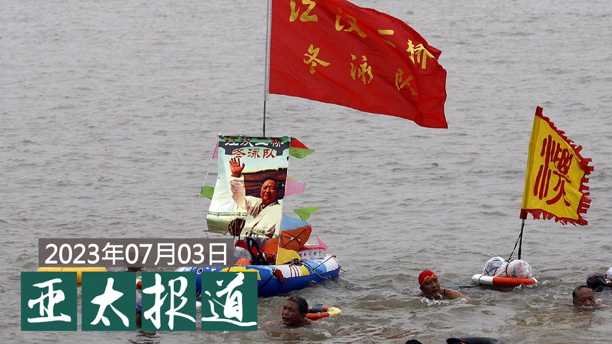
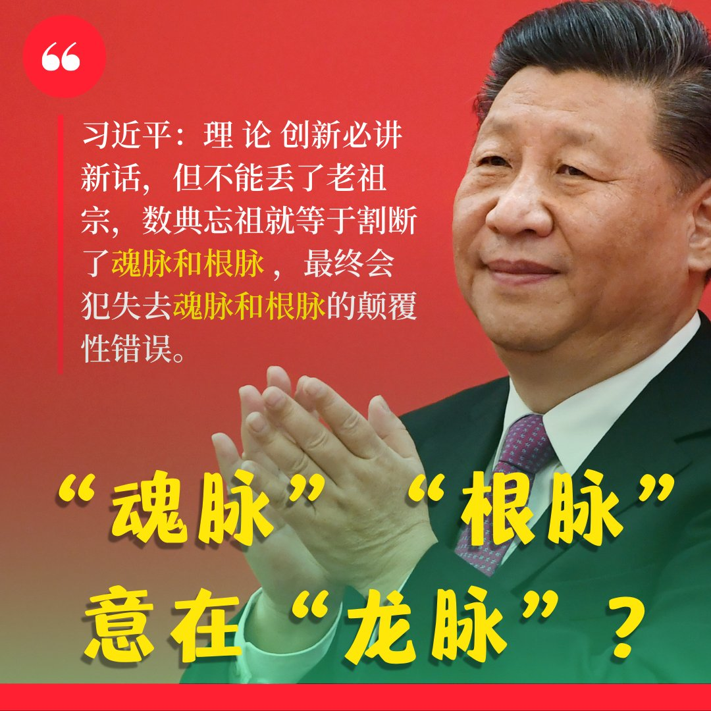
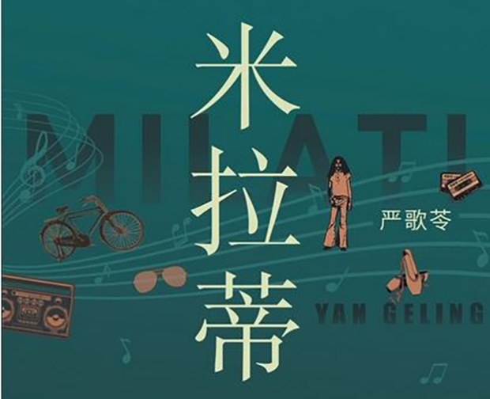
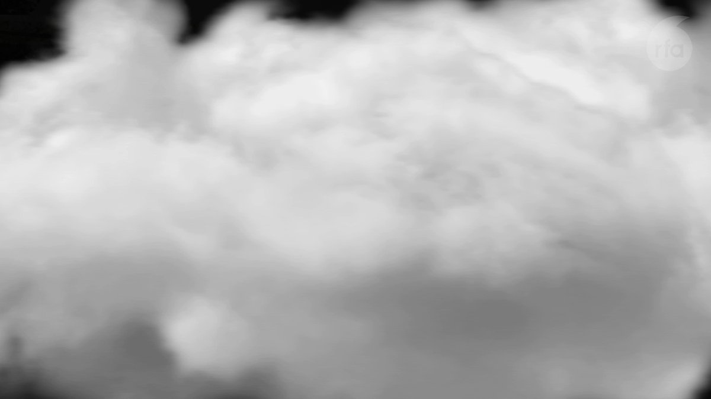

自由亚洲电台 北京时间 2023-07-04T18:56:52Z 1676183287109386242 【台湾部队展开系列操演 刺针飞弹上场】
【雷霆 天马 神弓 实弹测试验证】
3号开始，台湾军队在屏东展开系列的实弹射击演习。包括“#雷霆操演”于屏东九鹏基地实施，陆军所属 #雷霆2000多管火箭 系统进行实弹射击，依想定发射各式火箭模组，由远而近，模拟实战状况，打击敌船团及登陆兵力。

另外，在屏东枋山乡加禄堂地区执行“#天马操演”任务，由第四作战区成立操演指挥部，纳编陆军装甲542旅、564旅、机步269旅、234旅、花防部及海军陆战99旅反甲连，进行 #拖式飞弹 实弹射击鉴测。“天马操演”依据防卫作战构想结合战场景况，以目标海域靶船模拟敌军，由射手透过光学瞄准具追踪及线控导引方式，使飞弹击中目标。

4号，则是在屏东九棚大沙漠实施“#神弓操演”，实弹射击 #复仇者飞弹车、双联装 #刺针飞弹，从追瞄锁定、发射，必须在7至12秒内完成。   自由亚洲电台 北京时间 2023-07-04T19:17:55Z 1676188586461528065 【官媒频宣传西方衰败 "#七分之一英國人吃不飽"】
【学者：中国社会面临危机 先洗脑丑化资本主义】
近一段时期，有关西方发达国家 #经济衰退、 #全面返贫、衣食困难，西方难民恐将涌入中国的相关文章引发热议。新华社、人民网、光明网等中央级媒体相继作了同类型报道，网民嘲讽道，这是新华社，不是德云社？
https://t.co/SWYUseHa7J   自由亚洲电台 北京时间 2023-07-04T16:45:54Z 1676150328910303234 【刚入选中国应用新闻传播十大创新】
【“八点健闻”被全网关闭】
专注于报道医疗行业的智库型媒体“#八点健闻”，本周一（3日）被全网封闭。当局并未对此有更多的解释，在封号下方仅留言“违反《互联网用户公众账号信息服务管理规定》。而培训记者的微信公众号“#传媒特训营”也同时被封。
https://t.co/1uBbjsnnIK   自由亚洲电台 北京时间 2023-07-04T14:14:45Z 1676112290444365824 https://t.co/ub3nGlIuWR   自由亚洲电台 北京时间 2023-07-04T11:42:15Z 1676073911673573376 https://t.co/PfbUGTYGE4   自由亚洲电台 北京时间 2023-07-04T12:05:46Z 1676079830683754496 评论 | 陈破空：都说俄国兵变吓坏了习近平，此言不虚
https://t.co/prWX5ue0Yk   自由亚洲电台 北京时间 2023-07-04T06:37:25Z 1675997201259171841 #余杰：
普京出师不利，深陷泥潭，习近平有兔死狐悲之感。普京环顾全球，小鱼小虾级别的盟友仅有伊朗、朝鲜、白俄罗斯等屈指可数的几个，大块头的盟友则只有中国。于是，普京主动向其粉丝习近平抛出媚眼，为习近平庆生，以显示两国关系如胶似漆，两个独裁者也惺惺相惜。
https://t.co/mRh8iXjFYb   自由亚洲电台 北京时间 2023-07-04T07:11:47Z 1676005849419104257 【#亚太报道（2023-7-3）】
欢迎收听和订阅播客【亚太报道】 https://t.co/MjLNSvVMqc

香港以《#国安法》罪名通缉8位民主人士 / 人权团体呼吁美国禁止 #李家超 入境 / #余文生、#周世峰、#邹幸彤 等获颁人权奖项 / 美国财长 #耶伦访华 在即 / 江西组织“#千人横渡赣江”被批效仿文革 https://t.co/QswJeYMRWw   自由亚洲电台 北京时间 2023-07-04T07:16:27Z 1676007023324823553 “马克思主义中国化时代化 这 个 重 大 命 题 本 身 就 决 定 ，我 们 决 不 能 抛 弃 马 克 思 主 义 这 个 魂 脉 ，决 不 能 抛 弃 中 华 优秀传统文化这个根脉”。6月30日，#习近平 在中共中央政治局第六次集体学习时又造新词：“魂脉”与“根脉”，引起海内外关注。

#根脉 和 #魂脉 之间是啥关系？习近平到底想说什么？请分享高见。   自由亚洲电台 北京时间 2023-07-04T09:35:55Z 1676042120615063552 中共中央外事工作委员会办公室主任 #王毅 7月3日表示，中国尊重日、韩与各国发展关系，但“不能用于遏制甚至围堵身边近邻”。他还暗批美国的行为是“霸权霸道的胁迫”。

https://t.co/UDoZq9YBch   自由亚洲电台 北京时间 2023-07-04T09:54:18Z 1676046748178059264 著名旅美华裔作家 #严歌苓 因为谴责中国政府对新冠疫情处理不当，并呼吁关注铁链女事件，于去年遭到中国政府的封杀。今年六月，她通过自己在德国柏林成立的出版机构出版了她最新的中文小说《#米拉蒂》。
本台记者王允.@Jeff23Wang 就此对严歌苓进行了专访。
https://t.co/wduXcEm7Ic https://t.co/t1aIxi42Jt   自由亚洲电台 北京时间 2023-07-04T04:28:40Z 1675964800185126915 “709大抓捕”八周年前夕，海外人权团体在英国联合举办“中国⼈权律师节”，并向仍身陷囹圄的中国维权律师余文生、周世锋，以及香港支联会前副主席邹幸彤颁发“709人权律师奖”。 https://t.co/j9mbXVHiYy   自由亚洲电台 北京时间 2023-07-04T04:45:52Z 1675969125506760704 中国经济复苏的痛点与难点集中表现为“五个20%”：
青年群体调查失业率突破20%
工业企业利润总额年减20%
房地产新开工面积年减20%
地方土地出让收入年减20%
消费者信心指数的缺口高达20%
这显示，相关领域的压力已经超出了经济自我修复的能力。
#慢就业
https://t.co/uPm5KW1ZxO   自由亚洲电台 北京时间 2023-07-04T04:56:04Z 1675971694341820416 【一场高考一场梦 | "#动物庄园"动画剧场】
越是不平等的地方，就越要“鲤鱼跳龙门”的麻醉剂。龙家的 #高考，就是要让龙家百姓笃信“书中自有黄金屋”，而忘了大红龙手里的枪杆子。 https://t.co/qLha8zxkmm   自由亚洲电台 北京时间 2023-07-04T05:50:28Z 1675985384717828099 专栏 | #夜话中南海：二十大落选中委的 #潘功胜 咸鱼翻身
https://t.co/XDPDPyRVl5   自由亚洲电台 北京时间 2023-07-04T05:51:47Z 1675985713735831552 专栏 | #有问有答：维权人士 #陈光诚 介绍“#恶人榜”及影响力
https://t.co/mVZBbGNYYo   自由亚洲电台 北京时间 2023-07-04T06:05:17Z 1675989111008817154 评论 | #江棋生：仲夏等闲心 笑看鹅怼鹅
https://t.co/q69vkeFz2B   自由亚洲电台 北京时间 2023-07-04T06:15:19Z 1675991637246480385 评论 | #余杰：昔有保尔·柯察金，今有保罗·柯察铁
https://t.co/hJuMOlGVOc   自由亚洲电台 北京时间 2023-07-04T02:40:57Z 1675937691387699200 在 #旧金山中国领事馆 门外，数十名抗议者于今年7月1日下午聚集起来，在中共 #建党102周年 之日展开了示威活动。参与本次活动的团体，包括 #中国民主教育基金会、#人道中国、#湾区战车群、#美国香港人会馆 等。

https://t.co/iO1MUDUniR   自由亚洲电台 北京时间 2023-07-04T03:19:49Z 1675947471690960896 香港警方国安处当天发出通缉令，悬赏每人100万港元：
前法政汇思召集人 #任建峰
企业家 #袁弓夷
“香港民主委员会”执行主任 #郭凤仪
前立法会议员 #郭荣铿
前立法会议员 #许智峯
前职工会联盟总干事 #蒙兆达
“揽抄”团队发起人 #刘祖廸 
前立法会议员 #罗冠聪。

https://t.co/7NVsRxLQn0   自由亚洲电台 北京时间 2023-07-04T03:44:40Z 1675953725003935749 “#709大抓捕”八周年前夕，海外人权团体在英国联合举办“中国⼈权律师节”，并向仍身陷囹圄的中国维权律师 #余文生、#周世锋，以及香港支联会前副主席 #邹幸彤 颁发“#709人权律师奖”。
主办单位表示，中国政府八年来从未停止对维权律师的打压。

https://t.co/we35EV0goa   自由亚洲电台 北京时间 2023-07-04T03:56:37Z 1675956731615260674 #香港国安法3周年 之际，居住在 #加拿大 东西岸的 #香港人 举办活动，继续为香港民主发声。他们呼吁国际社会关注被拘捕的香港政治犯并抗议中国对加拿大的干预。有国会议员表示，希望秋季会期能加速推进 #外国代理人登记制度 的立法工作。

https://t.co/LnvfU9ndkx   自由亚洲电台 北京时间 2023-07-04T00:30:01Z 1675904741086494725 #李家超 眼中的政绩，在台湾香港协会理事长 #桑普 眼中，却是香港大陆化加剧的证据。他表示，李家超当特首的一年，不断有新增的《#国安法》案件，容不了 #尊子、"#愿荣光归香港"，港人连取消捐赠器官都要被查，香港不仅没有复常，更是从多方面加速走向大陆化。

https://t.co/WvPAKqVLs2   自由亚洲电台 北京时间 2023-07-04T01:24:29Z 1675918447308316680 #达赖喇嘛 透过视讯，和二千多名在台湾及在新加坡、越南等地信徒，以及在马来西亚的穆斯林等同步连线表示：“我的身体状态非常好，最主要源于我内心的宁静，内心的幸福感。根据我现况来讲，我觉得我还能够再活十五年、二十年，应该是没问题。”
https://t.co/Kt02HyTI7Z   自由亚洲电台 北京时间 2023-07-04T02:11:57Z 1675930391570423834 小粉红真的是自发的吗？
主办游行的 #谢菲尔德 市港人组织Re-Water发表声明，表示游行起步前，已有疑似中国“#小粉红”在人群中穿梭监视，起步后再有三名操普通话男子挑衅并推撞游行人士、以脏话指骂义工，阻碍游行队伍前进。
https://t.co/OhTKXnwGUo   自由亚洲电台 北京时间 2023-07-04T00:00:01Z 1675897191280541696 曾经拿下 #金曲奖 华语歌后的 #彭佳慧，7年后再度以《#我在客厅做的梦》拿下 #客语歌后，成为金曲奖史上首位双料歌后。她在获奖时表示，“当年我是新人奖，唱了28年，没想到再上台，唱的是我的母语。我唯一的希望，让更多人听见客语歌，音乐不应分语种。”

https://t.co/vdr8ZRb332   