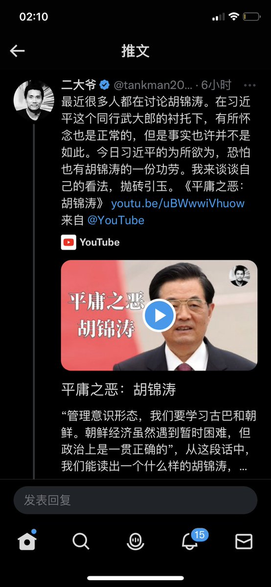
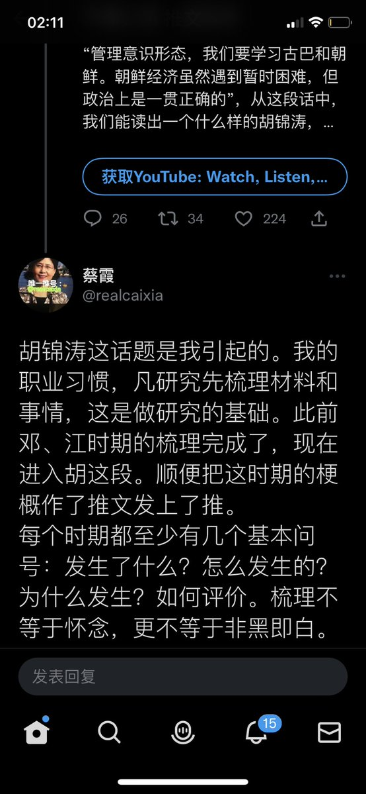
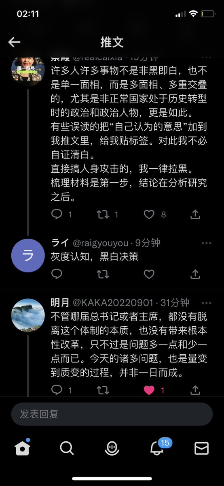
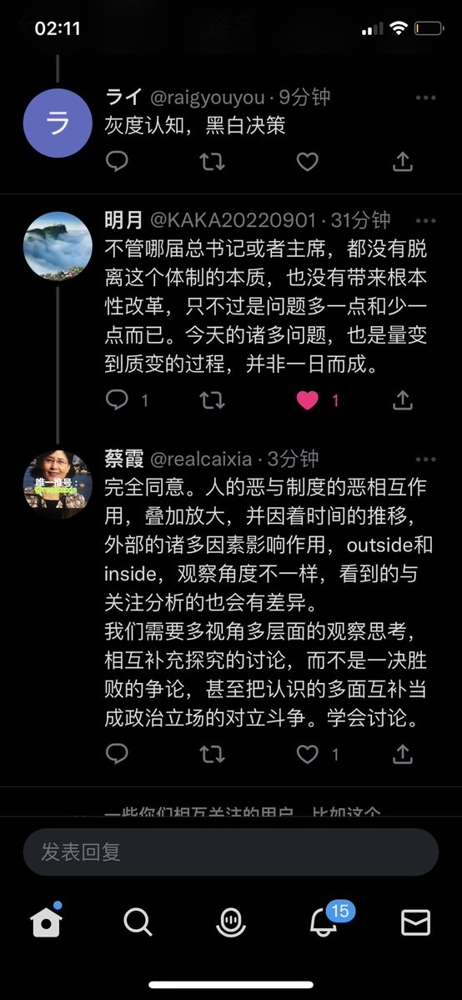
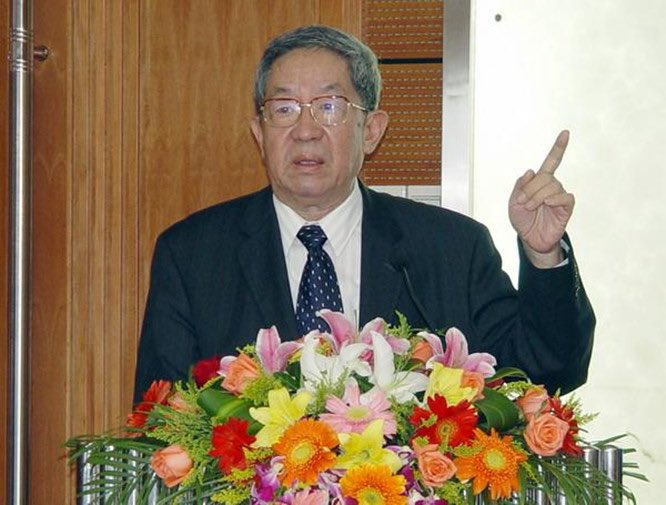

蔡霞 北京时间 2023-07-04T15:06:53Z 1676125412253114370 把这四个页面转推于此，是想面对复杂问题和认知差异时，大家平和讨论，而不是以辩论批斗来标示政治正确或政治罪错。

中共斗争哲学斗争思维毒害人心，清除极权思维方式的毒害影响，有助于共同推进中国民主宪政。
我和一些朋友曾在墙国里推介罗伯特议事规则一书，以学会开会，相信我们也可以学会讨论。 https://t.co/WEL9P1hbjz   蔡霞 北京时间 2023-07-04T09:52:29Z 1676046290617270272 一个北京就有25000个民警盯着市民谁在网上议论了习惶帝，就把谁找去喝茶训话。骂中共没事，就是不能提习惶帝。想起文革口号标语“誓死捍卫毛”，现在是誓死捍卫毛二翻版？   蔡霞 北京时间 2023-07-04T09:53:07Z 1676046450151784448 RT @Maoviews: 家父阎明复因病医治无效，于2023年7月3日10点19分溘然长逝，享年92岁。瞻望弗及，伫立哀泣，悲痛莫名。拟于近日择期恭行简仪，以志纪念。  
阎兰，石应瀚，牛牛泣告 https://t.co/fVQaCCZ4V4   蔡霞 北京时间 2023-07-04T09:57:25Z 1676047529899859969 RT @LiYuan6: 我也是这个感觉，好像比一两年前敢说多了   蔡霞 北京时间 2023-07-04T00:57:25Z 1675911637495332865 阎明复是中共党高层又一位有良知的人。哀悼！🥀
随着我对中共思考的逐步推进，得一认识：
党内顶层官员，凡是把民族前途命运放在首位的，到触及底线时都站在民众一边，都被中共党打击排挤迫害。凡是把中共统治权力放在首位的，到触及底线时就放弃改革，站在党一边。
这是中共党内最根本的政治分水岭。   蔡霞 北京时间 2023-07-04T01:35:46Z 1675921287317958656 我对中共党魁的区分，最根本最关键的是看他们各自的底线是什么。所以我的区分：
胡耀邦、赵紫阳、朱厚泽、徐勤先、阎明复是一类；
邓、江、胡是一类，只是邓更老辣；
毛、习是一类。   蔡霞 北京时间 2023-07-04T02:06:56Z 1675929131484323840 RT @realcaixia: @zhwilliam6 阎明复是中共中央书记处书记、中央统战部长，8964时他为学生向当局陈情，同时苦口婆心与学生对话。他做了大量的沟通协调，希望能避免军队开枪屠杀，但实际没用。
对统治者来说，只要把统治权位放在首位，必定会用最强硬手段毫不留情地…   