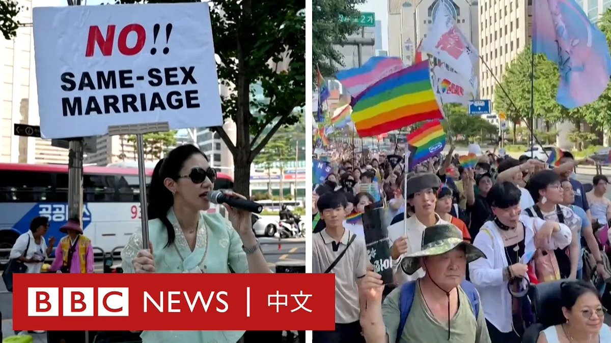
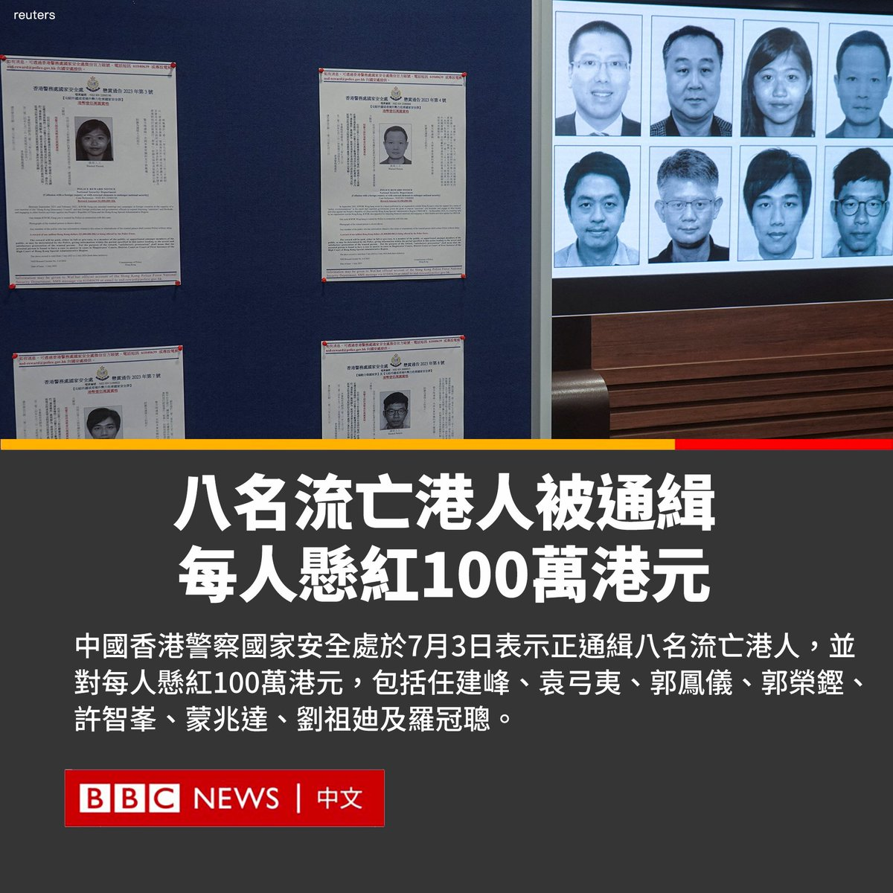
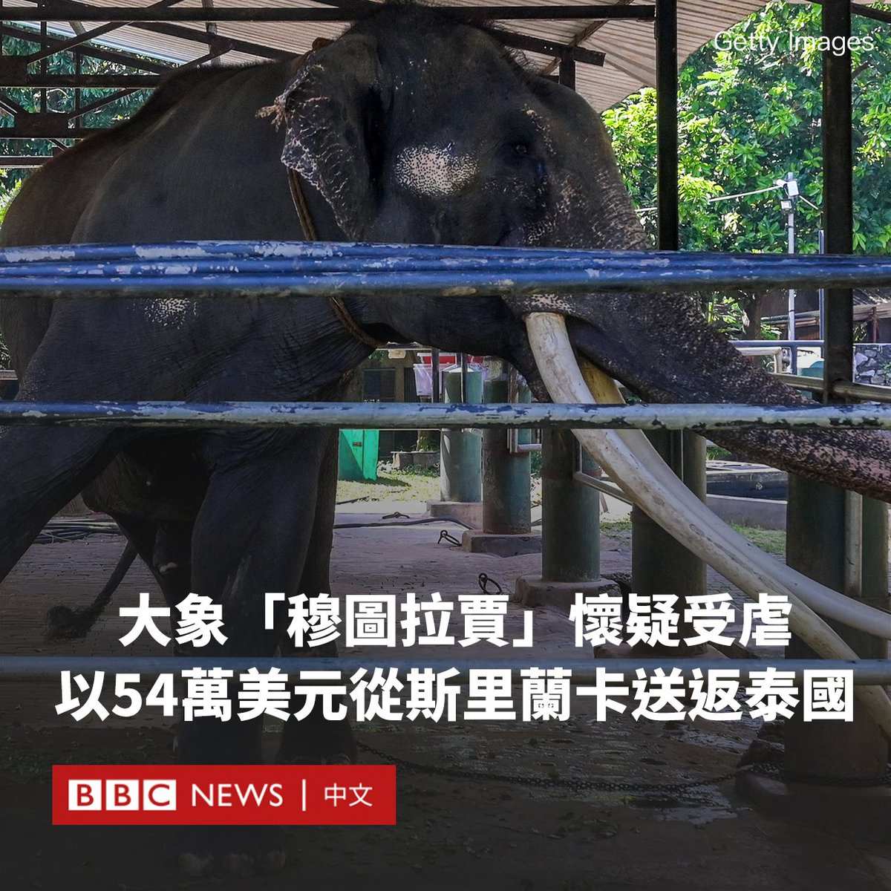
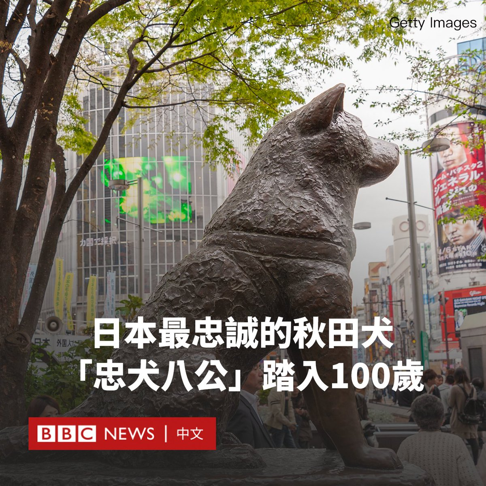

D英国广播公司BBC 北京时间 2023-07-03T21:01:03Z 1675852151115984896 韩国国家足球队队员孙准浩在中国涉嫌受贿被拘留调查以来，韩国各界以及国际足球界对事件持续关注。https://t.co/ZjON55ba52   D英国广播公司BBC 北京时间 2023-07-03T19:01:07Z 1675821970762391552 被警方撃毙的法国少年纳赫勒（Nahel）的一名亲属告诉BBC，他们不希望纳赫勒之死引发骚乱，但强调有关交警截停车辆时使用致命武器的法律必须改革。 https://t.co/kTUtoH4hyu   D英国广播公司BBC 北京时间 2023-07-03T20:01:07Z 1675837068876869633 首尔同志游行7月1日在反对者围绕下登场，尽管面临场地申请困难与反同声浪仍吸引数万人参与。

除疫情期间，首尔酷儿文化节从2015年起每年皆在市政府外举办。今年市政府拒绝同志游行的申请、把活动场地给公开反同的团体“CTS基督教电视”使用，引起关注。 https://t.co/z1W3ZCWLA3   D英国广播公司BBC 北京时间 2023-07-03T17:02:30Z 1675792117304573954 长期以来，这张三位犹太女孩逃离纳粹德国的照片成为一幅具有时代象征性的相片，80多年来，这三位女孩的身份一直是个谜，直到最近，谜底终于揭开。https://t.co/9Adq1LPwiG   D英国广播公司BBC 北京时间 2023-07-03T17:55:10Z 1675805374497329152 中国香港警察国家安全处于7月3日表示正通缉八名流亡港人，并对每人悬红100万港元（12.77万美元；397万元新台币）包括任建峰、袁弓夷、郭凤仪、郭荣铿、许智峯、蒙兆达、刘祖廸及罗冠聪。

八位分别被控涉嫌勾结外国或境外势力危害国家安全罪、涉嫌煽动分裂国家罪、煽动颠覆国家政权罪等。若他们被提上香港法庭受审并被判有罪，将面对最高无期徒刑。

国安处总警司李桂华指出，八位被通缉人士触犯十分严重的危害国家安全罪，他们亦鼓吹制裁，破坏香港及恐吓香港官员，有部分指明制裁法官检控官，以破坏行之有效、法官不受干预的制度；亦有人为外国出谋献策，以打击香港金融制度及金融中心地位。

高级警司洪毅表示，国安处已掌握上述八人触犯危害国家安全罪的证据，并向法庭申请拘捕令。他表示，必须防止有人利用不同途径，包括金融机构账户等，去协助上述八人继续危害国家安全。

中国全国人大常委会于2020年6月30日颁布《香港国安法》。李桂华表示，《香港国安法》实施三年来，警察至今拘捕260人，年龄介乎15至90岁，其中79人被法庭裁定有罪。   D英国广播公司BBC 北京时间 2023-07-03T15:34:04Z 1675769864802426880 【最新消息】中国香港警察国家安全处于7月3日下午举行记者招待会，国安处总警司李桂华及高级警司洪毅表示正通缉八名流亡港人，并对每人悬红100万港元（12.77万美元；92.62万元人民币）包括任建峰、袁弓夷、郭凤仪、郭荣铿、许智峯、蒙兆达、刘祖廸及罗冠聪。

李桂华表示，《香港国安法》实施三年，至今拘捕260人，年龄介乎15至90岁。   D英国广播公司BBC 北京时间 2023-07-03T14:17:12Z 1675750518076096513 泰国2001年赠送给斯里兰卡的大象，因涉嫌受虐待后引发外交纠纷，大象现已回到牠的出生地清迈。

名为穆图拉贾（Muthu Raja）的29岁大象于7月2日乘坐一架价值1900万泰铢（42.5万英镑；54万美元）的航班回到泰国。

泰国方面要求将该大象归还，称其在一个佛教寺庙中被虐待。斯里兰卡总理表示已正式向泰国国王道歉。

穆图拉贾重达4,000千克（8,800磅）的被装在一个特制的钢笼中，由四名泰国饲养员和一名斯里兰卡动物园管理员陪同，空运至清迈。

它将接受水疗，治疗其前左腿的伤势。

斯里兰卡和泰国都认为大象是神圣的动物。2001年，泰国皇室赠送三头大象给斯里兰卡政府，其中包括穆图拉贾，以便训练它们搬运宗教文物，穆图拉贾被寄养在南部一个寺庙里。

动物权利组织声称，它被迫与寺庙的伐木队一起工作，并称其因一处长期被忽视的伤势而令腿部出现了僵硬情况。

据法新社报道，去年11月，穆图拉贾在被从寺庙中移走时感到疼痛，并覆盖着脓疮。活动人士声称，牠的饲养员造成了其中一些伤口。

穆图拉贾后来被转移到斯里兰卡国家动物园，在最近几个月，大部分伤口已经愈合。   D英国广播公司BBC 北京时间 2023-07-03T12:10:15Z 1675718572256157696 电影《忠犬八公》海报上的中文标语已经道出了一切：“无论需要多久时间，我都会等你。”

这部电影讲述了一只秋田犬－忠犬八公（小八，Hachiko）站在东京涩谷车站前的真实故事。

牠每天陪伴主人前往涩谷车站，并等待他下班回来。当主人去世后，牠仍然每天前往车站等待主人的归来，即使主人再也没有回来过。

1923年出生的乳白色秋田犬Hachiko，从书籍、电影到科幻情景喜剧《飞出个未来》（Futurama），都在纪念牠。中国版电影《忠犬八公》，是继1987年的日本版和2009年的由理查德·基尔（Richard Gere）主演的版本后第三个版本，目前在票房上大获成功。

自1948年以来，Hachiko的铜像一直矗立在东京涩谷站外，牠在那里等待了一个十年。

这座铜像最初建于1934年，后来二战时被收回。日本学生被教导“忠犬八公”的故事，作为忠诚和信念的榜样。

夏威夷大学的克里斯汀·亚诺（Christine Yano ）教授表示，Hachiko以其“无可挑剔的奉献精神”代表着“理想的日本公民”， 成为了忠诚和献身的象征。

Hachiko的故事在日本和全世界都广为人知。秋田犬以其沉静、聪明、勇敢的个性以及对主人的忠诚而闻名。

1923年11月Hachiko出生后由东京大学农学部教授上野英三郎领养，Hachiko每天陪他到涩谷车站上班，下课时再到车站等上野教授回来，一起走回家。

1925年上野教授突然去世，Hachiko在车站等候了三天三夜，后来虽有人领养，但牠依旧每天前往车站，等候主人回来。

1935年，Hachiko去世的消息登上了许多报纸头版，人们将牠的遗体安葬在青山灵园里，与上野教授长眠樱花树下。   