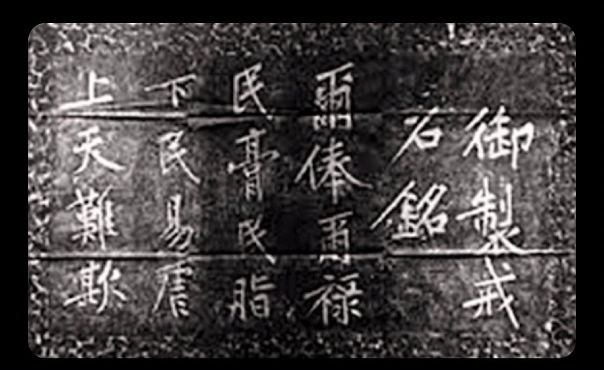

Ivy未央 北京时间 2023-07-03T08:33:57Z 1675664136007557121 转）一千年前，宋太祖赵匡胤认为，是民养了
官，是官吃了民的饭。那个时候，
•每个衙门门口
都要立一块石碑，上书十六个大字：“尔棒尔禄，民脂民膏。下民易虐，上天难欺！”
一千年后，有人说：“我们养活了十几亿人，解決了他们的吃饭问题”
o
一千年后说这话的人是有多不要脸啊？ https://t.co/0IXgnnaGkN   