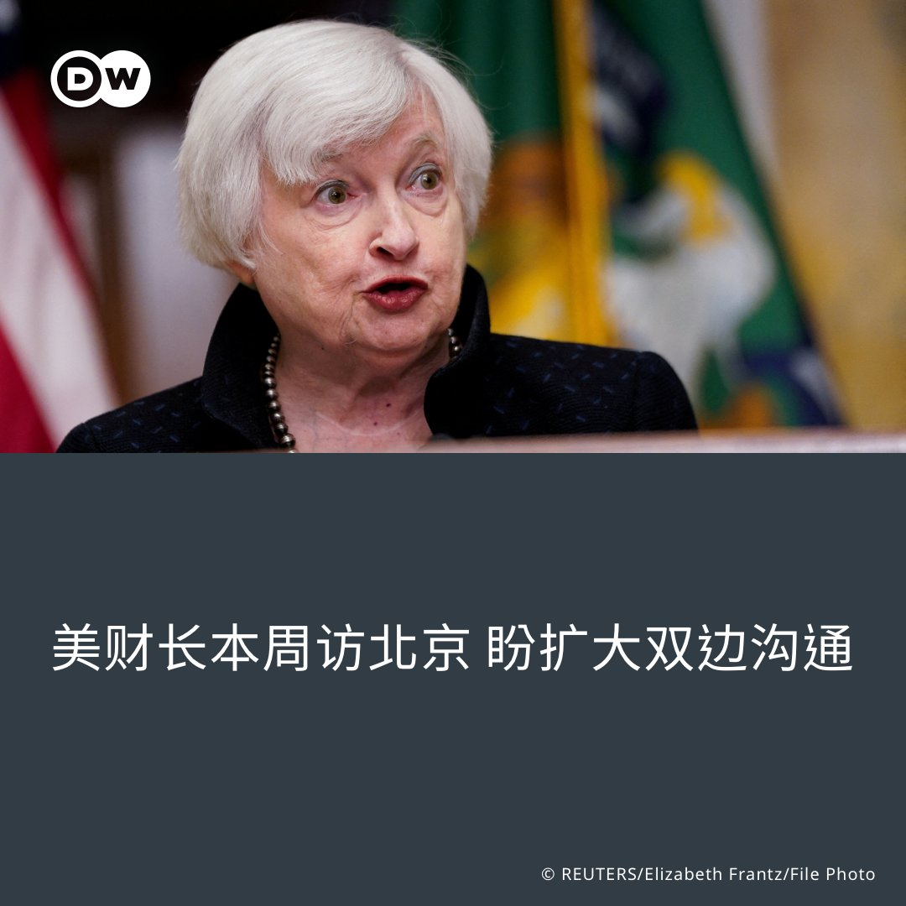

德国之声 北京时间 2023-07-03T23:07:00Z 1675883847232241664 《新苏黎世报》驻华记者讲述了他作为外国记者在中国屡次被初见面的人询问是不是间谍的经历，以及中国新通过的 #反间谍法 对媒体工作可能的影响。

作者写道，当他不断受到中国人怀疑他是间谍的时候，他每次都问对方，为什么会这么想。他才发现，他们是认真的。

https://t.co/mXXqyNtOfN   德国之声 北京时间 2023-07-03T20:55:00Z 1675850628369903620 中国官方媒体 #新华社 上周引述英国慈善机构 #特拉塞尔基金会 发布的一份调查报告报道称，去年约 #七分之一 的英国人因缺钱💸面臨饥饿困扰。这一报道在社交媒体上遭到大量中国网民的嘲讽和调侃。

“谁惹我们，谁就吃不饱。”
“全世界有几个国家能吃饱了？只有我们能吃得饱！”

https://t.co/ovfwJDain9   德国之声 北京时间 2023-07-03T21:29:00Z 1675859184573882370 香港警方7月3日宣布以涉嫌违反港区 #国安法 为名，通缉8名流亡海外的香港🇭🇰民主活动人士，每人悬赏100万港元。

8位遭通缉者分别为罗冠聪、许智峰、郭荣铿、蒙兆达、任建峰、袁弓夷、郭凤仪和刘祖迪，香港国安处称这8名人士「犯了严重的危害国家安全罪」。

https://t.co/ovfwJDain9 https://t.co/boAxEbWORY   德国之声 北京时间 2023-07-03T22:11:00Z 1675869754362396672 评论作者邓聿文认为，中国大概认为自己是美国 #长臂管辖 的“最大受害者”，尤其中美对抗的背景下。既然无法改变美国的“长臂管辖”，何不 #以其人之道还其人之身，也对认为违反中国利益的国家的企业和个人，祭出中国版的“长臂管辖”。

https://t.co/yLArYjC3xb   德国之声 北京时间 2023-07-03T18:46:00Z 1675818164356096002 周日到周一夜间，#法国 警方逮捕人数明显减少。上周被警察打死的17岁少年的祖母呼吁停止暴力，称暴力破坏者只是使用这件事作借口。周末，巴黎近郊一位市长的住家受到纵火攻击，其妻子和孩子被迫逃生并受伤。

https://t.co/HhBJ0N5shM   德国之声 北京时间 2023-07-03T19:24:00Z 1675827727272935425 最近，德国右翼民粹政党AfD相继在德东两次赢得了县长和市长选举，该党支持率超过肖尔茨总理的社民党。它会在德国联邦层面执政吗？ https://t.co/JJI6TDkW8n   德国之声 北京时间 2023-07-03T20:07:00Z 1675838548786675713 越南媒体报导，越南🇻🇳政府以”出现具争议的 #九段线 地图”为由，禁止电影《芭比》在越南上映。该国电影局局长Vi Kien Thanh对此表示：”我们不允许《芭比》在越南上映，因为它包含了九段线的违规画面”。九段线是中国在 #南海 所主张的海域归属范围线，中越两国时常因为该地区的主权归属问题发生摩擦。 https://t.co/b9GdDYcCNL   德国之声 北京时间 2023-07-03T17:21:15Z 1675796835976327169 美国科技品牌苹果公司 @Apple 近日股价表现亮眼，上周五（6月30日）苹果股价突破了190美元，成了全球首家市值超过3万亿美元的公司。若将此数字与世界各国的GDP相比，约等于 #英国2022年的GDP——3.07万亿美元，仅次于美国、中国、日本、德国和印度。 https://t.co/jWtharREUf   德国之声 北京时间 2023-07-03T15:30:00Z 1675768840217841664 美国财政部长 #耶伦 的北京之行即将于7月6日登场，消息指她将会晤中国副总理 #何立峰。据美国官员说法，美方不寻求与中国 #脱钩，但会向中国表明，美国将继续与盟友共同应对中国的 #经济胁迫 举动，并针对《#反间谍法》等议题向中方表达疑虑。
详细报导👉https://t.co/TOInpNUgHM https://t.co/0aVDnxuZCF   德国之声 北京时间 2023-07-03T10:30:00Z 1675693344071057434 #法国 民众因不满一名 #17岁少年 遭警察枪杀，暴力抗议已达数日。🇫🇷 被害少年的祖母首度出面敦促骚乱者停止"砸毁橱窗、攻击学校或公车"；与此同时，#德国总理肖尔茨 也表示正谨慎观察局势。

请见DW整理的最新资讯: https://t.co/12gaYLTQF0   德国之声 北京时间 2023-07-03T09:45:48Z 1675682218331754496 全球超过50个与港人相关的人权团体联合致函 #拜登，要求 #美国 应明确表态不会让香港特首 #李家超 到美国参加 #APEC峰会，否则"将设下令人忧虑的先例"。此前，美国两党议员亦曾表示反对李家超赴美。
详细报导👉https://t.co/DroJ9E9pie https://t.co/2hDaNbhUQz   德国之声 北京时间 2023-07-03T00:30:00Z 1675542347881541633 “标准的”德国长什么样？他们每天几点起床？怎样早餐？跟邻居经常打招呼吗？ 快来看看这个影片！ https://t.co/DGz47NFyt0   德国之声 北京时间 2023-07-03T00:03:09Z 1675535592392736772 一段时间以来，#去风险 、#供应链多样化 成为德国对华关系中的关键词。然而德国工商大会的一项最新调查显示，海外德企在多样化方面遇到重大困难 https://t.co/N93JEBpuLm   