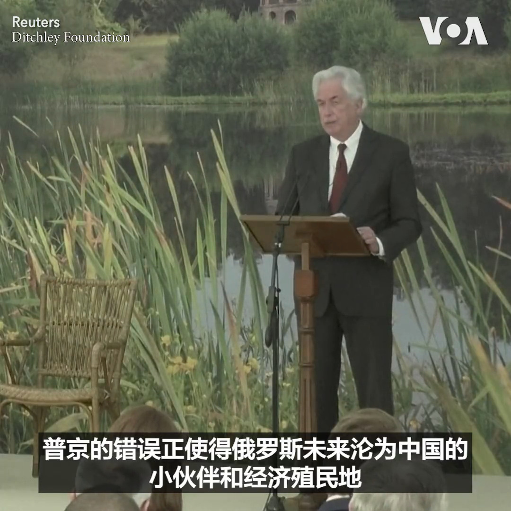

美国之音中文网 北京时间 2023-07-03T05:15:03Z 1675614084614737925 乌克兰防空系统击退夜间无人机袭击 https://t.co/D1ROjYOyoj   美国之音中文网 北京时间 2023-07-03T05:31:06Z 1675618124190846977 “709人权律师奖”宣布本年度得主名单 https://t.co/0rIXDFgrx5   美国之音中文网 北京时间 2023-07-03T03:36:45Z 1675589345191899137 法国总统马克龙2日在巴黎召集特别安全会议，讨论警方射杀17岁的少年纳赫尔引发的抗议和骚乱局势。马克龙还推迟了他本来计划从2日开始对德国的访问。 https://t.co/nyhmS3AFHG   美国之音中文网 北京时间 2023-07-03T00:47:03Z 1675546639136858112 新西兰总理访中会习近平 学者: 恐成印太战略的弱点 https://t.co/VgC913osRj   美国之音中文网 北京时间 2023-07-03T01:01:10Z 1675550192417009664 美国中央情报局局长威廉·伯恩斯1日在英国的一次演讲中表示俄罗斯侵略构成了严重挑战，但中国是唯一的一个有意图要重塑国际秩序，又具备日益增长的实力来重塑国际秩序的国家。伯恩斯表示瓦格纳雇佣军领导人普里戈津的兵变显示出普京对俄罗斯造成的损害。 
报道：https://t.co/XiWJJgAWXD https://t.co/UxTMRg8eCJ   美国之音中文网 北京时间 2023-07-03T01:36:03Z 1675558969895534592 英国多个城市的香港人1日举行示威活动。香港人组织在雪埠(Sheffield又译谢菲尔德)发起游行抗议《香港国安法》，有自称中国留学生的人拉扯示威者手上的旗帜，警方介入事件隔开双方。主办游行的Re-Water组织的视频显示华人男子表示不满示威者指“香港不是中国”。 另有两名说普通话的男子挑衅游行的港人。 https://t.co/9t24ZIUopG   美国之音中文网 北京时间 2023-07-03T01:45:04Z 1675561237185466368 韩国总统促统一部做出改变不再做朝鲜后援部 https://t.co/puiMOYPzEg   美国之音中文网 北京时间 2023-07-03T00:20:07Z 1675539862861262850 北京有意疏美，派军事代表团访问英法 https://t.co/FXRad7Z5QU   