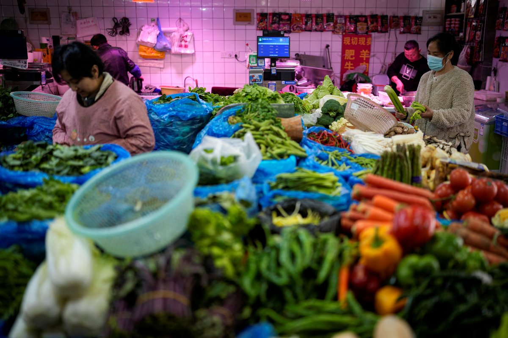
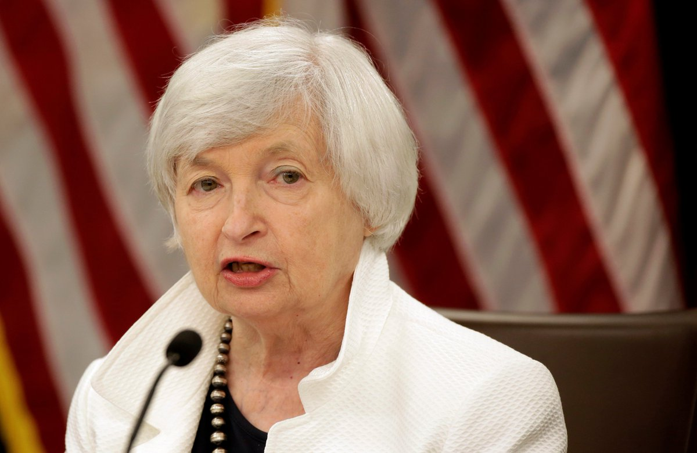
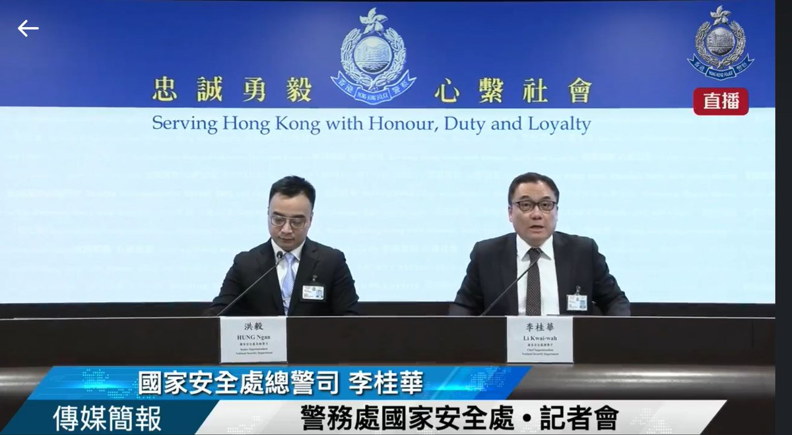

自由亚洲电台 北京时间 2023-07-03T22:47:56Z 1675879048151728128 业内人士说，在建筑行业的黄金时代，由于项目很多，设计院处于绝对优势地位。项目的设计费用在当时的工资水平来说是非常可观的。然而随着房地产市场快速萎缩，上海不再兴建大型项目。有分析称，在5到10年内，与建筑有关的企业将因此关闭。

https://t.co/nN0kbvDEvi   自由亚洲电台 北京时间 2023-07-03T23:24:01Z 1675888128786333699 #宋永毅：“实际上，他（毛泽东）在水里是泡着不动，因为他比较肥，所以他有浮力。所谓畅游长江都是写出来的，周围有十几个游泳好手就在长江里跟着水漂流。他自己说的，跟着水漂流。”
#千人横渡赣江

https://t.co/hN9TW4uQgE   自由亚洲电台 北京时间 2023-07-03T22:00:31Z 1675867116686446593 7月1日是中共建党102周年，6月30日，中共中央机关刊物《#求是》刊登“努力成长为对党和人民忠诚可靠、堪当时代重任的栋梁之才”文章，并注明这是去年3月1日 #习近平 在中央党校青年干部培训班开课发表谈话全文。
为何此时旧文重发，请分享高见。
https://t.co/UGysAikZXo   自由亚洲电台 北京时间 2023-07-03T17:28:12Z 1675798585697517568 【村镇银行受害储户再次维权】
【逾一年拿不回钱储户激动抗议】
7月2日，#河南、#安徽 的 #村镇银行 受害储户再次聚集维权讨存款。
去年4月，安徽2家村镇银行和河南4家村镇银行同时爆雷，近40万储户的存款被非法冻结。
7月2日，受害储户在河南开封一座天桥上拉横幅、喊口号。约50名河南、安徽村镇银行储户，要求河南省联社兑付他们的活期存款。   自由亚洲电台 北京时间 2023-07-03T17:59:44Z 1675806521320685568 【河南菜贩售不合格蔬菜遭罚11万元】
【法院裁定不予批准】
河南洛阳一名菜贩因销售 #不合格蔬菜 被 #罚款11万 元人民币。行政机关向法院申请强制执行，但法院裁定不批准。观察人士认为，虽然中国国务院加强监督，但未能有效遏制部分地方政府 #罚款创收 的歪风。
https://t.co/d7T45TCelq
（路透资料照）   自由亚洲电台 北京时间 2023-07-03T15:50:37Z 1675774028966150145 【美财长耶伦将访华促经贸合作】
【中方盼美撤销 #高关税】
美国财政部部长 #耶伦（Janet Yellen）将于本周四访问中国，她本人也曾表示，希望与北京重新建立经贸联系。中方则盼望美国取消对华加征 #关税、撤销“301”调查。学者认为，美中两国财长本次会晤有助于缓和两国紧张局势，建立新的沟通渠道，但各方均不会作出较大让步。
https://t.co/MggY3w1MLP   自由亚洲电台 北京时间 2023-07-03T16:05:03Z 1675777659689922560 香港国安处周一宣布通缉8名在海外的港人，包括  #任建峰、#袁弓夷、#郭凤仪、#郭荣铿、#许智峯、#蒙兆达、#刘祖廸 及 #罗冠聪，悬赏每人100万港元，追究在境外违反《国安法》人士。他们分别被指涉及香港《国安法》下，颠覆国家政权、勾结境外和外国势力危害国家安全等。

国安处总警司李桂华形容，被通缉人士为“反中乱港分子“，逃往海外后，继续进行危害国家安全的行为，强调《#香港国安法》有 #域外执法权，虽然国安警只能在被通缉者返港，才会进行拘捕行动，但不等于国安警会放弃会缉捕和搜证的工作，国安警会继续追究，有机会一定会把相关人士送上法庭。

他又说，《香港国安法》实施3年，至今拘捕260人，年龄介乎15至90岁。
(香港警务处直播截图）   自由亚洲电台 北京时间 2023-07-03T10:23:46Z 1675691774025809921 据中国官媒新华社6月底报道，中国之外的首个 #习近平思想 研究机构在俄罗斯成立，俄文全称为“#中国当代意识形态和习近平思想研究室”，由俄著名智库、俄科学院中国与现代亚洲研究所建立，旨在系统研究习近平新时代中国特色社会主义思想。

https://t.co/AD3j0q6Vmn   自由亚洲电台 北京时间 2023-07-03T07:18:09Z 1675645060602531840 今年迄今为止，33%的长期液化 #天然气 交易量都流向了中国，中国有望在2023年成为全球最大的液化天然气进口国。
https://t.co/TrI76HZ2gQ   自由亚洲电台 北京时间 2023-07-03T08:54:28Z 1675669300441391106 RT @RFA_Chinese: 【诚征受访者：35岁求职嫌你老？】
中国的招聘信息中，时常只招募35岁以下的年轻人，”35”岁彷彿成了魔咒数字，成为投身劳动市场的无形限制。本台想徵集35岁左右、因为年龄限制而就业受阻的青年，欢迎在评论区留言，或电邮fankui@rfa.org…   自由亚洲电台 北京时间 2023-07-03T09:15:59Z 1675674716584165378 港要求 #谷歌 下架《#愿荣光归香港》 谷歌：拿法院手令来
谷歌和港府，已就此事过招几个回合了。
https://t.co/sR2YxP2N0F   自由亚洲电台 北京时间 2023-07-03T03:14:52Z 1675583838804938752 据美国媒体《政客》网站报道，俄亥俄州共和党参议员范斯（J.D. Vance）周日在接受全国广播公司（NBC）采访时说，如果 #中国 不停止向 #墨西哥 和 #美国 的入境口岸发送制作毒品 #芬太尼 的前化学品，美国应对中国进行严厉的经济惩罚。

https://t.co/u0KlaF2Cuv   自由亚洲电台 北京时间 2023-07-03T04:15:41Z 1675599144071884801 中国国防部周六（7月1日）通过官方微信公号发文称，解放军防务战略磋商代表团从6月24日到7月1日，对英国和法国展开了为期八天的访问。双方重点就发展双边防务关系进行商讨，围绕共同关心的国际和地区安全问题深入交换意见，增进了双方了解和互信。

https://t.co/6Ow1IZHa4L   自由亚洲电台 北京时间 2023-07-03T01:37:05Z 1675559230105853952 RT @RFA_Chinese: 【谢锋向拜登递交国书 没穿西装有何深意？ 】
美国总统 #拜登 6月30日在白宫接受中国新任驻美大使 #谢锋 递交的国书，并就中美关系进行交谈。
谢锋着改良唐装，夫人穿旗袍，推特网民议论纷纷。
（图片来自中国驻美国大使馆网站）
https://…   自由亚洲电台 北京时间 2023-07-03T01:37:21Z 1675559295209857026 RT @RFA_Chinese: 【日本记者入境香港被拒  #香港新闻自由 已死？】

港区国安法实施3周年，曾在反送中运动期间赴香港采访并出版“香港示威战记”一书的日本记者 #小川善照，于29日入境香港被拒，30日遭遣返。在日港人团体批评，此举表明香港新闻自由已消失。… ht…   自由亚洲电台 北京时间 2023-07-03T01:37:26Z 1675559316227538945 RT @RFA_Chinese: #七一 #香港主权移交 26周年，在台港人以"#没有欢乐只有伤痛"为主题，自发举办哀悼会，悼念已逝的自由香港，以及数名反送中运动有关的逝者。
主办者在“自由广场”牌匾下，摆放数名与反送中运动相关的逝者画像，播放 #反送中 时流行的音乐和讲述逝者…   自由亚洲电台 北京时间 2023-07-03T01:37:35Z 1675559356601888768 RT @RFA_Chinese: 【#瓦格纳兵变 中国延后表态显示对 #普京 的动摇】
【征战不利反噬权位 #习近平 三思 #武统台湾 反作用力】
完整视频 https://t.co/KfXApjjndp https://t.co/ShxV7XJ3wU   自由亚洲电台 北京时间 2023-07-03T01:37:52Z 1675559427401736192 RT @RFA_Chinese: 【这届网民不好忽悠  #希音 找美国网红行销适得其反】
快时尚品牌希音（#Shein）最近邀请几名美国 #网红 赴中国旅游，参观其工厂和物流中心，并与工人们见面，以消除外界对其使用 #强迫劳动 等问题的疑虑，结果却是舆论大翻车。
https:/…   自由亚洲电台 北京时间 2023-07-03T01:38:19Z 1675559539825860608 RT @RFA_Chinese: #胡锡进 6月27日高调宣布进入中国股市，三天来每天在微博更新盈亏动态，成为股民和网民热议话题，各大平台关注，多次上热搜。
第三天，老胡说：“我的整个仓绿了，从昨天盈利200多元变成上午倒亏300几十元”，于是又转了10万进去。
你觉得胡锡进炒…   自由亚洲电台 北京时间 2023-07-03T01:38:32Z 1675559594716807168 RT @RFA_Chinese: 美国、中国，谁是世界第一经济强国？6月27日，皮尤发布一份新调查报告显示，在其调查的全球23个国家当中，中位数为41%的民众站美国，33%受访者选中国。您认为，谁才是世界领先的经济大国？ https://t.co/j7XwjfdZMB   自由亚洲电台 北京时间 2023-07-03T01:38:51Z 1675559673955594241 RT @RFA_Chinese: 【美国会军委会主席等9人访团晋见蔡英文】
【罗杰斯：台美共通价值深化友谊】
美国联邦 #众议院军事委员会 主席 #罗杰斯（Mike Rogers）等9名跨党派国会议员访台，台湾外交部表示，这是近年最大规模美国会议员访台。#蔡英文… https:…   自由亚洲电台 北京时间 2023-07-03T01:39:06Z 1675559736484274176 RT @RFA_Chinese: 【“数据控”习近平对世界意味着什么？】
美国胡佛研究所近日发表报告指出，中共总书记 #习近平 对网路 #大数据 的经济和社会影响力“近乎痴迷”，他统治下的中国党国体系，正试图通过企业扩张，将世界各地的海量数据引向中国，以提高中国的情报搜集和操控…   自由亚洲电台 北京时间 2023-07-03T01:39:29Z 1675559834500857857 RT @RFA_Chinese: 近日，赣州市人大常委会机关出台文件，加强对离退休干部因私出国的管理。

老干部润出中国现象引发网友强烈质疑：他们为何放弃国内优厚待遇，老来远走他国？在美加等发达国家，生活成本远超国内，他们哪来那么多钱？有网友建议剥夺出国养老离退休人员的退休福利…   