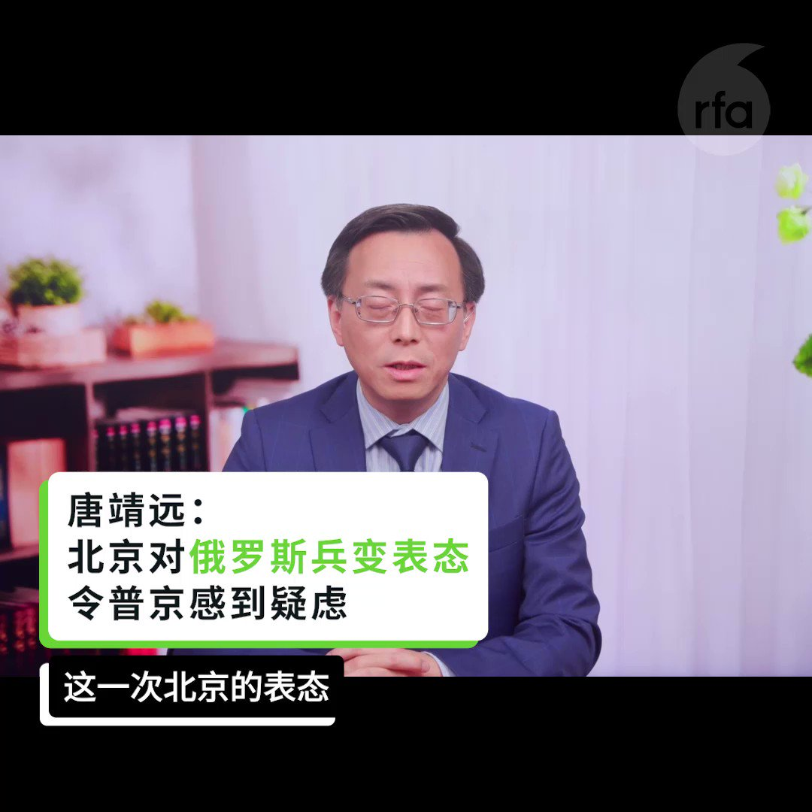

自由亚洲电台 北京时间 2023-07-03T01:37:26Z 1675559316227538945 RT @RFA_Chinese: #七一 #香港主权移交 26周年，在台港人以"#没有欢乐只有伤痛"为主题，自发举办哀悼会，悼念已逝的自由香港，以及数名反送中运动有关的逝者。
主办者在“自由广场”牌匾下，摆放数名与反送中运动相关的逝者画像，播放 #反送中 时流行的音乐和讲述逝者…   自由亚洲电台 北京时间 2023-07-03T01:37:35Z 1675559356601888768 RT @RFA_Chinese: 【#瓦格纳兵变 中国延后表态显示对 #普京 的动摇】
【征战不利反噬权位 #习近平 三思 #武统台湾 反作用力】
完整视频 https://t.co/KfXApjjndp https://t.co/ShxV7XJ3wU   自由亚洲电台 北京时间 2023-07-03T01:37:52Z 1675559427401736192 RT @RFA_Chinese: 【这届网民不好忽悠  #希音 找美国网红行销适得其反】
快时尚品牌希音（#Shein）最近邀请几名美国 #网红 赴中国旅游，参观其工厂和物流中心，并与工人们见面，以消除外界对其使用 #强迫劳动 等问题的疑虑，结果却是舆论大翻车。
https:/…   自由亚洲电台 北京时间 2023-07-03T01:38:19Z 1675559539825860608 RT @RFA_Chinese: #胡锡进 6月27日高调宣布进入中国股市，三天来每天在微博更新盈亏动态，成为股民和网民热议话题，各大平台关注，多次上热搜。
第三天，老胡说：“我的整个仓绿了，从昨天盈利200多元变成上午倒亏300几十元”，于是又转了10万进去。
你觉得胡锡进炒…   自由亚洲电台 北京时间 2023-07-03T01:38:32Z 1675559594716807168 RT @RFA_Chinese: 美国、中国，谁是世界第一经济强国？6月27日，皮尤发布一份新调查报告显示，在其调查的全球23个国家当中，中位数为41%的民众站美国，33%受访者选中国。您认为，谁才是世界领先的经济大国？ https://t.co/j7XwjfdZMB   自由亚洲电台 北京时间 2023-07-03T01:38:51Z 1675559673955594241 RT @RFA_Chinese: 【美国会军委会主席等9人访团晋见蔡英文】
【罗杰斯：台美共通价值深化友谊】
美国联邦 #众议院军事委员会 主席 #罗杰斯（Mike Rogers）等9名跨党派国会议员访台，台湾外交部表示，这是近年最大规模美国会议员访台。#蔡英文… https:…   自由亚洲电台 北京时间 2023-07-03T01:39:06Z 1675559736484274176 RT @RFA_Chinese: 【“数据控”习近平对世界意味着什么？】
美国胡佛研究所近日发表报告指出，中共总书记 #习近平 对网路 #大数据 的经济和社会影响力“近乎痴迷”，他统治下的中国党国体系，正试图通过企业扩张，将世界各地的海量数据引向中国，以提高中国的情报搜集和操控…   自由亚洲电台 北京时间 2023-07-03T01:39:29Z 1675559834500857857 RT @RFA_Chinese: 近日，赣州市人大常委会机关出台文件，加强对离退休干部因私出国的管理。

老干部润出中国现象引发网友强烈质疑：他们为何放弃国内优厚待遇，老来远走他国？在美加等发达国家，生活成本远超国内，他们哪来那么多钱？有网友建议剥夺出国养老离退休人员的退休福利…   