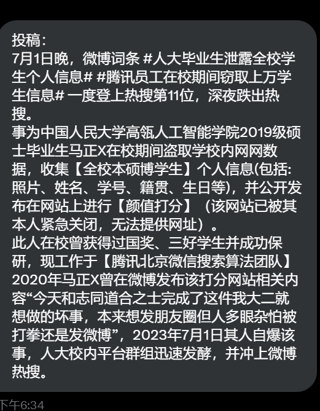

A李老师不是你老师 北京时间 2023-07-02T05:55:59Z 1675261997200420865 https://t.co/HmrJw75NdZ   A李老师不是你老师 北京时间 2023-07-02T02:54:46Z 1675216389836091393 网友投稿：
【中国人民大学一学生盗取全校学生数据建立颜值打分系统，现工作于腾讯微信团队】
 7月1日晚，网传中国人民大学高瓴人工智能学院2019级硕士毕业生马某在校期间盗取学校内网网数据，收集【全校本硕博学生】个人信息(包括:照片、姓名、学号、籍贯、生日等)，并公开发布在网站上进行【颜值打分】（该网站已被其本人紧急关闭，无法提供网址）。 
据悉，此人在校曾获得过国奖、三好学生并成功保研，现工作于【腾讯北京微信搜索算法团队】 2020年马曾在微博发布该打分网站相关内容“今天和志同道合之士完成了这件我大二就想做的坏事，本来想发朋友圈但人多眼杂怕被打拳还是发微博”
2023年7月1日其人自爆该事，人大校内平台群组迅速发酵，并冲上微博热搜。   A李老师不是你老师 北京时间 2023-07-02T01:10:29Z 1675190150081531907 马斯克宣布为推特加入“防沉迷系统”😄   A李老师不是你老师 北京时间 2023-07-02T01:58:35Z 1675202252846292998 网友投稿
【当北京成为三和】
7月1日，一名微博博主放出一则在北京马驹桥劳务市场的现场采访实录，一名务工人员讲述了当下的务工人员所面临的困境。
大量务工人员聚集在北京马驹桥附近寻找工作机会，现在是“人多活少”，一天装卸12小时仅收入160元，但是依然应聘者络绎不绝，“给钱就去”。年龄40岁以上已经很难找到工作，很多人连一晚20块的通铺都睡不起，转而睡在大街公园里，导致床位价格都下跌了。   