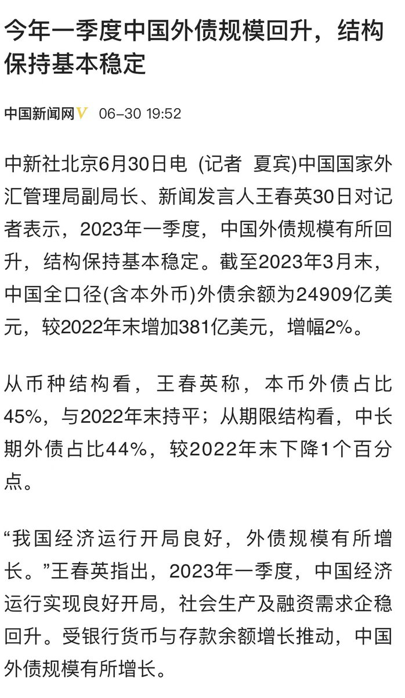

Petrichor 北京时间 2023-07-02T01:17:03Z 1675191799554375680 “No Black person will be able to succeed in a merit-based system”(没有任何一个黑人能够在择优录取的制度中取得成功)。说这样话的人，名义上维护黑人权益，实际在内心里对非裔有着根深蒂固的种族歧视的，认为黑人天生的愚笨。华人一定跳出肤色的坑，秉持Colorblind的宪法原则，而并非种族的利益。 https://t.co/Oo6yXrXJ6b   Petrichor 北京时间 2023-07-02T01:29:02Z 1675194817159077888 把债务增加说得如此可喜可贺，绝对是人才。 https://t.co/mJi6YBhEVX   