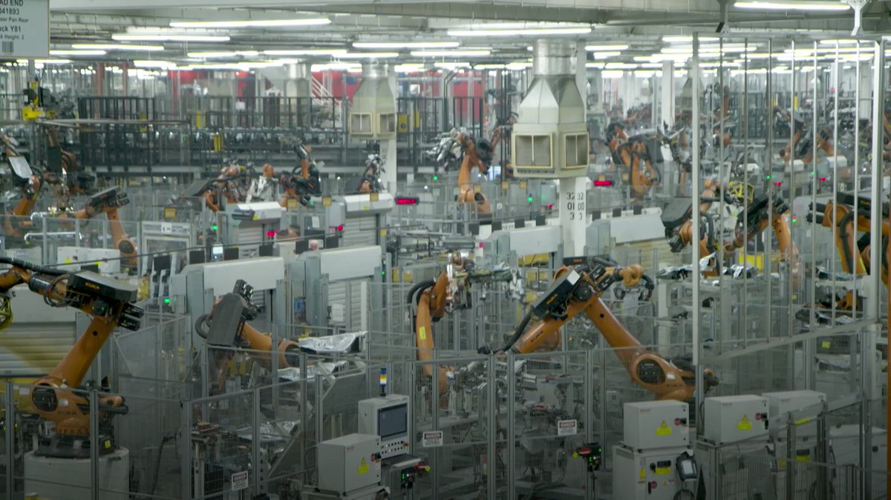

德国之声 北京时间 2023-07-02T07:09:00Z 1675280370462498816 斥了 #17亿美元💰💰💰💰💰 巨资 德国汽车🚘制造商 #宝马 在美国南卡罗来纳州打造的 #电动车厂 长什么样？#dwbusiness https://t.co/MbCtW9hshN   德国之声 北京时间 2023-07-02T08:00:00Z 1675293206920171525 德企高管伍德克前前后后在中国生活了约30年，曾亲手参与组建驻华德国商会以及欧盟商会。不久前，他刚刚卸任欧盟商会主席一职。在接受德国之声专访时，伍德克表示，中国已经不再是邓小平时代的开放国度了。 https://t.co/h1oNoWZas3   德国之声 北京时间 2023-07-02T05:59:00Z 1675262754448371712 《法兰克福汇报》认为，鉴于中国在许多方面依然有求于德国，柏林在面对北京时不必太卑躬屈膝。《新苏黎世报》则注意到美国与印度加强合作，以抗衡共同的对手中国，但是这一利益共同体注定会因为缺乏共同价值观而难以长远深化。 https://t.co/SCNCj5fJsV   