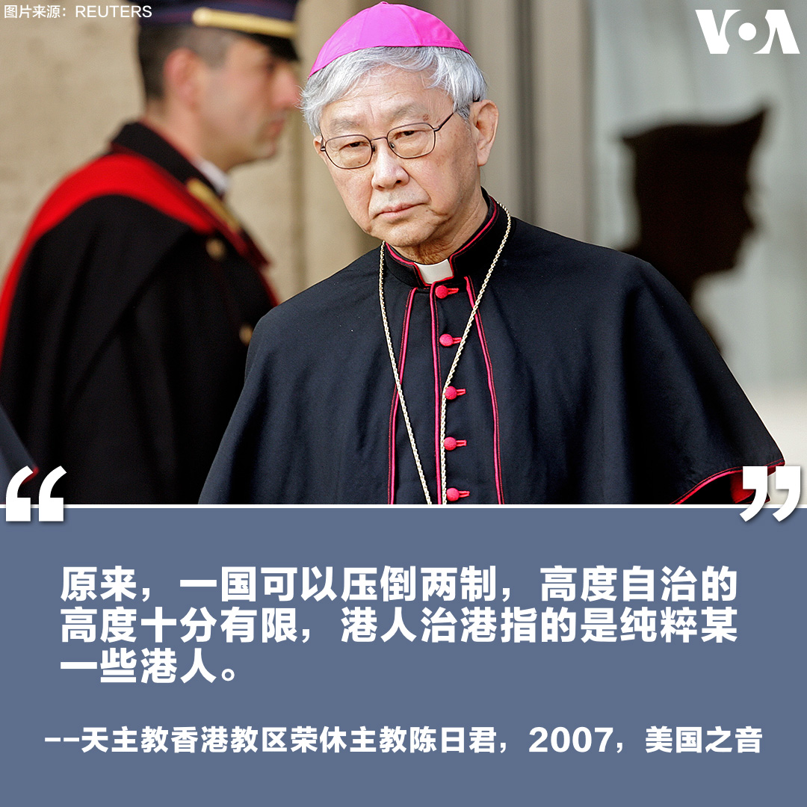
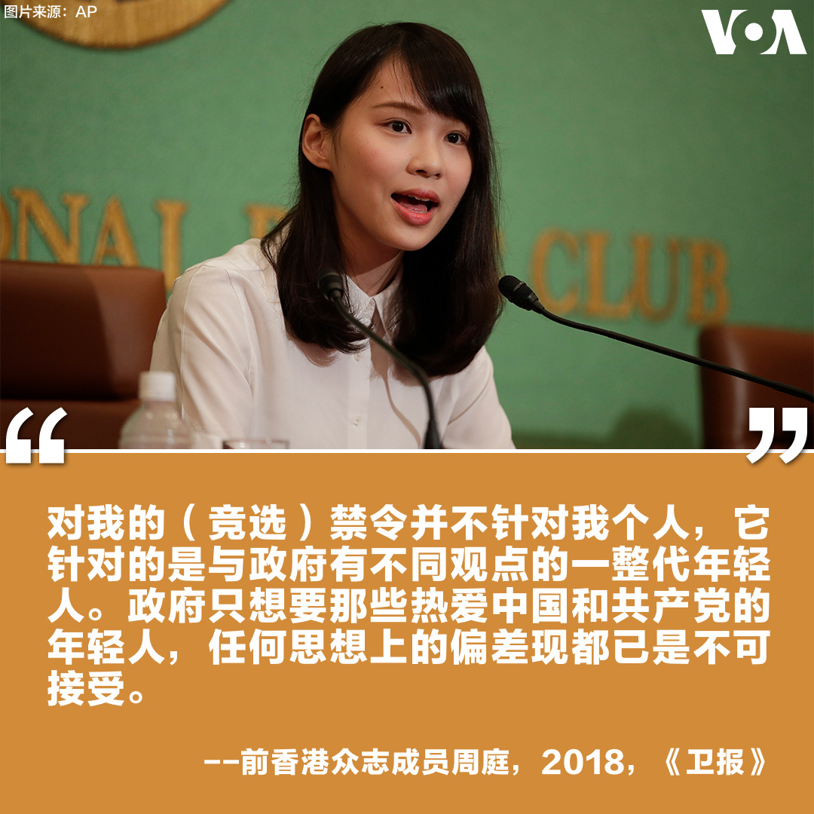
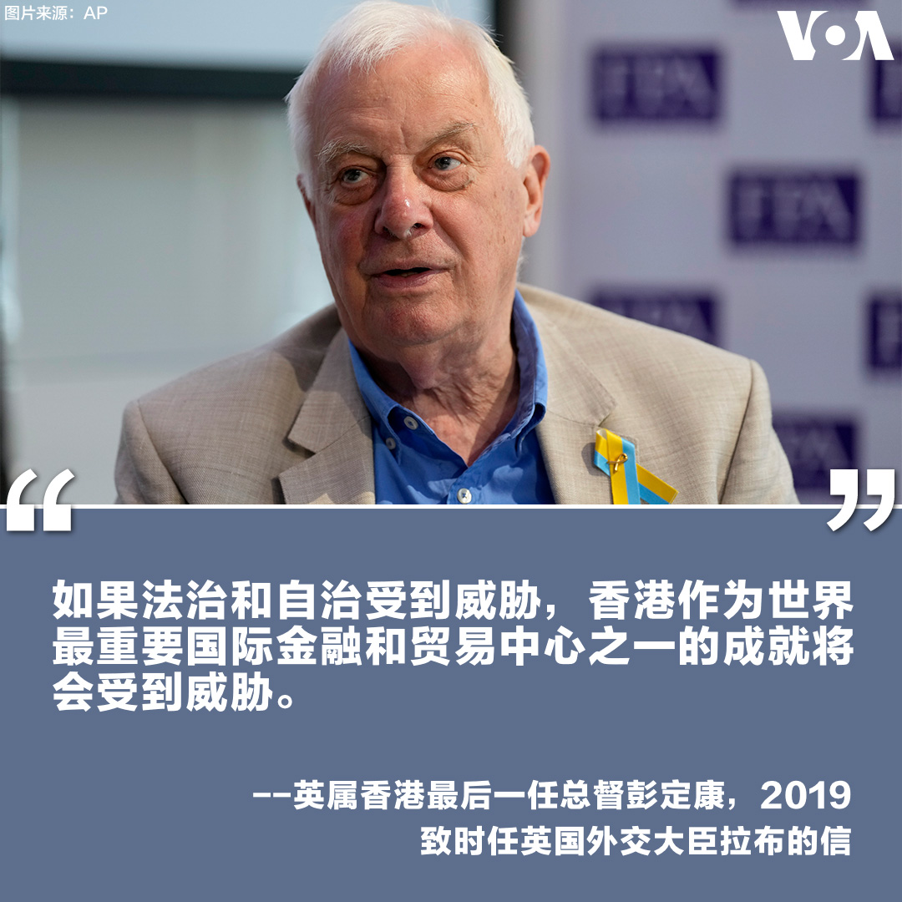
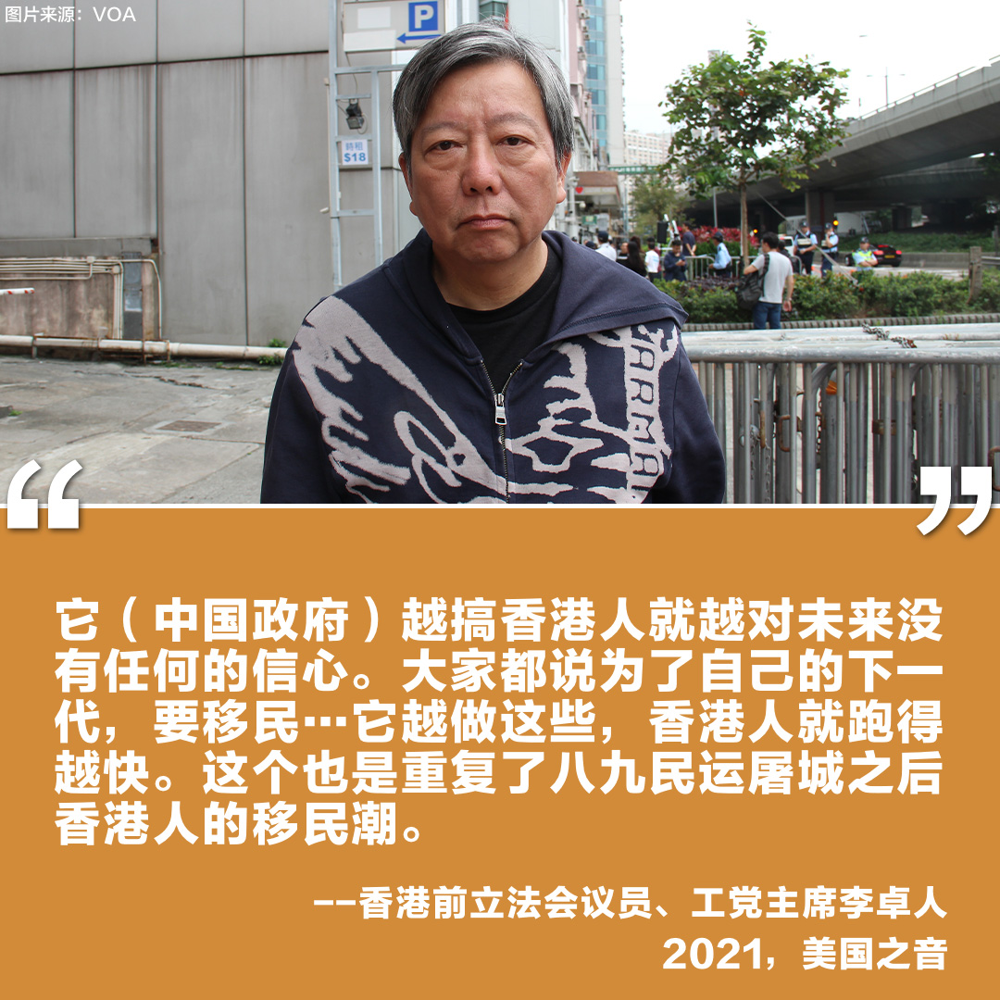
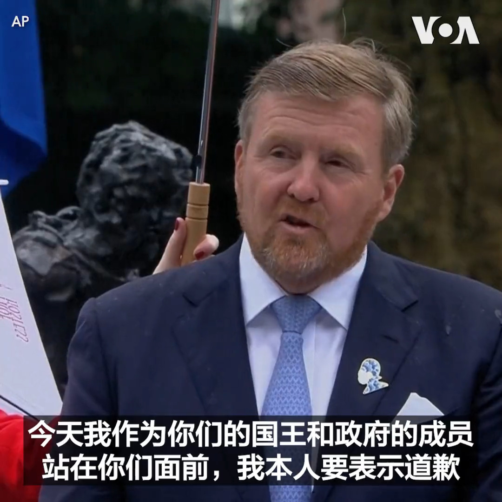

美国之音中文网 北京时间 2023-07-02T07:11:55Z 1675281107275612162 香港主权移交26年来，民主和自由遭北京蚕食。当年对香港前途的哪些展望已一语成谶？欢迎您在推文下加入评论。 https://t.co/W8Ndb37OAf   美国之音中文网 北京时间 2023-07-02T08:34:03Z 1675301773303779328 法国总统因暴乱取消对德国的访问 https://t.co/Xc57xZp8TE   美国之音中文网 北京时间 2023-07-02T09:00:00Z 1675308304753475585 中国热点对标美国论据，用一杯咖啡的时间聊聊中国热点的美国冷思考。今年暑假怎么过，美中青少年大不同。作为全美最大青少年组织，美国的童子军和中国的少先队、共青团有何不同？同样培养青少年领袖，官味十足的班干部和雄鹰奖章获得者差距在哪？本期视频带你了解。 https://t.co/qpcyT4rdjw   美国之音中文网 北京时间 2023-07-02T04:20:33Z 1675237981811101705 中国生产的一次性多种口味电子烟充斥美国市场，吸引广大美国未成年人，引起公共卫生界担忧。有媒体批评美国监管机构未对此加以限制，有失责之嫌；而电子烟产地中国虽在国内严格禁止，却允许大量出口。有电子烟业者告诉美国之音，经营电子烟门槛低利润丰厚，好过一般打工。报道https://t.co/4g4Fa9FgLI https://t.co/nmrNJtFoVl   美国之音中文网 北京时间 2023-07-02T05:32:03Z 1675255972762374144 中国新修订的《反间谍法》1日生效 https://t.co/8nB5IfEe2x   美国之音中文网 北京时间 2023-07-02T00:50:04Z 1675185008636723200 俄罗斯海军舰艇现身冲绳岛和台湾附近海域，日舰实施警戒 https://t.co/4b1LwJ1vqU   美国之音中文网 北京时间 2023-07-02T03:17:02Z 1675221996643418113 中国外汇管理局局长潘功胜被任命为央行党委书记 https://t.co/ERGXe37a3S   美国之音中文网 北京时间 2023-07-02T04:16:04Z 1675236852004159495 俄罗斯炮击在乌克兰炸死3人，炸伤17人 https://t.co/als6XTbvQF   美国之音中文网 北京时间 2023-07-02T00:00:01Z 1675172413770694659 2000年中国人均粮食400公斤时，中国当局提出“退耕还林”，到了2020年，人均粮食达到460公斤时，当局却提出“退林还耕”。中国土地资源专家王维洛说，“确保18亿亩耕地红线“或“确保国家粮食安全”是伪命题。#纵深视角完整版：https://t.co/Xdlj6NZ6GL https://t.co/tIW6Wk8a06   美国之音中文网 北京时间 2023-07-02T00:07:41Z 1675174344887025665 荷兰国王威廉·亚历山大1日在废除奴隶制的一个周年纪念活动上就荷兰历史上曾参与奴隶贸易表示道歉。荷兰首相马克·吕特去年底已经就此表达了道歉。 https://t.co/epaHzr92w5   