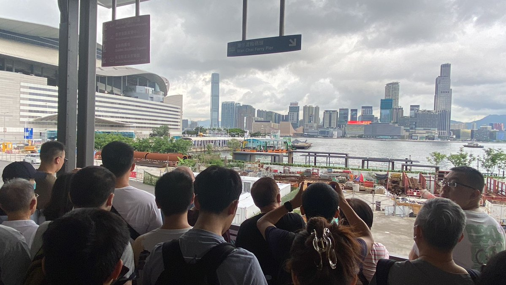
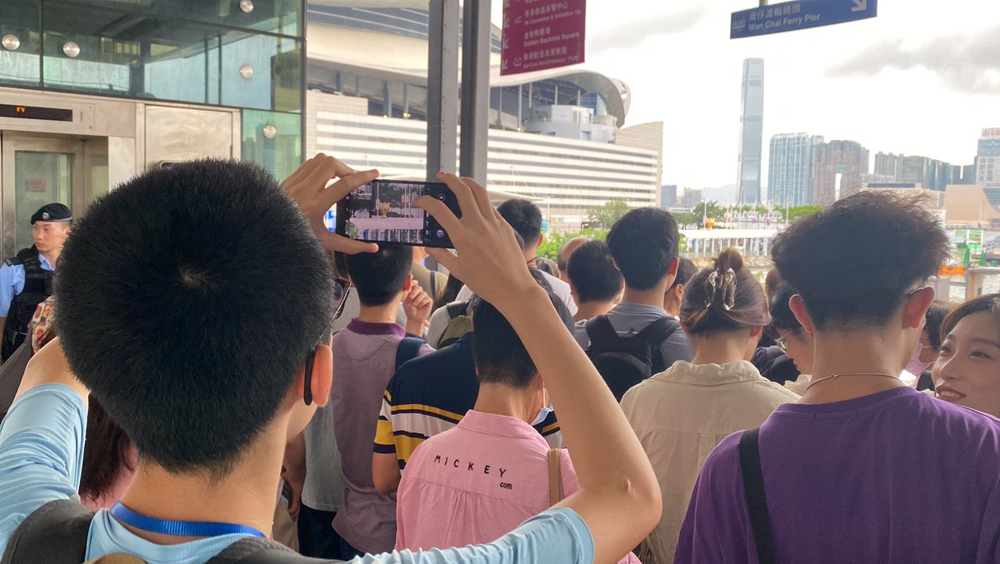
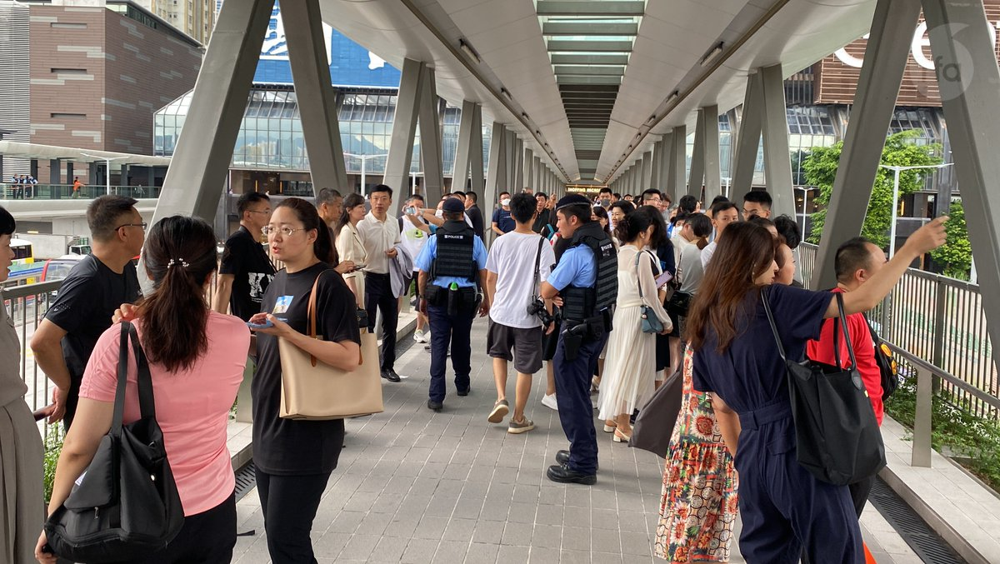
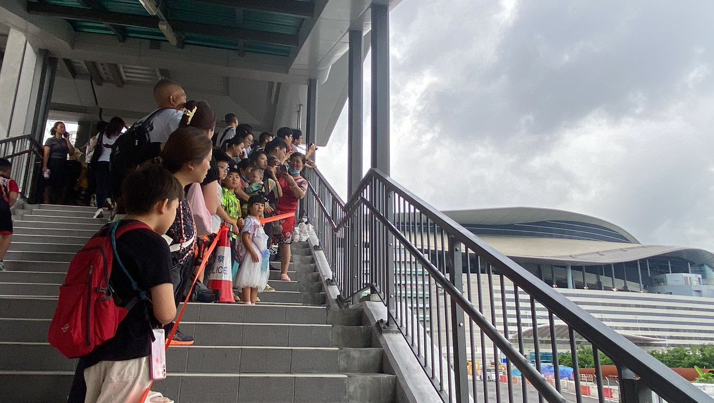
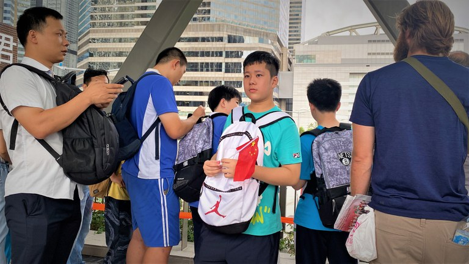
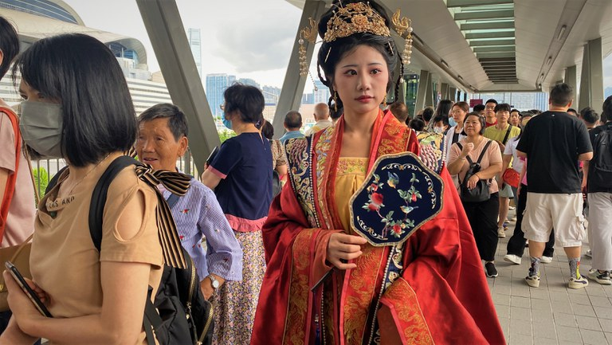
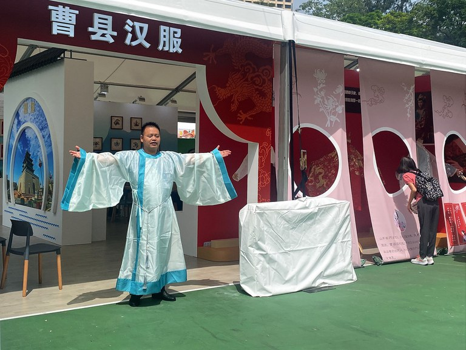
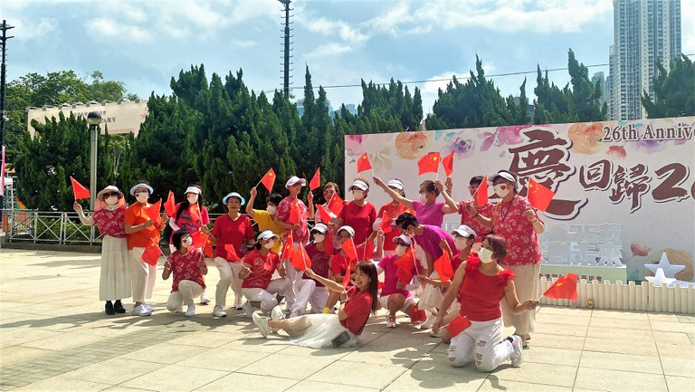
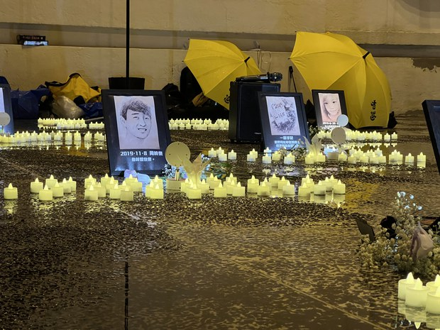
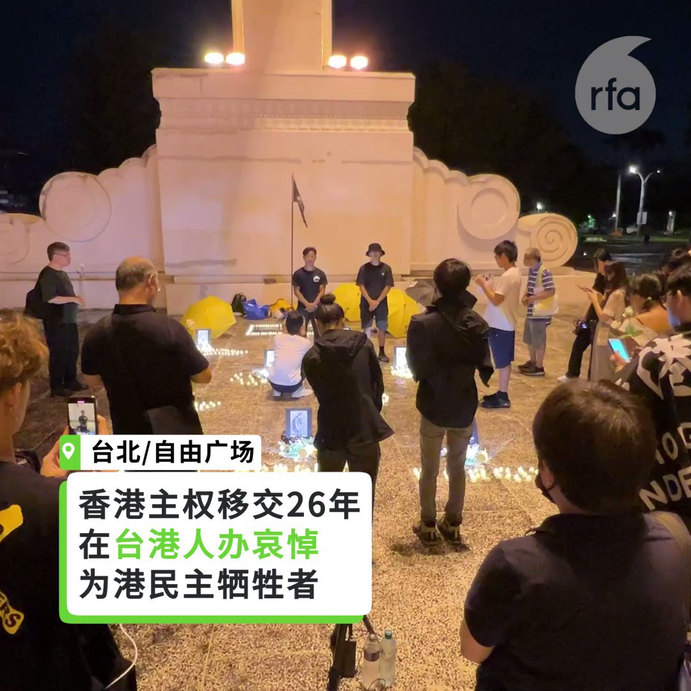

自由亚洲电台 北京时间 2023-07-02T07:58:00Z 1675292703771226113 RT @RFA_Chinese: 中国共产党成立102周年。截至2022年12月31日，共有党员9804.1万名。

明天“七一”建党节，你想对TA说点啥？ https://t.co/jGSpfl9aa6   自由亚洲电台 北京时间 2023-07-02T08:48:00Z 1675305286456967168 【谢锋向拜登递交国书 没穿西装有何深意？ 】
美国总统 #拜登 6月30日在白宫接受中国新任驻美大使 #谢锋 递交的国书，并就中美关系进行交谈。
谢锋着改良唐装，夫人穿旗袍，推特网民议论纷纷。
（图片来自中国驻美国大使馆网站）
https://t.co/Fihg23wRPH https://t.co/YdP0rqA3Nd   自由亚洲电台 北京时间 2023-07-02T04:59:30Z 1675247782670508033 #香港主权移交26周年，官方在香港湾仔金紫荆广场举行升旗仪式。虽然今年没有了疫情，但升旗仪式仍不设立公众观礼区，并把封锁线设在约一公里外，市民只能在人行天桥遥望升旗典礼。 https://t.co/G3UV4dagnN   自由亚洲电台 北京时间 2023-07-02T05:08:53Z 1675250143719747585 【#七一 #香港 印象】

#香港主权移交26周年，港府大力宣传普天同庆，但市面上本地人普遍气氛澹静。赴湾仔金紫荆广场观看升旗仪式，或参与维园庆祝活动的，主要是大陆游客和“爱国爱港”人士。不少人手持中国国旗“#庆回归”，现场鲜有见到香港区旗。（李若如摄）

图一，不少内地人手持中国国旗观看「七一」升旗礼。
图二，内地汉服模特儿曾小姐特意穿汉服来观看「七一」升旗礼。 
图三，维园今年举行的「七一庆回归」活动，9成是大湾区科技展商，包括汉服生产商。 
图四，多个亲中团体带队赴维园举行的「庆回归」活动撑场。   自由亚洲电台 北京时间 2023-07-02T05:09:21Z 1675250259314765827 RT @RfaCantonese: 今年 #七一 是香港主權移交中國26年，亦即50年不變的大限已過一半；不過，官方聲稱的全民共慶賀，結果早上的升旗禮，民眾只能在一公里外「遙望」。
詳細報道 ➡️https://t.co/qfCnoW45qk https://t.co/ZCzm…   自由亚洲电台 北京时间 2023-07-02T01:02:03Z 1675188025586860033 七月一日是 #香港主权移交26周年，台港的气氛大不同。在台港人自发举办哀悼会，有数十人冒雨参与。在台港人团体表示，在主权移交日办悼念，是要重新定义这个日子，立志为逝者继续走港人的自由路。另外，在台举办的《#国安法》座谈会，流亡的香港抗争者表示，《国安法》改变港人信赖可以通过法庭换取公平的方法，有香港艺术家表示，离开香港也难逃《国安法》的影响。

https://t.co/Ni3hXg4v7C   自由亚洲电台 北京时间 2023-07-02T01:02:29Z 1675188132885700608 #七一 #香港主权移交 26周年，在台港人以"#没有欢乐只有伤痛"为主题，自发举办哀悼会，悼念已逝的自由香港，以及数名反送中运动有关的逝者。
主办者在“自由广场”牌匾下，摆放数名与反送中运动相关的逝者画像，播放 #反送中 时流行的音乐和讲述逝者的故事，进行一分钟哀悼，向画像献花悼念。
有参加者触动落泪，形容悼念的逝者代表港人的勇气，争取民主自由的决心。
在台港人团体表示，在主权移交日悼念是要重新定义这个日子，立志为逝者继续走香港人的路。   自由亚洲电台 北京时间 2023-07-02T02:39:06Z 1675212450491400192 据海外维权网7月1日报道，30日上午，辽宁维权人士 #姜家文 接到上海市杨浦区长白街道的维权人士项文寅的求助电话，说他在前一天到北京上访时，已经遭到上海驻京人员的 #暴力截访，坐北京至上海的1461火车回上海，随后就处于失联状态。

https://t.co/lMxnH7vOiM   自由亚洲电台 北京时间 2023-07-02T02:42:45Z 1675213368372920321 7月1日是 #香港主权移交26周年，香港 #社民连 当天原本计划到政府总部示威，就言论自由和输入外劳等议题有所行动，但受到所谓“强力部门”介入需取消行动。特首 #李家超 在特区成立26周年酒会上指出，要警惕香港软对抗，维护国家安全。

https://t.co/ZNmXXZMmlU   自由亚洲电台 北京时间 2023-07-02T03:16:54Z 1675221963617206276 【日本记者入境香港被拒  #香港新闻自由 已死？】

港区国安法实施3周年，曾在反送中运动期间赴香港采访并出版“香港示威战记”一书的日本记者 #小川善照，于29日入境香港被拒，30日遭遣返。在日港人团体批评，此举表明香港新闻自由已消失。

据日本产经新闻报道，目前为自由记者的小川善照于29日晚抵达香港国际机场，然而在办理入境手续时遭海关人员带到另一个房间进行盘问，问题包括“打算要到香港的哪些地方”、“香港友人的姓名”等。

随后，他于30日被要求在“拒绝入境通知书”上签名，并强制遣返日本，而且没有向他说明被拒绝入境的理由。

报道引述小川的说法表示，不知道被拒绝入境的理由，也未在香港发表可能造成问题的言论。然而他也提到“可能是在日本的言行，因此被拒绝入境”。

根据公开资料，小川长期关注香港的民主运动，曾于2014年采访 #雨伞运动，2019年间赴港采访反送中运动，并将见闻汇整出版，同时也与他人共同合著有“现场见证 香港镇压的可怕真相”。

据悉，本次小川善照入境香港的目的是希望观察香港回归26年后的情况。

事件发生后，由日本人与香港人组成的非政府组织“日本香港民主连盟”发表声明，谴责香港政府在没有理由的情形下拒绝日本记者入境并遣返，并要求日本政府对此采取强硬行动，保障日本国民的出入境自由。   