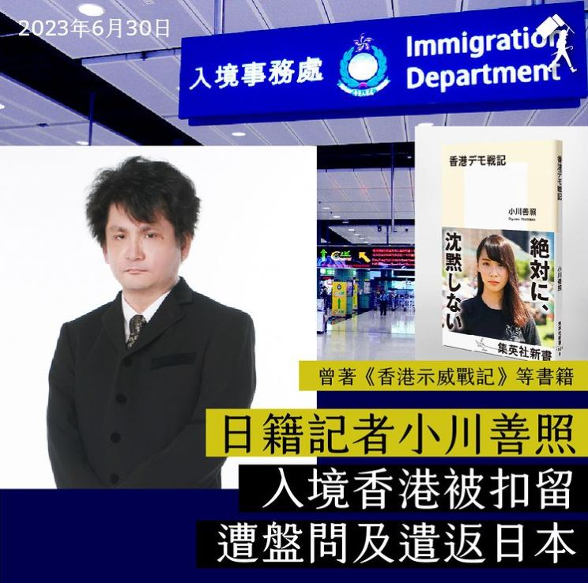

自由亚洲电台 北京时间 2023-07-02T03:16:54Z 1675221963617206276 【日本记者入境香港被拒  #香港新闻自由 已死？】

港区国安法实施3周年，曾在反送中运动期间赴香港采访并出版“香港示威战记”一书的日本记者 #小川善照，于29日入境香港被拒，30日遭遣返。在日港人团体批评，此举表明香港新闻自由已消失。

据日本产经新闻报道，目前为自由记者的小川善照于29日晚抵达香港国际机场，然而在办理入境手续时遭海关人员带到另一个房间进行盘问，问题包括“打算要到香港的哪些地方”、“香港友人的姓名”等。

随后，他于30日被要求在“拒绝入境通知书”上签名，并强制遣返日本，而且没有向他说明被拒绝入境的理由。

报道引述小川的说法表示，不知道被拒绝入境的理由，也未在香港发表可能造成问题的言论。然而他也提到“可能是在日本的言行，因此被拒绝入境”。

根据公开资料，小川长期关注香港的民主运动，曾于2014年采访 #雨伞运动，2019年间赴港采访反送中运动，并将见闻汇整出版，同时也与他人共同合著有“现场见证 香港镇压的可怕真相”。

据悉，本次小川善照入境香港的目的是希望观察香港回归26年后的情况。

事件发生后，由日本人与香港人组成的非政府组织“日本香港民主连盟”发表声明，谴责香港政府在没有理由的情形下拒绝日本记者入境并遣返，并要求日本政府对此采取强硬行动，保障日本国民的出入境自由。   