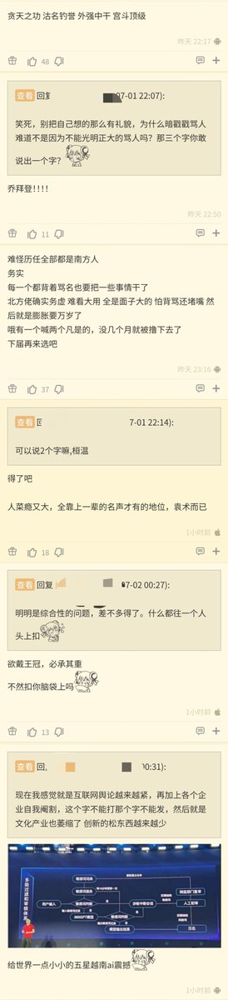

谁将十万横扫三江 北京时间 2023-07-02T08:05:46Z 1675294658799476736 RT @whyyoutouzhele: 网友投稿：
【中国人民大学一学生盗取全校学生数据建立颜值打分系统，现工作于腾讯微信团队】… https://t.co/5qArKqBmdC   谁将十万横扫三江 北京时间 2023-07-02T09:51:55Z 1675321371315027970 网友投稿：我从六月初在淮阳刘振屯镇高标准农田项目工作到月中完工，天天打电话给老板要钱，老板每天都说今晚绝对给，半个多月了也没给。给农业局打电话了，管不了，给劳动局投诉了没人管，给12345也打电话了，一周了也没信了 https://t.co/SVrf8xQZY6   谁将十万横扫三江 北京时间 2023-07-02T10:01:26Z 1675323767818694662 趋势对，但这是资本吗？

“我们已一再指明;
中国专制的官僚的政治形态是把地主经济作为它的物质基础。地主经济原是对领主经济而言的,它的大体内容,包括以次诸项︰
(一）土地为社会财富的最重要的生产手段；
(二）在相当范围内的私人土地所有权的确认；
(三）在相当范围内的土地自由买卖；
(四)集约的小农经营；
(五)土地剩余生产物的地租化与赋税化。
———中国官僚政治研究》   谁将十万横扫三江 北京时间 2023-07-02T10:04:42Z 1675324588811780099 RT @whyyoutouzhele: 网友投稿
7月2日清晨，河南开封
河南村镇银行储户再次抗议示威讨要存款
据悉，这批储户遭到非法冻结银联卡活期存款已有15个月。 https://t.co/rQ08IDzsOg   谁将十万横扫三江 北京时间 2023-07-02T10:04:57Z 1675324651663425536 RT @jakobsonradical: 墙内的NGA论坛在讨论生育率话题时，出现大量辱包言论😨 https://t.co/PH9VLzgC0W   