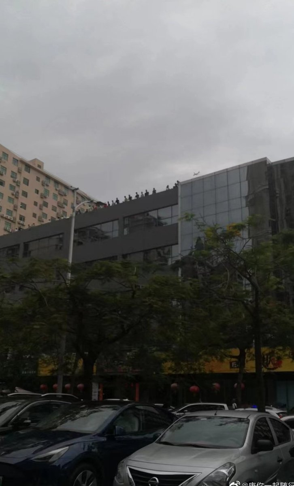
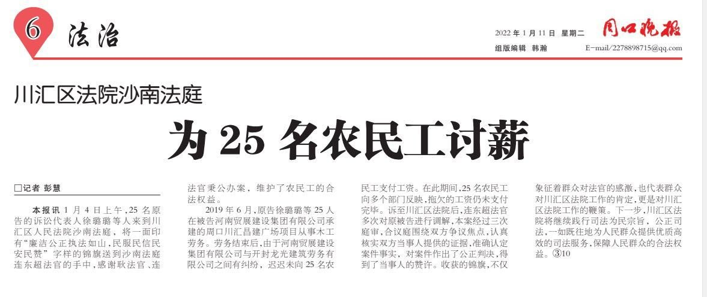
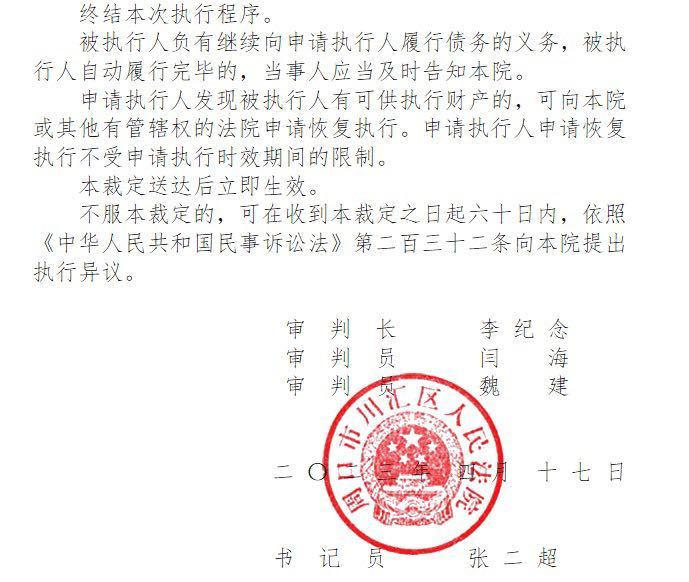
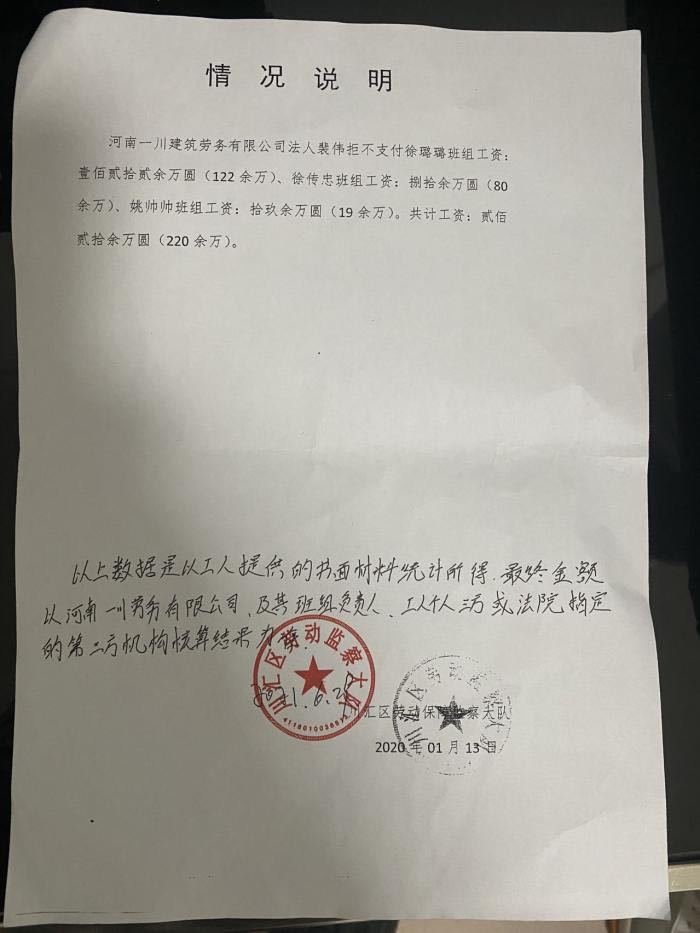
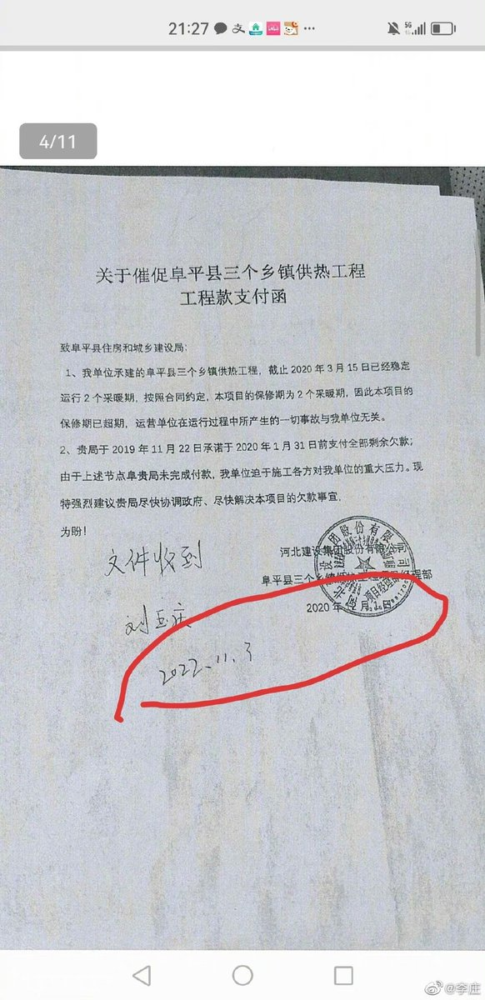
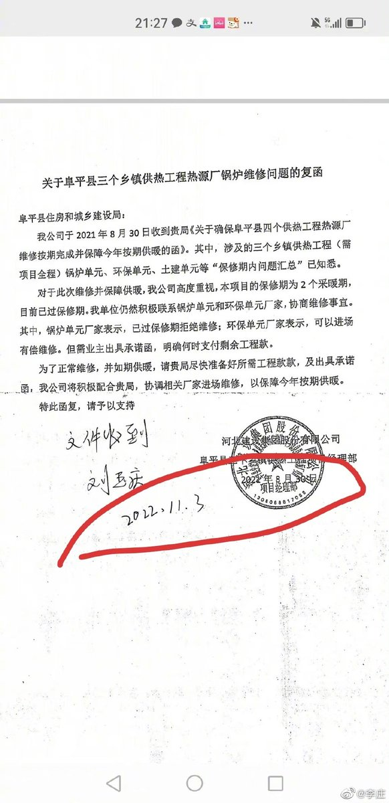
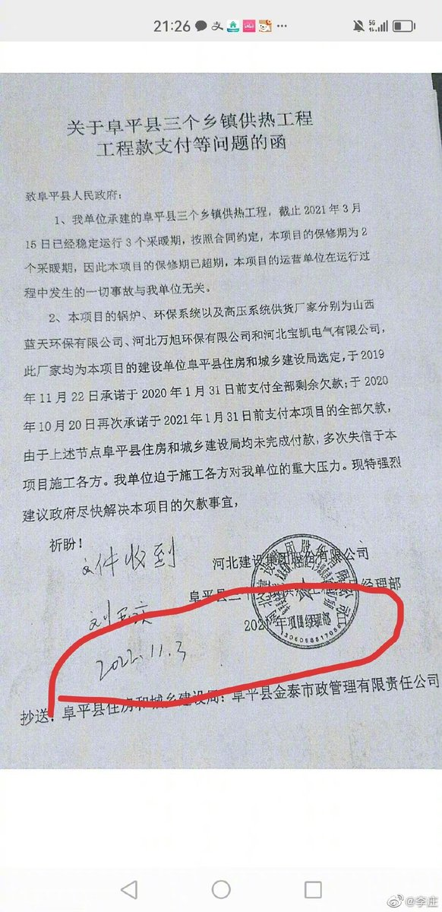
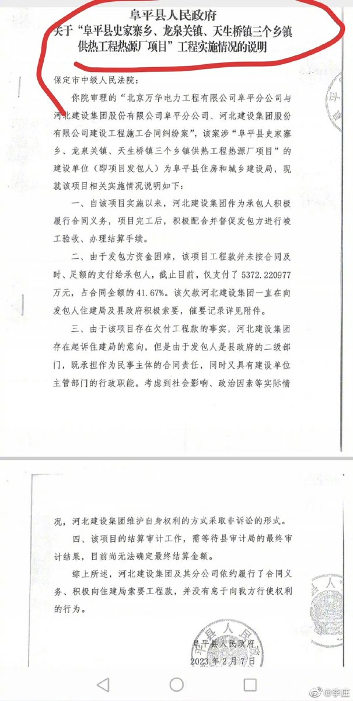

谁将十万横扫三江 北京时间 2023-07-02T07:06:02Z 1675279624794935297 RT @rmws1864928: 长毛象（Mastodon）是一种去中心化的社交媒体平台，它与推特相比具有许多优势。长毛象的设计理念是为用户提供更加开放、自由和安全的社交体验。 https://t.co/xpSFWoqDdF   谁将十万横扫三江 北京时间 2023-07-02T07:43:02Z 1675288936179208192 成都美吉姆跑路，六家店全部关门，卷走多少家长血汗钱，卷钱老板现场态度恶劣，老师为了讨薪在现场等了一天一夜，警察不去抓老赖，反而在现场打老师

警察都是很单纯的，都是为镇压而生的 https://t.co/fi7Da6clxC   谁将十万横扫三江 北京时间 2023-07-02T07:45:36Z 1675289581330255872 广东讨薪，党的生日，工人的受难日 https://t.co/geSjqhcH8X   谁将十万横扫三江 北京时间 2023-07-02T07:46:40Z 1675289849207881728 大连孩子父母欠钱，债主拉横幅去孩子学校讨薪 https://t.co/FRJt7qcjEi   谁将十万横扫三江 北京时间 2023-07-02T07:49:25Z 1675290543914627072 25位农民工，2019年6月23日在周口市川汇区重点项目工程《川汇昌建广场》干的木工，2019年10月15日被清场，经政府协调剩余403695元未支付。2021年5月份在周口市川汇区人民法院进行立案。

原一审：周口市川汇区沙南法庭连东超法官经过多次开庭审理调查。依据《保障农民工工资支付条例》判决：由总包单位河南贸展建设集团有限公司先行清偿，河南贸展建设集团有限公司与开封龙广建筑劳务有限公司的纠纷另案主张。

农民工欠薪的案子也在2022年1月11日在周口晚报进行了报道。

总包单位：河南贸展建设集团有限公司不服判决提交上诉。

原二审：周口市中级人民法院副庭长智卫东和曹春萍法官开了一次庭，给农民工判决发回重审。

重审一审：周口市川汇区城乡一体化示范区法庭张玉红法官进行一次开庭，判决由开封龙广建筑劳务有限公司支付25位农民工的工资，农民工不服提出上诉。

重审二审：周口市中级人民法院副庭长智卫东和曹春萍法官，判决农民工驳回上诉维持原判。 2023年1月13日向周口市川汇区人民法院执行局申请强制执行，2023年4月17日 强制执行结束，开封龙广建筑劳务有限公司地址根本没有这个公司。

25位农民工对周口市川汇区张玉红法官，周口市中级人民法院曹春萍法官与周口市中级人民法院副庭长智卫东判决有以下异议：

1;周口市川汇区张玉红法官，周口市中级人民法院曹春萍法官与周口市中级人民法院副庭长智卫东你们三位法官在我们的判决书提出的（本案的法律适用问题），《保障农民工工资支付条例》不适用农民工。三位法官也是在法院工作几十年经验丰富的老法官了，不可能连最基本的法律适用问题都不清楚吧。

《最高人民法院关于适用<中华人民共和国民法典>时间效力的若干规定》

第一条民法典施行后的法律事实引起的民事纠纷案件,适用民法典的规定。  民法典施行前的法律事实引起的民事纠纷案件,适用当时的法律、司法解释的规定,但是法律、司法解释另有规定的除外。  民法典施行前的法律事实持续至民法典施行后,该法律事实引起的民事纠纷案件,适用民法典的规定,但是法律、司法解释另有规定的除外。

<<保障农民工工资支付条例>>

第三十条　 工程建设项目转包，拖欠农民工工资的，由施工总承包单位先行清偿，再依法进行追偿。

第三十六条 施工单位允许其他单位和个人以施工单位的名义对外承揽建设工程，导致拖欠农民工工资的，由施工单位清偿。

〔2016〕1号 三、健全工资支付监控和保障制度 （九）落实清偿欠薪责任。建设单位或施工总承包企业将工程违法发包、转包或违法分包致使拖欠农民工工资的，由建设单位或施工总承包企业依法承担清偿责任。

2：开庭期间在法庭上开封龙广建筑劳务有限公司和刘木县多次提出，让总包单位：河南贸展建设集团有限公司先把钱优先支付给农民工，他们公司根本没有收到过河南贸展建设集团有限公司的一分钱，并且他们劳务公司还垫付了160余万，并且还有支付的转账票据。

总包单位：河南贸展建设集团有限公司反驳，280余万元已经支付给了开封龙广建筑劳务有限公司和农民工，并且河南贸展建设集团有限公司还支付超了。既然支付了还支付超了。请问法官：河南贸展建设集团有限公司支付农民工的转账票据您们怎么不调查一下，河南贸展建设集团有限公司只是口头辩驳了一下你们就直接采纳？几个班组被撤场第一时间到劳动监察大队立的案，总共农民工欠薪也才220多万，这钱去哪了？剩下的这么多欠薪哪来的？

3；关于农民工提供 的周口市住房和城乡建设局对总包单位：河南贸展建设集团有限公司该涉案工地违法转包的文件你们直接不采纳，周口市住房和城乡建设局这个文件就是一张废纸吗？

4：刻意把农民工欠薪案件跟违法转包施工总承包单位：河南贸展建设集团有限公司和开封龙广建筑劳务有限公司的工程纠纷搅合在一起，故意在判决书上面混淆视听。 这不是两个不同的案件吗？

5：为什么原二审法官和审判长与重审二审法官和审判长都是周口市中级人民法院曹春萍法官与周口市中级人民法院副庭长智卫东？？？

以上可见周口市川汇区张玉红法官，周口市中级法院曹春萍法官与周口市中级法院副庭长智卫东并不是从根上真心解决农民工欠薪问题，没有采纳过农民工提供的证据，故意制造矛盾，避重就轻。明明知道开封龙广建筑劳务有限公司没有拿过总包单位：河南贸展建设集团有限公司一分钱，没有清偿支付能力，还要故意判给一个没有支付能力的公司，不是故意让农民工拿不到血汗钱吗？

农民工被欠薪很多部门都让农民工理性讨薪，不要闹，不要走极端，农民工拿起法律武器来维护自己权益的时候为什么还是拿不到自己的血汗钱？   谁将十万横扫三江 北京时间 2023-07-02T07:56:21Z 1675292287700713475 几年来，县里重大工程，几乎都被这个私人企业承包，合计上百亿，拿到项目后大部被这个私企分包出去，目前拖欠各个农民施工队几十亿，原告起诉，巨无霸私企和政府联手造假，几份装模作样的催款函，竟然两三年后才签收。——律师李庄 https://t.co/DD5y4hOReZ   谁将十万横扫三江 北京时间 2023-07-02T07:58:55Z 1675292935192182784 河南省洛阳市委书记江凌主抓的天街项目——河南一建拖欠劳务工资几个月无人管 https://t.co/gBBn7igJ6U   谁将十万横扫三江 北京时间 2023-07-02T08:02:58Z 1675293951975366656 RT @xiaojingcanxue: 今天国内的一个热议判决是“猫药神”胡虹艳。胡是湖南人，在治疗自家猫所患绝症“猫传腹”（患猫一般会于15-60天内死亡）的过程中，通过阅读UC Davis教授Niels Pedersen的论文，了解到瑞德西韦前置药物GS441524对治疗猫…   谁将十万横扫三江 北京时间 2023-07-02T08:05:46Z 1675294658799476736 RT @whyyoutouzhele: 网友投稿：
【中国人民大学一学生盗取全校学生数据建立颜值打分系统，现工作于腾讯微信团队】… https://t.co/5qArKqBmdC   谁将十万横扫三江 北京时间 2023-07-02T09:51:55Z 1675321371315027970 网友投稿：我从六月初在淮阳刘振屯镇高标准农田项目工作到月中完工，天天打电话给老板要钱，老板每天都说今晚绝对给，半个多月了也没给。给农业局打电话了，管不了，给劳动局投诉了没人管，给12345也打电话了，一周了也没信了 https://t.co/SVrf8xQZY6   谁将十万横扫三江 北京时间 2023-07-02T10:01:26Z 1675323767818694662 趋势对，但这是资本吗？

“我们已一再指明;
中国专制的官僚的政治形态是把地主经济作为它的物质基础。地主经济原是对领主经济而言的,它的大体内容,包括以次诸项︰
(一）土地为社会财富的最重要的生产手段；
(二）在相当范围内的私人土地所有权的确认；
(三）在相当范围内的土地自由买卖；
(四)集约的小农经营；
(五)土地剩余生产物的地租化与赋税化。
———中国官僚政治研究》   谁将十万横扫三江 北京时间 2023-07-02T10:04:42Z 1675324588811780099 RT @whyyoutouzhele: 网友投稿
7月2日清晨，河南开封
河南村镇银行储户再次抗议示威讨要存款
据悉，这批储户遭到非法冻结银联卡活期存款已有15个月。 https://t.co/rQ08IDzsOg   谁将十万横扫三江 北京时间 2023-07-02T10:04:57Z 1675324651663425536 RT @jakobsonradical: 墙内的NGA论坛在讨论生育率话题时，出现大量辱包言论😨 https://t.co/PH9VLzgC0W   