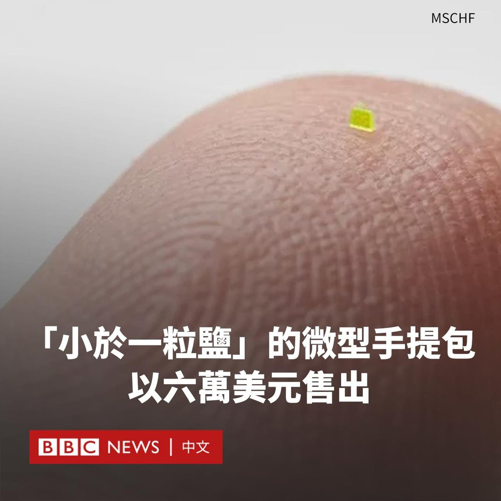

D英国广播公司BBC 北京时间 2023-07-01T19:17:19Z 1675101271290937345 一个“比一粒盐还小”的微型手提包在拍卖会上以63,750美元的价格售出。

这款微型手提包的尺寸为657x222x700微米，需要使用显微镜才能观察到它的设计。

这个手提包的艺术创作者称：“这是一个小到可以穿过针眼的钱包，你需要用显微镜才能看到它。”

总部位于纽约布鲁克林的艺术团体“MSCHF”以其具有争议性的设计而闻名，它们的设计包括含有人血的鞋子、鞋底注入“圣水”的运动鞋、巨大的红色橡胶靴等。

这一次，MSCHF决定将小手提包的潮流推向极致，它在文章中写道：“有大手提包、普通手提包和小手提包，但这是包包微型化的最终结果”。

这款手提包有奢侈品牌路易威登（Louis Vuitton）的品牌标志，但与该品牌没有任何联系。

它使用了光敏树脂，并由一种常用于制作微型机械模型和结构的3D打印技术制造而成。   D英国广播公司BBC 北京时间 2023-07-01T13:18:15Z 1675010909238861825 香港行政长官李家超的第一年“成绩表”到底都写着什么，似乎是一个各说各话的问题。作为在香港进入《国安法》时代后上任的特首，李家超有哪些“有为”与“无为”？https://t.co/IOMhD4ThSm   