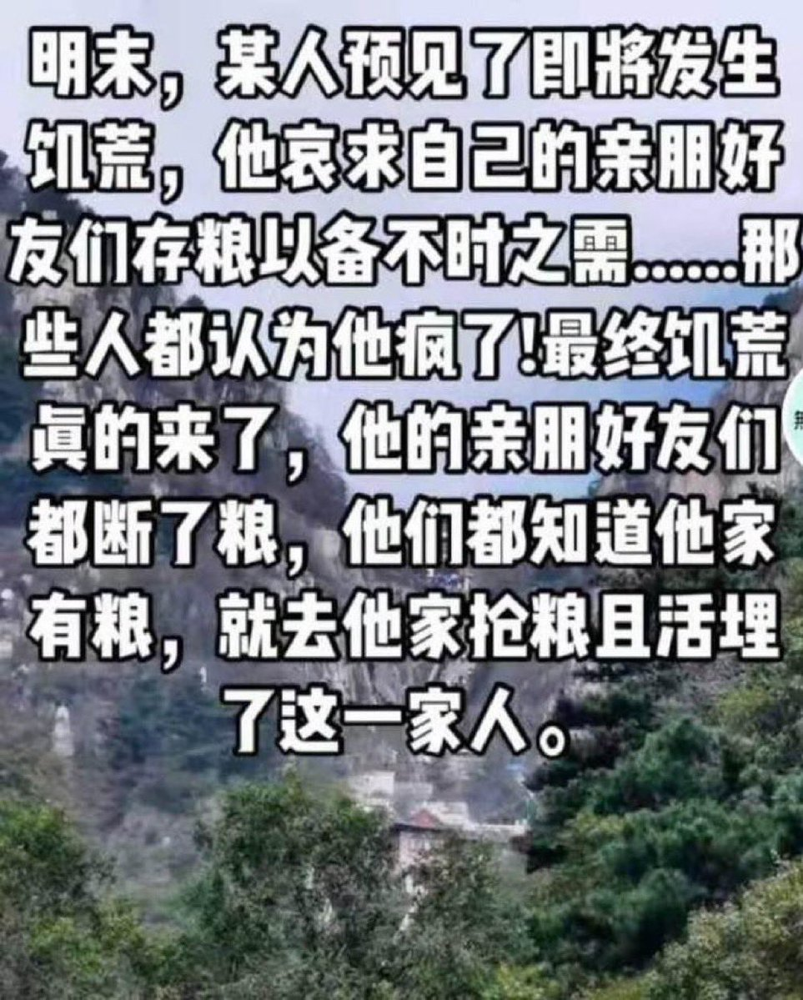
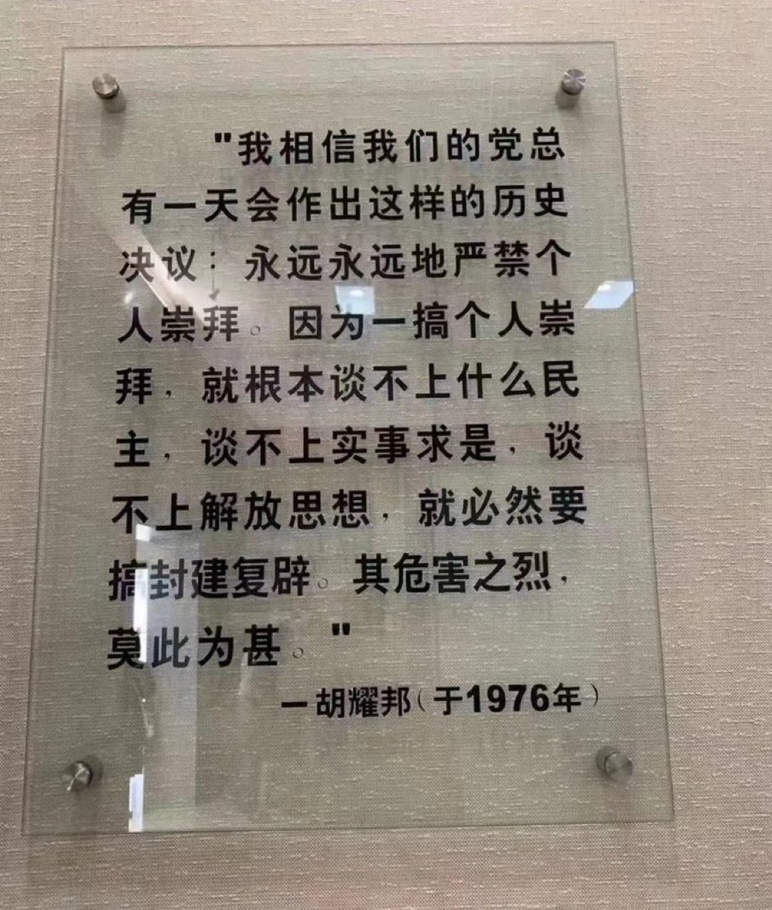

Ivy未央 北京时间 2023-07-01T11:56:48Z 1674990411956252679 细思极恐，这个故事好像不止发生在明末吧？ https://t.co/CTrmMRQXPK   Ivy未央 北京时间 2023-07-01T07:58:23Z 1674930412382978048 转）胡耀邦：“我相信我们的党总有一天将会作出这样的历史性决议：永远永远地严禁个人崇拜。因为一搞个人崇拜，就根本谈不上什么民主，谈不上实事求是，谈不上解放思想，就必然要搞封建复辟。其危害之烈，莫此为甚!”（《胡耀邦与平反冤假错案》中国工人出版社2004年7月版127-128页） https://t.co/bbCPAP4NiP   Ivy未央 北京时间 2023-07-01T09:32:06Z 1674953994702053377 转）鲁道夫·拉梅尔教授在研究了超过8000件政府造成的群体灭绝惨剧后发现，在20世纪前90年中，大约有1.7亿人被他们自己的政府所杀害，是同期因战争死亡人口的6倍。
因此，人民面临的首要危险是权力不受制衡的政府，而不是什么战争、罪犯或恐怖分子，对人民生命造成最大威胁的是本国政权，而非外国政府。 https://t.co/t8GmawP7rL   