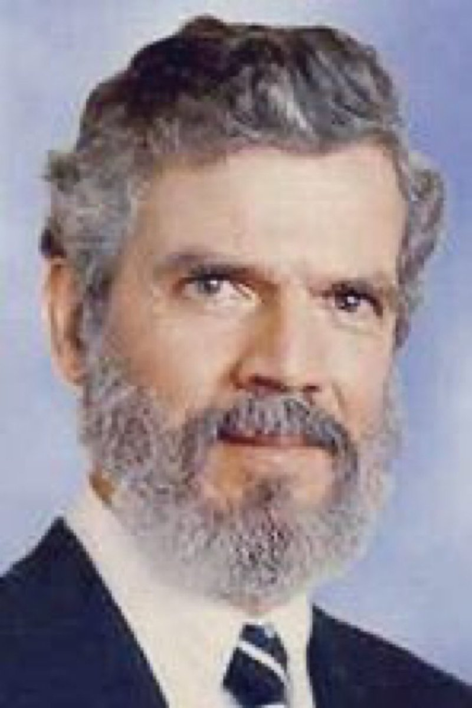

Ivy未央 北京时间 2023-07-01T09:32:06Z 1674953994702053377 转）鲁道夫·拉梅尔教授在研究了超过8000件政府造成的群体灭绝惨剧后发现，在20世纪前90年中，大约有1.7亿人被他们自己的政府所杀害，是同期因战争死亡人口的6倍。
因此，人民面临的首要危险是权力不受制衡的政府，而不是什么战争、罪犯或恐怖分子，对人民生命造成最大威胁的是本国政权，而非外国政府。 https://t.co/t8GmawP7rL   