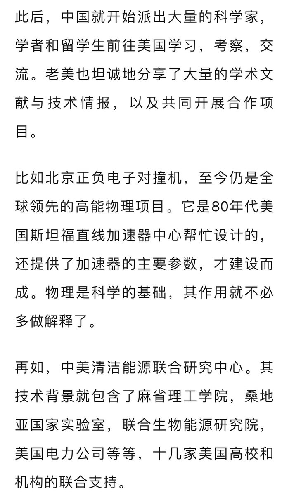
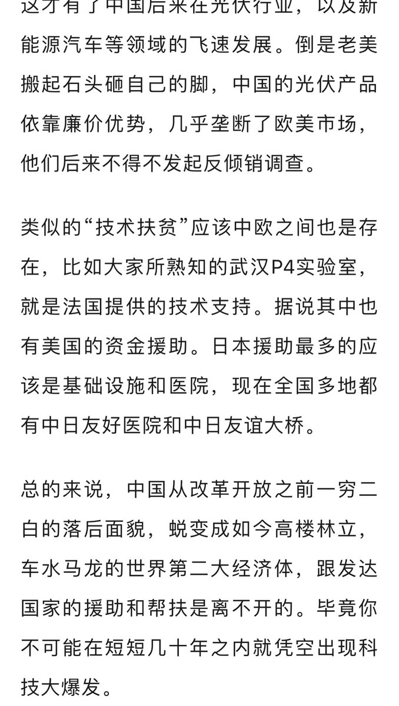
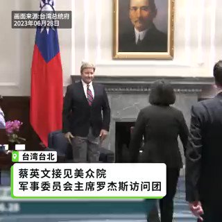
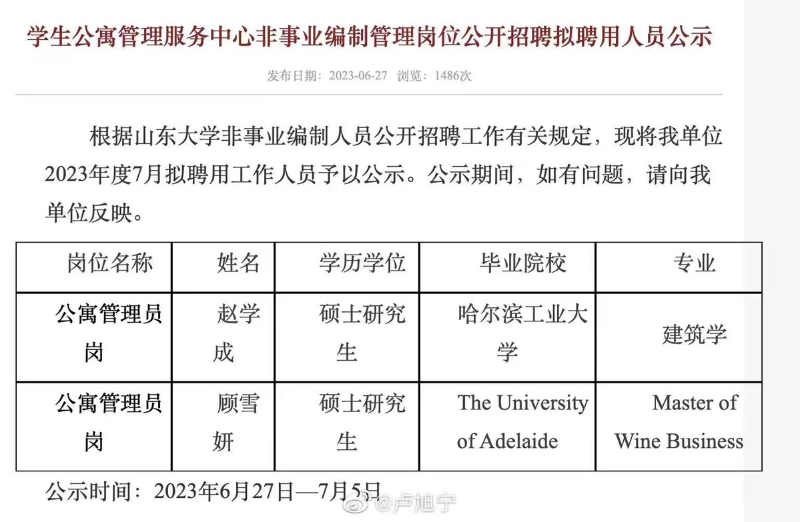
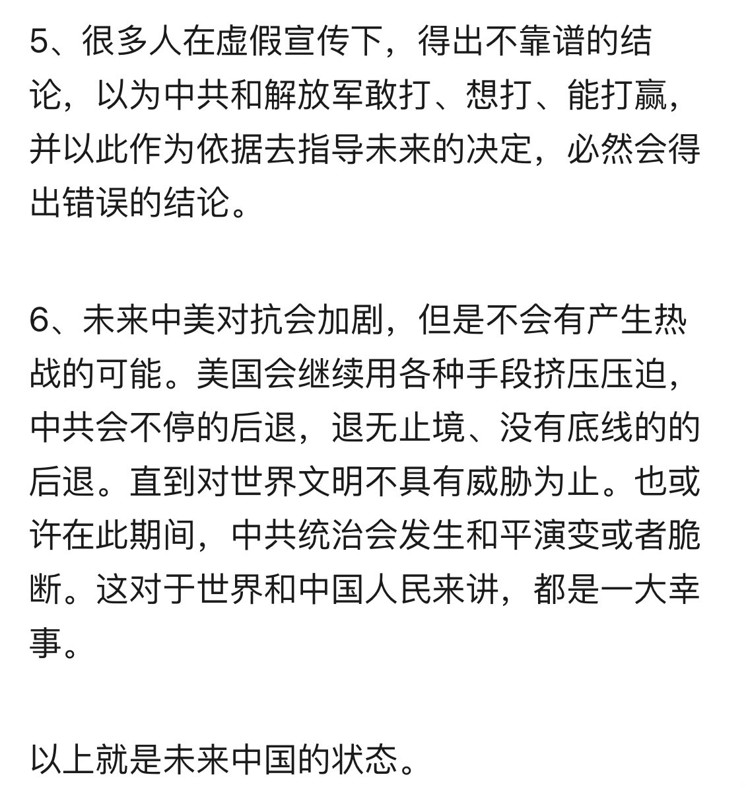
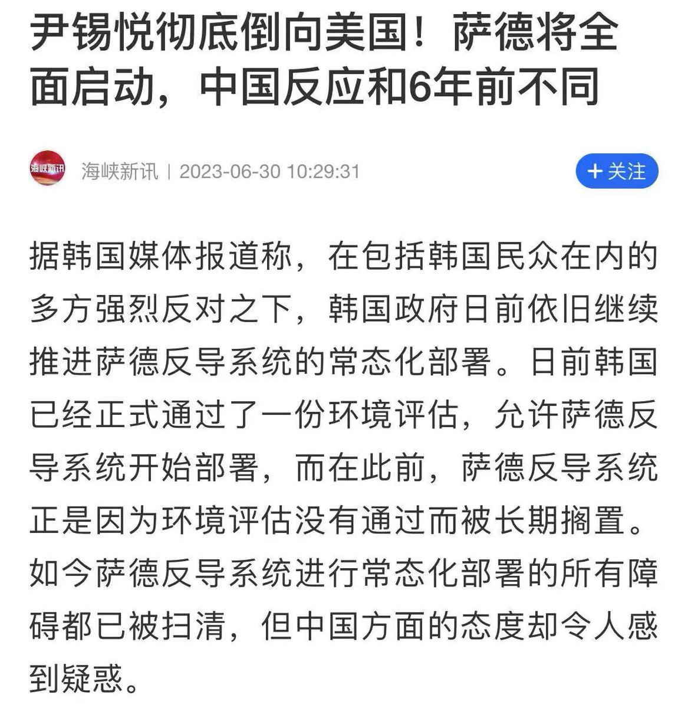
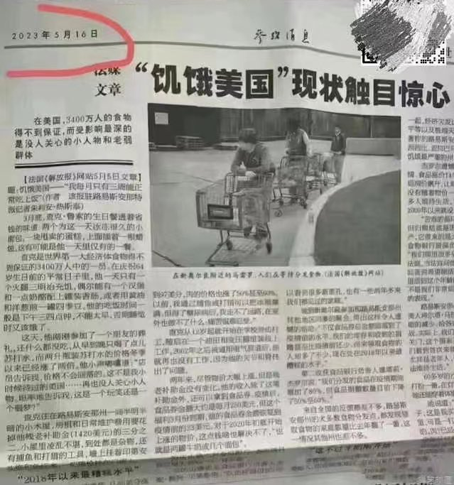
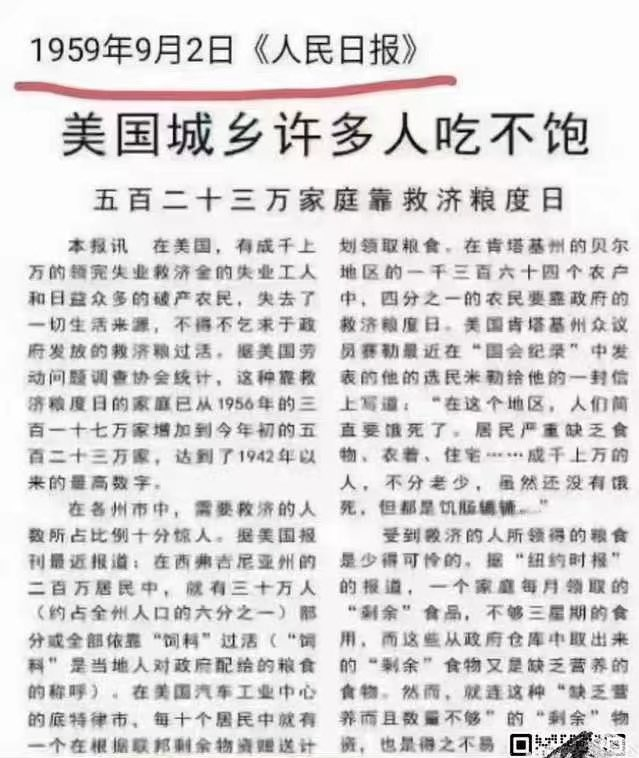
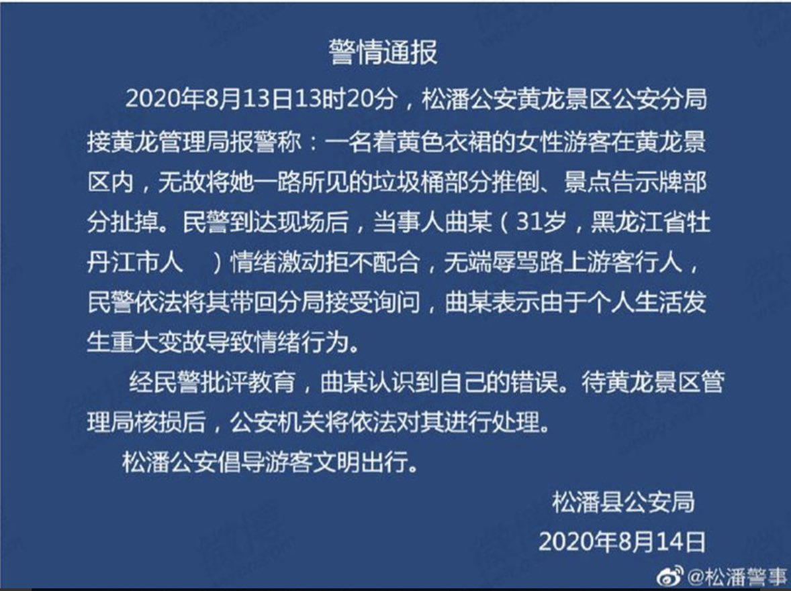

Petrichor 北京时间 2023-07-01T22:39:52Z 1675152244285620226 《中美科技合作协定》让中国收益了40年。但中美关系高开低走，从一开始的全面合作，到新时代走向脱钩，确实是非常遗憾。现在美国不情愿分享技术了，怕中共用美国技术打美国。就像你一直请人吃饭，请了40年，现在突然不请客了，这算是恶意吗？当然，责任肯定在美方，因为他们确实是越来越不好糊弄了。 https://t.co/B3olUgDuF8   Petrichor 北京时间 2023-07-01T23:27:38Z 1675164264611414016 民主国家的总统有没有替身？没有听说过美国总统拜登、川普、奥巴马、克林顿有过替身。雪茄门里的不是克林顿的替身。独裁者需要替身，是不是因为自知坏事干的太多，恨他的想谋杀他的人多，他一人之死会带来民族和国家的解放？北欧国家领导人大街上随便走，也没人要杀他们，甚至停足要合影的人也没有。 https://t.co/124shV3iQL   Petrichor 北京时间 2023-07-01T22:07:33Z 1675144111525855232 法国内政部报告了该国这个繁忙的夜晚： 
- 约 1000 人被拘留；  
- 79名警察受伤，1350辆汽车被烧毁；  
- 公共道路发生 2560 起火灾，234 座建筑物被烧毁或损坏；  
- 31个警察局、16个市警察局和11个宪兵营受到影响。 https://t.co/SVHfY8CPRz   Petrichor 北京时间 2023-07-01T19:25:42Z 1675103381587722240 中华民国总统蔡英文接见美国国会军事委员会主席带领的跨党派议员代表团。美國軍方修改了台灣保護級別。原先的軍事戰略是灘頭殲滅：放20萬共軍在台灣登陸，再斷掉回頭路，打斷補給線，殲滅登陸部隊。現在戰略是不放共軍過海峽中線，把共軍消滅在海峽中線以西，並延伸打擊大陸沿海共軍，被稱為源頭打擊。 https://t.co/RoGI5YLfYc   Petrichor 北京时间 2023-07-01T12:37:17Z 1675000597920075776 医院院长，最近有点烦。没钱看病的人的家属常把这段视频拿给医院的院长看，问他为什么就你们医院没钱不医病，抬病人扔大街。院长说，你们去找华春莹。 https://t.co/s1kf6PFkNX   Petrichor 北京时间 2023-07-01T12:37:54Z 1675000752400478208 知识和文凭与人民币一样贬值。 https://t.co/fBjZ2l7U57   Petrichor 北京时间 2023-07-01T12:39:44Z 1675001215422279681 因为国家公务员的饮食健康更重要。 https://t.co/tnTdGlaTU3   Petrichor 北京时间 2023-07-01T01:55:52Z 1674839182529658888 实现“四化”的政权，岂有可持续性？ https://t.co/pZgeHS0ZbF   Petrichor 北京时间 2023-07-01T08:42:46Z 1674941582141710336 转发 https://t.co/TaRpEsaXSs   Petrichor 北京时间 2023-07-01T08:57:26Z 1674945271342432256 2017年听说韩国同意部署美国导弹防御系统之后，反韩情绪立马席卷中国大地，中国媒体号召民众抵制韩国产品。学生、退休者和出租车司机都带头发起针对韩国企业的抗议活动、取消去韩国的旅游团。可是今年韩国真要部署萨德系统，中国政府反而不敢煽动民众反韩了，经济不行了，小粉红失业了。 https://t.co/xs1iF74wmB   Petrichor 北京时间 2023-07-01T02:10:30Z 1674842865761910787 非洲和中国都变成发达国家了，因为那里的人民吃得比美国人民吃得好、吃得饱！ https://t.co/qw0hVVrffU   Petrichor 北京时间 2023-07-01T02:17:20Z 1674844582213713938 https://t.co/c3gRfmUHZy   