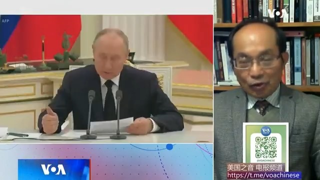
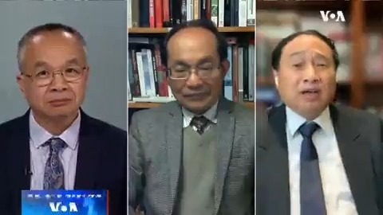
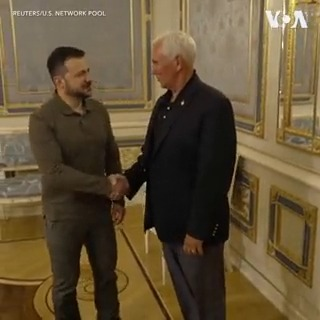

美国之音中文网 北京时间 2023-07-01T16:21:04Z 1675056917033672705 香港主权移交26周年 受「强力部门」介入 社民连临时取消示威 https://t.co/G9U4S6g1Xj   美国之音中文网 北京时间 2023-07-01T16:21:06Z 1675056924948328448 中国在泰国与缅甸军政府重新接触中作用举足轻重 https://t.co/WX7LpHdFA7   美国之音中文网 北京时间 2023-07-01T13:21:32Z 1675011735378616320 “美国受够了中国的技术偷窃”美中科技合作协定40年后前景不明 https://t.co/cbDvawzSTZ   美国之音中文网 北京时间 2023-07-01T14:08:02Z 1675023436002000897 香港归还中国26周年之际，李家超警告，香港内部潜伏着软对抗的破坏力量 https://t.co/9gedjxztu7   美国之音中文网 北京时间 2023-07-01T10:08:05Z 1674963050619863040 美国B-52轰炸机飞越朝鲜半岛向平壤展示实力 https://t.co/NLR9cw711B   美国之音中文网 北京时间 2023-07-01T05:11:22Z 1674888381724016647 瓦格纳集团首领普里戈津叛变未遂以及被流亡到白俄罗斯的后果，让波罗的海国家感到紧张。即将在7月中旬举行的北约年度峰会上，北约的议程将扩大到乌克兰以外的地区。请看美国之音白宫记者站主任帕齐·维达库斯瓦拉的报道。 https://t.co/5zbQVUrZ3X   美国之音中文网 北京时间 2023-07-01T05:34:52Z 1674894295575449600 香港民主派网络广播电台 “民间电台”(Citizens’ Radio)30日最后一次节目播出后将告别听众，其创始人说这是迫于资源缺乏和政治压力。这家电台2005年由资深活动人士曾健成创办，因敢于批评当局和多年来推动新闻自由而赢得许多听众支持。批评人士说这家电台停播是香港新闻自由空间不断缩小的又一个例子。 https://t.co/OvMVdSdvAR   美国之音中文网 北京时间 2023-07-01T06:04:33Z 1674901762493546496 法国限制公共交通，以遏制因警察枪击事件而引发的骚乱 https://t.co/p5hAiP7kp9   美国之音中文网 北京时间 2023-07-01T06:17:06Z 1674904923467808768 同为亚裔，他们对“平权行动”为何看法不同？ https://t.co/9e2exty7fE   美国之音中文网 北京时间 2023-07-01T07:00:01Z 1674915724718907394 中国今年在农管监督下强行推动的退林还耕、水稻上山等措施引发农村普遍民怨后，中国自然资源部日前下发通知，要求杜绝拔苗砍树、填坑平塘等一刀切行为，并对水稻上山做出明确规范和限制。从“退耕还林”到“退林还耕”，中国土地资源管理政策逆转的根据是什么？有何后果？请收看周六上午九点的《纵深视角》 https://t.co/0rQmXgImY5   美国之音中文网 北京时间 2023-07-01T07:14:05Z 1674919261418946561 美军参谋长联席会议主席马克.米利上将周五表示，中国毫不含糊地展现他们希望在未来十年内成为亚洲地区的霸主，在本世纪中超过美国的军事实力。他说，在台湾问题上，美国希望通过威慑，“确保每天习主席醒来后都说，今天还不是攻打台湾的那天，而那个决定永远不会到来。” https://t.co/hwl8LE3BKO   美国之音中文网 北京时间 2023-07-01T07:30:00Z 1674923267403157504 26年前的7月1日，香港主权移交回中国。北京对香港承诺“一国两制”，高度自治，但是26年来香港的民主自由空间被不断压缩。北京称三年前实施的港版国安法让香港“涅槃重生”，但民主派人士则哀叹“一国两制”已死。五分钟回顾香港主权移交中国以来的重要政治事件和抗争运动。 https://t.co/MDpaSP6ABh   美国之音中文网 北京时间 2023-07-01T07:38:33Z 1674925421794828288 国安法下 亲民主的香港民间电台关闭 https://t.co/VgO87Qdkye   美国之音中文网 北京时间 2023-07-01T07:52:34Z 1674928947040227328 美国警告企业当心中国新修订的《反间谍法》 https://t.co/9zAM0G9Yjn   美国之音中文网 北京时间 2023-07-01T08:22:35Z 1674936500373590019 中国偷渡客汇聚洛杉矶，为什么走线来美意向成谜 https://t.co/yajyh8theD   美国之音中文网 北京时间 2023-07-01T08:38:06Z 1674940405375451136 港版《国安法》实施三年，美参院两党议员：持续追究北京破坏香港自治责任 https://t.co/b7jO3OtqI2   美国之音中文网 北京时间 2023-07-01T09:00:00Z 1674945918909440001 如何解释瓦格纳兵变后习近平和普京两位老朋友一直没有联系过？悉尼科技大学中国学副教授冯崇义博士说：这两人在斗心眼，他们没有建立起友谊和信任关系。俄国觉得习不够朋友，习不愿与失败者站在一起。独裁者之间有相互利用的需要。#时事大家谈完整版： https://t.co/keiwxjcPUU https://t.co/hjdvgRDixx   美国之音中文网 北京时间 2023-07-01T09:06:35Z 1674947576192462848 美挑时间宣布对台军售？美台商会：选择在假日前公布显得过度担忧中国反应 https://t.co/rqj4u1Lpnf   美国之音中文网 北京时间 2023-07-01T09:32:57Z 1674954211455270913 #揭谎频道 ：中国官方的新华社表示，美国利用知识产权问题阻碍中国经济发展。 然而, 多个案例表明, 美国针对中国经济间谍活动采取的法律行动是对北京大规模盗窃知识产权的回应。https://t.co/krFJRXQljf   美国之音中文网 北京时间 2023-07-01T09:36:03Z 1674954992216842241 进展虽缓慢，美国对乌克兰的反攻充满信心 https://t.co/d1vs0ZTLas   美国之音中文网 北京时间 2023-07-01T09:52:32Z 1674959138991005696 美军最高将领：解放军进攻台湾并非已成定局 https://t.co/GbX6YKDhAD   美国之音中文网 北京时间 2023-07-01T09:56:10Z 1674960053256990720 7月1日是香港主权移交26周年，也是新冠疫情过后首个七一。警方加派警力巡逻，许多敏感地区也禁止车辆进入。在泛民主派团体解散，许多媒体关闭的情况下，今年的七一是什么样的景象？26年来北京如何改变了香港？请锁定美国之音即时报道与分析。 https://t.co/jKP3MJlLgi   美国之音中文网 北京时间 2023-07-01T11:00:03Z 1674976129294168065 因组织非正式选举初选，北京一次就指控47名港人“串谋颠覆”，这也会是大陆人的担心？中国民主党全国委员会主席王军涛博士说：最让人担心的是习以抓间谍名义搞倒查，查到李克强、马云、温家宝、汪洋头上，按习近平的做法，这些人都属于被渗透，都是间谍。#时事大家谈完整版：https://t.co/keiwxjcPUU https://t.co/uo7sEUYu8m   美国之音中文网 北京时间 2023-07-01T11:41:03Z 1674986447504576516 减少国际孤立 伊朗寻求上合组织帮助其经济发展 https://t.co/pA1NVUFSU2   美国之音中文网 北京时间 2023-07-01T00:03:32Z 1674810912749023235 欧盟集体发声 正式明确欧盟对中国的立场 https://t.co/9oxJdvpKuh   美国之音中文网 北京时间 2023-07-01T01:16:33Z 1674829288959524864 越总理结束访中行但两国仍存歧异 美越安全关系也未升级 https://t.co/ja0vzc9cln   美国之音中文网 北京时间 2023-07-01T02:15:34Z 1674844137085100032 中国疫后边界重新开放，走私贩卖妇女恶行又死灰复燃 https://t.co/Kh3oDN99Mj   美国之音中文网 北京时间 2023-07-01T00:16:47Z 1674814245546885123 已宣布参加2024年总统竞选的美国前副总统彭斯6月29日突访乌克兰，与该国总统泽连斯基会面。彭斯是第一位在竞选期间与乌克兰总统会面的共和党总统候选人。他在坚定自己对乌克兰支持的同时还表示，向乌军提供支持可以体现“自由世界将共同支持自由”。报道：https://t.co/d7CKAWUgcY https://t.co/SkVLgqMEpc   