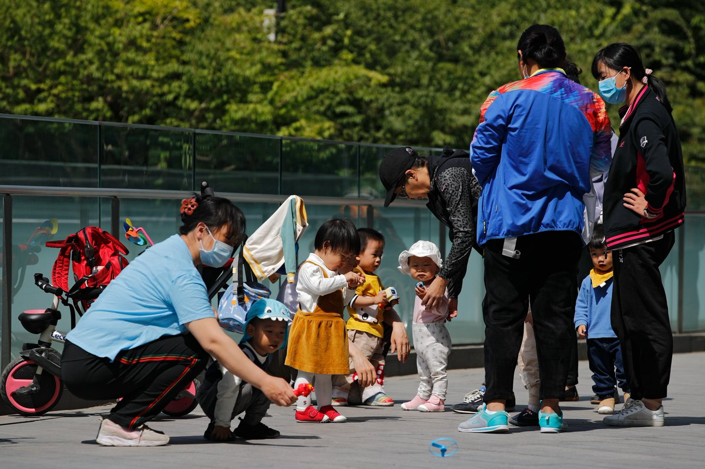
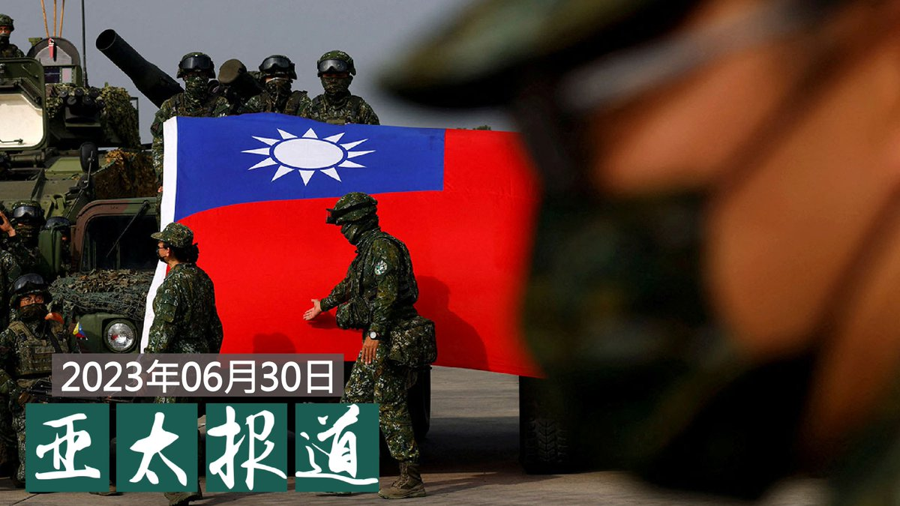
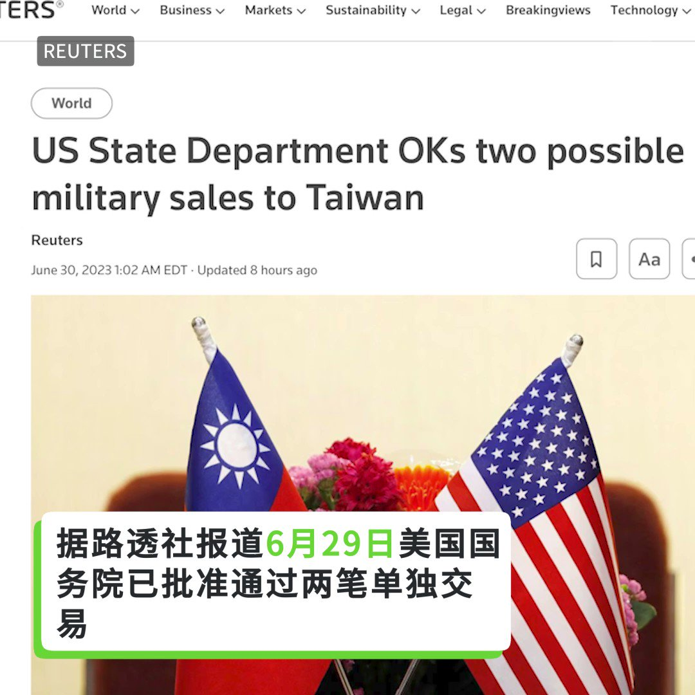
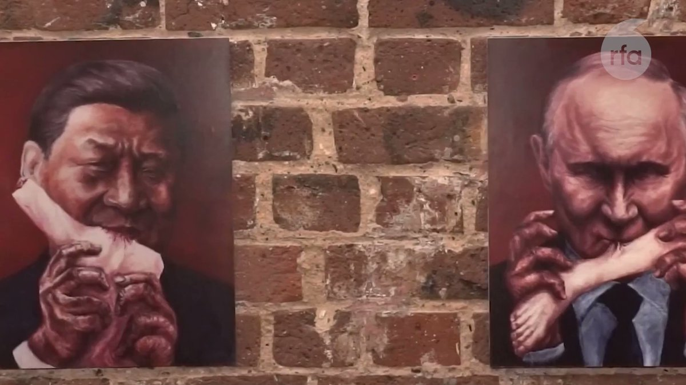

自由亚洲电台 北京时间 2023-07-01T23:17:40Z 1675161757332160513 RT @RFA_Chinese: 【异议艺术家巴丢草：只要仍有香港人，就还有香港】
2019年的香港反送中运动期间，大量“抗争文宣”涌现街头和网络。其中澳大利亚华裔艺术家 #巴丢草，创作大量声援香港的画作，为被打压的港人发声，同时向国际社会描绘香港的抗争运动。他近日带着最新画作…   自由亚洲电台 北京时间 2023-07-01T23:17:59Z 1675161837401194496 RT @RFA_Chinese: 【您收到的访华邀约 是馅饼还是陷阱？】
国际人权组织 #自由之家 的调查报告，标示出中国对全球的媒体影响程度。
报告建议，不论是记者、编辑或大学校长或政府官员，需要审慎对待透过 #公关公司 发出的访华邀约。简单操作如网络搜索，询问地方专家或查阅…   自由亚洲电台 北京时间 2023-07-01T23:18:10Z 1675161881042907136 RT @RFA_Chinese: 【中国产 #C919 上海飞成都未返航】
【空客A320代执行回程】
本周四（29日）由上海东方航空公司MU9197航班飞往成都后，未能正常返航。回程航班MU9198改由空客A320，这一不寻常现象引起飞行爱好者关注。今天在飞行软件发现，周五当…   自由亚洲电台 北京时间 2023-07-01T23:18:27Z 1675161952161505280 RT @RFA_Chinese: #胡锡进 6月27日高调宣布进入中国股市，三天来每天在微博更新盈亏动态，成为股民和网民热议话题，各大平台关注，多次上热搜。
第三天，老胡说：“我的整个仓绿了，从昨天盈利200多元变成上午倒亏300几十元”，于是又转了10万进去。
你觉得胡锡进炒…   自由亚洲电台 北京时间 2023-07-01T23:35:51Z 1675166331061121027 RT @RFA_Chinese: 【#瓦格纳兵变 中国延后表态显示对 #普京 的动摇】
【征战不利反噬权位 #习近平 三思 #武统台湾 反作用力】
完整视频 https://t.co/KfXApjjndp https://t.co/ShxV7XJ3wU   自由亚洲电台 北京时间 2023-07-01T20:41:53Z 1675122551184412672 RT @RFA_Chinese: 【生一个孩子发5万，你生不生？】
6月30日，旅游服务平台 #携程 集团宣布，7月1日起，入职满3年的全球员工，不论性别，每新生育一个孩子，将获得每年一万元人民币的现金补贴，发放至孩子满5周岁后终止。经初步测算，携程为为此投入10亿元 #生育补…   自由亚洲电台 北京时间 2023-07-01T20:26:01Z 1675118559662309377 RT @RFA_Chinese: 总部位于巴黎的联合国组织今天召开特别大会，以132国同意，15国弃权，10国反对党投票结果，宣布 #美国 正式重新加入… https://t.co/TGPssNLOIj   自由亚洲电台 北京时间 2023-07-01T20:28:17Z 1675119128246382593 RT @RFA_Chinese: 中国共产党成立102周年。截至2022年12月31日，共有党员9804.1万名。

明天“七一”建党节，你想对TA说点啥？ https://t.co/jGSpfl9aa6   自由亚洲电台 北京时间 2023-07-01T03:01:09Z 1674855610808950784 【生一个孩子发5万，你生不生？】
6月30日，旅游服务平台 #携程 集团宣布，7月1日起，入职满3年的全球员工，不论性别，每新生育一个孩子，将获得每年一万元人民币的现金补贴，发放至孩子满5周岁后终止。经初步测算，携程为为此投入10亿元 #生育补贴。
由携程创始人 #梁建章 创办的中国智库 #育娲人口研究 今年5月发布报告，中国 #养娃成本 世界第二高，仅次于韩国。国内家庭平均把一个孩子养育到十八岁的成本是中国人均GDP的6.9倍，相当于德国的两倍和法国的三倍。在中国，平均抚养一个孩子到大学毕业需要为62.7万人民币。   自由亚洲电台 北京时间 2023-07-01T03:26:57Z 1674862104753631237 【#调查报道 | 国际笑话日：我可以笑吗？】
因为近期的一些举措，中共对 #喜剧 的容忍度引起了广泛的质疑。
@lelefarley #脱口秀 #笑果 #李昊石
https://t.co/gHgSEI1JQr   自由亚洲电台 北京时间 2023-07-01T03:37:34Z 1674864773304025088 【变态辣椒：必读之书】
中共总书记 #习近平 对中国的统治已扩展到图书销售排行榜。#习近平著作  及中共党章最近数月占据了畅销书排行榜的前五名，在五十多年前《毛主席语录》曾占领图书销售市场以后，从未发生过这种现象。 https://t.co/mdYetGIqmP   自由亚洲电台 北京时间 2023-07-01T04:22:52Z 1674876175750148096 王志华 #走线 进入美国。他说，“奔着自由的方向，一路向北，真的不知道疲劳。在巴拿马热带雨林里，屁股一坐下就可以睡着，睡十来分钟就起身又走，真的是从来没有这样一种吸引力这么去做事。”
本台记者王允 @Jeff23Wang 报道。
#建党102周年  #七一
https://t.co/EDsqCoMTfc   自由亚洲电台 北京时间 2023-07-01T04:49:03Z 1674882766301970432 长铗归来乎，无以为家！
探访疫后中国，海华还想 #回国发展 吗？
https://t.co/WeMS1umCwA   自由亚洲电台 北京时间 2023-07-01T04:59:06Z 1674885292254437376 【拜登政府第十次对台军售 高达4.4亿美元】
6月29日，美国国务院批准通过两笔单独交易向台湾出售弹药和后勤支持，价值高达4.4亿美元。中国外交部坚决反对 #美国对台军售。 https://t.co/efV0vhjrVP   自由亚洲电台 北京时间 2023-07-01T06:00:06Z 1674900645281959937 【#亚太报道（2023-6-30）】
欢迎收听和订阅播客【亚太报道】 https://t.co/MjLNSvVMqc

#中共建党102周年 / 中国社会 #三年疫情 后有哪些变化？ / 一架国产 #C919 客机未正常返航 / #人民币兑美元汇率 持续下跌 / 美国拜登政府第十次 #对台军售 https://t.co/RGJs2aZFJe   自由亚洲电台 北京时间 2023-07-01T06:00:21Z 1674900709286764545 总部位于巴黎的联合国组织今天召开特别大会，以132国同意，15国弃权，10国反对党投票结果，宣布 #美国 正式重新加入 #联合国教科文组织。反对的10个国家包括中国、伊朗、叙利亚、俄罗斯等。据《经济学人》杂志报道，中国现在是联合国教科文组织最大的资助者，并在该机构内部具有影响力。您分析，中国反对美国恢复联合国教科文席位，原因何在？您支持美国重返联合国教科文组织吗？   自由亚洲电台 北京时间 2023-07-01T06:01:03Z 1674900884101251075 中国共产党成立102周年。截至2022年12月31日，共有党员9804.1万名。

明天“七一”建党节，你想对TA说点啥？ https://t.co/jGSpfl9aa6   自由亚洲电台 北京时间 2023-07-01T06:09:21Z 1674902974575919104 RT @RFA_Chinese: 【诚征受访者：35岁求职嫌你老？】
中国的招聘信息中，时常只招募35岁以下的年轻人，”35”岁彷彿成了魔咒数字，成为投身劳动市场的无形限制。本台想徵集35岁左右、因为年龄限制而就业受阻的青年，欢迎在评论区留言，或电邮fankui@rfa.org…   自由亚洲电台 北京时间 2023-07-01T09:11:28Z 1674948804523573248 RT @RFA_Chinese: 【生一个孩子发5万，你生不生？】
6月30日，旅游服务平台 #携程 集团宣布，7月1日起，入职满3年的全球员工，不论性别，每新生育一个孩子，将获得每年一万元人民币的现金补贴，发放至孩子满5周岁后终止。经初步测算，携程为为此投入10亿元 #生育补…   自由亚洲电台 北京时间 2023-07-01T10:20:48Z 1674966249988669450 RT @RFA_Chinese: 总部位于巴黎的联合国组织今天召开特别大会，以132国同意，15国弃权，10国反对党投票结果，宣布 #美国 正式重新加入… https://t.co/TGPssNLOIj   自由亚洲电台 北京时间 2023-07-01T10:21:14Z 1674966362140098564 RT @RFA_Chinese: 中国共产党成立102周年。截至2022年12月31日，共有党员9804.1万名。

明天“七一”建党节，你想对TA说点啥？ https://t.co/jGSpfl9aa6   自由亚洲电台 北京时间 2023-07-01T10:22:09Z 1674966593653075973 RT @RFA_Chinese: 王志华 #走线 进入美国。他说，“奔着自由的方向，一路向北，真的不知道疲劳。在巴拿马热带雨林里，屁股一坐下就可以睡着，睡十来分钟就起身又走，真的是从来没有这样一种吸引力这么去做事。”
本台记者王允 @Jeff23Wang 报道。
#建党102周…   自由亚洲电台 北京时间 2023-07-01T10:43:40Z 1674972004569722881 专栏 | #周嘉有话说：在中国该不该学新闻？
#周孝正 #张雪峰
https://t.co/MKwty0AnNo   自由亚洲电台 北京时间 2023-07-01T10:45:25Z 1674972445390905345 RT @RFA_Chinese: 【拜登政府第十次对台军售 高达4.4亿美元】
6月29日，美国国务院批准通过两笔单独交易向台湾出售弹药和后勤支持，价值高达4.4亿美元。中国外交部坚决反对 #美国对台军售。 https://t.co/efV0vhjrVP   自由亚洲电台 北京时间 2023-07-01T10:46:13Z 1674972648248578048 专栏 | #财经时时听：#罚没经济 加速小企业倒闭
https://t.co/81QYgdoBNh   自由亚洲电台 北京时间 2023-07-01T01:50:57Z 1674837945185083393 美国和 #荷兰 将在今年夏天进一步透过限制 #芯片 制造设备的销售，对中国芯片制造商打出“组合拳”。这是两国持续努力防止其技术被用于增强中国军事力量的一部分。
#ASML #深紫外光刻机

https://t.co/5jBJUKmpmp   自由亚洲电台 北京时间 2023-07-01T00:00:57Z 1674810262296076290 【异议艺术家巴丢草：只要仍有香港人，就还有香港】
2019年的香港反送中运动期间，大量“抗争文宣”涌现街头和网络。其中澳大利亚华裔艺术家 #巴丢草，创作大量声援香港的画作，为被打压的港人发声，同时向国际社会描绘香港的抗争运动。他近日带着最新画作现身伦敦，并接受本台专访。记者/吕熙 https://t.co/d4vXMutgcy   自由亚洲电台 北京时间 2023-07-01T00:14:52Z 1674813764733140992 香港《#国安法》生效满3周年，此法确立了北京对香港的全面管治，同时使 #香港公民社会 瓦解、议会中的民主派被迫退场。然而目前仍有一批留守者，其中包括民主派政团成员、前区议员和中国时评人，希望在《国安法》下，尽力捍卫港人尚存的权利。

https://t.co/rPgT11TCZe   