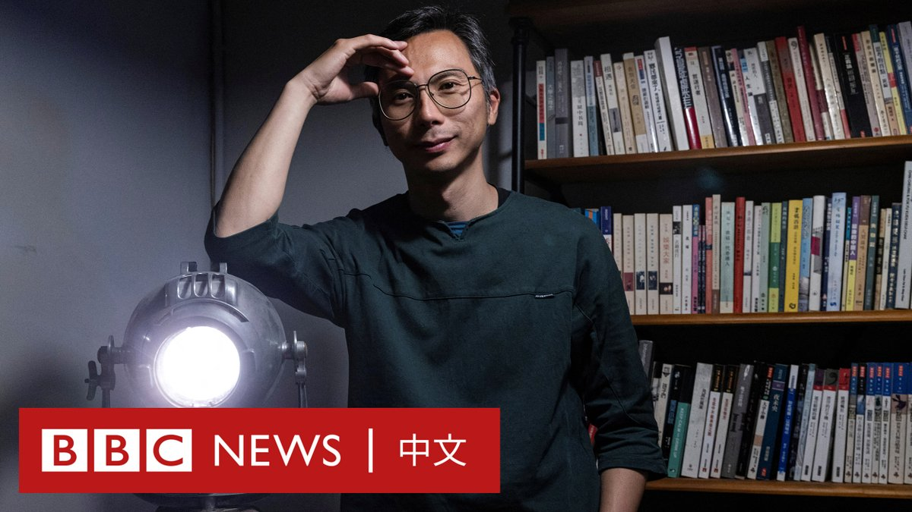
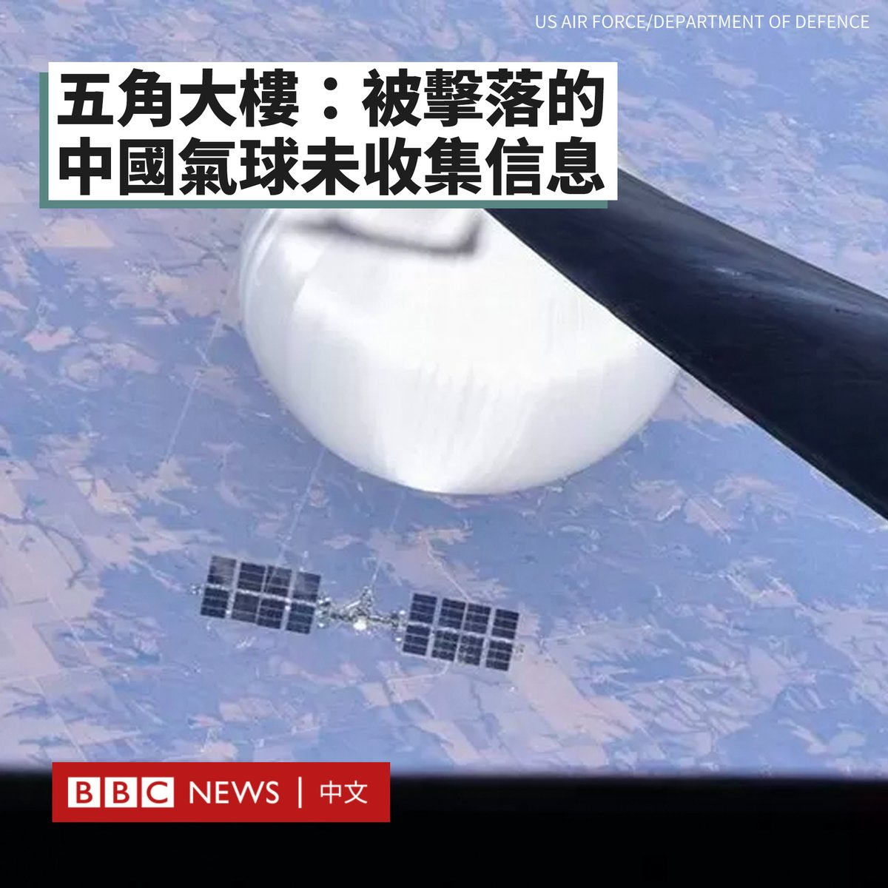
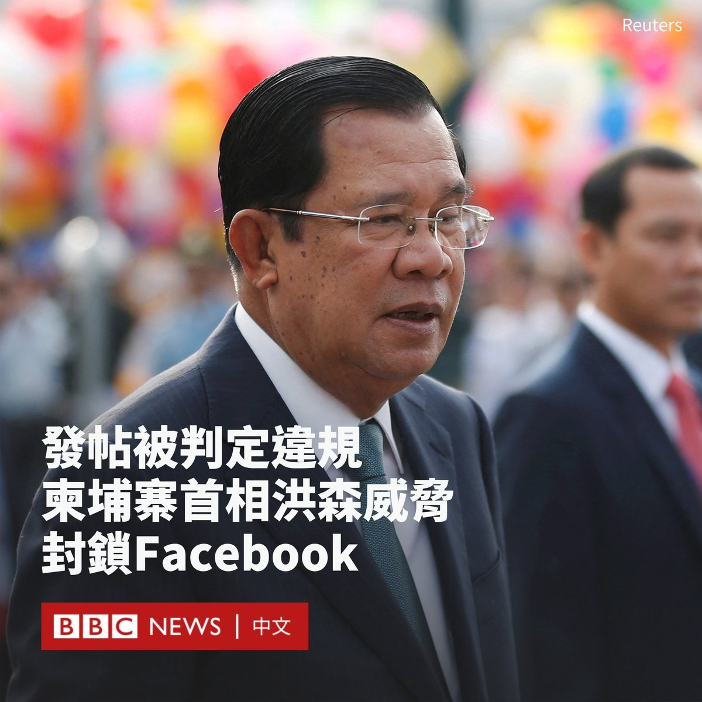
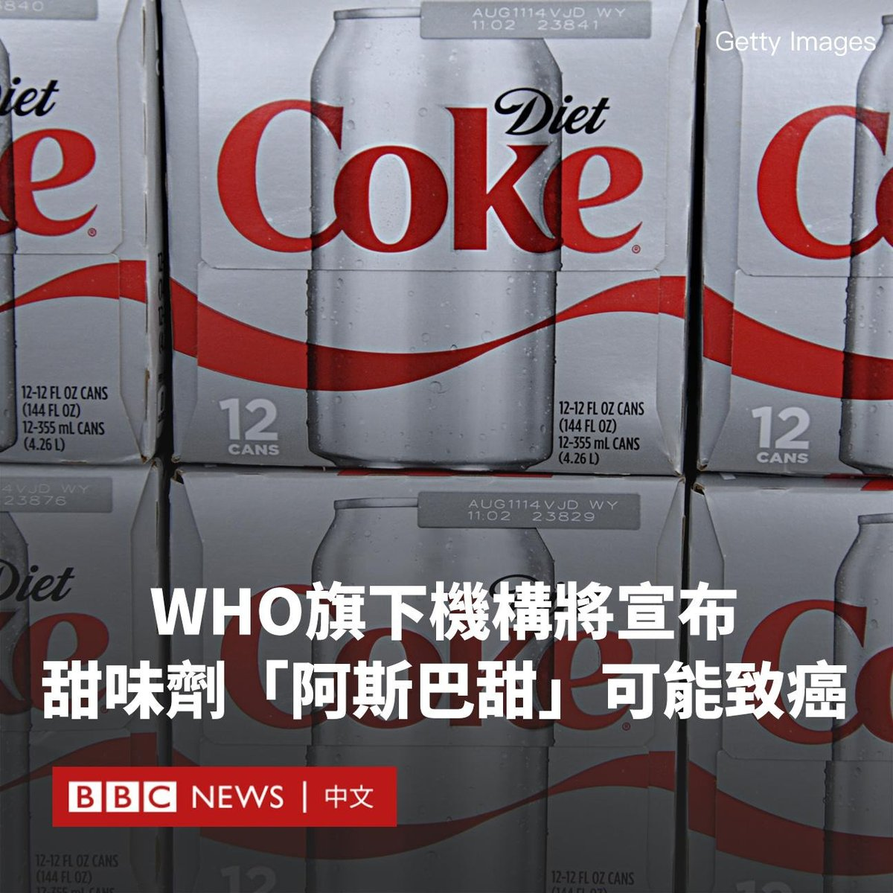
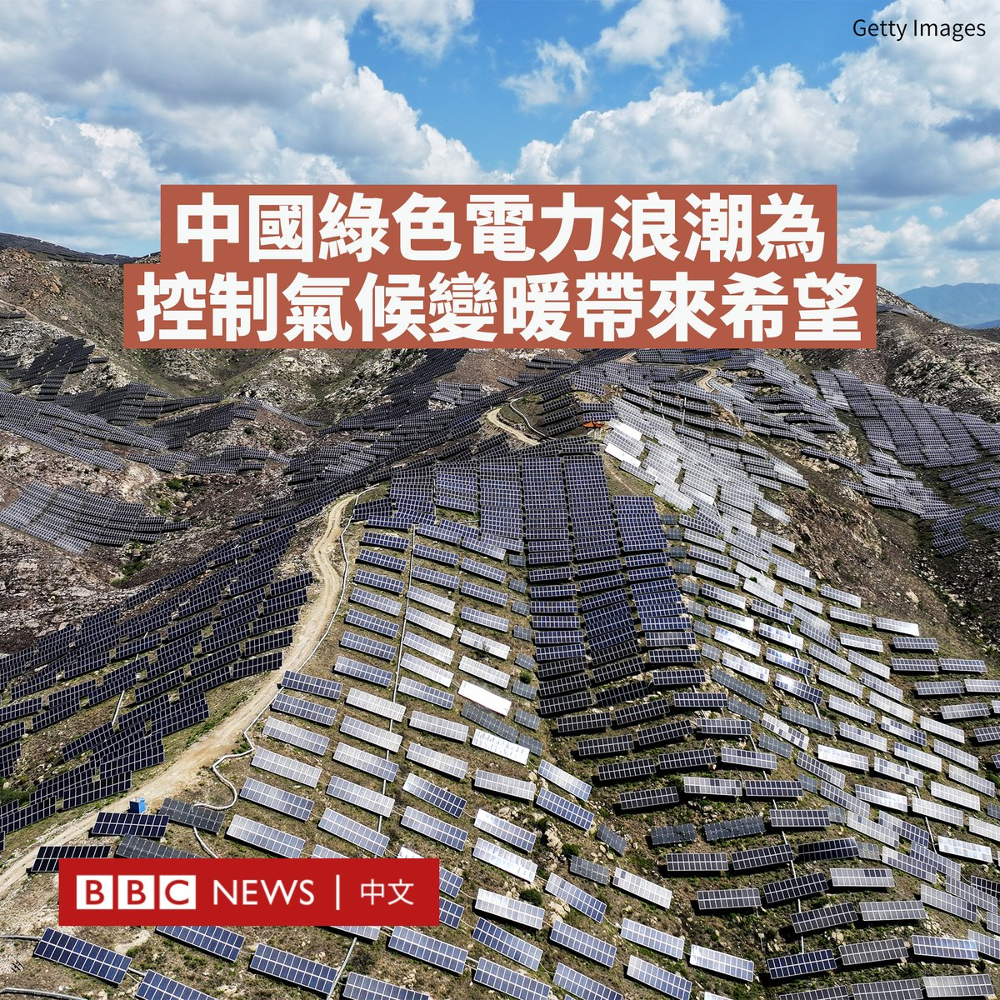
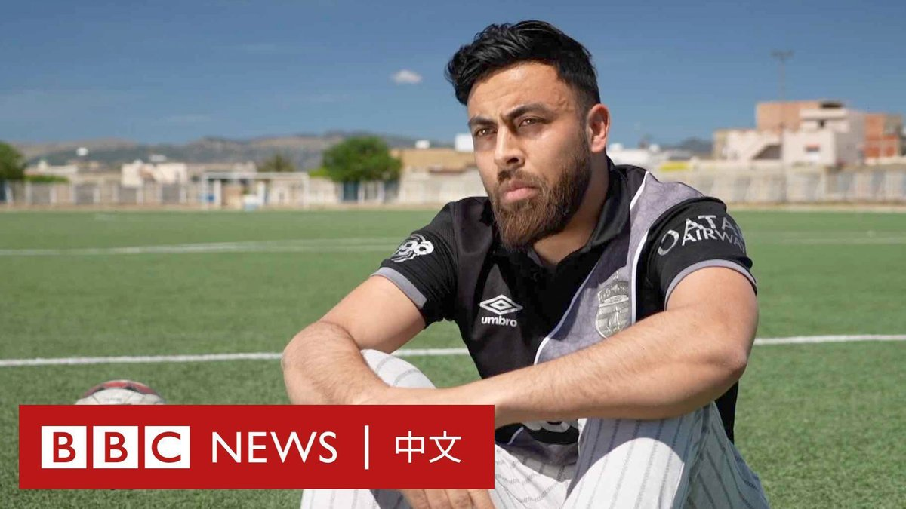
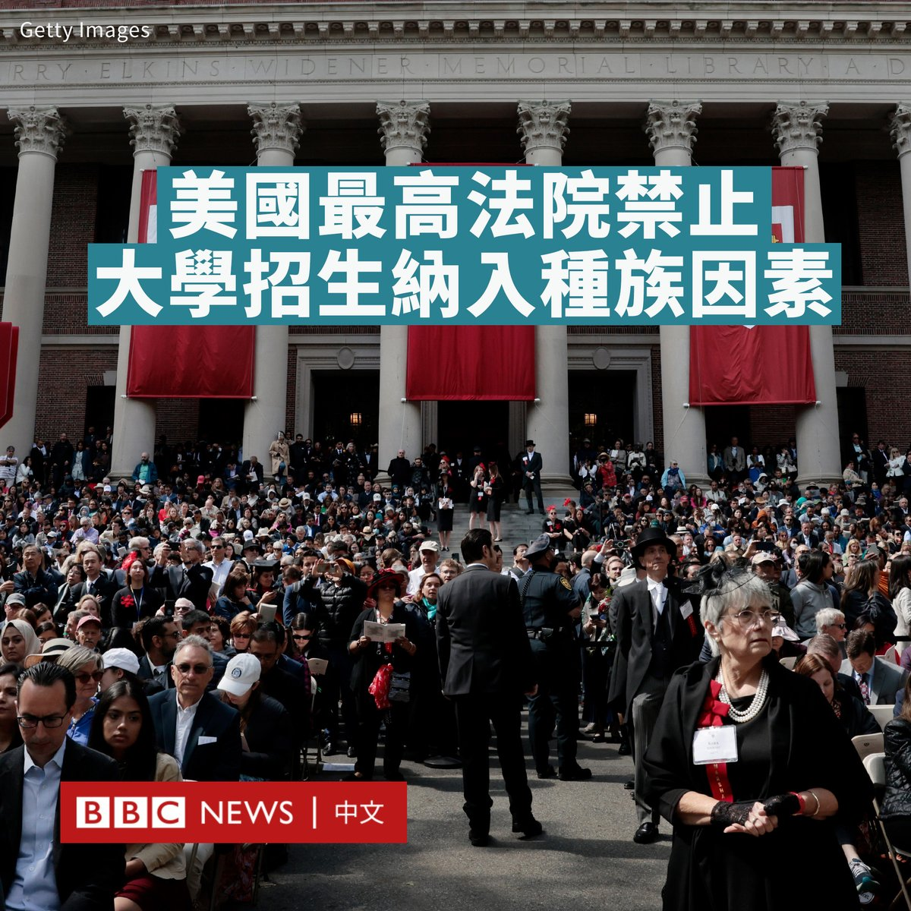

D英国广播公司BBC 北京时间 2023-06-30T19:00:10Z 1674734566639058944 美国最高法院裁定，宪法禁止大学在招生过程中考虑申请人的种族因素。这一裁决具有里程碑式的意义，颠覆了美国几十年来实践的“平权法案”。

该裁决适用于美国所有的公立和私立大学。但受影响最大的可能是哈佛大学等著名的常春藤盟校，每年有数万名申请者争夺几百个录取名额。
https://t.co/5BeqrK1d7H   D英国广播公司BBC 北京时间 2023-06-30T17:30:08Z 1674711907985682432 从《时代革命》到《1人婚礼》：导演周冠威如何看香港电影业的转变与挑战？ https://t.co/PYZcF37qtT   D英国广播公司BBC 北京时间 2023-06-30T15:02:12Z 1674674679049773057 美国五角大楼表示，在今年2月从阿拉斯加穿越美国大陆至东海岸的中国气球没有收集到任何信息。该事件加剧了中美关系紧张。

美国官员周四（6月29日）表示，美国“已采取措施减轻”这个疑似间谍气球可能收集的情报。美国情报机构正在分析收集到的碎片。

中国此前表示，该气球是一艘民用性质的飞艇，用于气象等科研用途。

五角大楼发言人帕特·莱德（Pat Ryder）周四表示，美国“意识到（该气球）具有情报收集能力”，但“我们现有评估是，它在过境美国或飞越美国时没有收集数据”。

他称，美国为减少情报收集所做的工作“促使”气球未收集到敏感信息。

《华尔街日报》此前报道，这些中国气球上装载了美国制造的设备，并有更专门的中国传感器和其他设备，以收集照片、视频和其他信息传送给中国。

莱德没有证实该报道的说法，但他表示，过去有中国无人机使用了非专门设计的美国设备。

美国总统拜登（Joe Biden）本月表示，中国国家主席习近平对该气球并不知情，因此感到“非常难堪”。   D英国广播公司BBC 北京时间 2023-06-30T15:12:40Z 1674677316361019392 【更新】意大利警方称，这名上周被拍到在罗马斗兽场遗址墙壁上刻字的男子，是一名来自英国的游客。多家英国媒体报道称，这名男子和同行女子住在布里斯托，据信他们已经离开意大利。

如果他们遭到起诉并被定罪，这名男子将面临巨额罚款或最高5年的监禁。   D英国广播公司BBC 北京时间 2023-06-30T16:15:21Z 1674693090249183235 在Facebook监督委员会建议封禁柬埔寨首相洪森（Hun Sen）的账号6个月后，这名柬埔寨领导人删除了他的Facebook专页，并威胁他可能在该国禁止Facebook。

在柬埔寨掌权30多年的洪森被指在今年1月的一段影片中，呼吁对他的政治对手使用暴力。

他当时在一场演讲中警告，如果反对派政客指控他的政党在即将于7月举行的选举中窃取选票，他们将面临法律诉讼或被棍棒殴打。

洪森是一名活跃的Facebook用户，他的页面有1400万粉丝。但批评人士表示，他在社交媒体上依赖机器人或虚假账户塑造形象。

在监督委员会宣布该决定后不久，洪森表示，他已要求助手删除他的Facebook账户。他转而开始使用Telegram和TikTok。

周五，洪森进一步警告说，他可能随时“短期或永远”封锁Facebook，以防止流亡的反对派政客与该国公民交谈。

独霸政坛的洪森一直被侵犯人权的指控缠身。他被指在7月的选举之前，清除了所有反对他连任的反对派。

今年5月，柬埔寨选举机构取消了唯一对他有挑战力的对手烛光党的竞选资格，理由是没有提交正确的登记文件。

今年3月，反对派领导人根索卡（Kem Sokha）因叛国罪被判处27年软禁，他本人否认这一指控。   D英国广播公司BBC 北京时间 2023-06-30T13:06:31Z 1674645567216005120 香港特首李家超在“七一”前夕表示，涉及国家安全的香港《基本法》第23条“在今年或最迟明年一定要立法”。“23条”与《国安法》有何差异？其运用会更广、更严吗？https://t.co/XgJtJJCy6s   D英国广播公司BBC 北京时间 2023-06-30T13:50:48Z 1674656711649689601 据路透社报导，两位知情人士透露，世卫组织（WHO）旗下的国际癌症研究机构（IARC）将在下月认定全球最常见的人造甜味剂阿斯巴甜（Aspartame）为可能致癌物。

阿斯巴甜被广泛用于可口可乐健怡可乐（Coca-Cola diet soda）、玛氏公司（Mars）益达口香糖、斯纳普（Snapple）饮料等产品中。

据报导，本月早些时候，该机构的外部专家召开会议，最终作出该决定。专家们是根据所有已公布证据，评估某种物质是否存在潜在危害。

但该评估并未考虑个人的安全摄取量为多少，这由另一家机构粮农组织/世卫组织食品添加剂联合专家委员会（JECFA）以及各国监管机关来决定。

然而，国际癌症研究机构针对不同物质的类似评估引起了消费者的担忧，导致了诉讼，并迫使制造商重新设计配方并转向其他替代品。

食品添加剂联合专家委员会今年也在审查阿斯巴甜的使用。该委员会在6月底开始开会，并将于7月14日与国际癌症研究机构同日宣布其调查结果。

自1981年以来，食品添加剂联合专家委员会一直表示，阿斯巴甜在可接受的每日摄入限制范围内是安全的，例如，一个体重60公斤的成年人每天要喝12至36罐健怡可乐才有风险。该观点得到了包括美国和欧洲在内的各国监管机构的广泛认同。   D英国广播公司BBC 北京时间 2023-06-30T11:35:13Z 1674622591800311809 一项新研究显示，正在中国蓬勃发展的风电和太阳能发电，可能会以比预期更快的速度帮助限制全球碳排放。

由独立研究机构“全球能源监测器”（Global Energy Monitor）发布的报告称，中国的风电装机容量比2017年翻了一番，而正在运营的公用事业规模太阳能装机容量，超过世界其他地区的总和。

报告称，中国仍在迅速扩大这一领域，到2025年底，如果所有预期项目得到落实，该国风电和太阳能发电的装机容量将增加一倍以上。

与目前水平相比，这一预期目标将使全球风力发电装机容量增加近50%、公用事业规模太阳能装机增加85%。

根据该报告，中国2030年的绿色能源目标看起来将比计划提前5年完成。

作者表示，中国的燃煤电厂也在增加，部分为新的风能和太阳能发电厂的备用电源。

目前，煤炭使用约占中国二氧化碳排放量的69%。这项新研究表明，中国正在快速提升风电和太阳能发电能力，这可能对限制气候变化产生重要影响。

@BBCNews 英文报导：https://t.co/Flj2qBytFX   D英国广播公司BBC 北京时间 2023-06-30T09:34:24Z 1674592187219316736 在突尼斯西部的加迪马乌，一个拥有100年历史的足球俱乐部首次被迫关闭。在过去三年里，当地球员纷纷从这里偷渡到欧洲，使俱乐部失去了32名最优秀的球员。 https://t.co/5VXa7zZiNd   D英国广播公司BBC 北京时间 2023-06-30T01:25:19Z 1674469103875264512 美国联邦最高法院裁定，美国大学在招生过程中必须停止考虑种族因素。这项裁决结束了长达60年的“平权法案”（affirmative action，又译为肯定性行动、扶持行动）实践，即大学可以考虑种族因素以改善多样性。

被审理的两起案件涉及哈佛大学和北卡罗来纳大学的招生，但其将影响全国的招生规则。

上述两校考虑招生时的种族比例，最初的目的是提高黑人和西班牙裔学生的数量，确保少数群体在本校学生中有公平体现，而反对者说这是反向歧视。

在哈佛大学的案例中，该校被指控歧视亚裔美国申请人，以提高其他群体的代表性。

由保守派大法官占多数的最高法院裁定，两所大学的招生计划违反了美国宪法。九名法官中的六名法官认为，两所大学的招生方式“缺乏足够集中和可衡量的目的体现使用种族因素的正当性”。

首席大法官约翰·罗伯茨（John Roberts）在主要意见书中写道：“我们从未允许招生项目以这种方式运作，今天我们也不会这样做。”

“必须基于他或她作为个体的经历来对待学生，而不是基于种族……我们的宪法历史不会容忍这种选择。”

此前，保守派一直对在学校招生、企业和政府招聘方面寻求多样性的“平权法案”表示反感。“平权法案”最早在1960年代被纳入政策，当时许多全白人学校开始招收少数族裔学生。

自由派法官则在不同意见书中批评，该决定“通过进一步加深教育中的种族不平等，颠覆了平等保护的宪法保障”。大法官索尼娅·索托马约尔（Sonia Sotomayor）称，此举“使几十年来的先例和重大进展倒退。”

BBC记者伊克巴尔（Nomia Iqbal）在华盛顿报道说，在该裁决发布后，理论上学生们仍然可以在申请学校时提到自己的种族，尤其在个人陈述中。但大学在考虑录取与否时，不能将种族作为一个因素。不过，也不排除一些大学可能会发布更严格指引，禁止申请者提及种族。   D英国广播公司BBC 北京时间 2023-06-30T00:22:22Z 1674453263389978624 美国联邦最高法院裁定，美国大学在招生过程中必须停止考虑种族因素。这项裁决结束了长达60年的“平权法案”实践，即大学可以考虑种族因素以改善多样性。

被审理的两起案件涉及哈佛大学和北卡罗来纳大学的招生，但其将影响全国的招生规则。

上述两校考虑招生时的种族比例，最初的目的是提高黑人和西班牙裔学生的数量，确保少数群体在本校学生中有公平体现，而反对者说这是反向歧视。

在哈佛大学的案例中，该校被指控歧视亚裔美国申请人，以提高其他群体的代表性。

由保守派大法官占多数的最高法院裁定，两所大学的招生计划违反了美国宪法。九名法官中的六名法官认为，两所大学的招生方式“缺乏足够集中和可衡量的目的体现使用种族因素的正当性”。

首席大法官约翰·罗伯茨（John Roberts）在主要意见书中写道：“我们从未允许招生项目以这种方式运作，今天我们也不会这样做。”

“必须基于他或她作为个体的经历来对待学生，而不是基于种族……我们的宪法历史不会容忍这种选择。”

此前，保守派一直对在学校招生、企业和政府招聘方面寻求多样性的“平权法案”表示反感。“平权法案”最早在1960年代被纳入政策，当时许多全白人学校开始招收少数族裔学生。

自由派法官则在不同意见书中批评，该决定“通过进一步加深教育中的种族不平等，颠覆了平等保护的宪法保障”。大法官索尼娅·索托马约尔（Sonia Sotomayor）称，此举“使几十年来的先例和重大进展倒退。”

BBC记者伊克巴尔（Nomia Iqbal）在华盛顿报道说，在该裁决发布后，理论上学生们仍然可以在申请学校时提到自己的种族，尤其在个人陈述中。但大学在考虑录取与否时，不能将种族作为一个因素。不过，也不排除一些大学可能会发布更严格指引，禁止申请者提及种族。   