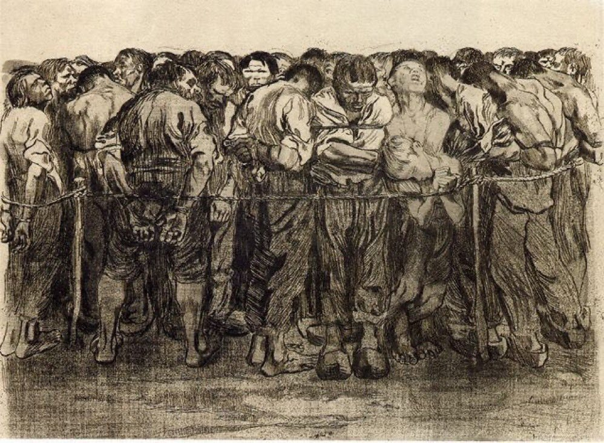

Ivy未央 北京时间 2023-06-30T09:31:43Z 1674591510770118658 转）布拉格一首当年的地下摇滚歌曲，歌词很有意思：他们害怕老人的记忆，害怕年轻人的思想，害怕墓地的鲜花，害怕工人，害怕教堂，害怕所有的快乐时光，他们害怕电影，害怕画家，害怕音乐家，害怕石块和雕塑，他们害怕电台，害怕技术，害怕信息自由流动，那么我们为什么要怕他们？ https://t.co/MetPZ4M7MT   